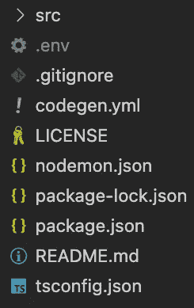
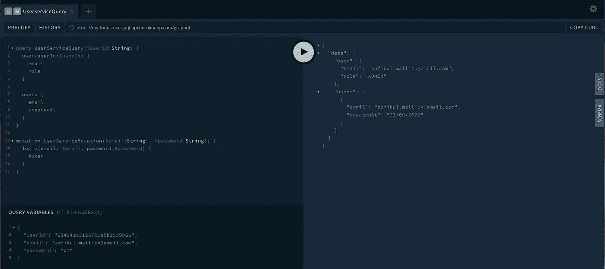
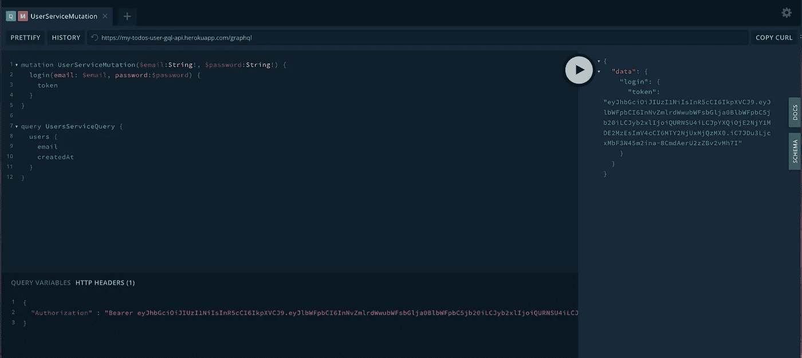

# 编码 GraphQL 服务

> 原文：<https://blog.devgenius.io/coding-graphql-services-eafd9235fdf7?source=collection_archive---------13----------------------->

本内容面向那些对 REST 和 GraphQL 有基本了解的工程师。我们将陆续公布以下内容。

# 1[my-todos 项目设计](https://medium.com/@sofikul.m/design-my-todos-project-with-graphql-rest-microservices-482cffc7729b)

**#2 编码 GraphQL 服务(我们在此发帖)**

#3 GraphQL 服务认证和授权

#4 编码 GraphQL 网关服务

#5 使用 Nuxt 编码 my-todos web

#6 所有服务的部署

## 要求

要求是创建一个具有以下功能支持的用户服务

*   按 Id 获取用户
*   获取所有用户(只有管理员有权访问此功能)
*   登录功能

## 技术栈

我们将用于构建 GraphQL 服务的技术堆栈

*   节点(快速框架)
*   Apollo GraphQL 服务器
*   以打字打的文件
*   GraphQL 库

说得够多了，我们将马上着手实施。深呼吸，专注于接下来的部分:)

## 项目结构

让我们首先决定我们的项目结构。现在我有以下内容给你。完整结构参见[此](https://github.com/Sofiukl/my-todos-user-gql-api)。



#示例配置文件代码

## 项目开发

## #01 图表 SQL 模式

GraphQL 模式是客户端可以从 GraphQL API 请求的数据的描述。它还定义了客户机可以用来从 GraphQL 服务器读取和写入数据的查询和变异函数。

```
directive @auth(requires: Role = ADMIN) on OBJECT | FIELD_DEFINITION

enum Role {
  ADMIN
  REVIEWER
  USER
  UNKNOWN
}

type LogInResponse {
  token: String!
}

type GetUserResponse {
  id: ID!
  email: String!
  role: String!
  createdAt: String!
  createdBy: String!
  updatedAt: String!
  updatedBy: String!
}

type Query {
  users: [GetUserResponse] @auth(requires: ADMIN)
  user(userId: String): GetUserResponse
}

type Mutation {
  login(email: String!, password: String!): LogInResponse!
}
```

我们按照最初的要求定义了用户、用户查询和登录变异。你可以认为 GET APIs 将会进入查询部分，而其他 API(比如 POST、PATCH、DELETE)将会发生变化。

## #02 GraphQL 模式到类型生成

我们在上面的模式中定义了 GetUserResponse，LogInResponse 类型。我们的代码中也需要相应的类型。我们将使用 npm ( [@graphql-codegen](https://www.npmjs.com/package/@graphql-codegen/cli) )从模式文件中自动创建它。

该库需要一个 codegen.yml 配置文件。

您需要运行下面的命令来创建类型。

```
graphql-codegen --config codegen.yml
```

输出将在/src/generated 文件夹下创建。你可以在我的[资源库](https://github.com/Sofiukl/my-todos-user-gql-api)里查看。

## #03 创建阿波罗服务器

我们将使用 [Apollo](https://www.apollographql.com/) 库来创建 GraphQL 服务器。Apollo 主要需要模式文件和解析器来创建服务器。

我们已经准备好了模式和服务器。接下来，我们需要我们的查询，突变解析函数。

## #04 编写解析器代码

解析器是请求处理程序。按照我们的模式，我们需要为用户、用户查询和登录变异创建处理程序。

## #05 在开发模式下运行代码

下面是我们在 package.json 中定义的脚本

```
"schema-type": "graphql-codegen --config codegen.yml",
"lint": "eslint . --ext .ts",
"build": "npm run schema-type && tsc",
"start": "npm run build && node build/server.js"
```

我们可以使用`npm run start`来运行我们的开发服务器。

## #06 测试 API

Apollo server 提供了内置文档和平台，可以非常快速轻松地测试这些特性。

操场将在端点`baseurl/graphql`可用，例如 http://localhost:4000/graphql



正如我们在模式中定义的那样，我们的用户查询是受保护的，只有管理员用户可以访问。所以要访问它，你需要在`Authorization`头中传递令牌。(你将获得执行`login`突变的令牌)



> 🔥恭喜你！您已经定义了您的第一个 GraphQL 服务。

## #07 部署

庆祝你的学习和成就🎉，我会想出新的文章进行部署。

## #08 参考

👨‍💻完整的源代码可以在[这里找到](https://github.com/Sofiukl/my-todos-user-gql-api)

## 下一步是什么

我们将在下一篇文章 [*#3 GraphQL 服务认证和授权*](https://medium.com/@sofikul.m/6894d6f40ac0) 中见到您。请订阅，以便在我们发布后立即获得更新。

> 继续学习！