# PHP 编程的编码指南和最佳实践第 1 卷

> 原文：<https://blog.devgenius.io/coding-guidelines-best-practice-on-php-programming-vol-1-16b7c650277f?source=collection_archive---------4----------------------->

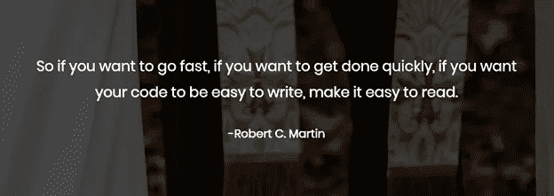

朋友们好。我是新加坡卡拉旺大学信息工程系的阿贡·普拉博沃。

当然，你们所有人都熟悉 PHP 编程语言，对吗？是的，PHP 编程语言是由拉斯马斯·勒德尔夫在 1995 年首先创造的语言。20 多年后的今天，PHP 仍然存在于 Web 开发领域。

当然，在 PHP 编程中，除了做代码，还有一个术语叫做编码指南和最佳实践。这个术语旨在维护我们创建的代码的一致性，以便易于维护、更改，并使团队合作变得更加容易。

让我们熟悉一下编码指南吧！

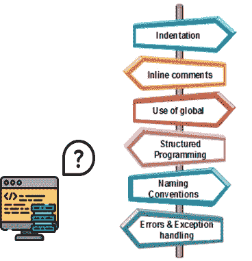

# 编码指南

编码准则是什么？编码指南是开发人员创建更易于阅读和维护的程序代码的参考。编码指南的目标是:

*   由不同开发人员创建的统一程序代码
*   让程序代码的内容更容易理解，降低程序的复杂度。
*   帮助程序代码被重用
*   使检测错误变得更加容易

# 成为编码指南实现的东西

## 命名

当然，在命名局部变量、全局变量、常量、函数和方法时，我们必须注意几件事，包括:

*   容易理解
*   避免使用数字
*   简单明了地描述内容

变量命名示例:

变量使用大小写，以小写字母开头，而全局变量以大写字母开头。

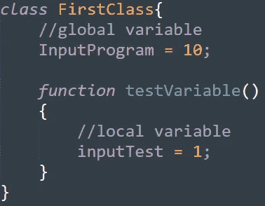

常量命名示例:

Constant 使用所有大写字母或带下划线的大写字母，而不是空格

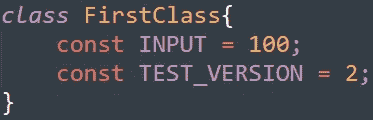

函数中的命名示例:

该函数使用以小写字母开头的 camel case。

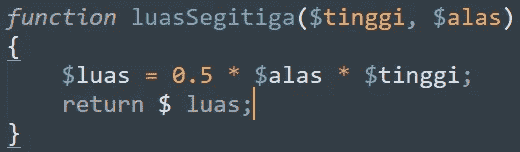

## 缩进。

除了命名，接下来我们要注意的是缩进。缩进对于让程序代码更容易阅读非常重要。标识的一些部分包括:

*   在两个函数参数之间的逗号后添加一个空格
*   每个嵌套块必须缩进
*   缩进是在每个程序块的开始和结尾执行的
*   每个程序块都用花括号{…}括起来

良好使用标识的示例:

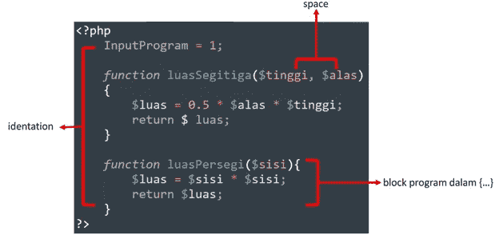

## 结构化程序设计

然后下一个是结构化编程。在编写程序代码时，必须使用结构化或模块化编程。“**转到**”语句不应用于帮助理解程序代码内容。

## 避免使用不同需求的标识符

当我们创建一个代码时，使用的每个变量必须描述它的用途。应避免将同一个变量用于几个不同的目的，以避免未来的困难。

## 程序代码必须记录在案

每个程序代码都必须以易于理解的注释形式记录下来。当然，这将使其他程序员更容易继续我们已经创建的代码。

## 错误返回值

程序中的每个函数都由一个有组织的标准来处理，例如，每个错误都返回一个 0 或 1 的值，以简化调试。

# 程序结构中的范式概念

这一次，我们将了解计划结构范例。什么是计划结构范式？编程范例是一种根据所创建的程序的特征对程序代码进行分类的方式。计划结构范例由几种类型组成，包括:

1.  *程序编程*
2.  *逻辑编程*
3.  *功能编程*
4.  *面向对象编程*

让我们一个接一个地了解他们！

## 程序设计

过程编程是一种基于如何调用过程的概念的编程范式，其中程序代码以解释必须完成的步骤的指令列表的形式排列。程序设计有几个优点，包括:

*   可移植程序代码。
*   程序可以在其他程序中重复使用，而不需要复制它们。
*   可以使用自上而下的方法来跟踪程序流。

## 逻辑程序设计

然后是逻辑编程。逻辑编程基于数学逻辑，其中程序语句表达关于解决问题的事实和规则。例如，当我们点咖啡时，必须采取的方法是:

1.  进入咖啡店
2.  选择要购买的菜单的队列
3.  订购所选菜单
4.  选择是当场享用还是带走咖啡
5.  支付
6.  接受命令，离开秩序之地

## 功能程序设计

接下来，是函数式编程。功能编程的特点是构建结构和程序元素。函数式编程由**纯函数**组成，其中函数包含接受输入并返回值的参数。

函数式编程的一些例子有:

*   *纯功能*
*   *递归*

纯函数

函数的输出取决于给定的输入。

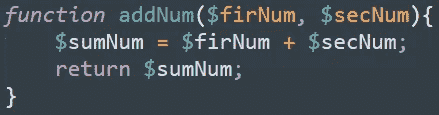

递归

一种在执行过程中将调用自身的函数。

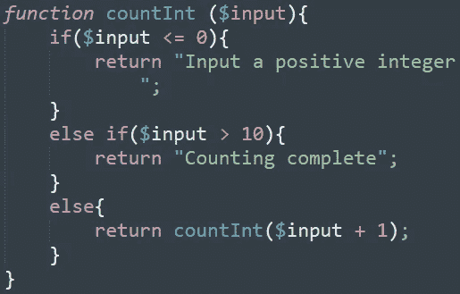

## 面向对象编程

面向对象编程以类的形式表示对象。每个类都将存储所有数据和函数，并且可以与其他类交互。

面向对象程序中的术语和概念:

*   *灌封*

基本功能是隐藏不想显示的细节。这个概念包装了对象上的数据和内部方法。

*   *遗传*

从其他类中获取属性的机制，用于创建共享属性和方法的层次结构。

*   *数据抽象*

简化数据的整体表示的简化。数据抽象通常是数据库设计的第一阶段。

*   *多态性*

OOP 概念，它利用变量、函数或对象形成各种形式的能力。

# 错误

当然，当我们创建代码时，我们经常会面临各种各样的错误。这次我们将讨论各种错误。那就是:

*   解析错误
*   致命错误
*   警告错误
*   注意错误

让我们一个一个去了解他们。

## 解析错误

当语法(引号、括号、分号等)有错误时，通常会出现解析错误。)通常是由打字错误引起的。当程序运行时，输出中将出现一条错误消息，并且一个解析错误将停止脚本执行过程。

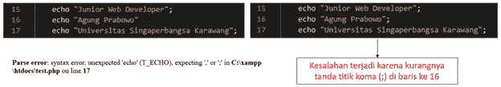

## 致命错误

当 PHP 知道写了什么程序代码，但是不能完成请求时，就会发生致命错误。例如，如果一个程序调用一个未定义的函数，一个致命的错误将停止脚本的执行

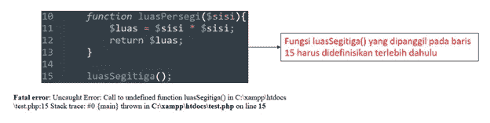

## 警告错误

调用函数时，如果文件不存在或参数数量不匹配，则会出现警告错误。当出现警告错误时，它不会停止脚本的执行

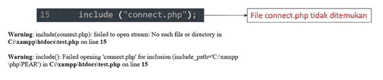

## 注意错误

当被访问的变量未被定义时，会发生通知错误，并且通知错误不会停止脚本的执行

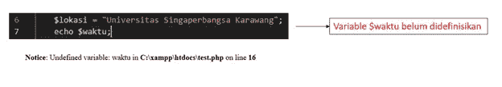

# 结论

总之，编码指南是开发人员创建更易于阅读和维护的程序代码的参考。然后是编程范式，这是一种根据创建的程序的特性对程序代码进行分类的方法。最后，当程序代码中出现错误时，就会出现错误。

你可以在[这里](https://kotakode.com/blogs/13797/Mengenal-Coding-Guidelines-%26-Best-Practice-pada-Pemrograman-PHP-Vol-1-%3A-Coding-Guidelines%2C-Paradigma)查看印尼版。

我的博客到此为止，我希望这篇文章对阅读它的人有用

谢谢你