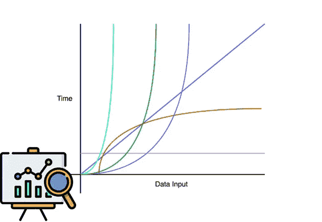
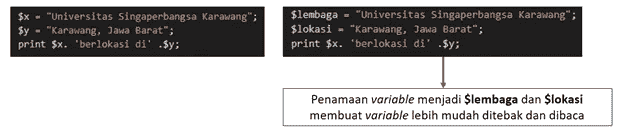
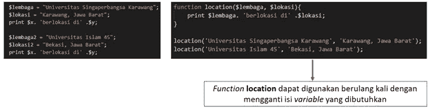
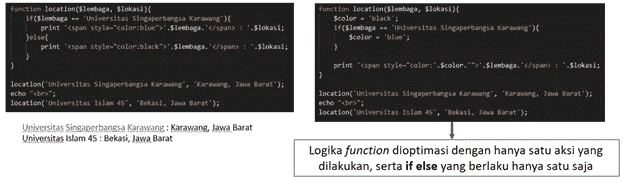

# PHP 编程的编码指南和最佳实践第 2 卷

> 原文：<https://blog.devgenius.io/coding-guidelines-best-practice-on-php-programming-vol-2-82f88f8fdc5b?source=collection_archive---------6----------------------->

朋友们好。我是新加坡卡拉旺大学信息工程系的阿贡·普拉博沃。在这篇博客第 2 卷中，我们将继续讨论我们在第 1 卷中讨论过的编码指南和最佳实践。

在第 2 卷中，我们将讨论在编写源代码时使用性能度量。我们将熟悉程序代码的资源效率和交互的简易性。

我们开始一个一个的讨论吧！

# 资源效率

资源效率必须考虑哪些因素？必须考虑的因素是程序代码的易读性以及程序执行所使用的资源。那么程序代码本身的优化可以通过几种方式来完成。其中包括:

*   变量命名
*   可重用代码
*   逻辑优化

## 变量命名

在命名变量时，使用的变量必须易于他人阅读。变量可以添加注释或创建易于猜测或阅读的变量。

## 可重用代码

接下来，有一个可重用的代码。重复使用的程序代码应该以函数的形式存储，以便它可以重复用于其他目的。

## 逻辑优化

从 location 函数，我想添加逻辑如果$lembaga 值 Singaperbangsa Karawang 大学，那么 Singaperbangsa Karawang 大学的写法用蓝色显示。

## 提示:高效的源代码

以下是创建更高效程序的一些技巧:

*   **管理*变量***

使用一个变量来存储要调用的值，尽量不要有未使用的变量。

*   **将计算结果保存到变量**

将计算结果存储到变量中如果多次执行算术运算，这也适用于返回值的函数。

*   **最小化多级循环**

执行的多级迭代越多，CPU 时间就会增加。如果使用嵌套循环，则将循环限制在最里面的循环，并且第一个循环大于其内部的循环。

*   **避免循环功能**

如果有一个循环调用一个返回值的函数，那么就让这个函数成为一个循环。

# 程序交互的简易性

在由多人进行的程序开发和开发中出现的问题是，程序代码是按照每个程序员的风格编写的。为了促进程序员之间的交互，如前所述，需要标准或编码指南。如果创建的程序代码遵循编码准则，程序员将获得以下好处:

*   易读的程序代码
*   命名变量、函数和所有程序代码内容的一致性
*   函数的命名代表了其中的内容
*   程序代码可以被其他程序员理解

# 结论

需要编码指南来促进程序员之间在程序创建或维护方面的交互。构建的程序代码越复杂，运行程序所需的资源就越多。

我的博客到此为止，我希望这篇文章对阅读它的人有用

谢谢你