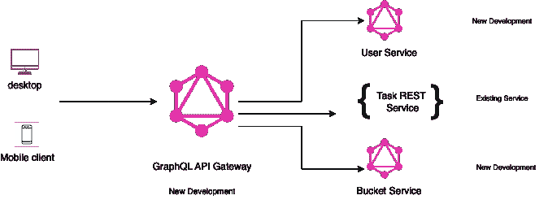

# 编码 my-todos web 以使用 GraphQL 服务

> 原文：<https://blog.devgenius.io/coding-my-todos-web-to-consume-graphql-service-1e78302e7a04?source=collection_archive---------11----------------------->

本内容面向那些对 REST 和 GraphQL 有基本了解的工程师。我们将陆续公布以下内容。

# 1[my-todos 项目设计](https://medium.com/@sofikul.m/design-my-todos-project-with-graphql-rest-microservices-482cffc7729b)

[#2 编码 GraphQL 服务](https://medium.com/@sofikul.m/coding-graphql-services-eafd9235fdf7)

[#3 GraphQL 服务认证和授权](https://medium.com/@sofikul.m/graphql-authentication-and-authorization-6894d6f40ac0)

[#4 编码 GraphQL 网关服务](https://medium.com/@sofikul.m/coding-graphql-gateway-service-b8516d4052d4)

***#5 使用 Nuxt 编码 my-todos web(您正在阅读本文)***

#6 所有服务的部署

# 我们要在这里讨论什么？

由于我们已经开发了子图和面向消费者的网关 GraphQL 服务，现在是时候看看如何在我们的前端使用网关 GraphQL 服务了。我们的目标是创建一个最小的网站来体验相同的。

# 技术栈

我们将用来建立这个网站的技术栈

*   nuxt 4
*   nuxt js 阿波罗客户端
*   以打字打的文件

说得够多了，我们将马上着手实施👨‍💻

# 项目执行

***#01 Nuxt 阿波罗配置***

***#02 创建需要执行的操作***

由于我们要在网站中显示任务，我们需要首先从我们的 GraphQL 服务器获取数据。让我们首先构建查询。

***#03 在我们的页面中执行查询和显示任务***

我们已经准备好了查询，现在可以使用 nuxt apollo 客户端库来执行它以获得结果。

> 🌟完整的源代码可以在这里找到[。](https://github.com/Sofiukl/my-todos-web-gql)

想看讲座吗？

# 下一步是什么💁

庆祝你的学习和成就🎉。我们将在下一篇文章*中看到所有服务的#6 部署。请订阅，以便在我们发布后立即获得更新。*

> **坚持学习！**