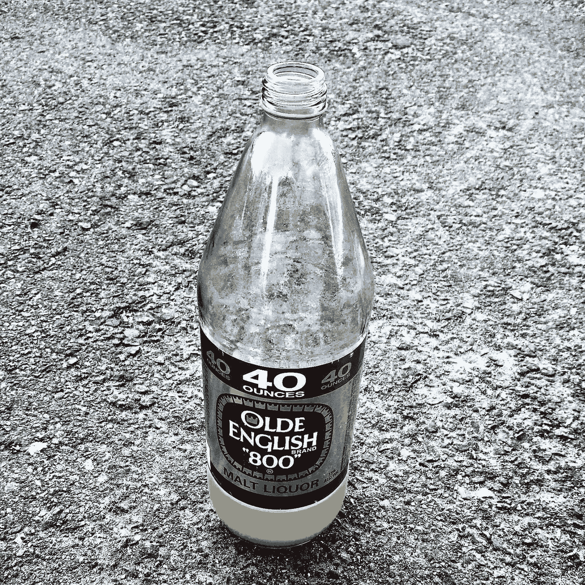

# 通过清醒编码我的方式:从毒品交易上瘾者到软件开发者

> 原文：<https://blog.devgenius.io/coding-my-way-through-sobriety-from-drug-dealing-addict-to-software-developer-45a10e915504?source=collection_archive---------7----------------------->

几年前，我在一个编码训练营教书。课堂进行得并不顺利，尤其是一名学生扰乱了我们的课堂。下课后，这个学生走近我。

“你知道，这东西很难。你教得太快了，我跟不上。这些东西对你来说可能很容易，但我们并不是在使用计算机或学习编码的环境中长大的。”

我有点吃惊，并向他道歉，向他保证我们可以在课外工作让他赶上进度。我也受宠若惊。我的转变终于完成了。他看到了我多年来努力想要的样子…一个真正的软件开发者。

大约 7 年前，没有人会相信我会以写代码为生，更不用说管理和指导其他工程师了。那时我的生活完全一团糟。

在我 20 多岁的大部分时间里，我卖毒品。大麻，毒品，冰毒，摇头丸和任何我能弄到的东西。我也很擅长这个。我赚了足够的钱来支付我的房租，每天晚上喝酒，并支持我自己在 16 岁时染上的可卡因习惯。

最终，我的酗酒和吸食失控了。我越来越粗心，冒了不该冒的险。我两次被持枪抢劫，差点丢了性命。抢劫我的同一个人在我抢劫后的第二周杀了一个人。我几乎没怎么睡觉，连续几天嗑药嗑药，然后喝酒来减缓我狂跳的心跳。我像喝咖啡一样嗑药——一醒来，我就吹一根线或者倒一杯饮料。照这样下去，我会死于心脏病或者在街上被杀。

我的女朋友白天工作，所以她可能不清楚我上瘾的程度，反正我大部分时间都在做“生意”。一天晚上，我回到家，有点醉了。她怀孕了。

我想，这是我改变生活的时候了。就像电影里一样。如果这个新宝宝不能让我改变，那就没什么能了。我发誓不再喝酒和吸毒…然后早晨来了。在我做生意的房子里，我挨了一拳，足以打死我柜子里的一匹小马。我想过把它冲进马桶。我告诉自己，就在这最后一行之后，我会停下来。

9 个月后，我的儿子出生了，而我还在写最后一行。那一年，在一位在当地社区大学工作的朋友的大力帮助下，我在那里找到了一份工作。我已经基本上离开了我生命中的毒品交易阶段，但是我没有一天不喝酒。我的交易大部分被降级为小交易，以补充我的收入和支持我的习惯。

我可能会继续这个酗酒、吸毒和小交易的仓鼠轮子，直到我死或被逮捕。不可避免的结局越来越近，我能感觉到。该地区的警察知道我是谁，我曾有幸在一次交通堵塞中逃脱。我的老经销商打电话给我，威胁要杀了我，因为我达成的交易出了问题。我每天都有恐慌症发作…真的。如果警察或街道没有抓住我，我的心会。

然后，发生了一件事。

7 年前，在复活节的那个星期天，我醉醺醺地跌跌撞撞地走进我的房子，前一天晚上我还没醒。我和我的朋友发生了一场小车祸，当时我正走在回家的路上，他开车越过了路中间的隔离带，爆胎了。我已经 24 小时没睡觉了，如果我的心脏停止跳动的话，我会走到床边昏死过去。我刚出生的儿子快一岁了。

几周前，我的另一个朋友自杀了，他的兄弟，我最好的顾客之一，因为拉皮条而被判入狱。在这段紧张时期，我的酒量飙升至新的高度。在我情绪最低落的时候，我记得在我家附近的一座桥下，和一群住在那里的过客一起吸食冰毒。

我的母亲和女友非常担心我喝酒和吸大麻，所以他们聚在一起，在我不知道的情况下，计划在复活节那天进行干预。我上床睡觉后不久，我母亲闯进了房子。我们走到外面，她给我读了一封信，信中有一个最后通牒:戒酒，否则我的家人会离开我。我很生气。他们凭什么在这个时候把这个放在我身上？我很悲伤，压力很大。这是退出的最糟糕的时机。我怨恨他们这样对我，但我不情愿地同意了，不知道如何停止。

她给我读了那封信后的第二天，我没有喝酒，也没有吸毒。我只是一天不喝酒。每天醒来，我都承诺不喝酒。

最终，日子变成了几个月。我的身体终于适应了节奏，但精神上的痛苦依然存在。我梦见喝了很多酒。我幻想过回到过去的生活。我也有了更多的空闲时间。天啊，这么长时间我该怎么办？

在工作中，我承担了更多的责任。我的任务之一是让我们的 janky 网站不断更新即将到来的事件的信息。一个特定的更新需要一个实际的代码变化，我不知道如何去做。我打电话给我们的网站管理员，安排了一些时间让她来我们的办公室更新。当她打开代码编辑器时，我看到了看起来像是一组象形文字的东西。我很震惊，她似乎明白那里有什么。

那是什么？我问。她解释说，所有网站都使用 HTML 和 CSS 来显示内容和添加样式。我追问她更多关于她如何知道去哪里和打什么的信息。我仍然不相信一个人能如此容易地破译和导航它。我每天都使用互联网…我怎么会不知道怎么做呢？

她告诉我，如果我想学习如何建立网站，我可以学习 HTML 和 CSS。为什么，不是我想的，我有足够的时间。我搜索了关于编码的免费课程，并选择了 HTML 和 CSS。一旦我让一些东西出现在屏幕上，我就着了迷。这是我的新嗜好。我花了大量的时间学习编码，它填补了酒精和毒品之前留下的空白。

7 年后，经过大量的学习，我成为了一名高级软件工程师，在多个训练营授课，在不同的公司工作，写了几十篇文章，指导过很多人。我仍然经常梦见喝酒，尽管我这辈子不打算再喝酒了。

我一直害怕告诉别人我生活的这一面，并且持续了好几年。我如此努力地想成为一个不同的人，以至于我害怕暴露我的过去会让人们觉得我没那么能干。和他一起工作有风险吗？如果他又犯错了怎么办？如果同事看到这个怎么办？还是潜在雇主？他们会怎么看我？

老实说，我仍然有这些恐惧，但我也知道当我学习编码时，我遇到了很多帮助我转变生活和职业的伟大的人，当我觉得他们可能不是隧道尽头的灯时，听到他们的故事给了我继续前进的动力。当我听到那些从毒瘾中走出来追求梦想、控制心魔的人的故事时，我能在他们身上看到自己，我也不那么孤独了。

我希望如果你正在阅读这篇文章，并且你正在经历生活中与毒瘾的斗争，你也不会感到孤独，并且知道没有你挖的洞太深而无法自拔。

我知道你能做到。