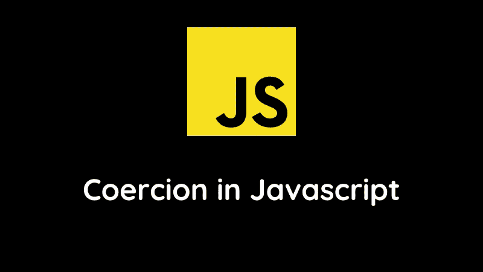
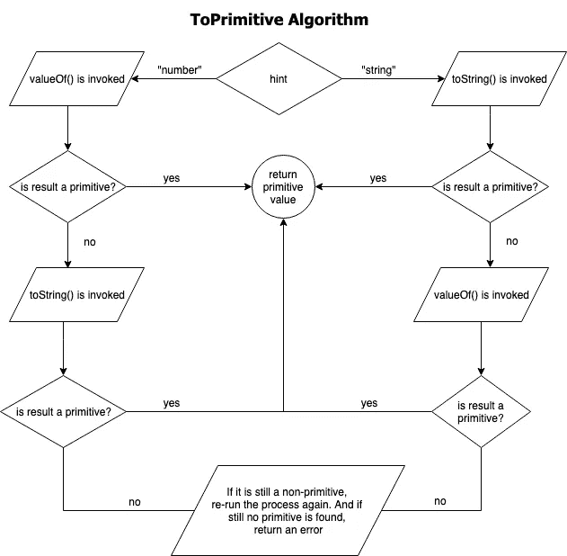

# Javascript 中的强制

> 原文：<https://blog.devgenius.io/coercion-in-javascript-47ba133d7ce9?source=collection_archive---------3----------------------->

强制是 Javascript 中最重要的概念之一。作为一名 Javascript 开发人员，这是你必须知道和学会的事情之一。因为说实话。如果你不熟悉强制，它会破坏你的程序。你可能会得到不可预知的结果。那么，到底什么是强制？将变量从一种类型更改为另一种类型称为强制。这就是我们在其他编程语言中所说的类型转换。强制和类型转换这两个词意思相同，可以互换使用。

现在，当谈到在 Javascript 中改变变量类型时，也就是执行强制。有两种类型。这些是:

*   隐性强制
*   显性胁迫

# 隐性强制

**含蓄胁迫**并非有意。这种强制是由 Javascript 本身完成的。一些例子是:

在这些例子中，我们正在执行数学运算。当 Javascript 遇到一个不是 number 类型的操作数时，它不是给出错误或警告，而是自己把它转换成一个数字。

# 显性胁迫

另一方面，显式强制是我们开发人员有意为之的。这种类型的强制在代码中很明显。让我们把隐式强制的例子变成显式强制。

现在，任何看到这段代码的人都会明白，类型强制是用来执行数学运算的。如代码所示，这是显而易见的。我们利用 Javascript 中的`Number()`工具将操作数显式转换为数字。为了显式转换成字符串或布尔值，我们在 Javascript 中使用了`String()`和`Boolean()`工具。

# 抽象操作

根据 ECMAScript 规范，抽象操作不是语言规范的一部分，但它们负责在 Javascript 中执行强制。这些只是决定强制的最终输出的算法。在这篇文章中，我将交替使用`abstract operation`和`algorithm`这两个词。Javascript 中有许多不同的抽象操作。但在本帖中，我们将讨论这四个抽象操作:

*   原始的
*   ToString
*   ToNumber
*   托布勒安

无论是隐式强制还是显式强制，这些操作都是在幕后起作用，决定最终的输出。

## 1-top 本原

当我们有一个**非原语**值，比如一个对象、数组或函数，并且我们需要**将其转换成一个原语值**时，就会涉及到**原语抽象操作**。那么，这个算法是如何工作的呢？这个算法需要一个提示。这个提示就是我们要转换成的原语类型。例如，如果我有一个数组，我希望它是一个字符串。在这种情况下，我可以提供一个`string`作为对 ToPrimitive 算法的提示。

同样，如果我们用非原语执行一些`numeric operation`，比如减去两个数组或对象，发送给这个算法的提示是一个`number`。toPrimitive 算法会在执行数值运算之前先将非基元转换成数字。

关于本原算法的另一件事是它只能接受两种类型的提示。该提示可以是类型`string`或`number`。这个提示是可选的。如果没有提供提示，则使用`default`提示调用 toPrimitive。

所有非基本对象、数组和函数都定义了这些方法:

*   的值()
*   toString()

如果我试图用提示**号**将一个**非原语**转换成一个**原语**。
top primitive 算法将调用非原语类型的`valueOf()`方法。如果输出是原始的。我们完了。而如果输出不是原语，那么就调用非原语类型的`toString()`方法。

另一方面，如果提示是一个**字符串**。在这种情况下，首先调用`toString()`，如果它没有返回原语，则调用`valueOf()`方法。

这里需要注意的是，如果`toString()`和`valueOf()`都没有返回原语，那么就会产生一个错误。下面是一个流程图来总结本原算法:

图片来源:来自 dev.to 的 Amandeep Singh

## 双 ToString

当任何**非字符串值**被强制转换为**字符串表示**时，转换由 **ToString 抽象操作处理。**让我们看看将不同的**原语类型**转换为**字符串**的结果:

另一方面，如果我们想将**非原语，即数组或对象**转换为**字符串**。*在这种情况下，toString 操作用提示字符串*调用 toPrimitive 算法。这将调用为非原始类型定义的默认 **toString()** 方法。

因此，当将数组转换为类型字符串时，数组的默认 **toString()** 方法会给出以下强制结果:

对于对象， **toString()** 方法的输出如下:

对于对象，无论是否为空，将其转换为字符串的输出都是`[object Object]`

然而，我们可以通过覆盖对象的默认 **toString()** 方法来改变这种行为。因此， **toString()** 的输出将是我们从这个方法返回的任何值。

## 三位数

如果任何**非数字**值的使用方式要求它是一个**数字**，例如一个数学运算，这种情况下的转换由**到数字抽象运算**处理。

将不同的**原始值**转换为**数字**的结果如下:

*另一方面，当将* ***非原语*** *值转换为* ***数字*** *时，toNumber 抽象操作调用带有数字提示的 toPrimitive 算法。* 结果，非原语的默认 **valueOf()** 方法被调用。数组和对象的默认 **valueOf()** 方法如下所示:

用于数组和对象的 **valueOf()** 方法最终返回自身，如`return this`所示。这导致忽略 valueOf()方法并遵从默认的 **toString()** 方法。

换句话说，将非原语转换为数字会导致首先将它们转换为**字符串**。这将使非本原成为本原即`string`。然后这个原语`string`被进一步强制为一个`number`。

对象也是如此:

将对象转换为字符串会返回`[object Object]`字符串作为输出。现在，当我们将这个字符串转换成一个数字时，输出将是一个`NaN`值。

要改变这种行为，我们可以覆盖对象的默认值 Of()方法。这将导致最终输出是我们从 valueOf()方法返回的任何内容。

## 4-ToBoolean

toBoolean 抽象操作负责任何与布尔相关的转换。这种抽象操作不太像算法，更像查找。
对于一组值，布尔转换将始终返回 false 作为输出。我们称这些价值观为虚假价值观。这个简短而有限的错误值列表是:

因此，每当我们执行布尔类型转换时，toBoolean 抽象操作只是在上面的 falsy 值列表中查找。如果要强制的值在列表中，则返回`false`作为输出。另一方面，如果值不在 falsy 列表中，我们将返回`true`。

我希望这篇文章对你有所帮助。感谢阅读。:)

下面连线:
[LinkedIn](https://www.linkedin.com/in/rabi-siddique-b6b4971a0/)
[Twitter](https://twitter.com/rabisiddique234)