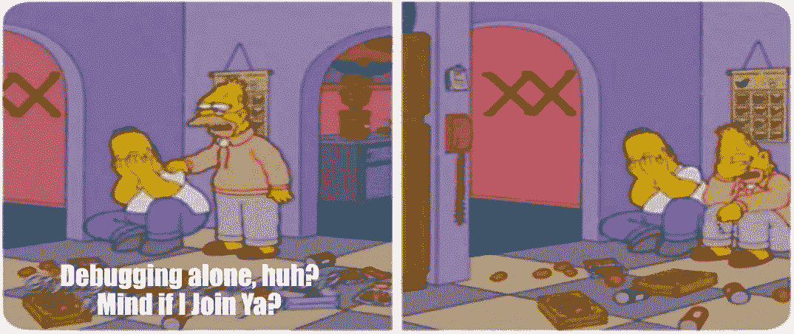
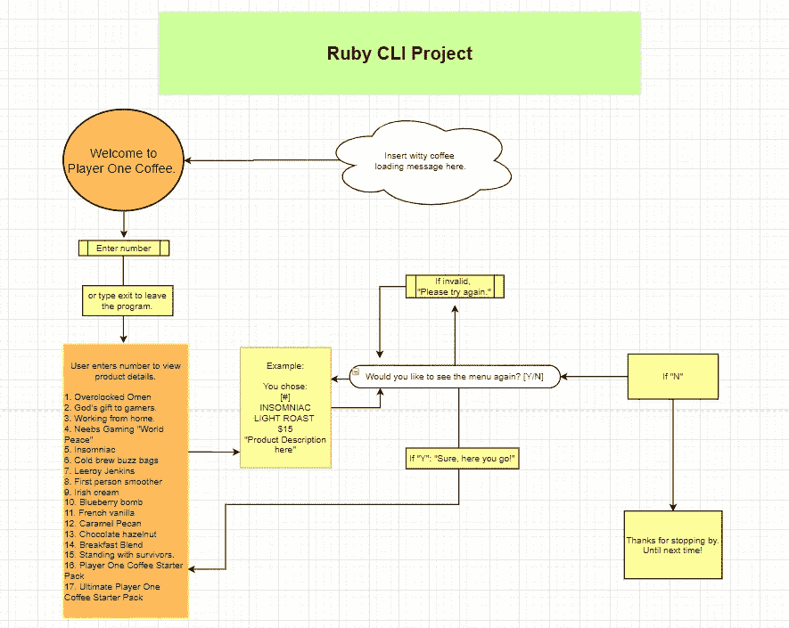

# CoffeeBreak: Ruby CLI 项目

> 原文：<https://blog.devgenius.io/coffeebreak-ruby-cli-project-b8e0c4b7e892?source=collection_archive---------11----------------------->

照片由 [Unsplash](https://unsplash.com?utm_source=medium&utm_medium=referral) 上的 [Azharul Islam](https://unsplash.com/@azhar93?utm_source=medium&utm_medium=referral) 拍摄

我终于完成了我的第一个作品集项目！这篇文章将深入介绍我的项目是做什么的，解释每个文件是做什么的，以及一个关于它如何工作的快速视频演示。

我制作了一个 CLI，向用户展示来自[player ecoffee](https://playeronecoffee.com/collections/all-coffee)的咖啡产品，显示产品名称、烘焙类型、价格和描述。

大声向我的导师和朋友尼克致谢，感谢他在整个过程中给了我反馈。

这个项目确实挑战了我对基本 Ruby 基础的理解，但也给了我额外的学习主题！

我常见的错误是缩进和冗余。当必须进行字符串整数转换时，许多 Google 搜索也会进行。我有一些相互冲突的方法，这些方法要么导致语法错误，要么根本没有语法错误。在调试时，尽可能避免后者是至关重要的，以便了解是什么原因导致 CLI 无法运行。

下面是我的工作流程。

用 draw.io 制作

该流程图帮助我了解我希望 CLI 如何工作和运行。它将以加载消息开始，然后是问候。用户可以选择按编号浏览特定产品，也可以键入“exit”离开。终端根据用户的响应给出相应的消息，例如:

> “哎呀！请再试一次。”||“啊哦！请再试一次。”如果输入无效。
> 
> “当然，给你！”给出一个有效的输入以再次显示菜单。
> 
> “谢谢你的来访。下次见！”用户结束程序。

我有 4 个不同的文件来帮助运行程序:

1.  " **cli.rb** 包含运行终端的 cli 逻辑。

*   这就是奇迹发生的地方！我用它们自己的特定方法定义了响应消息。你不一定要这样做，但我想保持我的方式，这样我就知道在什么情况下不工作了。在我的 run 方法中有一个非常简洁的东西，它在启动名为 **system("clear")** 的程序时清空你的终端。这基本上是在执行之前清空 bash，使得一切都变得干净。我在文件中包含了 Scraper 类，这将导致它一开始加载缓慢。我不想让用户认为它有问题，所以我只是添加了一些厚脸皮的咖啡加载消息。

1.  “ **scraper.rb** ”是咖啡收藏网站的首页。

*   Nokogiri gem 用于从网站的和<href>标签中抓取所需数据。Open-Uri 有助于发送 HTTPS 请求。然后，使用铲子方法将其发送到 Beanss.rb 中的 bean 类。</href>

1.  “ **scraper2.rb** ”是第二个代码结构相同但没有 URL 的页面。

*   与上面类似，Nokogiri 将从第二页中抓取数据。

1.  " **beans.rb** "包含从刮刀文件中获得的数据。

*   名称、标签、价格和详细信息被初始化到一个数组中，以显示 CLI 文件的信息。

bin 文件包含“coffee_time ”,当 bin/coffee_time 被输入到一个 Ruby 友好的应用程序中时，它执行终端。你可以通过我的 Github 下载这个库，在你的终端上试试。 [**Github 回购此处。**](https://github.com/Ro5hi/coffee_break/)

# 视频演示

[https://youtu.be/JN9Q4K9zwpY](https://youtu.be/JN9Q4K9zwpY)

# Ruby 代码

另外，如果它不是最有条理或看起来最干净的代码，我提前道歉。不过我肯定会有一个 0.2.0 版本！

# 结论

对于一个 Ruby 新手来说，这是一个挑战。我一直在做实验室作业，我知道该做什么，但从头开始让我从头开始计划一切。但这是一次很棒的学习经历，我希望通过创造更多的项目，随着时间的推移变得更好！