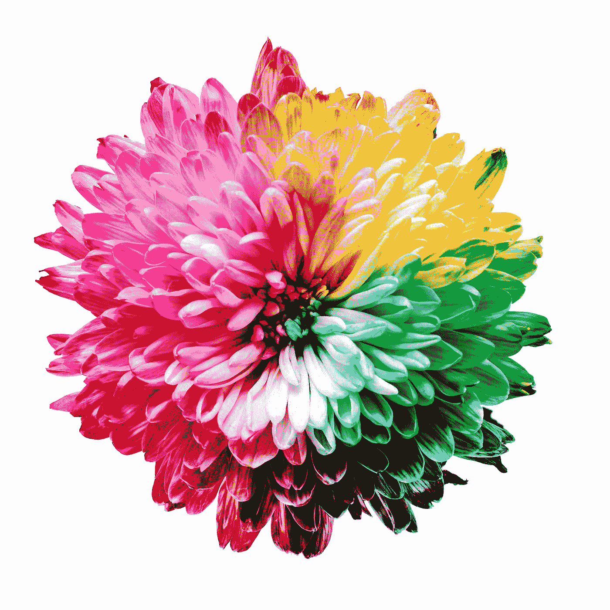
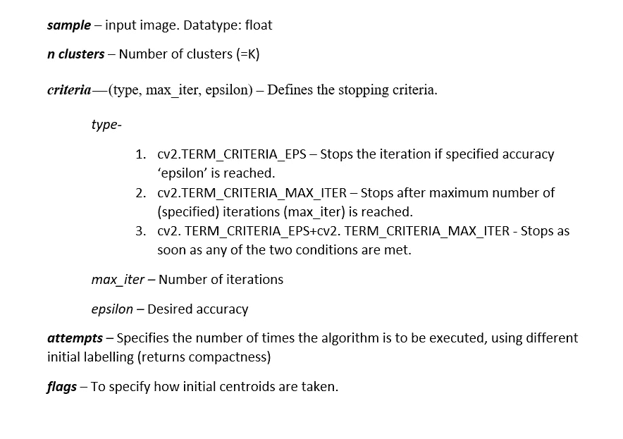
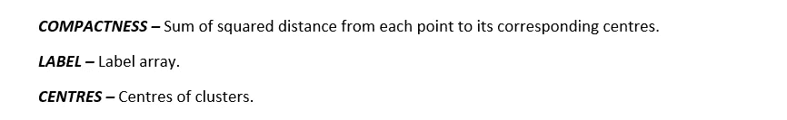
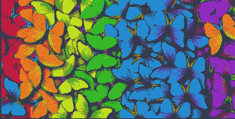
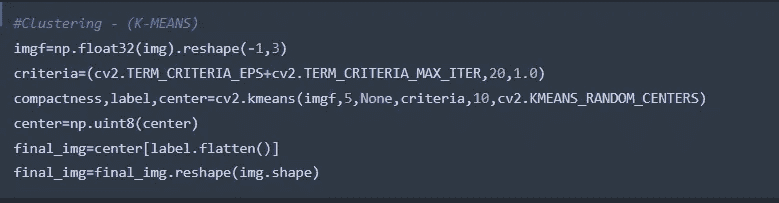
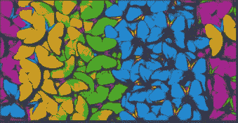

# 颜色量化—使用 K 表示聚类

> 原文：<https://blog.devgenius.io/color-quantization-using-k-means-clustering-132300ca6864?source=collection_archive---------6----------------------->

**色彩量化** —减少图像中使用的不同颜色数量的过程，前提是新图像在视觉上应尽可能与原始图像相似。简单来说就是色彩空间的量化。色彩空间是表征照片中存在的阴影通道的一种方式，它为照片提供了精确的色调。一些流行的色彩空间是—

1.  RGB
2.  用于印刷的四分色
3.  hsv 色彩模型
4.  实验室

> [OpenCV 中的色彩空间](/color-spaces-in-opencv-f0cd3e1d3fab)

这是一种有用的图像压缩技术，对于由于内存限制而只能显示有限数量颜色的设备非常有用。每个图像可以由三个特征来表示:每个像素的 R、G 和 B 值。假设我们的图像具有从 0 到 255 的像素值，我们可以说每个图像具有 256 * 256 * 256 种颜色。我们现在的目标是将颜色的数量减少到可管理的数量。

可以使用任何聚类算法来实现颜色量化。有 3 种可能的聚类类型—

1.  独家的
2.  重合
3.  等级体系的

**独家聚类**

*   也称为“硬聚类”
*   每个数据项只属于一个簇
*   示例— K 表示聚类

**重叠聚类**

*   也称为“软聚类”
*   数据点可以属于一个或多个类别
*   示例—模糊/ C 表示聚类

**层次聚类**

*   也称为“层次聚类分析”
*   一种聚类分析方法，旨在构建聚类的层次结构
*   有两种类型的层次聚类:**分裂(自上而下)和聚集(自下而上)**

实现颜色量化最常用的技术是— *K 表示聚类。*

## **K 表示聚类**

它将相似的数据点组合在一起，以发现潜在的模式。K 均值算法识别“K”个质心，然后将每个数据点分配到最近的聚类，同时保持质心尽可能小。 *K 表示*中的‘means’表示对数据求平均值(求质心)。

OpenCV 有一个内置函数可以直接执行 k 均值聚类

> cv2 . k 均值(样本、n 个聚类、标准、尝试、标志)

输出—

## 代码片段

输入—

输出—

*因此，我们可以看到只有最突出的颜色得以保留，而输出仍然与输入相似。因此，使用 K 均值聚类来实现颜色量化。*

*感谢阅读！如有任何疑问，请随时联系我的*[***Gmail***](http://aditi2507rastogi@gmail.com/)**或我的* [***LinkedIn 个人资料***](https://www.linkedin.com/in/aditi-rastogi-961789191/)**或*[***GitHub***](https://github.com/AditiRastogi250701)*个人资料。***