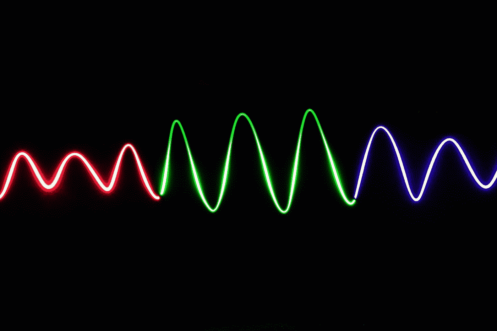
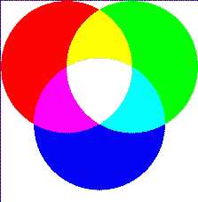
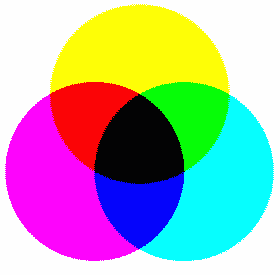
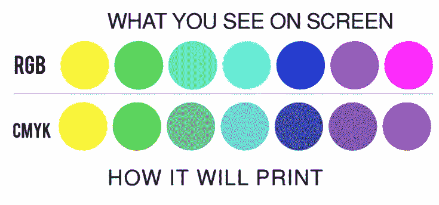
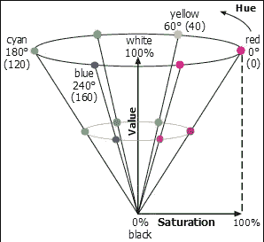
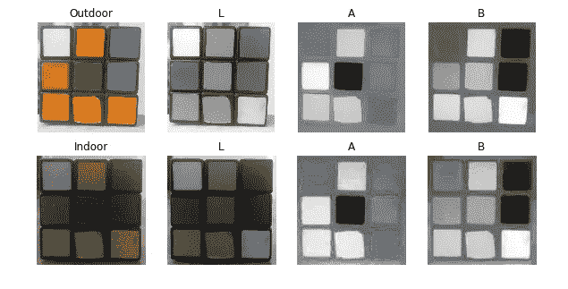

# OpenCV 中的色彩空间

> 原文：<https://blog.devgenius.io/color-spaces-in-opencv-f0cd3e1d3fab?source=collection_archive---------9----------------------->

色彩空间是表征照片中存在的阴影通道的一种方式，它为照片提供了精确的色调。一些流行的色彩空间是—

1.  RGB
2.  用于印刷的四分色
3.  hsv 色彩模型
4.  实验室

# RGB

在 [Unsplash](https://unsplash.com?utm_source=medium&utm_medium=referral) 上由 [Mitchell Y](https://unsplash.com/@mtchllyng?utm_source=medium&utm_medium=referral) 拍照

RGB 代表红绿蓝色彩空间。这是默认的色彩空间，但图像并不是真正以 RGB 格式存储，而是以 BGR 格式存储。OpenCV 读取 BGR 格式的图像，因为当 OpenCV 最初被开发时，BGR 彩色格式在相机制造商和图像软件提供商中很流行。RGB 与 BGR 的主要区别在于红色、绿色和蓝色子像素的排列。RGB 是这样排列的，但 BGR 基本上是相反的，对色彩的鲜艳度和准确性没有不利影响。

它是一种加色模型，即除了主色(它们是红色、绿色和蓝色)之外的所有其他颜色都是通过添加不同强度的主色而形成的。

例如，

红色+蓝色=粉色

红色+绿色=黄色

红色+绿色+蓝色=白色

RGB 颜色空间

# 用于印刷的四分色

CMYK 代表“青色品红色黄色键”。与 RGB 不同，它是一个减色空间。意思是这里的颜色是用白空间减去 RGB 得到的。白光减去红叶青色，白光减去绿叶品红，白光减去蓝叶黄色。

CMYK 色彩空间

CMYK 色彩空间用于彩色印刷，也用于描述印刷过程本身。

# hsv 色彩模型

HSV 代表“色调饱和度值”,是 RGB 颜色模型的替代表示，旨在更紧密地与人类视觉感知颜色制作属性的方式保持一致。在这些模型中，每个 [*色调*](https://en.wikipedia.org/wiki/Hue) 的颜色被排列成放射状切片，围绕从底部的黑色到顶部的白色的中性色的中心轴。

HSV 颜色空间

色调以 0 到 360 度为单位。例如，青色介于 181-240 度之间，洋红色介于 301-360 度之间。颜色的值和饱和度都在 0 到 100%的范围内进行分析。大多数数字颜色选择器都基于 HSV 色阶，HSV 颜色模型对于为艺术、色板和数字图形选择精确的颜色特别有用。它主要用于颜色分割。

# 实验室

Lab 色彩空间有三个组成部分。

1.  L —亮度(强度)。
2.  A—从绿色到洋红色的颜色成分。
3.  B —从蓝色到黄色的颜色成分。

在 RGB 颜色空间中，颜色信息被分成三个通道，但是同样的三个通道也编码亮度信息。另一方面，在 Lab 色彩空间中，L 通道独立于色彩信息，并且仅编码亮度。另外两个通道编码颜色。

*   从图中可以很清楚地看出，照度的变化对 L 分量的影响最大。
*   包含颜色信息的 A 和 B 分量没有经历巨大的变化。

每个 LAB 值代表一种不同的颜色。与 RGB 颜色空间不同，LAB 颜色空间在感知上是一致的。这意味着颜色空间的任何分量的任何变化都被人眼感知为相同程度的颜色变化。

因此，通过这篇文章，我们开始了解不同的色彩空间。

*感谢阅读！如有任何疑问，请随时联系我的*[***Gmail***](http://aditi2507rastogi@gmail.com/)**或我的* [***LinkedIn 个人资料***](https://www.linkedin.com/in/aditi-rastogi-961789191/)**或*[***GitHub***](https://github.com/AditiRastogi250701)*个人资料。***