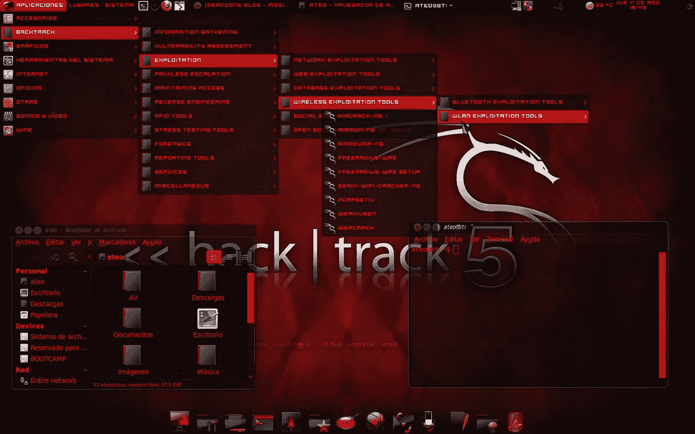
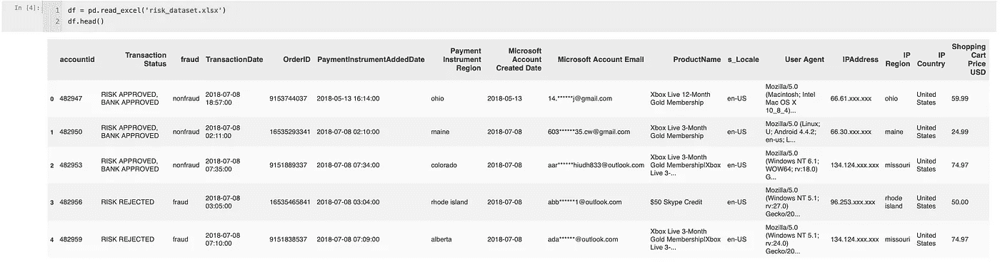
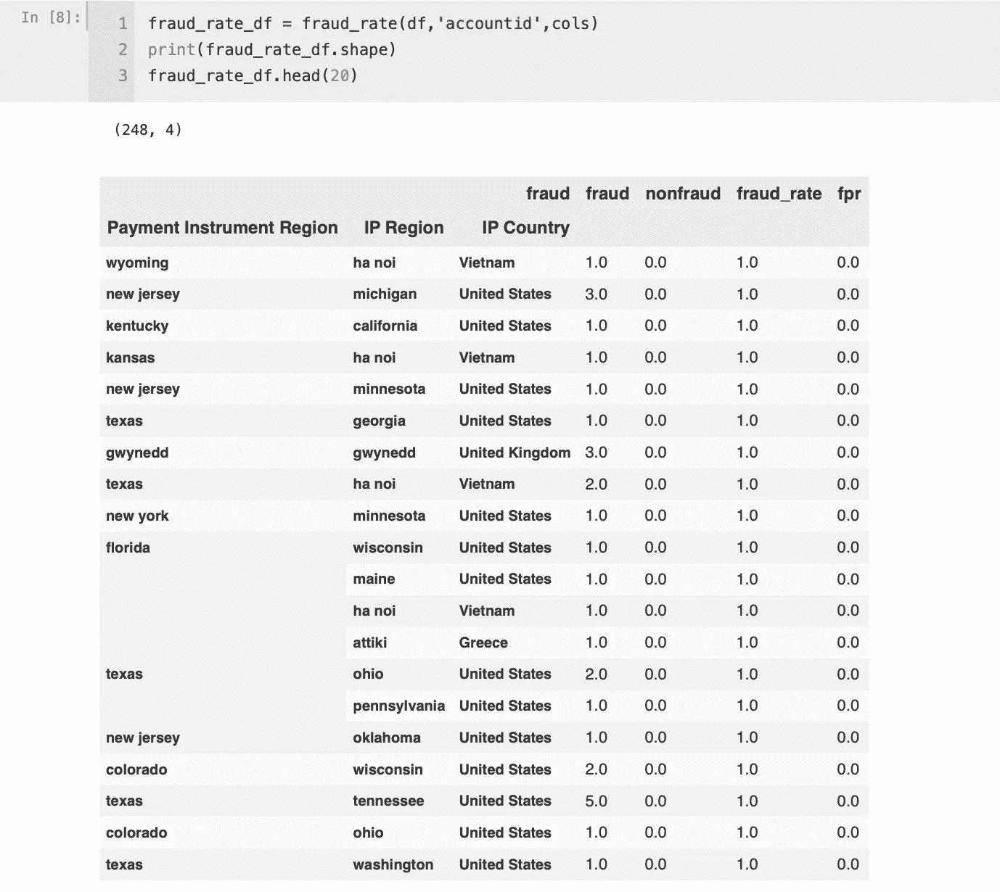
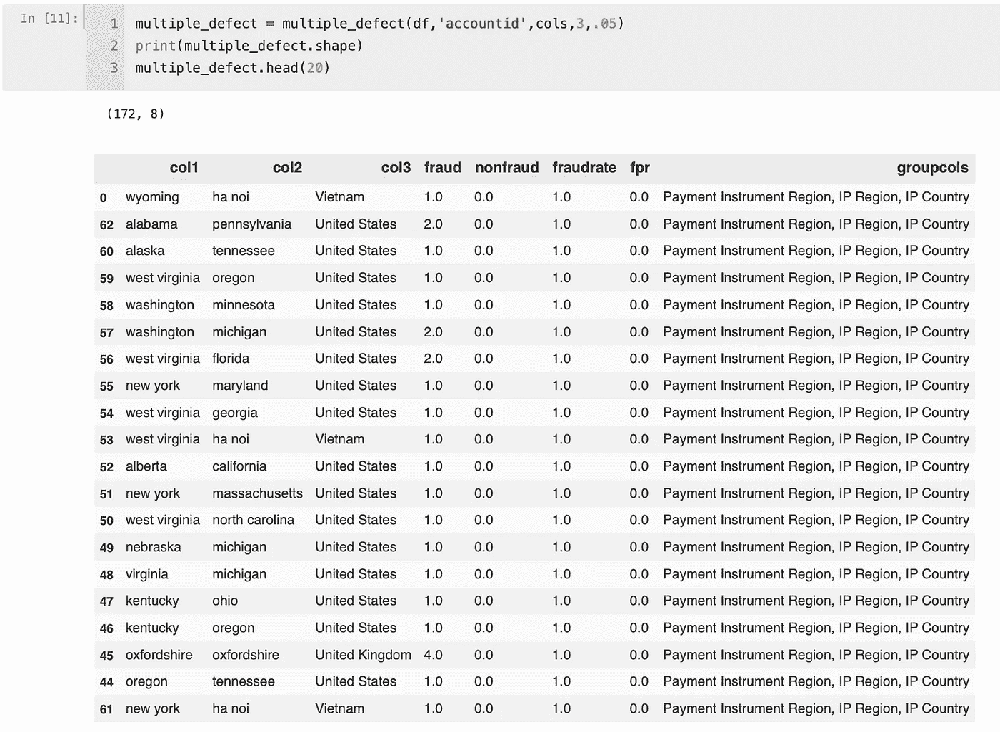
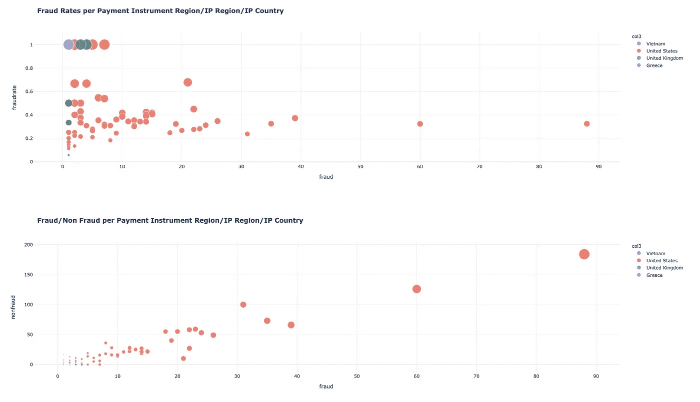

# 使用 Python 打击欺诈和网络犯罪

> 原文：<https://blog.devgenius.io/combatting-fraud-and-cyber-crime-with-python-8d57c82664e2?source=collection_archive---------1----------------------->



不，这篇文章不是关于回溯/linux 或掠夺者或 airmon——我可能会因此惹上麻烦

# 我为什么要写这篇文章？

我一直热衷于欺诈分析。我只是认为，你如何使用这些数据，以及编写一些聪明的代码对一家公司的底线意味着什么，这真的很有趣。

作为一名数据工程师，在光谱的某一点上，我经常被数据包围。可能是数据的质量—数据类型是否正确，它们是否以最佳方式存储；可能是数据处理——分析和建模；可能是数据呈现—报告/仪表板构建；可能是数据的交付—它是否在正确的位置、数据仓库、数据库类型之类的地方；不管是什么，我都在努力。但是用数据来发现欺诈——就像用数据来拼板一样。太牛逼了。

# 那么，什么是欺诈？

或者至少，当人们说“我们正在寻找欺诈或风险分析师”时，他们是什么意思？取决于你所在的行业，通常意味着数字欺诈；像 CNP(无卡)欺诈、账户盗用——基本上是从被盗的信用卡中提取现金。还有更大的定义，但你不是来上历史课的。你来这里是为了密码，对吗？

# 他们是怎么做到的？

我也不想过多地讨论这个问题——但是在互联网的深处，除非你完全隐藏起来，否则你甚至不会想去那里。我说的隐藏是指使用 vpn，一个加密的浏览器，最好不要在你的个人设备上使用。

# 好了，让我们开始吧

```
#first thing's first
import pandas as pd
import itertools
import plotly.express as px
```

## 描绘数据的画面:



我在网上找到的一个风险数据集 GitHub 中的链接

*   看起来我们有一个`accountid`(这是我虚构的——只是一个唯一的行标识符)
*   我们有一个`fraud`列，一些基于 ip 的列，一些日期列(帐户创建日期和交易数据——棒极了)

> **欺诈列是我们的目标—没有欺诈/目标列将无法工作**

*   以及其他一些可能有用也可能没用的，比如`ProductName`、`s_Locale`、`Price`等。

用 pandas profiling 分析你的数据总是好的——但是我很懒，不想为这个项目这么做。这不是我第一次表演，我知道我在找什么。

# 您在找什么？

## 方法 1:

我在寻找模式。但是记住，我很懒。我必须通过编程来找到它们。

上述代码将允许您快速识别导致最高欺诈率的列。太好了！现在我们不必手动筛选，并试图找到异常。相信我，有很多人仍然这样做…呀。希望这能对他们有所帮助。



运行欺诈率函数/代码将为我们提供以下信息

## 方法二:

发现模式的另一种方法是遍历列组合，提取一些关键指标(欺诈率、假阳性率、欺诈和非欺诈的数量等)。).您可以随意设置任何数字，但是列表中至少需要 n 列；还要记住，这最终会变得很昂贵。

Python 函数迭代每个列对

这个方法允许我们对列表中的列进行分组，并遍历每个组来查找指标。你可以自由地添加更多的列，并把它们作为一个列表传递给函数；我做到了。



方法 2 将产生类似这样的结果

# 好吧，让我们把这个带回家

在任何伟大的数据相关代码之后，应该呈现某种视觉效果——你知道，对于那些没有时间听*你如何*构建它的非技术人员来说。下面的代码只是这个项目/数据的一些欺诈视觉的味道。一个人可以创造一百万个。

绘制下图的代码



很明显这个可以更漂亮，但是如果你想要漂亮，你必须付钱给我

我已经建立了数以千计的异常检测视觉效果、查询和程序，在我看来，它们都很棒。也许下一篇文章我会做一些 scikit-learn 和 auto sklearn 代码作为方法 3。

如果你喜欢这个或者觉得这个有帮助，或者如果你需要其他方面的帮助，给我发一些 XRP，我们来聊聊。我会拿比特币/以太坊甚至现金，但都是劣质技术。如果你不知道，现在你知道了。

所有这些代码都在我的 [github](https://github.com/maxwellbade/fraud_combos) 里。

# 干杯

**XRP 钱包**:rmdg 3 ju 8 pgy VH 29 elpwadua 74 cpw w6 fxns

**XRP 目的地标签** : 1328520722

**BTC 钱包**:3k 2 wujcrcbsbiplrffaestjva 5 qubzvr

**ETH 钱包**:0x e 7 ede 8 b 7 ef 4289356d 5579 f 0 C4 e 00 BFF 36 b 28 BDF

**Venmo: @ Max-Bade**