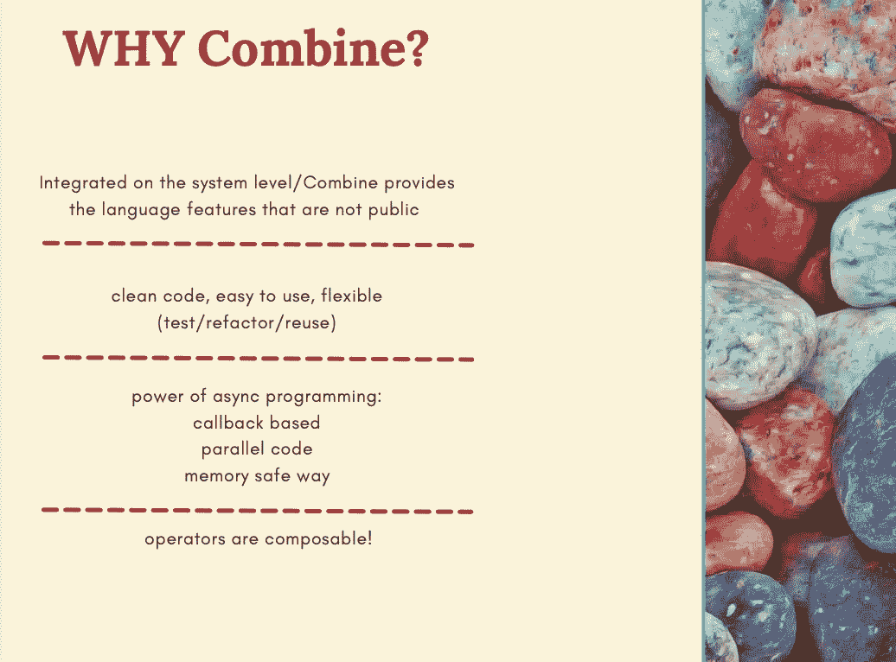
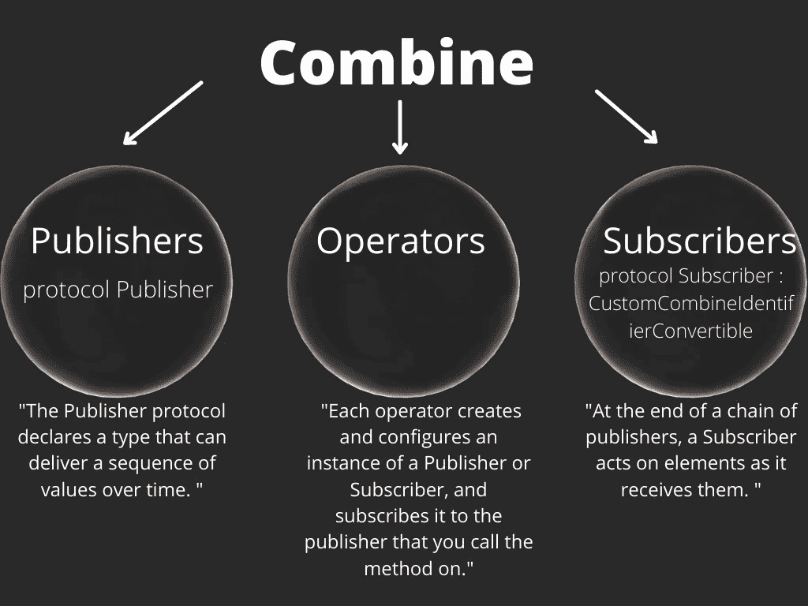
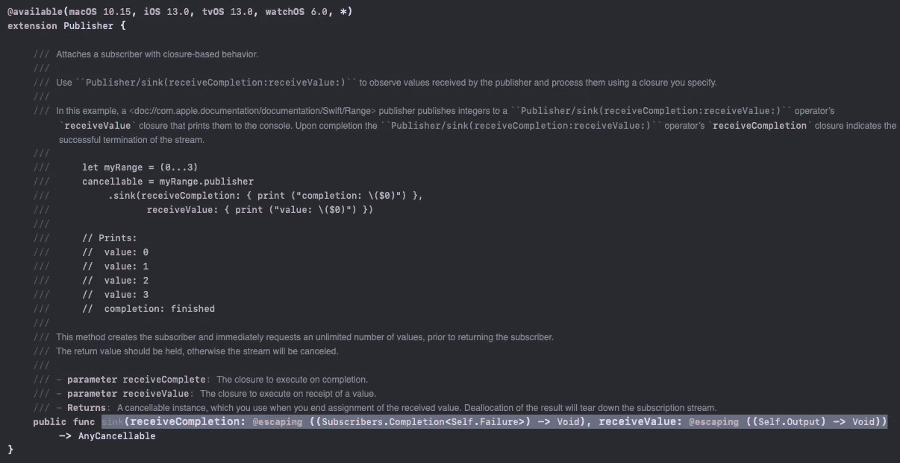
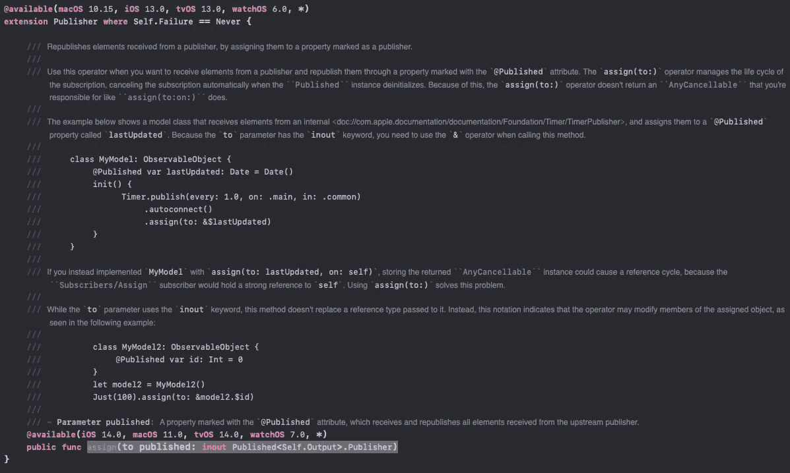
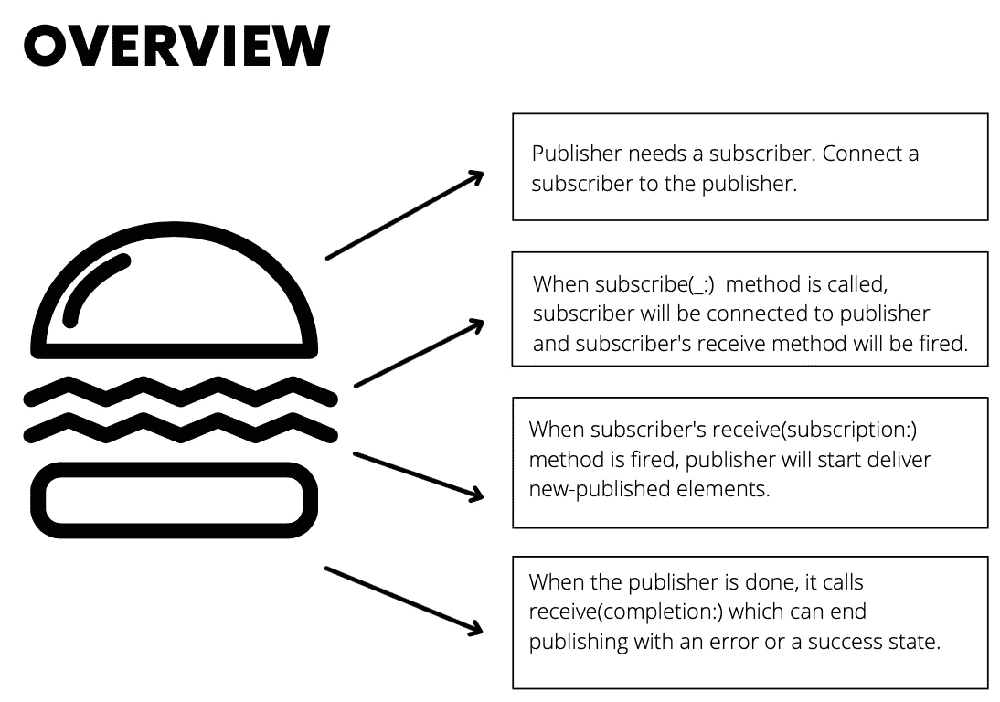

# 联合收割机-101:基础和术语介绍

> 原文：<https://blog.devgenius.io/combine-101-introduction-to-basics-terms-a21106cdd142?source=collection_archive---------4----------------------->


对于这篇文章，我的目的是熟悉并学习创建组合框架的最常用术语的基础知识。当我们完成了第一步，我们将能够更容易地学习这个框架的细节。让我们从一些定义部分开始！(也许是最无聊的部分……是的，不要失去动力，继续读下去！)

首先，Combine 是苹果在 WWDC2019 上宣布的一个新框架。Combine 是苹果自己的框架，它可以处理/帮助 IOS 开发者的几乎所有任务。哇，太好了，但是什么？我的意思是，Combine 是非常动态和强大的，因为有了它，处理委托、通知、回调、闭包等变得更加容易。

> Combine 框架提供了一个声明性的 Swift API，用于随时处理值。这些值可以表示多种异步事件。Combine 声明*发布者*公开可以随时间变化的值，声明*订阅者*从发布者那里接收这些值。来源可用[此处](https://developer.apple.com/documentation/combine)。

当然，很好。为什么我们需要使用 Combine FW 而不是发送/观察通知？以下是答案:



联合有 3 个核心概念:出版商，运营商，订户。我看了很多和 Combine 框架相关的东西。作为介绍，我首先试图理解出版商、运营商和订户的术语和责任。



正如你在图表上看到的，这是对概念最简单的解释。让我们更深入:他们到底是什么，他们的责任是什么？

## 出版商

发布者是一种协议，负责根据需求/请求随时将数据/值分发给注册方(例如一个或多个订户)。

要做到这一点，要求是应该为发布者注册一个订阅。这意味着应该有请求/侦听器从发布者协议获取数据。

要定义一个发布者，需要两个相关的类型:输出和失败。

```
AnyPublisher<Output, Failure>
```

**Output** 是一个通用的输出类型，它引用发布者发出的值。“出版商。“输出”是您发出的类型，它引用已发布的值。
**失败**是发布者返回的一种错误形式。
**加成**:如果用 Never 作为失败类型，表示永远不会失败。

根据下面的示例，这意味着发布者将 Int 作为输出发出，并且不会失败。

```
Publisher<Int, Never>
```

## 经营者

操作符是范围广泛的方法，它们执行某些操作，并使用发布者发出的值或事件(完成)来更改您正在处理的数据。

运算符总是有输入(上游)和输出(下游)。它们是“事件处理链”的基础。运算符的输入类型必须与发布者的类型匹配。

## 订阅者

订阅者是从发布者接收输入的协议。每个订阅都以订阅者结束。

> 联合收割机在`[Publisher](https://developer.apple.com/documentation/combine/publisher)`类型上提供`[sink](https://developer.apple.com/documentation/combine/publisher/sink(receivecompletion:receivevalue:))`和`[assign](https://developer.apple.com/documentation/combine/publisher/assign(to:on:))`用户作为操作员；

*   `[sink(receiveCompletion:receiveValue:)](https://developer.apple.com/documentation/combine/publisher/sink(receivecompletion:receivevalue:))`在你的代码上提供基于闭包的行为，这样你将能够接收值和完成。为了更好地理解，让我们检查函数的签名。



*   `[assign(to:on:)](https://developer.apple.com/documentation/combine/publisher/assign(to:on:))`每当订阅者收到输出属性时，它就被写入一个变量并通过 key-path 存储。例如，如果 UI 配置需要最近收到的变量，那么访问和设置 UI 就很容易。

> [**WTF 关键路径？**](https://www.appypie.com/swift-keypath-how-to)Swift 中的关键路径是一种存储对属性的引用的方式，与引用属性的值本身相反。这就像处理属性的名称，而不是它的值。

为了更好地理解，让我们检查函数的签名。



如果您觉得自己还不熟悉联合收割机，请不要担心。这很正常，但是你应该知道这只是开始前的情况。这是关于阅读，试图理解的条款，并在所有的概念，然后尝试如何实现组合。首先，我们先来看一个概述:



*   Publisher 是一种协议，它定义需求并发布值和事件。
*   Publisher 可以发布零个或多个值，但只包含一个完成事件(错误或成功状态)。
*   使用`just`,您可以从单个值创建一个发布者。
*   如果 publisher 发布完成事件，则该事件已完成，不能再发布。
*   订阅者是一种协议，它定义了能够从发布者接收输入的要求。
*   Sink 是一种用闭包来附加订户的方法。
*   您可以使用`sink`创建一个订户。
*   只要发布者发布->称为无限制需求，接收器将继续接收值。

对于未来的文章，我的目的是更深入地结合 FW 的概念，写第一出版商，订户和玩主题。

感谢您的阅读！