# 将多个 csv/excel 文件合并到一个表格中(Python Pandas)

> 原文：<https://blog.devgenius.io/combine-multiple-csv-excel-files-into-a-single-table-python-pandas-18d2aaa10986?source=collection_archive---------12----------------------->


# 读取文件

在我的[上一篇文章](https://www.linkedin.com/pulse/turn-excel-pandas-data-frame-python-chee-chuan-foo)中，我已经展示了如何将 excel 或 csv 文件转换成 pandas 数据框架。当你只有一个 excel 文件需要处理的时候，这将是非常有用的。实际上，许多公司每天/每周/每月/每年都将数据分离到一个 csv 文件中。在这种情况下，您可能希望将它们结合起来分析所有数据，比如说，全年的数据。

为简单起见，我们将使用 csv 文件，其中包含由股票代号和年份分隔的每年的月度股票价格。在这个[数据文件夹](https://drive.google.com/uc?export=download&id=1W3eI3EF_q3G1jTBuHOGIH2XhFJETBRHg)中，我们有苹果、亚马逊和微软的股票价格。

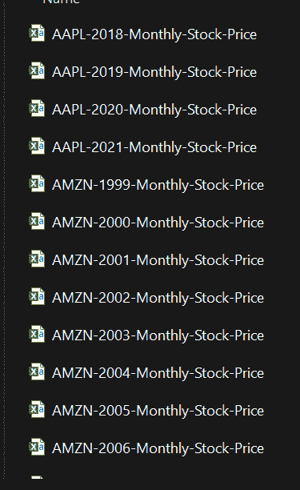

# 读取文件夹中的文件

为了读取文件夹中的所有文件，让我们编写代码列出指定文件夹中的所有文件。

```
# List out files in 'writeCSV' folderimport os
data_files = os.listdir('writeCSV')
data_files
```

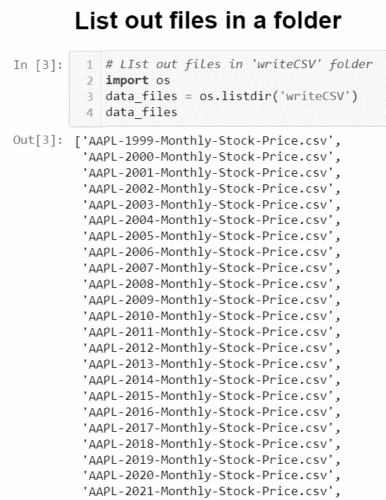

这里，我们列出了“writeCSV”文件夹中的所有文件**您可能希望引用您自己的文件路径* *现在我们应该读取这些文件中的所有数据并将它们合并到一个表中。

# 循环所有数据

首先，我们将遍历所有数据。

```
import pandas as pd
for filename in data_files:
    # Read data from each file
    df = pd.read_csv(f'writeCSV/{filename}')
    print(df)
```

现在的问题是，我们不知道哪一行属于哪个 excel 文件。因此，我们将添加另一列来指示它来自哪个 excel 文件。因此，让我们向表中添加列来表明它们的来源。

```
import pandas as pd
for filename in data_files:
    # Read data from each file
    df = pd.read_csv(f'writeCSV/{filename}')
    # Get ticker & year from filename
    csvTicker = filename[0:4]
    csvYear = filename[5:9]
    # Add columns "Ticker" and "Year" to the table
    df['Ticker'] = csvTicker
    df['Year'] = csvYear
    print(df)
```

请注意，我们的 excel 文件名中有一个模式:“MSFT-2009-月度-股票价格. csv”，前 4 个字母和后面的 4 个字母告诉我们该数据属于哪只股票和哪一年。data_files 中的 filename 是 string(文件名)filename[0:4]表示我们取第一个 4 字符。注意，我们从 0 开始计数，以 4 结束计数。0 是第一个元素的索引，4 是第五个元素的索引，依此类推。等等，我们不是只对前 4 个字符感兴趣吗？那我们为什么取[0:4]而不是[0:3]？而索引从 0 开始，python 中的[a，b]表示从 a 到 b-1 也就是省略最后一个数字。因此，文件名[0:4]将只采用前 4 个字符，而不是 5 个字符。

实际上，您可能会看到类似的模式，例如:“20211123Sales.csv”。在这种情况下，我们可以将文件名[0:4]作为年，文件名[4:6]作为月，文件名[6:8]作为日。

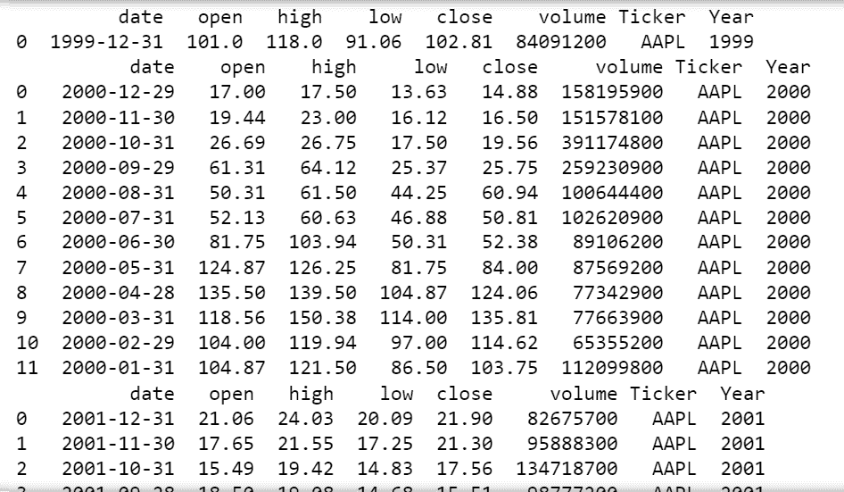

此时，我们一个接一个地打印每个表格，而不是将它们合并到一个表格中。这不是我们想要的。但是在此之前，让我们使用生成器重新创建这些单独的表。

```
# Generator
def load_files(data_files):
    for filename in data_files:
        # Read data from each file
        df = pd.read_csv(f'writeCSV/{filename}')
        # Get ticker & year from filename
        csvTicker = filename[0:4]
        csvYear = filename[5:9]
        # Add columns "Ticker" and "Year" to the table
        df['Ticker'] = csvTicker
        df['Year'] = csvYear
        yield df
```

等等，发电机？那是什么？就像我们一直在一个接一个地打印表格一样，yield df 帮助我们‘生成’表格，正如它的名字所暗示的那样，而不是返回或打印它们。我们将“生成”这些表，并在生成另一个表后使用 concat()函数追加行。

```
# Generate a list of file names
data = [x for x in data_files] # load_files takes 1 argument (a list of file names)
stockprice = pd.concat(load_files(data))
stockprice
```

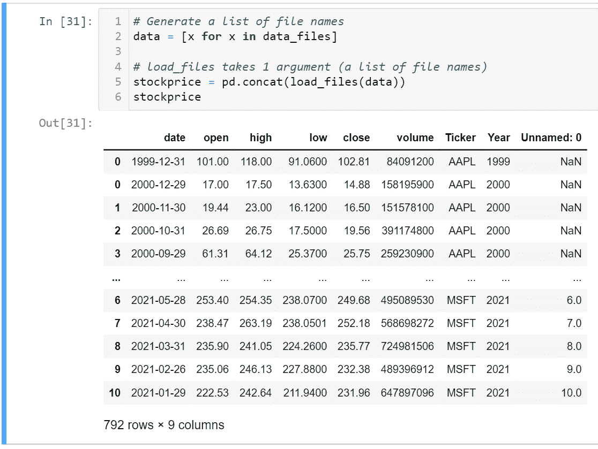

看，我们已经成功地将这些表合并成 1。然而，我们还没有接近完成，因为:1。行索引很奇怪(0，0，1，2，3，…，6，7，8，9，10)，而我们有 792 行。2.我们有一个额外的“未命名:0”列。

# 索引

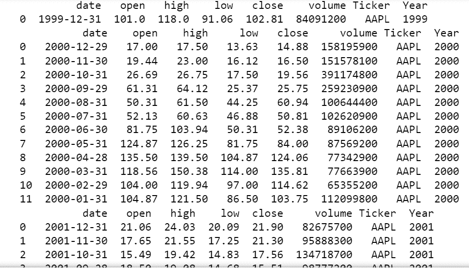

回想一下，这些最初是单独的表，每个文件有 12 行(除了第一行)。当我们使用 concat()合并表时，我们基本上是追加行(包括索引),因此即使在合并表之后，它仍然保持为 0–11。

```
# Generate a list of file names
data = [x for x in data_files] # load_files takes 1 argument (a list of file names)
stockprice = pd.concat(load_files(data)) # Reset index
stockprice.reset_index(drop=True, inplace=True) stockprice
```

我们需要使用 stock price . reset _ index(drop = True)来删除原来的索引，并使用新的索引。而 inplace=True 意味着修改后的表将被重新分配给 stockprice 变量，而不是定义一个新的变量。

# 未命名:0 列

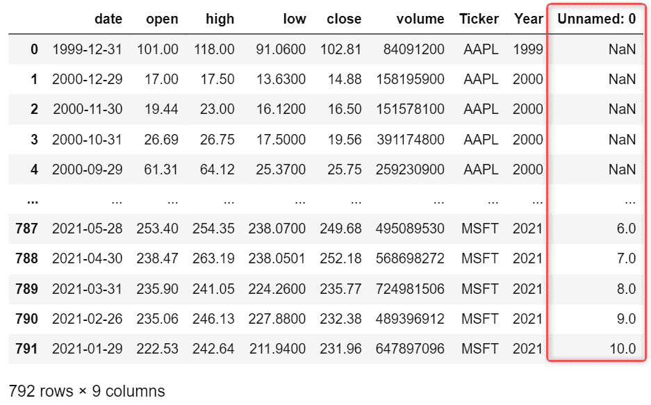

请注意 Unnamed: 0 列的顶部几行和底部几行之间的差异。对于苹果公司的股票，其价值是 NaN，而对于微软公司，其价值实际上是其原始指数。这告诉我们，对于微软的文件，数据中有一个索引列，而苹果没有。

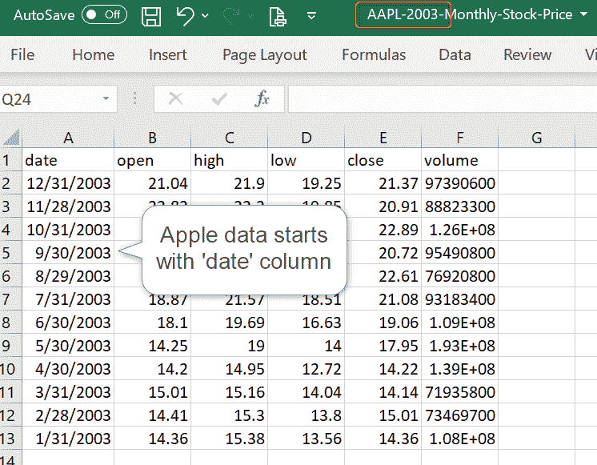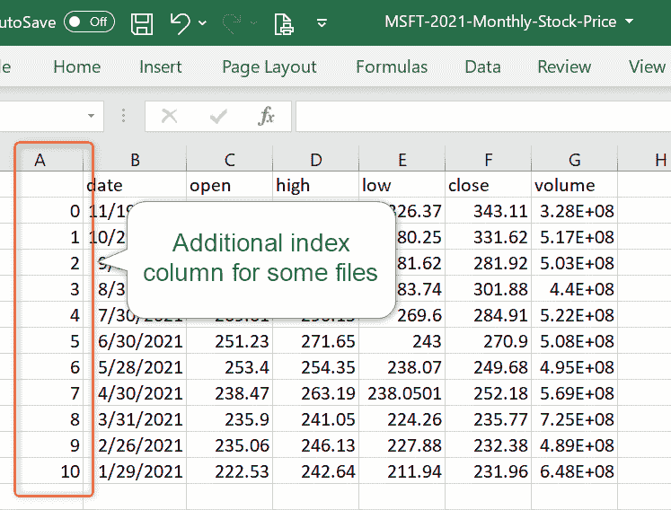

当我们使用 pd.concat()追加表时，pandas 将取出那个索引列，并将其重命名为 Unnamed: 0。对于没有该列的 excel 文件，这些值将为 null (NaN)。

如果所有文件都有那个索引列，我们可以使用 index_col=0 告诉 pandas，第一列实际上是索引列，我们不需要包含在我们的合并表中。

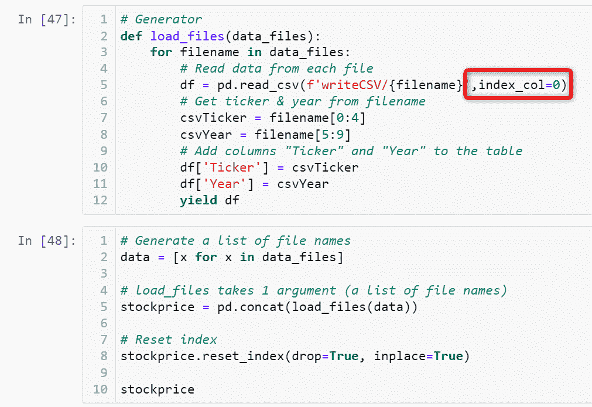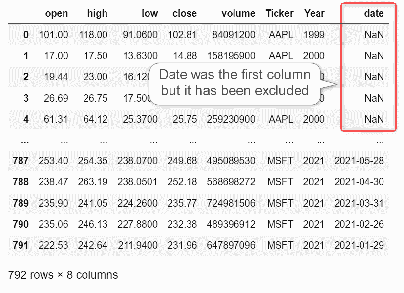

如图所示，在我们的例子中，我们不能使用 index_col=0，因为不是所有的文件都有那个索引列。

```
# Generate a list of file names
data = [x for x in data_files] # load_files takes 1 argument (a list of file names)
stockprice = pd.concat(load_files(data)) # Reset index
stockprice.reset_index(drop=True, inplace=True) # Removes last column
stockprice = stockprice.iloc[:,:-1] stockprice
```

DataFrame.iloc[a:b，c:d]表示我们取 a+1 到 b-1 行(索引从 0 开始，省略最后一个数字)和 c+1 到 d-1 列。在我们的例子中，我们使用 iloc[:，:-1]。“a”和“b”未填写意味着我们将接受所有行。同样的想法也适用于‘c’(没有填写意味着 c=0)和 d = -1。index = -1 表示从后数的第一个索引，因此，我们将获取除最后一列之外的所有列(最后一个数字被省略)。

# 最终输出

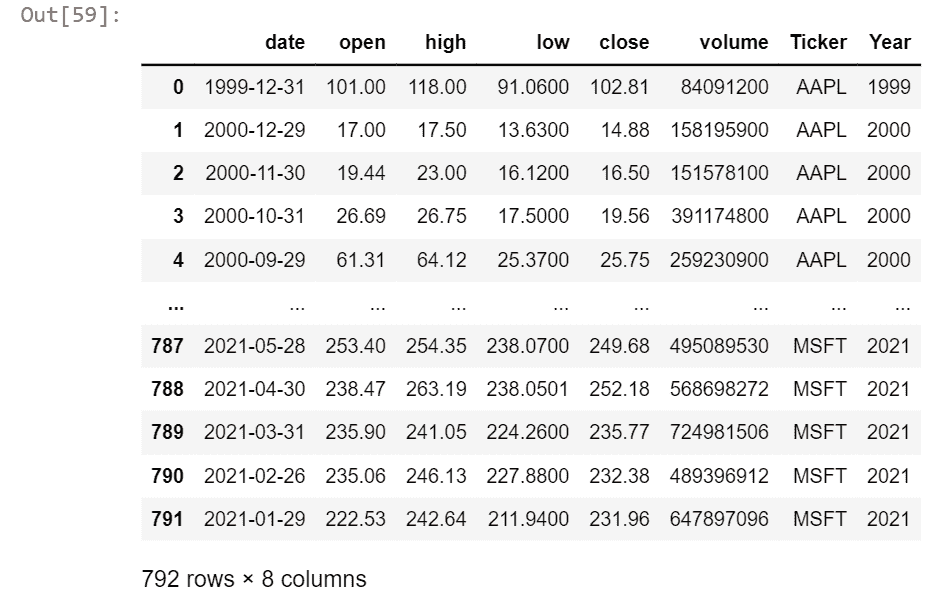

这就是我们期望的组合表。让我们把这些代码放到一个函数中，这样我们就可以用一行代码来调用它。

```
def read_data():

    # Generate a list of file names
    data = [x for x in data_files]

    # Concatenate data frames
    stockPrice = pd.concat(load_files(data))

    # Reset Index
    stockPrice.reset_index(drop=True, inplace=True)

    # Removes last column
    stockPrice = stockPrice.iloc[:,:-1]

    # Print Number of Files Loaded
    print("Loaded",len(data),'files')

    # Print Number of Rows
    print("Total Rows =",len(stockPrice))

    # Print Number of Columns
    columns=[]
    for column in stockPrice:
        columns.append(column)
    print("Total Columns =",len(columns))
    return stockPrice
```

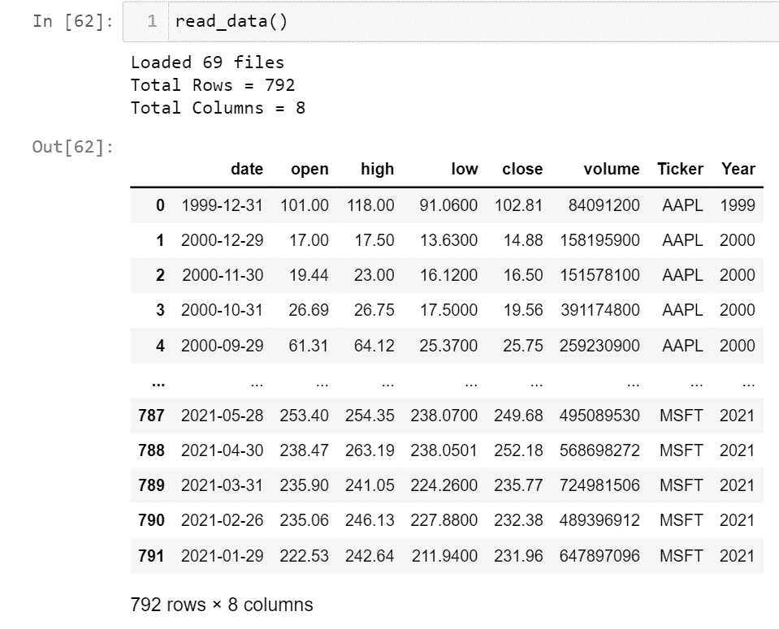

请注意，我们添加了代码来打印加载到表中的文件数、行数和列数，这样，当我们调用函数而不显示结果表时，我们就知道表已成功加载。

# 最终代码和输出(将所有文件合并到一个文件夹中)

```
# Generator
def load_files(data_files):
    for filename in data_files:
        # Read data from each file
        df = pd.read_csv(f'writeCSV/{filename}')
        # Get ticker & year from filename
        csvTicker = filename[0:4]
        csvYear = filename[5:9]
        # Add columns "Ticker" and "Year" to the table
        df['Ticker'] = csvTicker
        df['Year'] = csvYear
        yield df def read_data(): # Generate a list of file names
    data = [x for x in data_files]

    # Concatenate data frames
    stockPrice = pd.concat(load_files(data))

    # Reset Index
    stockPrice.reset_index(drop=True, inplace=True)

    # Removes last column
    stockPrice = stockPrice.iloc[:,:-1]

    # Print Number of Files Loaded
    print("Loaded",len(data),'files')

    # Print Number of Rows
    print("Total Rows =",len(stockPrice))

    # Print Number of Columns
    columns=[]
    for column in stockPrice:
        columns.append(column)
    print("Total Columns =",len(columns))
    return stockPriceread_data()
```


如果你需要的是读取一个文件夹中的所有文件，你可以就此打住。在某些情况下，您可能不想合并所有文件，而是根据文件名选择要合并的文件。

为了声明模式，我们将使用 re.compile

```
import re
# Define a pattern we want
pattern = re.compile(f'^....-....-Monthly-Stock-Price')
# in data_files list, loop through all elements and return elements that match our pattern
data = [x for x in data_files if pattern.match(x)]
data
```

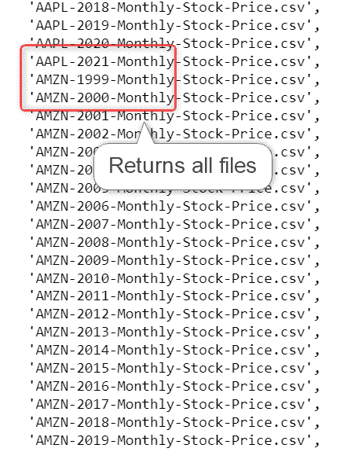

re 代表正则表达式。当我们想要定义一个模式，而不是写所有匹配该模式的名字时，通常使用它。查看[正则表达式备忘单](https://www.debuggex.com/cheatsheet/regex/python)了解更多正则表达式符号及其用法。

在这里，我们使用^….-….-告诉 python 我们希望任何文件名以任何 4 个字符开头，后面跟一个'-'，任何 4 个字符，在“Monthly-Stock-Price.csv”前再跟一个'-'。如果我们想指定一个股票，我们可以替换…股票代码像 MSFT。

```
import re
# Define a pattern we want
pattern = re.compile(f'^MSFT-....-Monthly-Stock-Price')
# in data_files list, loop through all elements and return elements that match our pattern
data = [x for x in data_files if pattern.match(x)]
data
```

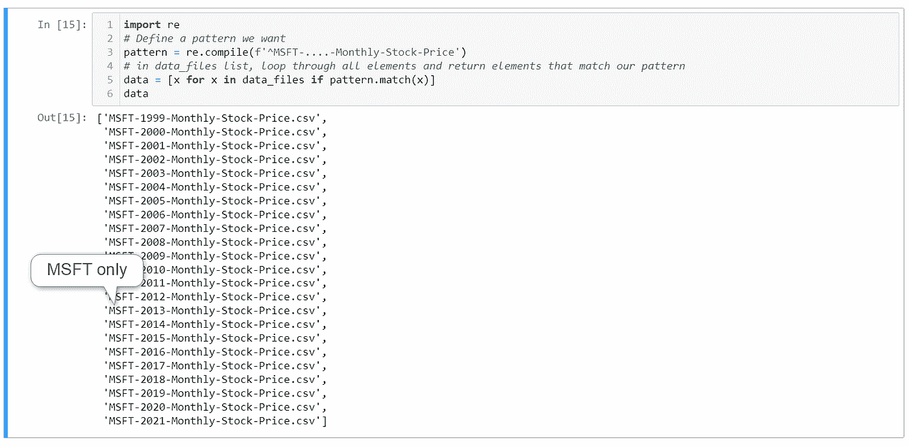

把这个放到我们的函数中:

```
def read_data():
    # Define a pattern we want
    pattern = re.compile(f'^MSFT-....-Monthly-Stock-Price')

    # in data_files list, loop through all elements and return elements that match our pattern
    data = [x for x in data_files if pattern.match(x)]

    # Concatenate data frames
    stockPrice = pd.concat(load_files(data))

    # Reset Index
    stockPrice.reset_index(drop=True, inplace=True)

    # Removes last column
    stockPrice = stockPrice.iloc[:,:-1]

    # Print Number of Files Loaded
    print("Loaded",len(data),'files')

    # Print Number of Rows
    print("Total Rows =",len(stockPrice))

    # Print Number of Columns
    columns=[]
    for column in stockPrice:
        columns.append(column)
    print("Total Columns =",len(columns))
    return stockPrice
```

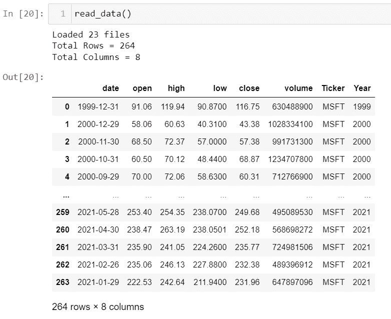

最终代码(带正则表达式)

```
# Generator
def load_files(data_files):
    for filename in data_files:
        # Read data from each file
        df = pd.read_csv(f'writeCSV/{filename}')
        # Get ticker & year from filename
        csvTicker = filename[0:4]
        csvYear = filename[5:9]
        # Add columns "Ticker" and "Year" to the table
        df['Ticker'] = csvTicker
        df['Year'] = csvYear
        yield df def read_data():
    # Define a pattern we want
    pattern = re.compile(f'^MSFT-....-Monthly-Stock-Price')

    # in data_files list, loop through all elements and return elements that match our pattern
    data = [x for x in data_files if pattern.match(x)]

    # Concatenate data frames
    stockPrice = pd.concat(load_files(data))

    # Reset Index
    stockPrice.reset_index(drop=True, inplace=True)

    # Removes last column
    stockPrice = stockPrice.iloc[:,:-1]

    # Print Number of Files Loaded
    print("Loaded",len(data),'files')

    # Print Number of Rows
    print("Total Rows =",len(stockPrice))

    # Print Number of Columns
    columns=[]
    for column in stockPrice:
        columns.append(column)
    print("Total Columns =",len(columns))
    return stockPrice
```

最终输出


本文最初发表在我的 [linkedin 个人资料](https://www.linkedin.com/pulse/combine-multiple-csvexcel-files-single-table-python-pandas-foo/)上。如果你喜欢读这篇文章，请随时关注我！

感谢您的阅读！下一篇文章再见:)