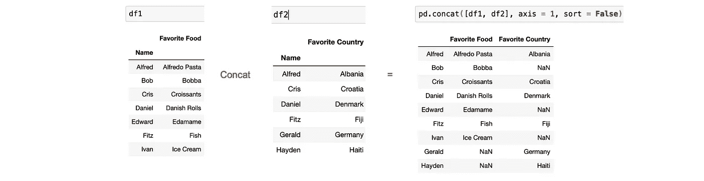

# 结合熊猫的数据

> 原文：<https://blog.devgenius.io/combining-data-in-pandas-31c984afceb7?source=collection_archive---------1----------------------->

在 Pandas 中有多种方式来组合数据:

*   通过追加— *df* 。*追加()*
*   通过连接— *pd.concat()*
*   通过加入— *df* 。 *join()*
*   通过合并— *pd.merge()或 df.merge()*

# 通过追加

追加看起来像这样:

如果你想垂直堆叠数据帧*，你可以使用它。非常简单，就像它的语法一样:`df1.append(df2, sort = False)`*

**

*但是**如果**你想并排堆叠数据帧呢？*

# *串联*

*输入 ***串联*** 。Concat 可以做 append 做的事情，还可以做更多。可以垂直堆叠数据帧:`pd.concat([df1, df2], sort = False)`*

****

*还有横向:`pd.concat([df1, df2], **axis = 1**, sort = False)`*

**

*append 和 concat 都创建被组合的数据帧的完整的*联合*。这意味着 df1 和 df2 中的所有行都包含在结果数据帧中。*

*让我们密切关注这个例子:*

**

*我们试图连接一个有最喜欢的食物的人的数据框架(df1)和一个有最喜欢的国家的人的数据框架(df2)。现在，有些人只有其中的一个(要么是最喜欢的食物**要么是最喜欢的国家**，但是使用 concat，每个人的名字都会出现在结果数据帧中。😬*

*这并不总是有效和有用的。有时，我们只想看到数据帧之间匹配的数据。如果我只对那些有最喜欢的食物和最喜欢的国家的人感兴趣呢？可惜 concat 在那方面帮不了我。好事*加入*即可。*

# *加入*

*就像 concat 一样，join 在索引的基础上并排堆叠数据帧。它的语法也很简单:`df.join(df2, sort = False)`但是与 concat 不同，join 有选项**而不是**来创建数据帧的完整的*联合*。您可以修改它，使其以四种不同的方式运行:*

****外连接*** :在 join 的词汇表中，*联合*被称为*外连接。*正如我们前面看到的 concat， *union* 组合所有数据帧中出现的所有数据。*

****

*传递参数， *how，*是我们指定如何连接数据帧的方式。尝试将此数据帧与之前 concat 中的数据帧进行比较。它们应该有相同的数据。*

****内部连接*** : *内部连接* s 创建数据帧的*交集*。它只包括在两个数据帧中都有**匹配索引**的行。*

****

****左联结*** : *左联结*是*联结的默认行为。*除非您指定了*方式，否则* join 会完全合并您的左侧数据帧和右侧数据帧上具有匹配索引的任何行。*

****

****右* *联接:*** *右联接*行为相反。它从右侧数据帧中取出所有行，从左侧数据帧中取出任何具有匹配索引的行。*

****

*连接很棒。它允许我们选择在结果数据帧中包含哪些行。然而，有两个关于*加入*的典型抱怨:*

1.  *如果两个数据帧都有**列**和**共享相同的名称**，你将被要求**重命名其中的一个。***

*例如，如果 df1 和 df2 的索引被重置，并且我们试图连接它们，我们将得到一个错误，因为 *join* 识别出两个数据帧共享列‘Name’，该列不再被设置为索引。*

****

*为了解决这个问题，您必须为其中一个数据帧提供一个后缀( *lsuffix* 如果您将它提供给左边的 df 和 *rsuffix* ):*

**

*这可能已经解决了这个错误，但是即使这些共享列现在有稍微不同的名称，在 dataframe 中同时包含它们也没有什么实际用途。*

*2.基于索引只能**完成**的连接。这意味着您必须始终确保您尝试连接的数据帧具有相同的索引。一直都是。*

*你认为有没有一种方法可以根据数据帧的共享列而不是索引来匹配数据帧？我们是否可以这样做，使得这些共享列在结果数据帧中只出现一次？*

*为什么是的。让我们转向*合并。**

# *合并*

*Merge 是 join 更直观更智能的版本。但是它的语法也很简单:`df1.merge(df2)`或`pd.merge(df1,df2)`*

****

*Merge 可以做 join 所做的一切。就像 *join* ， *merge* 也可以通过 *how* 参数指定数据帧如何被连接(*内*，*外*，*左，右)*)。唯一的区别是，一个 join 默认为*左 join* ，而一个 merge 默认为*内 join，*如上图*所示。**

*在处理共享列方面，Merge 比 join 做得更好。当它检测到列' *Name* '同时出现在上面的两个数据帧中时，它只返回第一个，而对于 join，它将返回两个。*

*但是关于合并最酷的事情可能是我们不需要数据帧有相同的索引来组合。Merge 基于共享列合并数据帧！*

**

*在上面的例子中，我们引入了一个新的数据帧 df3，并试图将其与 df2 合并。如你所见，df2 和 df3 是基于它们共享的列自动合并的:“最喜欢的国家”*

*如果数据帧之间有太多的共享列，并且我们想要控制使用哪一个进行合并，我们可以传递参数上的*:**

**

*在这里，有两个列在数据框之间共享- ' *名字*和'*最喜欢的国家*'。在指定我们希望仅基于*‘Favorite Country*’列进行合并时， *merge* 返回了另一个共享列的两个副本， *Name* ，并分别为每个副本添加了后缀“_x”和“_y”。它在结果数据帧中区分了两者。*

*最后，如果我们真的需要根据索引合并数据帧怎么办？我们需要回到使用*连接*吗？*

*号码*

*通过传递要合并的索引的名称，我们可以很容易地做到这一点。为此，我们使用' *left_index* '(用于左侧 df)和' *right_index* '(用于右侧 df)参数。如果两个索引共享相同的名称，我们可以将两个参数都设置为 True:*

**

*就是这样！*

**鳍**

*附:如果你喜欢这个，你可能会喜欢:*

*   *[选择熊猫的数据](https://medium.com/swlh/selecting-data-in-pandas-ff9fe1370785?source=friends_link&sk=e5015c119372425ba0b4132513ad6683)*
*   *[过滤熊猫的数据](https://levelup.gitconnected.com/filtering-data-in-pandas-c7b60d1e1301?source=friends_link&sk=73ef944d2f932d8c8380d8b5cfb23ac9)*
*   *[对熊猫的数据进行分组和汇总](https://medium.com/swlh/grouping-and-aggregating-data-in-pandas-7cae8c5023ce?source=friends_link&sk=ffc3e4da0327ad184ae0ed7fbe022ab5)*