# 在 Java 应用程序中结合生产和远程调试

> 原文：<https://blog.devgenius.io/combining-production-and-remote-debugging-in-java-applications-8a849ee93ca9?source=collection_archive---------5----------------------->

如今，系统变得越来越复杂。一个大的应用程序可能由微服务组成，依赖于不同的 API，是一个很难控制的整体，因为它包含旧的遗留代码，或者有许多开发人员一起工作。

随着 web 应用程序的增长，您的软件架构师(如果您有)可能会引入标准实践，如 IOC(控制反转)和 TDD(测试驱动开发),以最小化产品错误或崩溃。或者，你可以使用已经实现了这些技术的框架，比如 [Spring](https://spring.io/guides/gs/serving-web-content/) 。然而，即使有了这些工具，错误和崩溃仍然会发生，你必须处理它们！

那么你能做什么呢？你需要能够看到并管理出现的错误，为此，我发现 [Lightrun Cloud](https://lightrun.com/cloud/) 是最有效的。

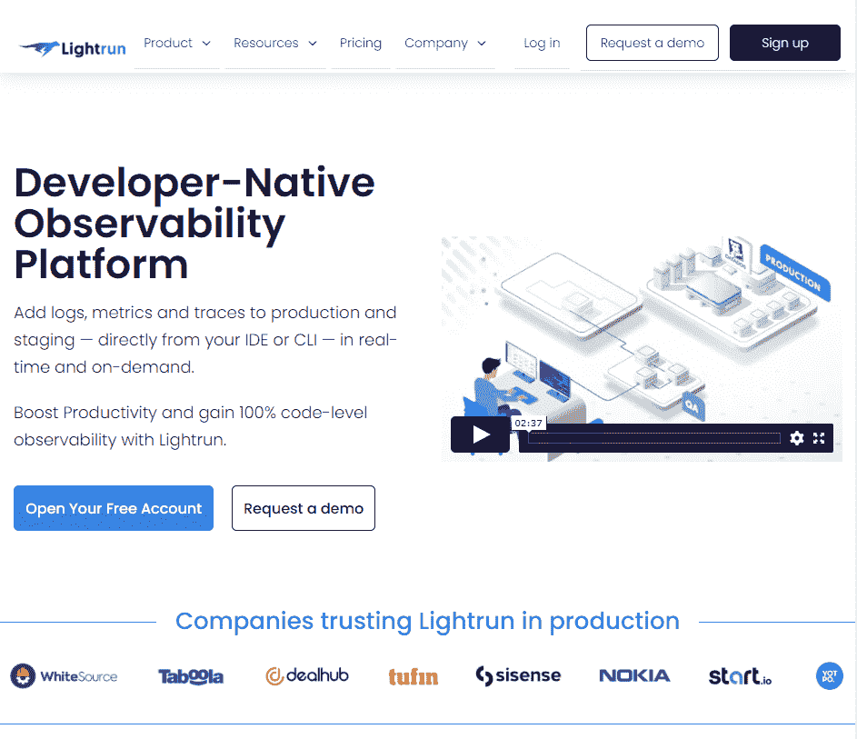

Lightrun 主页

# Lightrun Cloud:什么和为什么

Lightrun Cloud 是一个免费的可观察性平台，它为您提供了使用 CLI 或您最喜欢的 IDE(在我的例子中是 [IntelliJ IDEA](https://www.jetbrains.com/idea/) )在暂存或生产环境中执行实时调试和日志记录所需的工具。

使用 IntelliJ IDEA 安装很快:你打开它，进入设置页面，找到“Lightrun”插件，然后点击“安装”。

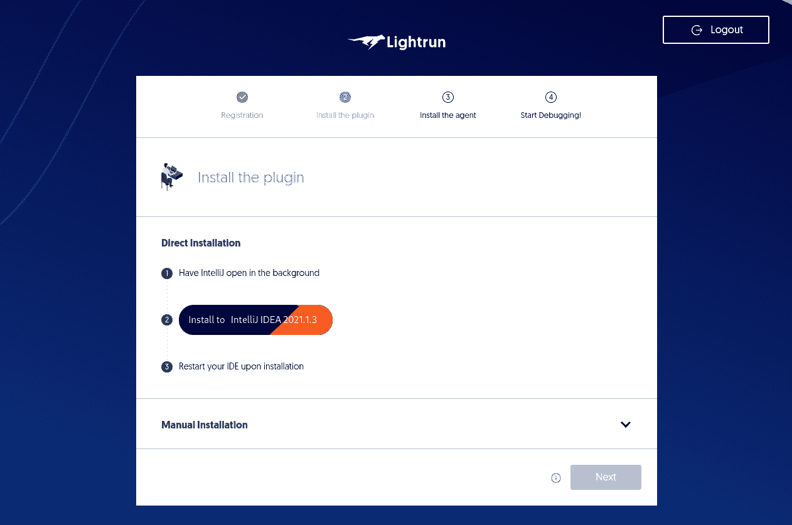

*设置过程*

安装完成后，重启 IntelliJ IDEA，点击“登录”，它就会打开浏览器，将你的 IDE 与你的账号同步。

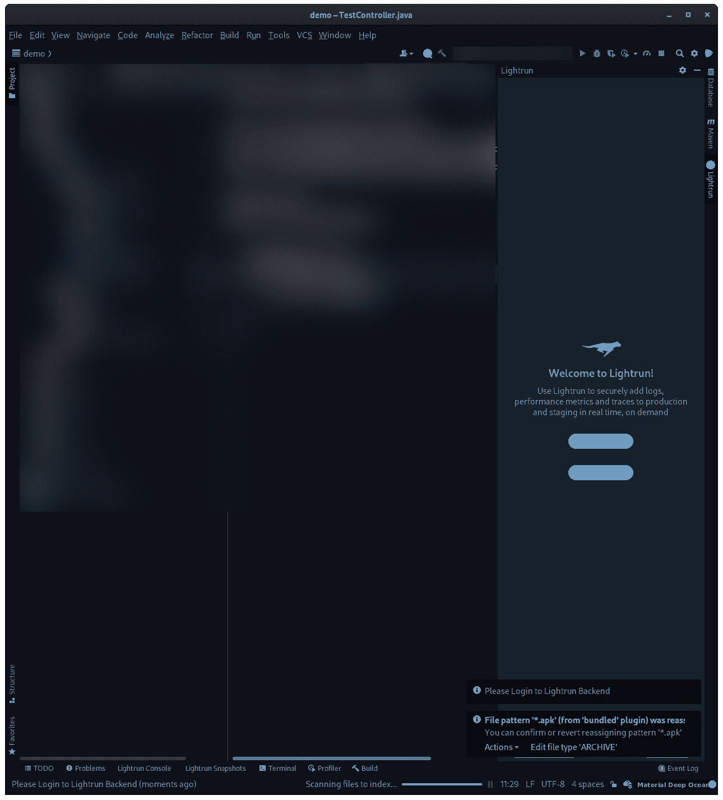

*安装 Lightrun 后的 Intellij 想法*

一旦你的 IDE 准备好了，平台会自动知道。缺少的是你要调试的环境。这是安装向导的第二步。

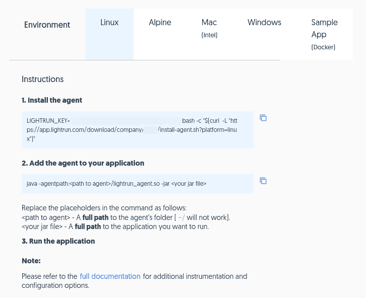

代理安装说明

代理应该安装在您要调试或测试的环境中。它由一个库组成，该库将安装在您的系统上，并将加载 java 运行时环境，充当 Java 和您的应用程序之间的中间件。这样，您几乎可以调试它。

请注意，安装是指将代理与 Java 和 JAR 文件一起使用。但是如果你仔细阅读[文档](https://docs.lightrun.com/tomcat/)，你会注意到 Lightrun Cloud 支持大多数主流框架和服务器，比如 Tomcat、Glassfish、Wildfly、Jetty 和 Weblogic。这意味着，如果您的应用程序不是一个 JAR 文件，并且您没有测试服务，而是想直接使用服务，那么您可以简单地使用一个“Hello World”应用程序来跳过这一步，并根据您的环境正确地配置代理。

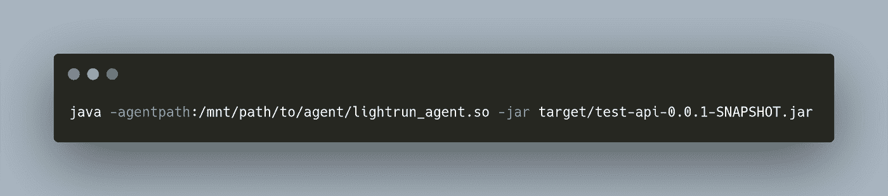

[*使用 Lighrun 代理作为中间件启动应用的命令*](https://carbon.now.sh/?bg=rgba%28171%2C+184%2C+195%2C+1%29&t=monokai&wt=none&l=application%2Fx-sh&ds=true&dsyoff=20px&dsblur=68px&wc=true&wa=true&pv=56px&ph=56px&ln=false&fl=1&fm=Hack&fs=14px&lh=133%25&si=false&es=2x&wm=false&code=java%2520-agentpath%253A%252Fmnt%252Fpath%252Fto%252Fagent%252Flightrun_agent.so%2520-jar%2520target%252Ftest-api-0.0.1-SNAPSHOT.jar)

Windows 和 WSL 是模拟开发和登台环境的好方法，因为许多开发人员通常在 Windows 上运行他们的 ide，并部署在可以用 WSL 表示的 Linux 机器上。

# 构建测试 Web 应用程序

现在我们已经建立了 Lightrun，是时候用一个有缺陷的 web 应用程序来弄脏我们的手了。对于本教程，我选择了一个打包在 JAR 文件中的假 Spring Boot 应用程序来在 Lightrun 上测试。我选择这个来演示 Lightrun Cloud 与一个依赖于一些有缺陷的 API 的 web 应用程序的使用，我们认为这些 API 非常稳定，稳定到我们没有回退错误处理策略。

让我们来布置舞台。我们有一个很好的 web 应用程序，它具有模拟我们正在连接的 API 的特性和单元测试，以及一个将触发构建并将其直接部署到我们的环境中的连续交付系统。

为了生成模拟假 API 的随机数据，我们可以使用 [Java Faker](https://github.com/DiUS/java-faker) ，一个简单的库来生成假数据。你可以通过 Maven 或者 Gradle 把它添加到你的应用中。

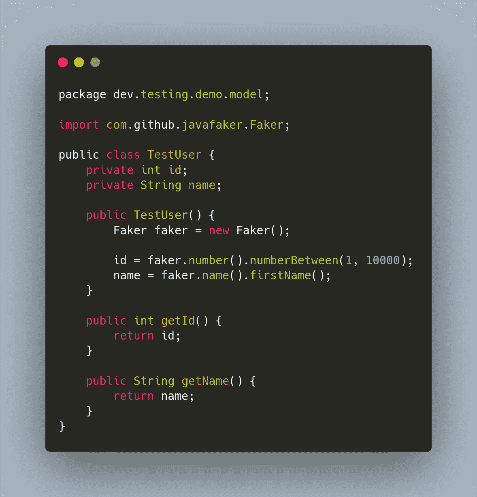

[*假 TestUser 型号代码*](https://carbon.now.sh/?bg=rgba%28171%2C+184%2C+195%2C+1%29&t=monokai&wt=none&l=auto&ds=true&dsyoff=20px&dsblur=68px&wc=true&wa=true&pv=56px&ph=56px&ln=false&fl=1&fm=Hack&fs=14px&lh=133%25&si=false&es=2x&wm=false&code=package%2520dev.testing.demo.model%253B%250A%250Aimport%2520com.github.javafaker.Faker%253B%250A%250Apublic%2520class%2520TestUser%2520%257B%250A%2520%2520%2520%2520private%2520int%2520id%253B%250A%2520%2520%2520%2520private%2520String%2520name%253B%250A%250A%2520%2520%2520%2520public%2520TestUser%28%29%2520%257B%250A%2520%2520%2520%2520%2520%2520%2520%2520Faker%2520faker%2520%253D%2520new%2520Faker%28%29%253B%250A%250A%2520%2520%2520%2520%2520%2520%2520%2520id%2520%253D%2520faker.number%28%29.numberBetween%281%252C%252010000%29%253B%250A%2520%2520%2520%2520%2520%2520%2520%2520name%2520%253D%2520faker.name%28%29.firstName%28%29%253B%250A%2520%2520%2520%2520%257D%250A%250A%2520%2520%2520%2520public%2520int%2520getId%28%29%2520%257B%250A%2520%2520%2520%2520%2520%2520%2520%2520return%2520id%253B%250A%2520%2520%2520%2520%257D%250A%250A%2520%2520%2520%2520public%2520String%2520getName%28%29%2520%257B%250A%2520%2520%2520%2520%2520%2520%2520%2520return%2520name%253B%250A%2520%2520%2520%2520%257D%250A%257D)

TestUser 将是我们的假 API 将返回的内容。假设假 API 的失败率是 30%。这意味着我们可以提取 0 到 100 之间的一个数字，如果这个数字大于 70，我们可以认为 API 调用失败。如果发生这种情况，我们将在系统抛出未处理的异常时使用 RuntimeException。

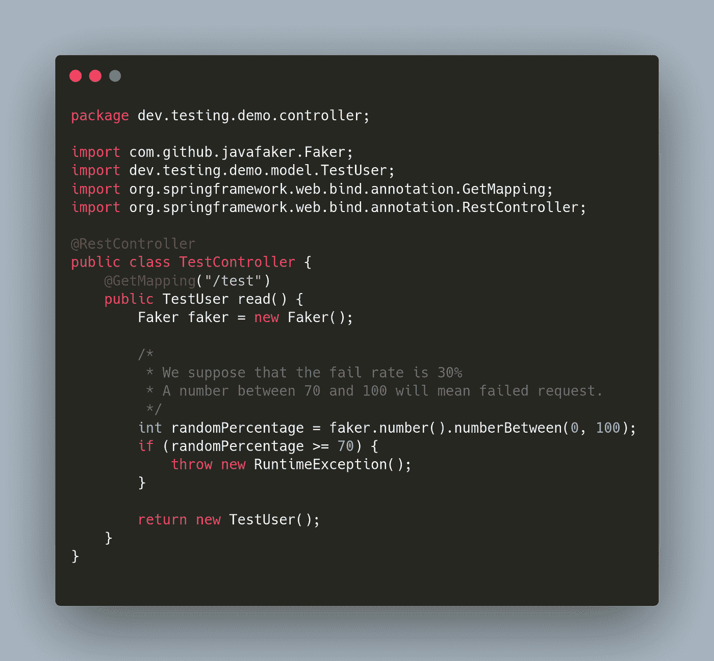

[*假控制器，会随机抛出异常*](https://carbon.now.sh/?bg=rgba%28171%2C+184%2C+195%2C+1%29&t=monokai&wt=none&l=auto&ds=true&dsyoff=20px&dsblur=68px&wc=true&wa=true&pv=56px&ph=56px&ln=false&fl=1&fm=Hack&fs=14px&lh=133%25&si=false&es=2x&wm=false&code=package%2520dev.testing.demo.controller%253B%250A%250Aimport%2520com.github.javafaker.Faker%253B%250Aimport%2520dev.testing.demo.model.TestUser%253B%250Aimport%2520org.springframework.web.bind.annotation.GetMapping%253B%250Aimport%2520org.springframework.web.bind.annotation.RestController%253B%250A%250A%2540RestController%250Apublic%2520class%2520TestController%2520%257B%250A%2520%2520%2520%2520%2540GetMapping%28%2522%252Ftest%2522%29%250A%2520%2520%2520%2520public%2520TestUser%2520read%28%29%2520%257B%250A%2520%2520%2520%2520%2520%2520%2520%2520Faker%2520faker%2520%253D%2520new%2520Faker%28%29%253B%250A%250A%2520%2520%2520%2520%2520%2520%2520%2520%252F*%250A%2520%2520%2520%2520%2520%2520%2520%2520%2520*%2520We%2520suppose%2520that%2520the%2520fail%2520rate%2520is%252030%2525%250A%2520%2520%2520%2520%2520%2520%2520%2520%2520*%2520A%2520number%2520between%252070%2520and%2520100%2520will%2520mean%2520failed%2520request.%250A%2520%2520%2520%2520%2520%2520%2520%2520%2520*%252F%250A%2520%2520%2520%2520%2520%2520%2520%2520int%2520randomPercentage%2520%253D%2520faker.number%28%29.numberBetween%280%252C%2520100%29%253B%250A%2520%2520%2520%2520%2520%2520%2520%2520if%2520%28randomPercentage%2520%253E%253D%252070%29%2520%257B%250A%2520%2520%2520%2520%2520%2520%2520%2520%2520%2520%2520%2520throw%2520new%2520RuntimeException%28%29%253B%250A%2520%2520%2520%2520%2520%2520%2520%2520%257D%250A%250A%2520%2520%2520%2520%2520%2520%2520%2520return%2520new%2520TestUser%28%29%253B%250A%2520%2520%2520%2520%257D%250A%257D%250A)

要将我们的 API 构建为一个 JAR，我们可以很容易地调整 pom.xml 来使用 [spring-boot-maven-plugin](https://mvnrepository.com/artifact/org.springframework.boot/spring-boot-maven-plugin) 。

# 运行中的 Lightrun 云

在连接了 Lightrun Cloud 的情况下启动您的应用程序后，它将在您的 IDE 上弹出，生成连接的环境。

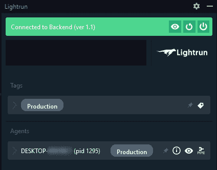

*IntelliJ IDEA 面板*

这意味着它当前连接到您的进程，并等待您设置日志记录或[远程调试](https://lightrun.com/debugging/remote-debugging/)。你所要做的就是右击你想要记录的行，打开“Lightrun”子菜单，点击“log”。

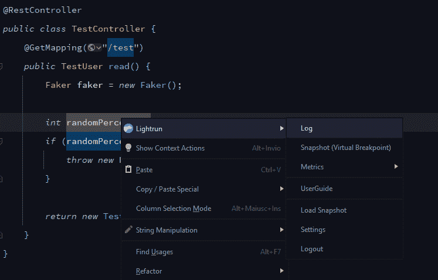

*日志启用*

这将产生一个弹出窗口，您可以在其中设置您希望在日志中看到的内容:

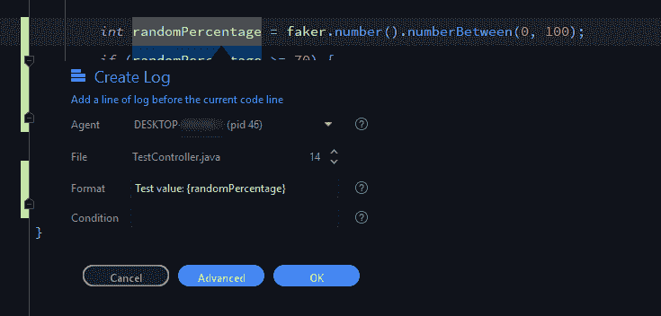

*测井条件和格式*

出于测试目的，我不会设置任何特定的条件，只是记录消息。添加这些日志记录条件后，控制台将会出现，日志将会快速填充。

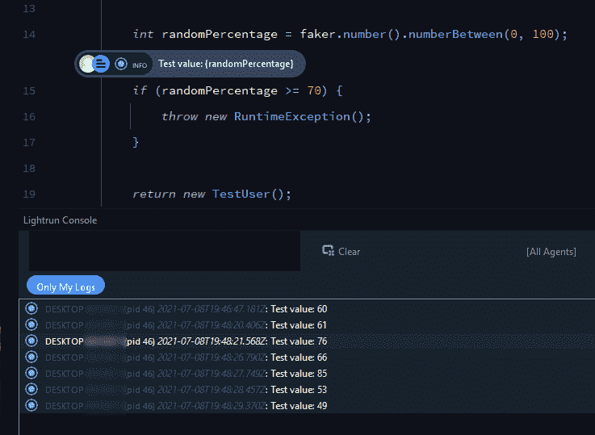

*日志*

这只是冰山一角。想象一下，在一个真实的生产环境中使用 Lightrun Cloud，您可以记录来自 API、db、if 条件或 AJAX 调用的所有内容，以供每个用户和应用程序的每个实例使用。拥有多个服务器或应用程序实例或多个微服务对于这样的日志记录器来说绝不会是问题。您可以使用虚拟快照来记录所有本地变量和表达式，就像在本地环境中设置断点一样。通过测量应用程序执行的指标，您可以做得更多。

# 不再有边缘条件

Lightrun Cloud 是一个强大的系统，可以改进您的 web 应用程序和所有 Java 应用程序。你可能会想:如果我从头开始开发一个 web 应用程序，尊重所有众所周知的模式和通用审计技术来阻止所有的错误，**那么我还需要 Lightrun Cloud 吗？**

这个问题没有正确的答案，但是**拥有这样一个强大的工具将显著改善您的测试体验**，尤其是对于像边缘条件或未知状态这样的特殊情况，捕捉并修复生产中所有可能的 bug！