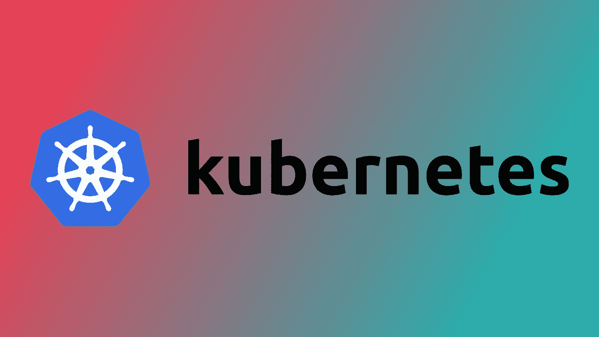

# 关于如何用 kubectl 显示 Kubernetes pods 及其节点的命令

> 原文：<https://blog.devgenius.io/command-for-how-to-display-kubernetes-pods-with-their-nodes-with-kubectl-1551602cd9f4?source=collection_archive---------3----------------------->



您可能有兴趣通过 Kubernetes 命令行工具查看 pods 调度了哪些节点，但是没有一个超级简单且容易记忆的快捷方式来实现这一点。

当然，您可以深入研究`Deployment`并在`.yaml`文件中找到相关信息，但是让我们明智地准备一个命令，以便以一种快速的方式轻松漂亮地输出。

实际上，这个命令与我在以前的一篇文章中使用的命令非常相似，如果您希望学习更多的 Kubernetes 快捷方式，我推荐您阅读这篇文章:

[](https://medium.com/cloud-native-the-gathering/useful-kubectl-commands-and-scripts-you-can-use-in-your-day-to-day-kubernetes-work-91131ce11e3c) [## 您可以在日常 Kubernetes 工作中使用的有用的 kubectl 命令和脚本

### 你是不是经常使用 kubectl，想节省时间？这可能是给你的。

medium.com](https://medium.com/cloud-native-the-gathering/useful-kubectl-commands-and-scripts-you-can-use-in-your-day-to-day-kubernetes-work-91131ce11e3c) 

但不管怎样，让我们在这里找到答案。你会想要利用`-o`旗。那是`--output`的简称，也管用。但不管怎样，这控制了`kubectl`的输出。

我们将在这里做一些“魔术”，定义当我们运行`kubectl get pod`时，我们到底想要输出哪些列。顺便说一下，我们正在使用它，因为它有我们想要的相关 pod 信息；目标是添加更多信息，特别是每个 pod 的节点。

不管怎样，我们可以运行以下代码:

```
kubectl get pod -o=custom-columns=NAME:.metadata.name,STATUS:.status.phase,NODE:.spec.nodeName
```

这将给我们带来惊人的输出，比如:

```
NAME                        STATUS    NODE
myservice-123456789-3abcd   Running   ip-10-01-23-456.ec2.internal
myservice-123456789-3abce   Running   ip-10-01-24-567.ec2.internal
```

请注意，我实际上在那里输入了 pod 的状态。我发现拥有这些信息通常是很好的，但是如果您*只是*想要 pod 和节点的名称，您可以去掉这些信息:

```
kubectl get pod -o=custom-columns=NAME:.metadata.name,NODE:.spec.nodeName
```

还有，别忘了不一定要写`pod`。您可以使用`po`作为速记:

```
kubectl get po -o=custom-columns=NAME:.metadata.name,NODE:.spec.nodeName
```

此外，让我们更深入地了解另一个专业技巧:按列名排序！假设我们想按节点排序。我们可以这样实现:

```
kubectl get po -o=custom-columns=NAME:.metadata.name,NODE:.spec.nodeName --sort-by=.spec.nodeName
```

这样，我们就可以按字母顺序排列节点名。例如，它有助于理解哪个 pod 被调度到哪个节点。

[](https://tremaineeto.medium.com/membership) [## 通过我的推荐链接加入媒体

### 作为一个媒体会员，你的会员费的一部分会给你阅读的作家，你可以完全接触到每一个故事…

tremaineeto.medium.com](https://tremaineeto.medium.com/membership) 

*更多内容尽在*[*blog . dev genius . io*](http://blog.devgenius.io)*。*