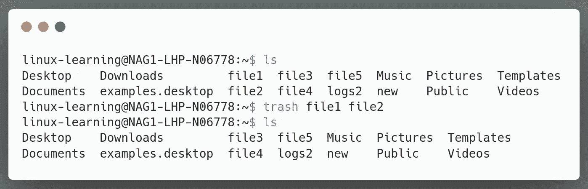

# Linux 系统的命令行回收站

> 原文：<https://blog.devgenius.io/command-line-recycle-bin-for-linux-system-f07450a10b7f?source=collection_archive---------12----------------------->

最近，我们看了如何在 Linux 系统中[删除文件和目录，我们在那里学习并使用了`rm`命令，但是`rm`命令有一个巨大的问题。](https://medium.com/@yashsugandh/deleting-files-and-directories-in-linux-system-19d4d32e565)

你记得是什么吗？

是的，你猜对了。`rm`命令会永久删除文件和目录。

所以有什么大不了的，我们还能恢复误删的文件。

是的，我们当然可以从磁盘恢复，但这将花费很多时间，我们首先使用 CLI 来节省时间。

那么我们能做些什么呢？

如果我告诉你，我们可以使用一些东西作为我们的**回收站**并且不会永久删除文件和目录，那会怎么样？

**真的吗？？**

是的，今天我们来看看。

**trash-cli** 是 Linux 系统使用的**垃圾桶**的**命令行接口**。

想到的第一个问题是我们如何安装它？

**安装**

我们有三种方法可以安装`trash-cli`

*   简单的方法

大多数 Linux 发行版的存储库中都有`trash-cli`。上面的例子来自 Ubuntu OS。

如果它不在存储库中呢？

*   Python **pip** 包管理器

因此，首先我们使用以下命令安装 **pip** :

成功安装 **pip** 后，我们使用以下命令安装`trash-cli`:

如果因为任何原因甚至这种方法都不可能

*   从源头

**全系统安装**

**针对单个用户**

现在我们知道如何安装`trash-cli`。让我们开始探索如何使用`trash-cli`。

*   删除文件

`trash`命令的语法

要使用 trash 删除一个文件，我们只需要使用`trash`命令和 file_name。

*   删除多个文件

在上面的例子中，我们使用命令`trash file1 file2`，其中

`trash`代表垃圾桶
的 **cli** 代表要删除的文件

我们如何检查文件是否已经被移动到我们的**垃圾箱**或者它们已经被永久删除？

嗯，让我们列出垃圾桶里的所有文件

*   列出废纸篓中的文件

我们使用`trash-list`命令列出我们的回收站中的所有文件。

在上面的例子中，我们使用了`trash-list`命令，找到了我们最近删除的所有文件。

因此，我们现在已经确认这些文件不会被永久删除。

现在我们知道如何删除单个或多个文件。

我们可以在`trash`命令中使用**通配符**吗？

我们来试试吧-

*   删除所有的**。txt** 文件

在上面的例子中，我们使用通配符`*`并创建了一个命令`trash *.txt`，其中

`trash`代表 **cli** 垃圾桶
代表所有以“”结尾的文件。txt”。

类似地，您可以尝试在`trash`命令中使用所有其他通配符，如果您面临任何挑战，请告诉我。

到目前为止，我们已经探索了

*   如何使用`trash`命令删除文件
*   列出我们回收站中的所有文件

等等，将文件移动到垃圾箱而不是永久删除文件的主要好处是，我们可以从垃圾箱中恢复文件，那么使用垃圾箱 cli 可能吗？

让我们试一试

*   从垃圾桶恢复文件 1

在上面的例子中，我们使用了命令`restore-trash`,它向我们展示了垃圾箱中从 0 开始索引的所有文件。

我们的目标是恢复索引 1 上的文件 1，因此我们输入 1。

为了验证文件是否已恢复，我们检查了`trash-list`以确认该文件不再存在于垃圾箱中，然后使用`ls`命令确认该文件已恢复。

注意:在一些 Linux 发行版中，restore 命令可能是 **trash-restore** 。因此，如果您尝试使用 **restore-trash** 命令，但没有找到命令，那么您可以尝试使用 **trash-restore** 。

现在，让我们来看看如何从垃圾箱中删除文件

*   倒垃圾

在上面的例子中，
我们首先使用命令`trash-list`列出垃圾箱中的所有文件

然后使用命令`trash-empty`清空垃圾箱

为了验证垃圾箱是空的，我们再次使用了`trash-list`命令，它没有像预期的那样返回任何值。

类似地，我们可以使用命令`trash-empty <days>`，其中**天**表示文件在垃圾桶中的天数。

这可以用在这样的情况下，如果我们想清除所有的文件，至少一个星期前。我们将简单地使用`trash-empty 7`。

*   从回收站中永久删除文件 3

在上面的例子中，我们使用了命令`trash-rm file3` where

`trash-rm`代表清除垃圾命令
`file3`代表永久删除的文件

*   删除所有的”。txt "回收站中的文件

在上面的例子中，我们使用了通配符`*`和`trash-rm`命令，并创建了命令`trash-rm *.txt`，其中

`trash-rm`代表垃圾清除命令
`*.txt`代表所有的。要永久删除的 txt 文件

好了，这就是我们需要知道的 Linux 系统中的垃圾桶。

希望你理解了`trash`在 Linux 系统中的用法。如果有任何问题，请告诉我。