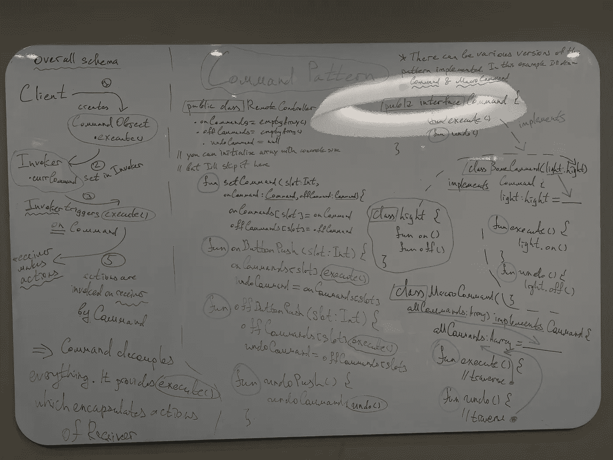

# 封装调用的命令模式

> 原文：<https://blog.devgenius.io/command-pattern-for-encapsulated-invocation-kotlin-4338eb23d2ca?source=collection_archive---------5----------------------->

再次见到你，花样学习者！😁这是我发布的一系列帖子，告诉世界关于设计模式以及它们如何帮助你开发 software🧑‍💻

我强烈推荐看一下我以前的文章，因为它们不仅教授了很多关于**模式**的知识，还教授了相关的 **OOP 原则**🙌：

*   策略模式:[https://medium . com/toward sdev/strategy-pattern-for-independent-algorithms-kot Lin-70 ed 24 c 7 BD 8 b](/towardsdev/strategy-pattern-for-independent-algorithms-kotlin-70ed24c7bd8b)
*   观察者模式:[https://medium . com/toward sdev/observer-pattern-for-loose-coupling-kot Lin-f5ab 804609 bb](/towardsdev/observer-pattern-for-loose-coupling-kotlin-f5ab804609bb)
*   装饰模式:[https://medium . com/toward sdev/decorator-decorator-pattern-for-object-composition-kot Lin-7 CEC 92 cbaf 7b](/towardsdev/decorator-decorator-pattern-for-object-composition-kotlin-7cec92cbaf7b)
*   工厂模式:[https://medium . com/dev-genius/factory-patternS-to-hide-instantiation-kot Lin-D5 f 01 cf 01921](/dev-genius/factory-patterns-to-hide-instantiation-kotlin-d5f01cf01921)
*   单例模式:[https://medium . com/dev-genius/singleton-pattern-for-one-of-a-class-objects-Java-a63c 774 d9d 4](https://medium.com/dev-genius/singleton-pattern-for-one-of-a-kind-objects-java-a63c774d9d4)

和往常一样，我建议买一本奥莱利媒体的书来充分利用这些模式:[https://www . oreilly . com/library/view/head-first-design/9781492077992/](https://www.oreilly.com/library/view/head-first-design/9781492077992/)

结构:

*   介绍
*   问题
*   离题部分
*   设计遵循的原则:`null`本文中的
*   **最终解决方案代码**
*   **图画**

**《❗️Before 深度 dive❗️》,我会多次重复某些事情，这样你就能理解了。我对这种模式很困惑，我不想让你像我一样挣扎💪**

# **命令模式**

## **介绍**

**正如有人所说:“编写软件类似于艺术🎎".这是真的。如果你回头看看以前的文章，仔细思考一下特定逻辑的实现方式——很明显，有无数种方式可以重塑这个问题，并以这样或那样的方式书写它。当方法上的差异并不意味着低劣，而是纯粹的艺术🎨**

**有时一种模式可能会违反另一种模式所宣扬的原则，就像 **Singleton** 一样，但这是特定情况下需要的题外话，而不是 flaw✨**

## **问题**

**想象你有一个物体，像*遥控器*。它有多个按钮，可以指定触发某些行动。你可能会有一个明显的问题:“嗯，按钮可以被重新分配，这意味着我们**不能将**对象硬编码到按钮上”。然后你可以继续说:“这意味着，我们要有某种类型的**接口或抽象事物**，它将允许我们把动作转储到那里，并且它将解开它并做出所需的动作”。**

**你的思考过程是正确的👍🏼此外，想象那些动作将在客户提供给我们的类上完成。**

**Sooo:**

```
 Remote Control Device
              * button1
              * button2
              * next buttons...

 'provided class1'  'provided class2'  'provided class n' 
```

**我们需要创建一个将按钮上的调用传输到类并执行 action⚙️的设计**

**立即抛弃坏想法:**

*   **这些类的方法**命名不同** - >没有直接调用**
*   **班级可以增删->没有`if/else`乱**

**显然，我们将利用**命令模式**来解决这个问题。**

> **模式的要点:**将动作的请求从执行动作的对象中分离出来****

**其中:**

*   ****请求**:来自远程设备上的按钮**
*   ****对象**:客户提供给我们的类**

**我知道这听起来很模糊，让我更详细地解释一下🤚🏼：**

1.  **我们有可以被认为是 API 的设备**
2.  **它已经加载了**命令**(内部按钮)**
3.  **那些**命令**封装了
    -任务
    的工作方式(也就是做事情的方式)——将完成任务的对象**

## **离题部分**

**我知道乍一看这听起来很奇怪，至少对我来说是这样。让我们分解一个更现实的例子来理解具体细节。想象我们有一家餐馆:**

1.  **客户发出**请求**:我们按下**设备**上的按钮**
2.  **服务员以**命令**的形式接受**请求**:**调用者**接受信号**
3.  **命令**封装了**对象要做的动作和做动作的方法:**命令**有**对象**可以使用，并且知道**如何做**上面的东西**
4.  **服务员“触发”**命令**告诉厨师去做工作:**命令**利用对象上的**方法使它们工作****

**`=>`女服务员(命令)是**与厨师(提供的类)分离的****

**现在让我们来观察这个图表:**

```
1\. Client creates the Command 
2\. Client sets the Command in the Invoker object
   (not simply in the Invoker!!)3\. Client triggers the Invoker
4\. Invoker triggers Command method
5\. Method leverages receiver and calls methods belonged to it
```

****接收者**——由客户端(在我们的例子中)提供的对象/类，我们将其封装在命令中。**

****命令**——由**接收器**和应用于**接收器**的一组动作组成的东西。为了**解耦**一切，我们有相同的方法，通常命名为`execute()`，从 API 触发命令。**

****调用者**——简单触发**命令**的东西。在我们的例子中，它是一个按钮。**

**所以，回到我们咖啡馆的例子:**

*   **客户端是**客户端**(抱歉同义反复)**
*   **女服务员是一个**调用者****
*   **命令是一个**命令****
*   **库克是一个**接收器****

**‼️Don't haste‼️又从头开始重读了这一节的所有内容。我花了几个小时反复思考这个问题(希望你能更快理解)💨**

*   **接下来，每个**命令**本身不是一个命令，但是*实现了*特定的**接口**。我们称之为**具体命令**。**
*   **这个**具体命令**通过暴露`execute()`—like 方法绑定接收器和其上的一组动作。**

> **所以，**请求**本身不是一个东西，它是一个概念，意味着**客户端**调用将触发**调用者**，调用者从**调用者对象**使用**命令**。而这个**命令**确实有**接收器**和一组动作(其中**动作**隐藏在`execute()`后面)。
> 这就是为什么它被称为**请求的接收者****

**可能会有更多的讨论和例子，但我认为我已经很好地涵盖了所有内容。在代码中更容易做进一步的解释。这就是为什么我想邀请你参加下一部分🤝**

> **我试图尽可能详细地描述，但如果你没有得到什么，不要羞于发表评论。我会来救你的💁🏻‍♂️**

## **最终解决方案代码**

**在下面的链接中，你可以找到我用 Kotlin 编写的模式的完整代码**

**[](https://github.com/SleeplessChallenger/KotlinDesignPatterns/tree/main/src/main/kotlin/6_CommandPattern) [## KotlinDesignPatterns/src/main/kotlin/6 _ command pattern at main…

### O'Reilly 设计模式在 Kotlin 的实现。为 sleep less challenger/KotlinDesignPatterns 开发做出贡献…

github.com](https://github.com/SleeplessChallenger/KotlinDesignPatterns/tree/main/src/main/kotlin/6_CommandPattern) 

现在我想展示一下命令模式在代码中的样子，并把我上面的解释和代码匹配起来🤙

退一步讲讲**宏命令**和**撤销**:

1.  **宏命令**是一个通用命令，内部包含多个命令。因此，我们像往常一样将其分配给按钮，但是`execute()`将通过遍历我们放入其中的**命令**的列表/数组来触发多个**接收器**上的动作
2.  **撤销**是将动作回滚到以前的状态。它*实现了*同样的**命令**接口，但是我们不需要从外部分配它。为什么？🧐，我以后会说的，请耐心点🙏

**代码本身:**

1.  `RemoteLoader.kt`是一个文件，它创建我们的命令并实例化遥控器设备
    - `Command.kt`是我们将使用的所有命令的接口(记得我如何强调**相同接口**对所有按钮的重要性)。它有两个方法:`execute() & undo()`
    ——在`init {}`块`setCommand()`中，我们将特定的命令分配给**调用程序对象**(回想一下解释中的这个术语)
2.  `RemoteControl.kt`是我们的遥控装置。
    -它有 2 个对象，我们在其中存储了& Off 命令。我们可以称它们为**调用者对象**(再次从上面回忆)
    - `onButtonPush()` & `offButtonPush()`就是我们的**调用者**。我们提供要使用的插槽号，它从中获取命令并触发`execute()`
    - **还有:**我们有**撤销**命令。再晚一点😩
3.  `Light.kt`、`CeilingFan.kt`是我们的客户端类。他们是**接收者**
4.  `LightOffCommand.kt`、`LightOnCommand.kt`是我们的**命令**，实现**命令**接口
    ——我们在每个命令
    里面都有**接收器**实例——心爱的`execute()`触发**接收器**上的方法
    - `undo()` ( **最后**)使用**命令**的相反动作。就像`LightOnCommand`在`execute()`中触发`light.on()`，但是在`undo()`中我们有`light.off()`

下面我再做一些评论:

*   在`RemoteControl.kt`中，我们有`undoCommandPush()`，它将最后分配的命令传递给`undoCommand`并利用它。也就是说，我们最后执行`LightOnCommand`，因此我们将其分配给`undoCommand`并且该**命令的`undo()`将触发`light.off()`**
*   `NoCommand.kt`是一种简单的方法，可以将模仿对象放到**调用对象**中，调用对象在方法中什么也不做(是的，为了兼容，它们*实现了* **命令**接口)，但是确保我们有办法防止系统在按钮被调用但没有被赋值时崩溃。

为了便于练习，试着用相关的**命令解开**调用者** `CeilingFan.kt`。**如果觉得难，就留下评论吧！😇

> *命令模式**将发出请求的对象与知道如何执行请求的对象解耦**

## 图画



在这张图片上，您可以观察到两个部分:

*   左边一个致力于模式的流动
*   右边的是图案本身

如果你想让我一步一步地看完它，请在评论中留下一条消息**👣**

## 结尾部分👋

> **命令模式**的学术定义:它将请求封装为一个对象(命令)，这允许你用不同的请求参数化其他对象。

在这个时候，我不离开吓人😱学术定义，因为它将涵盖它更详细:
1。命令**封装了**的请求，如何？它有一个**接收器**并在其上施加动作。**请求**是一个概念，意味着我们利用来自**调用者**对象
2 的**命令**。命令将类似的方法暴露给外部世界，触发将导致那些动作被激活。
3。外界不知道哪个**接收器**被触发。他们只知道，如果他们触发`execute()` - >，一切都会变得神奇。
4。什么是“参数化”的东西？我们可以在**调用者**对象中加载**任何** *命令*(还是那句话，不是简单的**调用者**，而是它的对象)，直到这个命令实现了命令的接口。

一些最后的 thought☝️:

*   **命令模式**可用于请求排队，即我们将**命令**放入队列，*线程*弹出它并触发`execute()`like 方法。所以，我们不需要在这里发明一辆自行车，完全不同的操作可以用这个接口**封装**

是的，很艰难😪如果需要的话，多读几遍，如果仍然是 unclear✌️的话，在评论中留言

你可以找到我:

*   领英:[www.linkedin.com/in/sleeplesschallenger](http://www.linkedin.com/in/sleeplesschallenger)
*   GitHub:[https://github.com/SleeplessChallenger](https://github.com/SleeplessChallenger)
*   leet code:[https://leetcode.com/SleeplessChallenger/](https://leetcode.com/SleeplessChallenger/)
*   电报:@无眠挑战者**