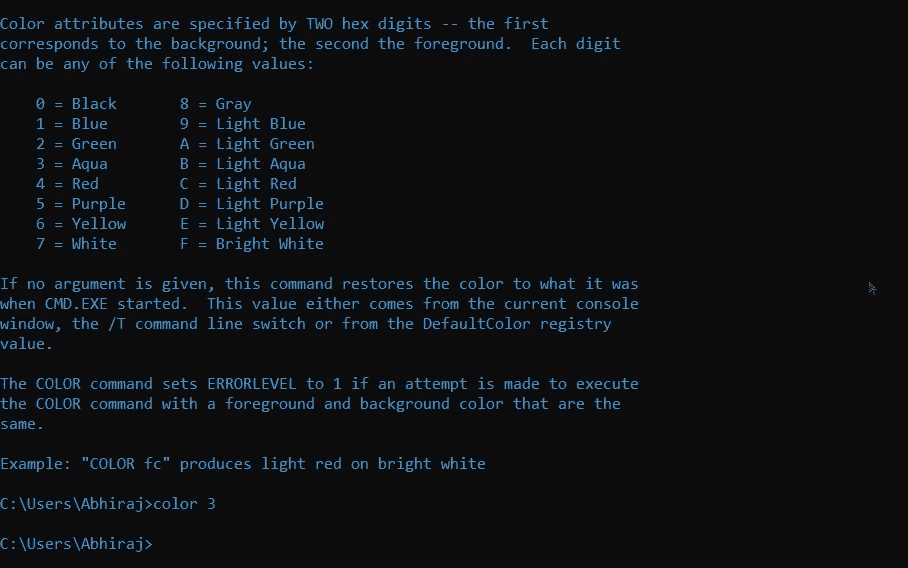
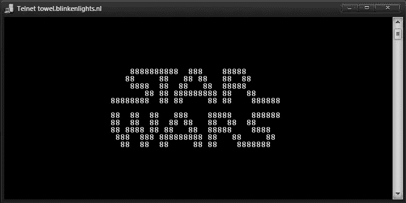
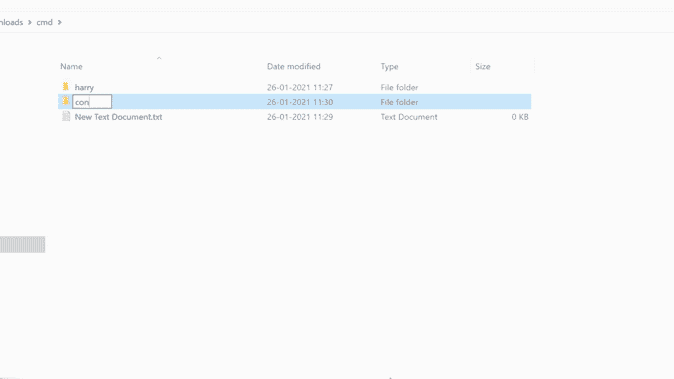

# 您不知道的命令提示符技巧

> 原文：<https://blog.devgenius.io/command-prompt-tricks-you-did-not-know-39f0445ab9b1?source=collection_archive---------17----------------------->

**命令提示符**是 Windows 中用来执行命令的命令行界面程序之一。它通常被开发者用来下载包。然而，有几个潜在的小技巧可以让你开心，甚至捉弄你的朋友。


## 1️⃣改变颜色

您可以在 cmd 中使用以下命令来更改颜色。

```
color <color-code>
```

下面的命令将给出一个可以在 cmd 中使用的所有颜色的列表:

```
help color
```

以下命令将改变终端的颜色:

```
color 04
```



## 2️⃣改变命令中的提示

您可以使用以下命令更改 cmd 中的提示文本:

```
prompt abhiraj@hacker$G//here $G is a special character for the ‘>’ symbol//
```

## 3️⃣在 CMD 中更改标题

如果您想在 cmd 中更改标题，您可以简单地使用 title 命令后跟标题。以下标题命令会将 cmd 标题更改为“黑客攻击进行中…”:

```
title Hacking in progress…
```

## 4️⃣在 CMD 观看星球大战电影

你知道你可以在 cmd 里看星球大战电影吗？如果你没有，你需要发出下面的命令，你将会看到星球大战电影:

```
telnet towel.blinkenlights.nl
```



## 5️⃣显示/隐藏文件夹

如果您想隐藏目录中名为“web”的文件夹，可以使用以下命令:

```
Attrib +h +s +r web
```

一旦您的文件夹被隐藏，您可以通过触发以下命令再次显示它:

```
Attrib -h -s -r harry
```

## 6️⃣创建一个带有保留名称的文件夹

你知道在 windows 中不能创建名为 aux 或 con 的文件夹吗？



这些是 windows 内部使用的保留名称。
您仍然可以通过在 cmd 中执行以下命令来创建一个名为 con 或 aux 的文件夹:

```
md con\
md aux\
```

## 感谢阅读！

请确保在您的电脑上尝试所有这些技巧。此外，如果你知道一些其他的技巧，请随意分享。玩得开心！

如果你喜欢这篇文章，订阅我的[时事通讯](https://newsletter.abhiraj.co)，永远不要错过我的博客、产品发布会和科技新闻。