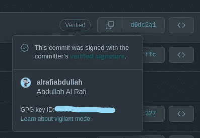

# GitHub 中的提交验证

> 原文：<https://blog.devgenius.io/commit-verification-in-github-90adae7ed8a6?source=collection_archive---------14----------------------->

> 不要错过最后关于 VS 代码和 Git 的额外提示。

在一个随机的工作日，我检查了存储库中的提交，发现 CTO 的提交显示了一个绿色的验证徽章。经过一番研究发现，GitHub 有一个[提交验证](https://docs.github.com/en/authentication/managing-commit-signature-verification)的功能。基本上，它将您的提交标记为已验证，以便其他人知道该提交来自可信来源。此外，它给你所有的提交一个看起来很酷的验证徽章。所以，我尝试了一下，一些来自社交媒体的人请求我帮助他们做这件事。几天后，我开始写这个…



## 先决条件

*   电子邮件验证了 [GitHub](http://github.com) 账户。
*   基本的命令行知识。
*   基本的[键对](https://www.ssl2buy.com/wiki/what-is-a-public-and-private-key-pair)知识。

要做到这一点，有三个主要步骤。在下面的段落中，我将向你展示 Ubuntu 和 Windows 的步骤。

*   生成密钥对。
*   将公钥添加到您的 GitHub 配置文件中。
*   用它签名确认。

## 生成密钥对

根据 GitHub，您可以使用 GPG 或 S/MIME 生成密钥对。在这里，我会告诉你如何使用 GPG 只。

对于 **Windows** 用户:

*   下载并安装您自己选择的 GPG 密钥生成器客户端或 [GPG4Win](https://www.gpg4win.org/) 。它将安装一个名为 Kleopatra 的 GUI。
*   之后，将全局 git 配置路径添加到 gnupg(如果还没有添加的话)。

```
git config --global gpg.program "*C:\Program Files (x86)\GnuPG\bin*"
```

*   启动 Kleopatra 并创建一个新对。它会询问你的名字和电子邮件。使用您使用的姓名和电子邮件。GitHub 建议使用 4096 位加密，如果你愿意，你可以使用密码来保护你的密钥对。

对于 Ubuntu 用户:

*   如果您使用的是 20.04 及更高版本，gpg 应该已经安装了。如果没有，运行该命令

```
sudo apt install gnupg
```

*   接下来运行 gpg key gen 命令，选择 RSA 并输入全名和您在 GitHub 中使用的电子邮件。

```
gpg --full-generate-key
```

*   如果您想保护您的密钥对，请添加密码短语。
*   现在，您可以通过键入以下命令来查看关键细节:

```
gpg --list-secret-keys --keyid-format=long 
```

现在，我们已经生成了要使用的密钥对，让我们继续下一步。

## 向 GitHub 添加公钥

在这一步中，我们需要生成公钥并将其添加到我们的配置文件中。添加到个人资料非常简单。我们需要复制公钥，然后进入设置> SSH 和 GPG 密钥>新 GPG 密钥>粘贴密钥>添加 GPG 密钥。

对于 **Windows** 用户:

*   打开 Kleopatra，您将看到刚刚创建的密钥对的详细信息。
*   双击它会出现一个提示，并点击导出。
*   您将看到完整的公钥。现在复制全文。

对于 **Ubuntu** 用户:

*   转到命令行并找到密钥 id。

```
gpg --list-secret-keys --keyid-format=long
```

*   然后运行这个命令，它将在终端中打印公钥。

```
gpg --armor --export key_id
# Prints the GPG key ID, in ASCII armor format
```

*   从头到尾复制 GPG 键。

现在 GitHub 知道了公钥，我们就快完成了！

## 签名提交

这是获得我们想要的绿色徽章的最后一步！因为，我们已经完成了最困难的部分，这就像在公园散步。

*   首先进入 GitHub 配置文件的“设置”>“SSH 和 GPG 键”,打开“未签名提交未验证”标志。[ *可选的*
*   然后在 git 全局配置中添加我们在上一步中获得的 key_id。

```
git config --global user.signingkey key_id
```

*   接下来，转到本地 git 存储库，使用以下命令提交您的更改

```
git commit -S -m "commit message"
# Creates a signed commit
```

*   现在，如果你去 GitHub 并检查提交，你会看到验证徽章。

就这样，我们完成了这个过程。

## 结论

耶！我们已经成功地配置了 GitHub 概要文件来推送经过验证的提交。现在，我们所有的未来提交将显示一个非常酷的徽章！也许我们应该创建一个认证徽章邪教。开个玩笑！感谢你坚持完成这三个部分。如果你面临任何问题，请在评论中告诉我。我会尽力帮你。到那时再见！

## 奖金

这一部分只有在你使用 VS 代码作为你的代码编辑器和 git 的情况下才适用。

如您所见，我们需要在每个提交中添加一个 *-S* 来使提交签名。如果你和我一样，那就没意思了。我们可以告诉 git 记住默认情况下签署每个提交:

```
git config --global commit.gpgsign true
```

要告诉 VS 代码类似的事情，转到 settings.json 文件并添加这个键值:

```
"git.enableCommitSigning": true,
```

现在，VS 代码将从 GitHub GUI 扩展中自动执行签名提交。