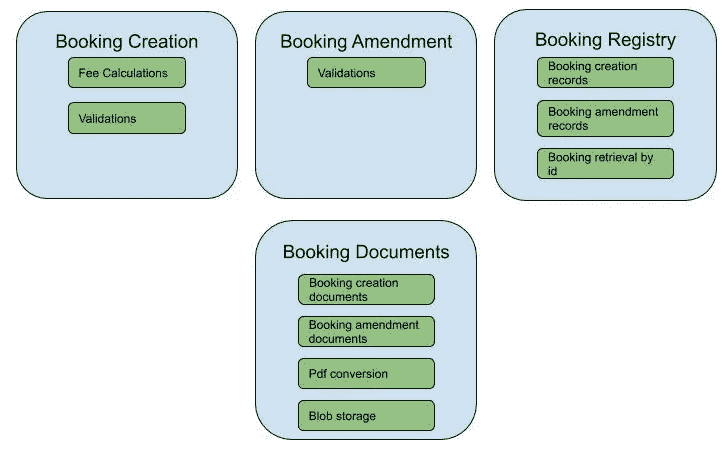
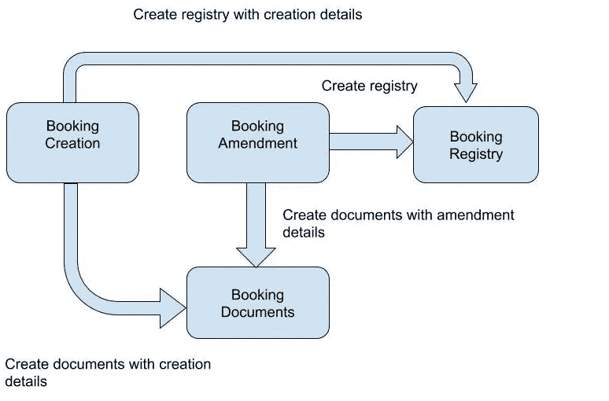
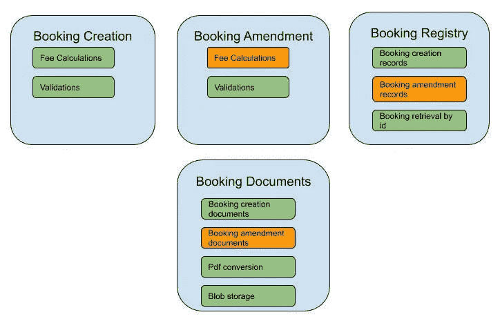
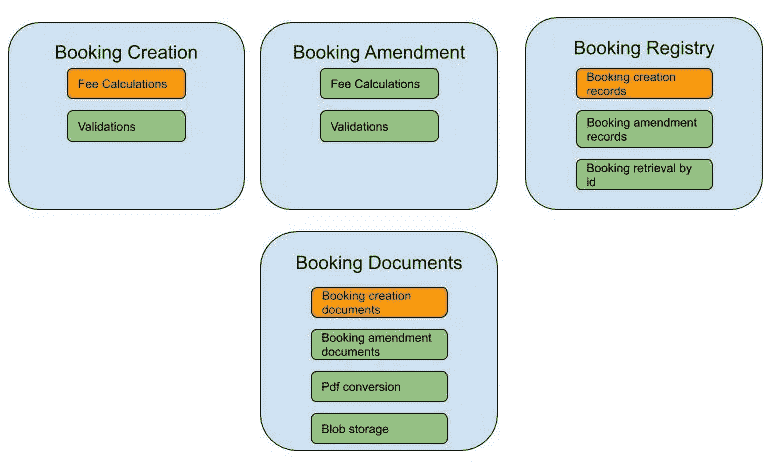
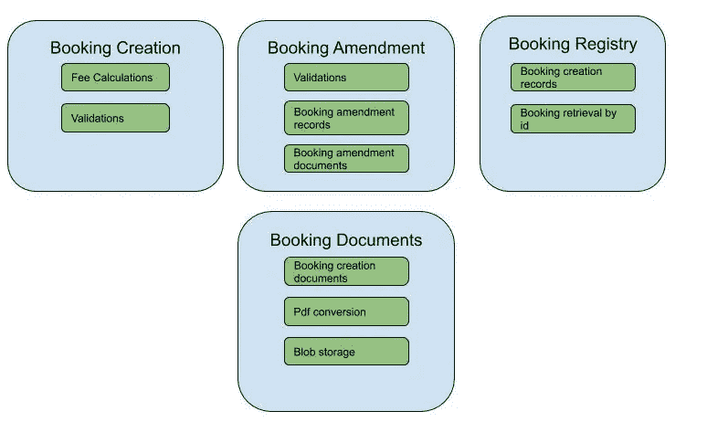
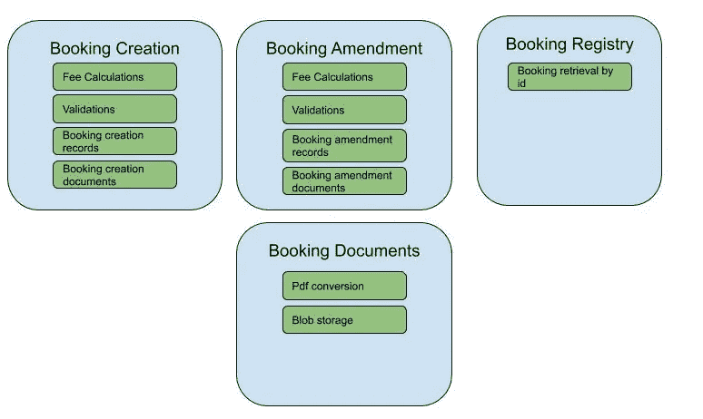

# 公共闭包原则:演进架构的故事

> 原文：<https://blog.devgenius.io/common-closure-principle-the-story-of-an-evolving-architecture-6919b452c8db?source=collection_archive---------8----------------------->

尼克·波顿在 [Unsplash](https://unsplash.com?utm_source=medium&utm_medium=referral) 上拍摄的照片

# 摘要

本文展示了在设计软件组件时遵循通用闭包原则是如何加速添加新特性的。它还表明它可以减少在整个软件生命周期中维护稳定性的努力和成本。这是通过分析现有架构中两个示例功能场景的影响来实现的。

# 什么是 CCP

CCP 在[清洁建筑](https://www.amazon.com/Clean-Architecture-Craftsmans-Software-Structure/dp/0134494164)一书中有详细描述。它在组件级别工作。它指出，接近相同类型变化的类应该放在相同的组件中。换句话说，由于相同的原因而改变的类同时属于相同的组件。反之亦然，因为不同原因和不同时间而改变的类应该在不同的组件中。通过遵循这一原则，每次我们需要改变我们的软件时，最少数量的组件将受到影响。因为我们已经在同一个组件中一起修改了类。我们更改的组件越少，所需的部署就越少，版本控制和测试就越少，因此意外行为的风险就越小，交付周期也就越短*。*此外，这一原则还可以最大限度地减少理解和找到所有需要扩展或修改的部分的工作量。这是因为相关部件在源存储库中尽可能接近。

# 故事

这里的用例是一个酒店预订管理系统。对于本文，我们只关注几个组件。这里的第一个组件创建一个预订，称为预订创建组件。它计算费用，做一些验证和检查房间的可用性。预订房间后，你可能想修改一下。你可能想换一个房间，换一个更小或更大的房间，或者改变你预订房间的人。因此，我们还需要一个名为预订修改组件的组件来管理预订中的修改。与预订创建类似，它也检查可用性并进行验证。更改预订是免费的，所以不需要计算费用。

另一方面，我们需要生成两套文档。第一组将在最初预订时生成，显示房间的详细信息、您预订房间的人，以及最终费用和付款的详细信息。第二套文件，我们称之为修改文件，将显示预订中的变化。它们将在生成后存储在 blob 存储中，用户可以打印或下载它们以供将来参考。正如您可能已经猜到的那样，我们将需要预订系统中的另一个组件来生成这些文档。我们称之为预订文档组件。该组件将知道每次预订创建或预订修改时需要哪种类型的文档，以及每种文档的内容。

最后，每次我们想要应用更改时，我们都需要知道当前预订的详细信息。这里我们需要的最后一个组件叫做 Booking Registry，它存储每个预订创建后的详细信息以及一个修改。其他组件可以通过预订注册组件检索每个预订的最新状态。每次创建预订或更改预订时，这些记录都将由该组件存储。图 1 显示了所有提到的组件。

每个组件也由一组类组成，这些类也显示在上面提到的图中。在预订创建中，我们有一个类来计算预订的费用和成本。此外，一个验证预订的类，例如，它确保人数不超过房间的容量。预订修改也有一个验证类，它有自己的逻辑。因此，预订文档组件包括计算预订创建和修改所需的文档和内容的类。此外，它还有另一个将文档转换为 pdf 的类和另一个将它们存储在 blob 存储中的类。类似地，booking registry 也有用于计算预订创建和预订修改所需的注册记录的类。它还有一个帮助检索这些记录的类；这个类不依赖于操作的类型，只返回具有给定 id 的任何可用记录。

图表 1

在展示了我们正在处理的组件之后，让我们看看它们之间的交互。交互很容易理解，如下图所示(图 2)。预订创建和预订修改组件启动对其他两个组件的调用，以创建文档并存储所需的记录。作为通话的一部分，他们发送新预订的详细信息，或者在修改的情况下发送修改的详细信息。被调用方组件将拥有创建文档或保存具有所需值的记录的规则和逻辑。

图表 2

# 功能场景

每个架构中的主要挑战是不可预测的变化。这一部分将展示被解释的建筑如何对变化做出反应。我们将通过要求在系统中实现的两个不同的需求变更来检查我们的架构。

# 预订修改的费用

第一个新要求是每次预订修改时都要考虑费用。为了将它应用到我们的软件中，我们需要改变一些组件。首先，预订修改需要有基于每个修改的细节计算总费用的逻辑。其次，预订修改文件必须反映产生的费用。最后，预订注册中心现在需要将计算出的费用存储在其记录中。这些更改必须应用于所有三个组件。我们需要测试、重新部署和版本化所有三个组件。下一张图(图 3)用不同的颜色显示了变化的类别。

图表 3

# 预订的促销代码

第二个变化是预订的促销代码。用户可以使用不同的促销代码，每个代码在预订时都有不同的折扣。因此，如果有促销代码，我们必须更改预订创建组件来计算折扣费用。此外，我们需要修改生成预订文档的代码，以便在创建预订时显示折扣。此外，每当操作是预订创建并包含促销代码时，我们必须更改预订注册组件的代码来存储促销代码。这些变化也显示在下图中(图 4)。

图表 4

# CCP 违规

如您所见，在第一个场景中，由于预订修改流程的更改，我们必须对预订文档组件进行更改，但是正如在第二个功能中提到的，由于公司创建流程的更改，我们必须更改该组件。到目前为止，预订文档组件有两个需要更改的原因，这两个原因来自系统的两个完全独立的部分，它们可能发生在项目生命周期中完全不同的时间。这违反了 CCP 教。对于预订注册组件，也可以使用相同的论点。最后，在这个架构中不遵循 CCP 会使应用这两个新需求变得更加困难，因为我们必须改变更多的组件。这是很昂贵的。

# 应用 CCP

让我们看看如何通过应用 CCP 来最小化变化的影响。在这种情况下，最小化变更的影响意味着最小化需要变更的组件数量。为了应用 CCP，让我们把同时发生变化的类移到同一个组件中。为了实现这一点，对于第一个需求，我们应该将预订修改文档和预订修改记录类移动到预订修改组件中。这将改变两个组件之间的接口，我不会深入讨论细节，因为这是另一篇文章的主题。在提到重构之后，新的架构如图 5 所示。现在，我们需要改变的只是一个组件，即预订修改。

图表 5

对于第二个需求，你很容易猜到我们需要做什么。这是最终的图表。

图表 6

图 6 中的架构将在应用两个需求后保持所需的更改最小化，因为我们只需要修改每个需求中的一个组件。此外，更容易理解代码，因为与创建预订相关的每个业务规则和逻辑都位于预订创建组件内部，对于预订修改组件也是如此。

# 结论和讨论

理解每个架构的主要目标之一是最小化维护软件所需的努力是很重要的。在这种情况下，维护软件意味着随着时间的推移应对变化。因此，系统的架构高度依赖于系统中的变化类型。在上面提到的预订系统中，如果更改不同，我们可能会以组件中不同的类排列结束。

预测会发生什么变化也几乎是不可能的，所以一个适应和进化的架构是我们可以想象的最小化软件工作和成本的最好方法。重构，尤其是[预备性重构](https://martinfowler.com/articles/preparatory-refactoring-example.html) 是演进架构*的关键。*

*普通闭合原理中闭合的含义*

*我体验的软件系统不一样，有完全不同的用途。我编了一个订票系统，因为我们都熟悉它的逻辑。然而，复杂性是相同的，相同的原则适用于两个*。

*这些文档类似于以 pdf 格式预生成并存储在 blob 存储器中的报告。*