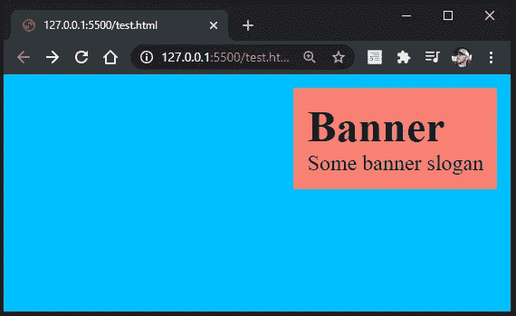

# 常见的 CSS 问题及解决方案

> 原文：<https://blog.devgenius.io/common-css-headaches-with-solutions-811790597cf7?source=collection_archive---------0----------------------->


让我先说我是一个网页开发者，而不是网页设计师。我发现，在我的整个旅程中，有人创造了我一直在寻找的东西，而且他们做得比我想象的还要好。通常他们有 HTML/CSS 可供你随意修改。然而，有一些事情对相当多的人来说仍然是个谜，因为我看到每年都有相同类型的堆栈溢出问题出现。

我遇到的另一个问题是，大多数设计师想展示他们有多聪明，会在他们的样式表中包含不必要的 CSS。你很快意识到大部分都是废话。

我们将在本文中讨论的内容:

*   块与行内元素
*   内置边距
*   整页容器
*   导航下方的全高横幅
*   将横幅中的内容居中
*   对齐横幅中的内容
*   全高背景图像
*   箱式模型
*   盒子尺寸
*   文字移动时横幅图像被修复
*   使背景图像变暗
*   使图像适合容器

让我们通过一些痛苦的简单的例子，没有绒毛。每当我发现人们似乎在纠结的其他事情时，这篇文章就会更新。

## 块与行内元素

你有没有尝试过在锚定标签上添加页边距，但它就是不起作用？这是因为 margin-top 是类似于 *div* 标签的*块*元素的属性。以下是所有块元素的列表:

```
<address> <article> <aside> <blockquote> <canvas> <dd> <div> <dl> <dt> <fieldset> <figcaption> <figure> <footer> <form> <h1>-<h6> <header> <hr> <li> <main> <nav> <noscript> <ol> <p> <pre> <section> <table> <tfoot> <ul> <video>
```

以下是所有内联元素的列表:

```
<a> <abbr> <acronym> <b> <bdo> <big> <br> <button> <cite> <code> <dfn> <em> <i>  <input> <kbd> <label> <map> <object> <output> <q> <samp> <script> <select> <small> <span> <strong> <sub> <sup> <textarea> <time> <tt> <var>
```

根据 [W3](https://www.w3.org/TR/CSS21/box.html#margin-properties) ，边距属性指定一个框的边距区域的宽度。“margin”速记属性设置所有四条边的边距，而其他边距属性只设置它们各自的边。这些属性适用于所有元素，但是垂直边距对未替换的行内元素没有任何影响。"

如果你真的想给一个内联元素增加边距，你可以用几种方法来实现。您可以将该元素视为块或内联块。块将跨越屏幕的整个宽度，而行内块将跨越行内元素周围必要的空间。


上面的例子创建了一个红色背景的链接，这样你就可以看到上边距对锚标签没有影响。

如果我们将 anchor 标签修改为一个 *block* 元素，它将跨越窗口的整个宽度，但是 *margin-top* 属性将起作用。


最后，如果我们不想让 anchor 标签跨越整个窗口，我们可以使用 *inline-block* 作为显示选项。边距仍然有效，但是宽度包含在元素中。


## 内置边距

浏览器内置了边距。如果你想让你的导航出现在屏幕的顶部，并且从左向右扩展，没有任何空白，你必须首先删除空白。

让我们创建一个 div 元素，并给它一个红色的背景色。你会很快看到它周围出现的空白。


让我们移除*主体*标签的内置边距。


就这样，空白被去掉了。大多数时候你会看到,*正文*和 *html* 标签的边距都被移除了。

如果您想要从所有标签中移除内建的边界，您可以使用*符号。

## 整页容器

你见过那些整版的横幅广告吗，想知道他们到底是怎么做到的？这其实很简单。对于这个例子，我们首先需要删除固有的浏览器边距并创建一个 *div* 元素。


我们可以在宽度和高度属性中使用视图高度和视图宽度单位。因为这是一个已经占据了浏览器全部宽度的 block 元素，所以我们只需要 height 属性。我们将高度设置为 100 视图高度，这将占当前浏览器高度的 100%。


您可以使用相同的 view-height 属性在下面添加其他的 *div* 标签，这样您就有了完整的窗口高度部分。


即使你调整窗口的大小，它仍然会占据 100%的可用空间。我添加了*红旗*和*蓝旗*类来显示区别。

## 导航下方的全高横幅

如果你在顶部有一个元素，比如导航栏，你试图在下面添加一个全高的横幅，你会发现它实际上占据了比可用空间更大的高度。如果你的窗口是 800 像素高，但导航栏是 100 像素高，100vh 将看到容器的高度为 800 像素。在我们研究解决方案之前，让我们先看看这个问题。


您可以看到滚动条出现，这意味着高度大于可用的屏幕尺寸。如果我们向下滚动，你会看到它刚好可以去掉导航栏。


为了让横幅占据 100%的可用屏幕空间，我们必须从 100vh 中减去导航栏的高度。因此，我们可以使用 *calc()* 函数来帮助我们解决这个问题。我们可以看到导航高了 50px，那我们就从 100vh 中减去 50px:`calc(100vh - 50px)`。确保在减法运算符前后有一个空格，否则它将不起作用。


就这样，滚动条被取消了。

## 将横幅中的内容居中

我们将继续上面的例子。假设我们希望*横幅*文本在 *div* 标签内居中。最简单的解决方案是将横幅 *div* 转换为 flex-box，并使用 *justify-content* 和 *align-items* 属性。将 *justify-content* 设置为*居中*将使项目水平对齐屏幕中心，将 *align-items* 设置为居中将使项目垂直对齐。


这不一定是文本。您可以在 div 标签中包含其他元素，并对齐这些元素。我们将在横幅 *div* 中添加一个内部 *div* 。这个内部的 *div* 将会是红色的，将会有一个标题和副标题，并且将会在页面上居中。我将从这个例子中删除导航，以清理这些混乱。


可以看到，内部的 *div* 是居中的，但是它的内容不是居中的。因为我们只有文本在里面，我们可以使用 *text-align* 属性并将其设置为居中，或者我们可以像在 banner *div 中那样使用 *flex* 。在这个例子中，我们将使用*文本对齐*属性。*


记住*文本对齐*只会水平对齐文本。如果您将内部 *div* 的高度设置得更大，您将需要使用 *flex* 方法来垂直居中项目。唯一的问题是，一旦你使用 *flex* ，它会水平对齐项目。


要再次垂直居中对齐，必须将*伸缩方向*设置到*列*；默认设置为*行*。


## 对齐横幅中的内容

让我们过渡到对齐横幅的内容(而不只是居中)。我确信你可能从上面的例子中找到答案，但是不管怎样，让我们来看看。让我们用上面的例子(稍微修改一下，去掉绒毛)。这个例子展示了一个内部 *div* 已经在屏幕上居中的横幅。


为了将内部 div 与右下角对齐，我们可以修改 *justify-content* 和 *align-items* 属性。我们将两者都设置为*挠性端*。


为了将其移动到右上方，让我们使用*柔性启动*进行垂直对齐。


我相信你能弄清楚如何做左上和左下的配置。我们也可以给内部的 *div* 增加一点点边距，把它和边缘分开。



要查看您可以尝试的选项的完整列表，请查看文档。

[](https://developer.mozilla.org/en-US/docs/Web/CSS/justify-content) [## 调整内容

### CSS justify-content 属性定义了浏览器如何在内容项之间和周围沿…

developer.mozilla.org](https://developer.mozilla.org/en-US/docs/Web/CSS/justify-content) 

如果我们想非常具体呢？举个例子，我想让我的内部容器从右边开始是 12px，从底部开始是 27px？我们可以这样做。我们只想确保内部容器的位置是绝对的。然后，我们可以设置顶部、右侧、左侧和底部属性。


## 全高背景图像

一旦你从上面得到了一些基本的东西，添加背景图片，然后在上面添加一些文字应该会感觉很自然。让我们继续上面的例子。

首先，让我们用居中的内部 *div* 元素再次创建全高横幅。


让我们将背景颜色从蓝色修改为实际的图像。我将从 [Pixabay](https://pixabay.com/photos/sun-sunrise-field-cabin-house-hut-5685447/) 获取一张图片。


删除*背景色*属性，用*背景色*属性替换。将 *url* 指向保存图像的路径。由于我的图像和我的文件在同一个文件夹中，我可以将图像名称添加到 *url()* 函数中。


如果我调整浏览器的大小，它实际上会显示图像的左上角。我想让它围绕图像的中心调整大小。我们可以通过*背景位置*属性来实现。


如果图像很大，这很好，但是如果图像不是那么大呢？让我们来看看这张图片的缩小版。


看起来不太像我们预想的那样。大多数时候，我们只是想拉伸图像来填满空间。让我们从消除重复开始。我们将把*背景重复*属性设置为*不重复*。


不幸的是，我们现在有一堆空白。它在屏幕中央的原因是因为*背景位置*属性之前被设置为*中心。*让我们拉伸图像来填满容器的空间。我们可以通过将*背景尺寸*属性设置为*封面*来实现。

根据您的屏幕分辨率和图像质量，图像可能看起来模糊。多模糊是可以接受的？这由你来决定。


让我们快速地将导航添加回顶部，并从整个背景容器中移除导航的高度。导航文本靠右居中对齐，右填充为 20px。整个导航高度为 50px，因此从横幅容器中减去了 50px。


## 箱式模型

我敢肯定，你们大多数人已经厌倦了听盒子模型。这对于下一节很重要，所以我在这里简单介绍一下。


Washington.edu

让我们创建一个 div 元素，并将背景色设置为红色。您看到的文本在*内容*区域内。


*背景色*属性应用于*内容*区域和*填充*区域。让我们添加一些填充来看。


让我们给 *div* 元素添加一个*边框*。


最后，让我们给 *div* 添加一个边距。


当我们探索下一个主题时，有这样的视觉效果是很重要的。

## 盒子尺寸

让我们看看你是否能猜出这个。如果我们有一个设置了以下属性的 *div* 元素，那么 *div* 元素的高度和宽度是多少？

```
div {
    height: 100px;
    width: 100px;
    padding: 10px;
    border: 1px solid black;
}
```

你猜到了吗？高度不是 100px，宽度也不是。它们实际上是每个 122 像素。怎么会？因为框大小的工作方式。如果没有 CSS box sizing 属性，实际的宽度和高度计算如下:

*   实际宽度=宽度+填充+边框
*   实际高度=高度+填充+边框

所以，实际宽度= 100px + 20px + 2px。为什么要 20px 填充？因为我们有左右两边的衬垫。为什么是 2px 边框？因为我们左边有一个 1px 边框，右边有一个 1px 边框。

当我们想在屏幕上显示整页的横幅时，这会变得很棘手。让我们像以前一样创建一个导航和横幅。导航将占用 50px 的高度，横幅将为 100vh - 50px。


让我们给导航菜单添加一些填充:周围 10px。


您可以立即看到一个滚动条出现。我们可以采取两种不同的方法来解决这个问题。第一个选项是减去填充所增加的 20px。在我们的横幅容器中，让我们减去 70 像素，而不是减去 50 像素。


另一个选择是重新定义我们如何计算容器的宽度和高度。我们可以添加*框尺寸*属性，并将其设置为*边框*。这告诉浏览器，我们刚刚设置的 50px 高度应该是我们正在查看的高度。填充和边框应该包含在 50px 内。一旦设置好，我们就可以回到正常情况下从 100vh 中减去 50px，以获得占据 100%可用空间的横幅。


## 文字移动时横幅图像被修复

你有没有见过这样的页面，当你开始向下滚动时，图像是固定的，而文本是移动的。这也很容易实现。让我们创建一个包含三个 div 元素的页面。

*   第一个和第三个*分区*将有一个鲑鱼色背景，而第二个*分区*将有一个背景图像。背景图片只是为了帮助更进一步的可视化这个过程。
*   每个 *div* 也将有一个 *p* 标签，其中包含一些文本。 *p* 标签将会是蓝色的，并且会有一些填充。
*   每个*分区*的高度为 100 英尺。
*   每个 *div* 内的每个 *p* 标签将在屏幕上居中。

我们以前做过所有这些。不应该有任何让你害怕的东西。


第一个


第二个


第三名

对于那些感到恐慌的人，让我们快速浏览一下 CSS。每当属性在 *div 的*之间重复时，我会将其分离出来。例如，我们将把*横幅*和*横幅固定*类的高度都设置为 100vh，所以我将它们分组。其他一切都应该是不言自明的。

让我们看看向下滚动页面时会发生什么。


到目前为止，它的表现就像我们习惯看到的普通网页。第二个 *div* 的内容和背景图像一起移动。让我们通过在内容移动时固定第二个 div 的背景图像来改变这一点。我们可以通过将*背景附件*属性设置为*固定来实现。*


## 使背景图像变暗

如果您有一个横幅图像，并且您希望文本弹出，您可能希望将背景图像变暗。为此，让我们创建一个横幅并添加一些文本。我们将使用 *flex* 使文本居中，并将字体设置为白色和粗体。这看起来相当不错。


如果我们想让图像稍微暗一点，我们可以应用一个 50%不透明度的线性渐变，然后增加或减少它。线性渐变应用于*背景*属性。


## 使图像适合容器

您可能以前遇到过这个问题。你有一个容器，容器里有一个图像。图像对于容器来说太大了，所以它会溢出容器。


我们可以使用*溢出*属性，并将其设置为*隐藏*。为了使图像居中，我们可以使用 flex。


Dino Cajic 目前是 [LSBio(寿命生物科学公司)](https://www.lsbio.com/)、[绝对抗体](https://absoluteantibody.com/)、 [Kerafast](https://www.kerafast.com/) 、[珠峰生物技术](https://everestbiotech.com/)、[北欧 MUbio](https://www.nordicmubio.com/) 和 [Exalpha](https://www.exalpha.com/) 的 IT 负责人。他还担任我的自动系统的首席执行官。他有十多年的软件工程经验。他拥有计算机科学学士学位，辅修生物学。他的背景包括创建企业级电子商务应用程序、执行基于研究的软件开发，以及通过写作促进知识的传播。

你可以在 [LinkedIn](https://www.linkedin.com/in/dinocajic/) 上联系他，在 [Instagram](https://instagram.com/think.dino) 上关注他，或者[订阅他的媒体出版物](https://dinocajic.medium.com/subscribe)。

阅读迪诺·卡吉克(以及媒体上成千上万的其他作家)的每一个故事。你的会员费直接支持迪诺·卡吉克和你阅读的其他作家。你也可以在媒体上看到所有的故事。