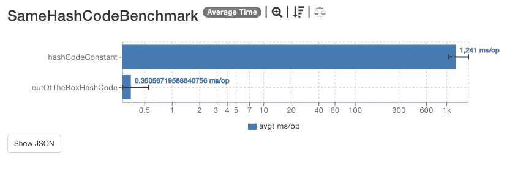

# 每个 Java 开发人员都面临的常见 hashCode 问题

> 原文：<https://blog.devgenius.io/common-hashcode-issues-every-java-developer-faces-dfc61c9a119e?source=collection_archive---------3----------------------->

## 这就是为什么你应该知道更多关于 equals 和 hashCode 的知识


照片由[安德烈斯·埃尔顿](https://www.pexels.com/@andres-ayrton?utm_content=attributionCopyText&utm_medium=referral&utm_source=pexels)从[佩克斯](https://www.pexels.com/photo/black-bearded-man-typing-on-laptop-at-home-6578421/?utm_content=attributionCopyText&utm_medium=referral&utm_source=pexels)拍摄

`hashCode`和`equals`有什么区别？可以用`hashCode`实现`equals`吗？定制`hashCode`有什么好处？不好的`hashCode`有哪些坏处？

这些都可以到你下次求职面试的时候。它们在我的上面。

让我们深入了解一下`equals`和`hashCode`方法。

# 有哪些常见的`hashCode`问题？

`equals`和`hashCode`有什么区别？我们可以用`hashCode`来比较物体吗？你会在 Java 开发人员面试中听到这些。大部分开发者回答错误。

这是有经验的开发者常见的面试问题。

`hashCode`用在哪里？`HashSet`能出什么问题？对于不相等的对象，`hashCode`应该总是返回不同的整数吗？

哈希对于`HashSets`来说是必不可少的。不相等对象的相同散列会使散列集变得毫无意义。相同对象的不同散列会导致讨厌的错误。我们会继续讨论这个问题。

为什么不可变散列很重要？应该使用哪些字段来计算它？hashCode 的默认实现是什么？

假设你有一个`HashMap`。你还没有覆盖`Customer`的`hashCode`方法。所有字段都用于计算哈希值。你用`Customer`它作为`Cart`一张地图的钥匙。在您更改了`Customer`的一个字段后，散列将会改变。

*你将无法为旧的未修改的* `*Customer*` *实例检索值作为键。*

这意味着你需要一个不可变的`hashCode`方法。

为什么`hashCode`很重要？现在我们有了不可变的`Records`来解决这个问题。`Records`生成`equals`和`hashCode`方法。为什么要担心这些方法呢？

# 关于`hashCode`你应该知道什么？

让我们更深入地研究记录，以及它们生成的`equals`和`hashCode`方法。

`Records`默认生成这些方法。所有的`Record`字段都被标记为`private final`，使得它们不可改变。

`Records`会有什么问题？它们有不可变的字段，这反过来会生成一个好的散列。对吗？这是对的，但也有可能出错。

没有什么可以阻止您在记录中添加可变字段。可变字段不能很好地与自动生成的`hashCode`和`equals`方法一起工作。这里有什么问题？

记录提供了浅层不变性。您可以添加可变的数组或其他字段类型。这意味着您生成的`hashCode`和`equals`也需要被覆盖。`hashCode`只能从不可变字段计算。

Piotr [写了一个很好的例子](https://softwaregarden.dev/en/posts/new-java/records/should-write-equals-and-hashcode/)来说明散列和记录是如何产生奇怪的错误的。

有问题的记录是 Rekord。上面有创建时间和仓库列表的糖果条。

```
public record Rekord(Instant created, List<String> locations) {}
```

让我们总结一下他发现的问题。

1.  创建了两个糖果条。
2.  两者都被添加到一个盒子中，该盒子是一个`HashMap<Rekord>`
3.  两块糖都变了
4.  两者都被放回盒子里，前提是它们将取代之前的糖果棒
5.  盒子的总尺寸是 4

所有 4 块糖都有不同的哈希值。这就是为什么我们得到 4 个“独特的”糖果条——hashcode-wise。虽然它们是相同的。`HashMap`将两对相同的实例存储为 4 个不同的元素。这些实例在哈希方面是不同的。

看到这一点，我们仍然需要了解`equals`和`hashCode`是如何工作的。尽管我们有闪亮的`Record`和我们在一起。

`HashSets`和性能怎么样？我们的`hashCode`方法如何在`HashSets`上禁用常量访问或 O(1)？

返回常量值会将`HashSets`变为`List`。每个散列将是相同的，映射到一个桶，并且检索将是 O(N)。对于 Java 8，这将是 [O(logN)](https://dzone.com/articles/hashmap-performance) 。

让我们运行下面的基准测试。一条记录`Rekord`覆盖`hashCode`并返回`1`。另一个使用默认的`hashCode`方法。



[https://jmh.morethan.io/?gist = 577 D5 e9 CBE 97 E1 a 774 c 41344 e 1970307](https://jmh.morethan.io/?gist=577d5e9cbe97e1a774c41344e1970307)

用常量`hashCode`设置的访问速度较慢，因为对`HashSet`的元素没有常量访问。每个元素都会导致冲突，因为 hashCode 是常数，所以访问是 O(N)。

***覆盖默认 hashCode 方法会启用***[](https://quarkus.io/blog/biased-locking-help/#what-is-biased-locking)****。*** 偏置锁定会提高锁定/解锁对象的工作速度。*

*根据[研究](https://srvaroa.github.io/jvm/java/openjdk/biased-locking/2017/01/30/hashCode.html)，如果没有自定义 hashCode 方法，偏向锁将被禁用。如果没有偏向锁定，即使一个线程也需要原子操作来锁定/解锁一个对象。*

*尽管[在较新的 Java 版本中没有偏向锁定](https://openjdk.java.net/jeps/374)，但在低于 Java 15 的版本中它仍然存在。大多数企业代码仍然启用了这个特性:)*

**能否用* `*hashCode*` *来实现* `*equals*` *？*简答:没有。*

****不同对象的 Hashcodes 可以是常量。****

*你可以自定义默认 hashCode 函数。你可以使用**-XX:hashCode = 0–5**来[选择正确的 hashCode](http://hg.openjdk.java.net/jdk8u/jdk8u/hotspot/file/87ee5ee27509/src/share/vm/runtime/synchronizer.cpp#l555) 算法。*

*下面是[自定义 hashCode 选项](https://srvaroa.github.io/jvm/java/openjdk/biased-locking/2017/01/30/hashCode.html):*

1.  *随机生成的数字。*
2.  *对象的内存地址的函数。*
3.  *a 硬编码 1(用于灵敏度测试。)*
4.  *一个序列。*
5.  *对象的内存地址，强制转换为 int。*
6.  *线程状态结合 xor shift([https://en.wikipedia.org/wiki/Xorshift](https://en.wikipedia.org/wiki/Xorshift))*

*你也不能用 hashCode 来改进 equals 方法。Hashcode 可以不同，对象可以相同。*

# *为什么您应该更多地了解`equals`和`hashCode`？*

*你会在性能上损失很多。如果没有自定义 hashCode，您将失去[4 倍的锁定/解锁操作性能提升。](https://srvaroa.github.io/jvm/java/openjdk/biased-locking/2017/01/30/hashCode.html)*

*有了坏习惯`hashCode`你可以把`Hash-like`建筑变成`Lists`。我们看到`HashSet`可以变成`List`。这反过来恶化了访问性能。*

*你可能会在下一次面试中得到用`hashCode`实现`equals`的问题。看完应该就知道答案了。*

# *今天就加入 Medium！*

****为什么你*要** [***亡国***](https://zivce.medium.com/membership?source=responses-----f49b64432202---------------------respond_sidebar-----------) ***？*** 率先抛弃微服镀铬模式。其次，你会接触到很多精彩的故事。你可以从实用主义程序员的书架上读到 [100 本左右的书。你可以从](https://medium.com/pragmatic-programmers/directory-of-pragmatic-programmer-books-on-medium-6a5cbadbd4b4?source=responses-----f49b64432202---------------------respond_sidebar-----------) [Pinterest 团队](https://medium.com/@Pinterest_Engineering?source=responses-----f49b64432202---------------------respond_sidebar-----------)那里看到障碍、非常有用的提示和很棒的建议。你可以阅读[谷歌云的最新进展](https://medium.com/google-cloud?source=responses-----f49b64432202---------------------respond_sidebar-----------)。*

***这就是你每月**[**【5 美元(两杯咖啡)**](https://zivce.medium.com/membership?source=responses-----f49b64432202---------------------respond_sidebar-----------) **得到的东西。**你可以花 [$5](https://zivce.medium.com/membership?source=responses-----f49b64432202---------------------respond_sidebar-----------) 阅读整个实用程序员库。*

*免责声明:$2 出 [$5](https://zivce.medium.com/membership?source=responses-----f49b64432202---------------------respond_sidebar-----------) 将直接支持我，为你传递精彩话题。*