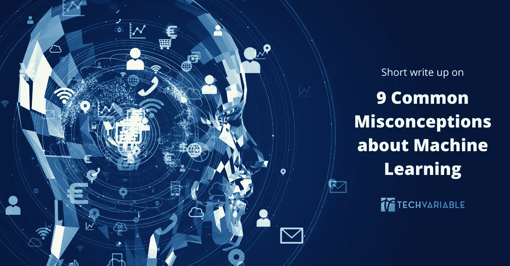
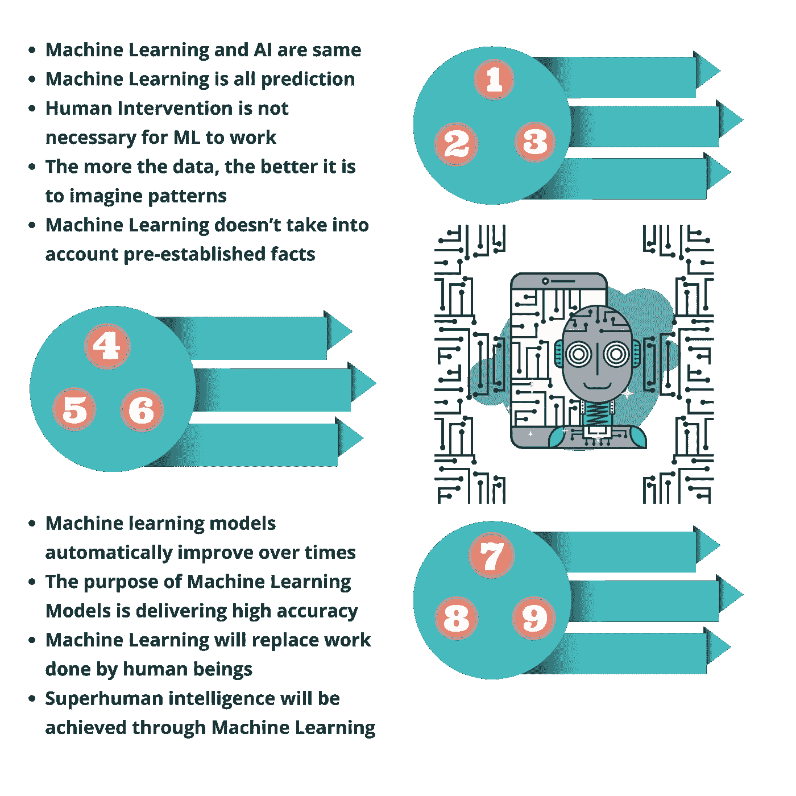

# 关于机器学习的常见误解

> 原文：<https://blog.devgenius.io/common-misconceptions-about-machine-learning-6779522c5bb5?source=collection_archive---------11----------------------->

## 简短的报道

## 机器学习领域流行的 9 大误区

机器学习一直是技术专家和非技术专家感兴趣的话题。以前只有像脸书这样的公司在封闭的墙内讨论显示帖子提要，谷歌用于放置广告，亚马逊用于产品推荐，现在机器学习已经成为一个不断担忧和讨论的话题。这不仅在公众中引起了巨大的兴趣，而且由于涉及到来自行业多个阶层的人，也造成了一些不必要的误解。以下是一些最突出的例子:

**1)机器学习和人工智能是一样的** : *虽然被认为是一样的，但事实是它就像牛奶和黄油一样不同。简而言之，人工智能是机器能够以我们认为“智能”的方式执行任务的更广泛的概念，而机器学习是基于人工智能的当前应用，其理念是我们应该真正能够让机器访问数据，并让它们自己学习。*

**2)机器学习就是预测:** *在大多数情况下，人们会说他们希望机器学习对他们来说变得规范。但这几乎不是它的工作方式。事实是，只有当未来看起来像过去的趋势时，ML 才能擅长预测未来。*

**3)人工干预对于 ML 的工作不是必须的:** *一般意义上来说，机器学习东西是不需要编程代码的。但事实是，没有写出合适的算法，机器学习只是一个名词。*

**4)数据越多，越有利于想象模式:** *事实是，如果我们能挖掘出同一实体的更多属性，那么幻想事物的风险就增加了。这是 ML 开发者和顾问想出最小化影响的方法的地方。此外，如果可以挖掘出更多具有相同属性集的实体，那么高估和幻想的风险就会大大降低。*

**5)机器学习不考虑预先建立的事实:** *一个人需要明白，事实和真正的知识来自于一个漫长的推理和实验过程，这是无法通过运行数据库中的通用算法来模仿的；然而，这里必须承认的是，当提炼一个预先存在的知识时，算法确实会派上用场。*

**6)机器学习模型会随着时间的推移自动改进:** *还有一种误解，认为我们只需要启动过程，结果的准确性就会在没有任何干预的情况下提高久而久之。然而，人们需要理解，机器学习模型一旦部署，就需要一次又一次地重新训练，以提高准确性。*

**7)机器学习模型的目的是提供高精度:** *对机器学习模型的评估一直是热情的技术人员争论的话题。然而，认为机器学习模型旨在提供高度准确的结果是一种误解。然而在现实中，准确性从来都不是衡量一个模型有多好的好标准。*

**8)机器学习将取代人类所做的工作:** *虽然流程和系统都将实现自动化，一些社会活动将由机器人结构完成，但这也将为熟练劳动力创造就业机会，特别是在相关技术方面的专业知识。*

随着人工智能的不断进步，计算机有一天会像人类一样看、说话、推理和做事(甚至可能超过人类)，这是一个流传了很长时间的普遍神话。然而，事实是，尽管计算机将擅长于狭窄的任务，但由于缺乏常识，它们永远不会实现超级智能。

> "*致力于在*[*HR-tech*](https://www.techvariable.com/casestudy-Employee-Performance-Management/)*[*Media*](https://www.techvariable.com/casestudy-Media-Aggregation-and-Analytics-Portal/)*[*Market-Research*](https://www.techvariable.com/casestudy-NLP-based-Market-Research-Automation/)*[Technology](https://www.techvariable.com/casestudy-Product-Lifecycle-Management/)*等领域开发机器学习算法的公司。，通过对每个步骤中涉及的方法的透明和清晰的描述，消除了大多数行业的疑虑。****