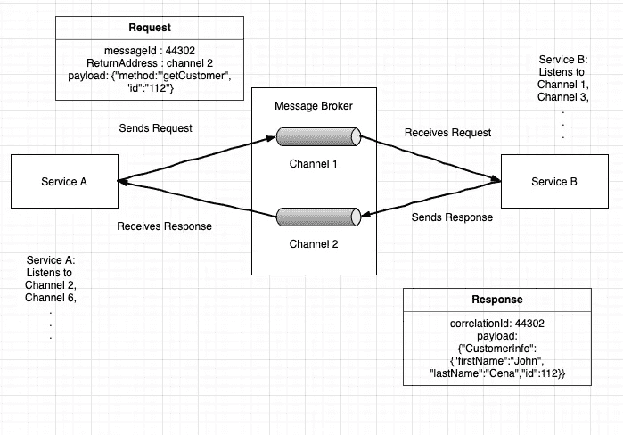

# 微服务中的通信模式

> 原文：<https://blog.devgenius.io/communication-patterns-in-microservices-2de316d213cd?source=collection_archive---------20----------------------->

约翰·施诺布里奇在 [Unsplash](https://unsplash.com?utm_source=medium&utm_medium=referral) 上的照片

微服务是一种在过去十年中流行起来的模式。有许多文章/书籍/博客/教程/视频/学习课程描述了它。在本文中，我想回顾一下行业中遵循的服务之间流行的通信实践。

在高层次上，微服务之间有两种主要的交互方式。

1.  **同步通讯。**

在这种交互风格中，两个服务之间将进行一对一的通信，并且客户机服务期望来自服务器服务的及时响应。这可以通过使用 REST 或消息传递来实现。

REST 是一种使用 HTTP 的进程间机制。REST 中的主要概念是，它包含一个或一组表示为资源的业务对象。使用 REST，我们可以操作(POST、PUT、DELETE)或获取(GET)资源。在开发基于 REST 的 API 时，理解 Martin Fowler 解释的 [Richardson 成熟度模型](https://martinfowler.com/articles/richardsonMaturityModel.html.)非常重要。

使用基于 REST 的模型的主要好处是简单和熟悉，它不需要中间代理，这简化了系统的架构。使用基于 REST 的方法的主要缺点是它不支持发布-订阅模型。这种方法可能会降低可用性，因为在交换请求和响应期间，客户端和服务器服务都应该是可用的。在这种方法中，客户机必须知道服务器服务实例的 URL。REST APIs 应该处理网络超时和[电路中断模式](https://dzone.com/articles/circuit-breaker-design-pattern-using-netflix-hystr)。

**消息代理**可用于基于同步的通信。这属于异步风格的通信，以实现服务之间的同步交互。像 [eventuate tram](https://eventuate.io/abouteventuatetram.html) 这样的框架有助于以异步方式使用消息代理实现同步通信。下图显示了使用消息代理的两个服务之间的通信。

如上图所示，客户端服务(服务 A)向消息代理中配置的通道(通道 2)发送一个带有 messageId、返回地址和有效负载的请求。该服务订阅该通道(通道 1)并接收请求。该请求包含关于需要发送响应的返回通道的信息。服务器服务(服务 B)处理请求并创建一个响应，使用该响应发送到返回通道(通道 2 ),请求中的 messageId 与 correlationId 相同。correlationId 帮助客户端服务映射其请求并相应地采取行动。

在这种方法中，即使服务器服务暂时关闭，它也会收到客户端发送的请求，客户端也会收到响应。客户端服务可以通过阻塞调用来等待服务的响应。同步通信的一个主要缺点是它在服务之间引入了紧密耦合。

如果情况需要，我们应该使用它。

2.**异步通信**

在这种交互风格中，可以有两个或更多的服务作为通信的一部分。当这种通信中只涉及两个服务时，它就变成了一对一的通信，客户机服务向服务器服务发送请求，服务器服务异步回复响应。服务器服务向客户端发回响应的时间可能比平时长。在这种交互中，客户端不等待响应。这非常类似于我们上面讨论的异步风格的同步通信。这里唯一的区别是客户端不进行阻塞调用，从而使通信异步。

客户端可以向更多服务发布可由 0 使用的消息。

这种类型的服务间通信是使用消息代理实现的。流行的消息代理包括 Kafka，Rabbitmq，ActiveMQ，AWS Kinesis。所有这些都支持点对点和发布-订阅通道。使用基于代理的消息传递的主要好处是松耦合、消息缓冲、灵活的通信方式。

通过松散耦合，客户端服务不需要知道其他服务托管在哪里。接收服务可以在同一个网络中，也可以在完全不同的 pod 中。这有助于开发人员开发可伸缩的应用程序，而无需过多考虑依赖性。

基于代理的消息传递支持消息缓冲，直到消息被服务处理。

这种单点故障的一个主要缺点是。消息代理应该是高度可用的。

总之，两种风格都有其优点和缺点。因此，当我们设计和架构各种应用程序时，比较和对比所有可用选项并选择适合应用程序的通信方式总是好的。有可能在同一个应用程序中使用两种交互风格来解决不同的用例。

**确认**

我借用了[克里斯·理查森](https://medium.com/u/f66695cce1a8?source=post_page-----2de316d213cd--------------------------------)的书《微服务模式》中的概念

你可以在[https://www . LinkedIn . com/pulse/communication-patterns-micro services-Anand-Nair](https://www.linkedin.com/pulse/communication-patterns-microservices-anand-nair)找到同样的文章。