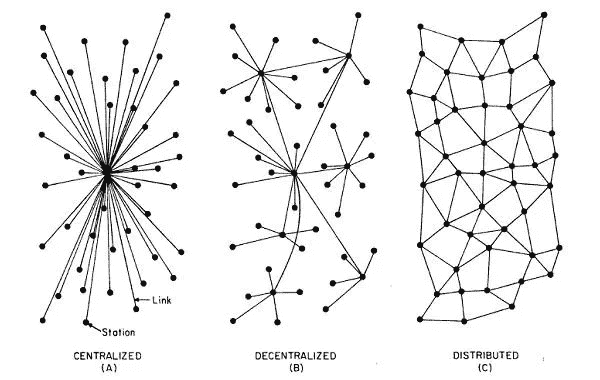
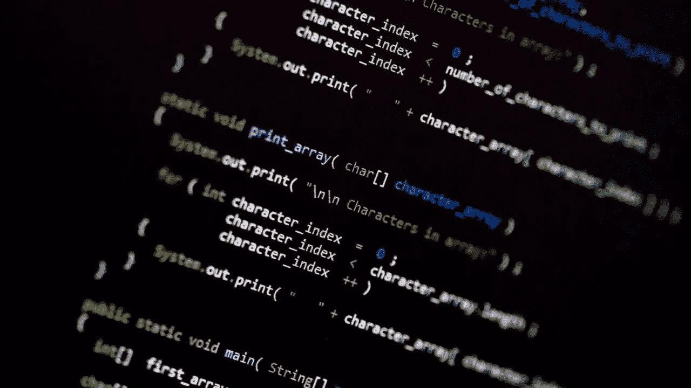

# 区块链中的社区管理:从远处看似乎没什么

> 原文：<https://blog.devgenius.io/community-management-in-blockchain-not-really-seemed-from-a-distance-692f298058ad?source=collection_archive---------17----------------------->

管理一个区块链社区似乎并不遥远。在这里，我们将讨论我在区块链的社区管理经验。

## 1-区块链社区不仅仅由做 R&D 的书呆子组成！

*我管理某些社区，书呆子在这个群体中所占的比例最少*。相反，我们专注于某些活动，如研发、网络、组织、教育和业务发展。更有甚者，社区领导人继续同时管理至少两三个社区。反而；当我们找到机会的时候，我们会做一些活动，比如网络、社交、露营；我们尽情狂欢。

## 2-他们不只是在区块链做事

尽管区块链是社区里人们的主要专长。我们只是在不同的领域工作，大多数人至少在两个领域工作。相反，大多数人知道他们感兴趣的某些话题。最重要的是，我们只有一个管理角色来保持我们的部门在某些领域的工作。我们的余生完全被挡在外面。

## 3-他们支持尝试新事物的人

如果你把你的新想法告诉你的朋友，创业精神总是会受到鼓励的。他们不会嘲笑你，会尽最大努力融入他们的社区。好消息是，只要与区块链有关，学生俱乐部也会尽可能提供最多样化的环境。

## 4-我们的目标是创建一个分散的分布式系统，而不是集中的层次结构

我们的目标是(B)和(C)

我们不喜欢头衔和等级制度。相反，我们把所有人都看作是采取行动的平等和有益的主动性。甚至更多，如果他们告诉我们他们的新想法；只要与区块链有关，我们鼓励并帮助他们实现进一步加强我们社区的目标。

## 5-我们大多数人都知道如何编程

而我们所知道的编程语言取决于我们的专业；所有程序员都懂 python，HTML，CSS，JavaScript。对于开发者来说；它包括 nodeJS、java、solidity，有时还包括 hyperledger。然而，我们通常与 solidity 一起工作以获得彻底的经验。

## 6-你不需要编程就能和我们在一起

这在大多数人看来还是平淡的。但是，我们需要从事社交媒体、通信、业务开发、营销和其他更多领域工作的人。举个例子，尽管我想作为一名开发者在区块链从事数学方面的工作，但是我的主要领域是内容写作。

*你觉得区块链的社区管理怎么样？在下面的评论区分享你的想法和经历。*