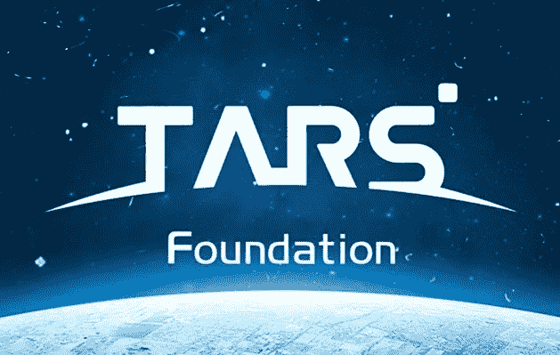
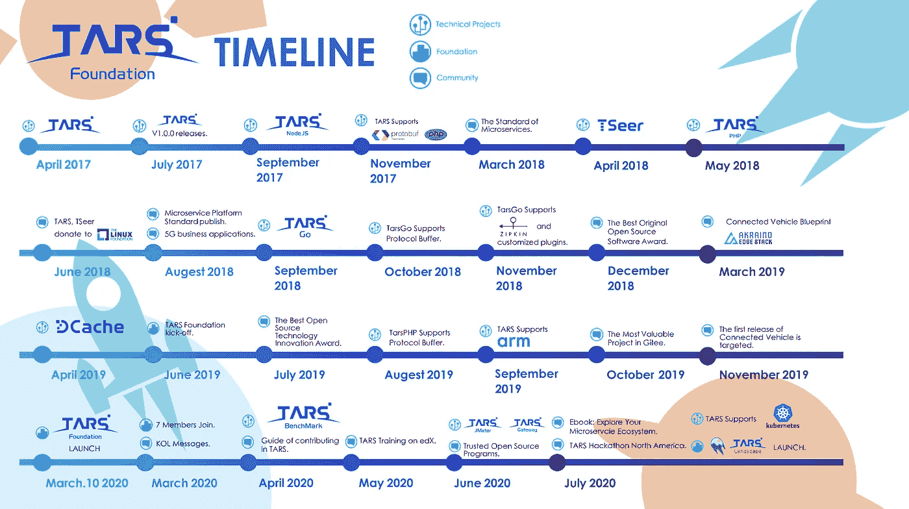

# 来自 TARS 基金会的社区更新

> 原文：<https://blog.devgenius.io/community-updates-from-the-tars-foundation-8ea2e8608d3?source=collection_archive---------21----------------------->

# TARS 增长和项目时间表

TARS 基金会最初是腾讯的一个内部项目，现已发展成为一个全球性的非营利组织，致力于在 2020 年建立一个开放的微服务平台。在 Linux 基金会的保护下，TARS 基金会继续为软件基础设施、开放治理和社区参与支持提供解决方案。此外，TARS 的最终目标是为任何行业的开源微服务项目提供支持，以快速、大规模地将想法转化为应用。

下面的时间表展示了 TARS 的许多里程碑以及我们都很期待的未来计划/更新。请继续关注我们更多令人兴奋的消息。

有兴趣了解 TARS 微服务生态系统的更多信息吗？请随意查看 Linux 基金会的[介绍](https://www.linuxfoundation.org/blog/2020/03/the-tars-foundation-the-formation-of-a-microservices-ecosystem/)和我们的 [github](https://github.com/TarsCloud) 回购。