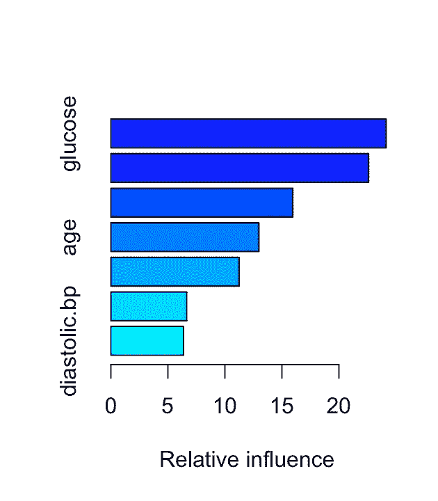

# 比较 R 中的机器学习模型以预测心力衰竭和糖尿病导致的死亡

> 原文：<https://blog.devgenius.io/comparing-machine-learning-methods-in-r-to-predict-death-due-to-heart-failure-and-diabetes-3c0f40425a4b?source=collection_archive---------9----------------------->

**第一部分:使用机器学习来预测由于心力衰竭导致的死亡事件**

这项分析的目标是在预测心力衰竭导致的死亡事件时比较机器学习方法。死亡事件的预测变量包括年龄、贫血、肌酸酐磷酸激酶、糖尿病、射血分数、高血压、血小板、血清肌酸酐、血清钠、性别、吸烟和时间。

图书馆(rpart)
图书馆(gbm)
图书馆(randomForest)
图书馆(ISLR)

心力衰竭 hf < -心力衰竭
头部(hf)

将数据分成训练集和测试集。

set . seed(21)
test . d<-sample(1:nrow(HF)，. 20 * nrow(HF))
test<-HF[test . d，]
training < - hf[-test.d，]
y . true<-as . numeric(test $ DEATH _ EVENT)
y . true

使用 10 进行交叉验证，生成一棵单独的树。

model . control<-rpart . control(min split = 5，xval = 10，CP = 0)
fit<-rpart(DEATH _ EVENT ~)。，数据=训练，方法= "类"，控制=模型.控制)

plot(fit)
文本(fit，use.n = TRUE，cex = .5)

这棵树长得太多了。我要看看复杂度参数表。复杂度参数给出了每个节点所需的改进。如果添加另一个变量会使成本超过复杂性参数，则不会添加该变量。这将帮助我修剪这棵树。

最小 cp 图(fit$cptable[，4]，main = "Cp for model selection "，ylab = "cv error ")

这个复杂度参数表显示 2 是最优的。

pruned.fit

plot(pruned.fit)
文本(pruned.fit，use.n = TRUE，cex = .5)

计算单棵树的测试误差。

my . predmy . pred
y . hat<-as . numeric(my _ pred)-1
y . hat
misclass . tree<-sum(ABS(y . true-y . hat))/length(y . hat)
misclass . tree

单棵树的测试误差:0.1355932。

构建随机森林模型。

RF . fit<-random forest(DEATH _ EVENT ~)。，数据=训练，n.tree = 10000)

方差图(rf.fit)

重要性(rf.fit)
增加纯度
年龄 4.5938688
贫血 0.3684661
肌酐 _ 磷酸激酶 2.9997713
糖尿病 0.3819893
射血分数 7.3631650
高血压 0.5095131
血小板 3.3403799
血清

计算随机森林的测试误差。

y . haty . hat<-as . numeric(y . hat)
y . hat
misclass . RF<-sum(ABS(y . true-y . hat))/length(y . hat)
misclass . RF

随机森林测试错误:0.2446791。

制袋材料

bag . fit

变量图(bag.fit)

重要性(bag.fit)
增加纯度
年龄 3.1057867
贫血 0.2509914
肌酐 _ 磷酸激酶 2.9177911
糖尿病 0.2167239
射血分数 6.2159849
高血压 0.3778630
血小板 2.8023183
血清肌酐 6.5533

计算装袋的测试误差。

y . haty . hat<-as . numeric(y . hat)
y . hat
misclass . bag<-sum(ABS(y . true-y . hat))/length(y . hat)
misclass . bag

装袋试验误差:0.2385333。

升压

boost.train < -训练；
boost . train $ DEATH _ EVENT<-as . numeric(training $ DEATH _ EVENT)
boost . train $ DEATH _ EVENT
boost . test<-test；
boost . test $ DEATH _ EVENT<-as . numeric(test $ DEATH _ EVENT)
boost . test $ DEATH _ EVENT

boost.fit

boost.fit2

summary(boost.fit)

Variable relative influence:
时间 37.9954489
射血分数 14.0026115
血清 _ 肌酐 11.6500200
血小板 10.4647959
年龄 8.7592157
肌酐 _ 磷酸激酶 8.0280420
血清 _ 钠 4.4700776
性别 1.4631

摘要(boost.fit2)

变量相对影响:
时间 29.389490031
血清 _ 肌酐 14.053466311
血小板 13.644517810
射血分数 13.067936909
肌酐 _ 磷酸激酶 10.309038549
年龄 7.13039393657
血清 _ 钠 5.0101

看收缩率的测试误差= .1。

y . hatmisclass . boost . 1<-sum(ABS(y . hat—y . true))/length(y . true)
misclass . boost . 1

收缩率的测试误差= .1: 0.1677244

看收缩率的测试误差= .6。

y . hatmisclass . boost . 6<-sum(ABS(y . hat—y . true))/length(y . true)
misclass . boost . 6

收缩率的测试误差= .6: 0.1865359

不同收缩值的误差曲线:

黑色=.1，红色=.4，蓝色=.6，绿色=.8

建立一个 k 最近邻模型。

库(类)库(factoextra)

knn.total.data set.seed(21)

使用肘形函数计算总的类内平方和。

dev . off()
fviz _ nbclust(KNN . total . data，kmeans，method = "wss "，k . max = 20)+theme _ minimal()+gg title("肘方法")

k = 5
KNN<-KNN(train = training，test= test，cl=training$DEATH_EVENT，k = 5)
KNN
KNN . cm<-table(test $ DEATH _ EVENT，KNN)
KNN . error<-mean(KNN！= test $ DEATH _ EVENT)
print(paste(' Accuracy = '，1-KNN . error))
Accuracy = 0.728813559322034
KNN . error

k=5 时的测试误差:0.2711864

建立逻辑回归模型。

glm . fitsummary(glm . fit)
names(glm . fit)
round(glm . fit $ fitted . values)
glm . probs . test<-predict(glm . fit，newdata = test，type = " response ")
y . hat . test<-round(glm . probs . test)

log.tab

.86441 accuracy
1- .86441

逻辑回归检验误差:0.13559。

这是所有模型中最低的，但它几乎等同于单树测试误差 0.1355932。

逻辑回归发现重要的变量有:

p 值为 6.51e-09
射血分数为 1.47e-06
血清肌酐为 0.000592
年龄为 0.000911

单株误差为 0.1355932。随机林错误为 0.2446791。装袋误差为 0.2385333。最小提升误差为 0.1677244，收缩 0.1，树数为 1000。KNN 误差最高为 0.2711864，逻辑回归检验误差最低为 0.13559。

我感到惊讶的是，一些更简单的模型表现得比装袋，升压和随机森林更好。与装袋、推进和随机森林相比，单棵树模型的优势在于它更容易解释。KNN 没有做得那么好，在这种情况下选择 k 的肘方法是不可靠的，所以我不得不尝试一些不同的 k 值。我发现 k=5 导致 27%的最低误差，但这与装袋、助推和随机森林的结果不可比。logistic 回归的误差率最低，为 13.56%。这是最容易实现的，它将几个同样重要的变量标识为 boosting。

**第二部分:利用机器学习预测糖尿病**

Pima 数据集来自国家糖尿病、消化和肾脏疾病研究所。我这次分析的目标是根据 7 个健康预测指标来预测糖尿病，这 7 个健康预测指标包括怀孕次数、血糖水平、舒张压、皮褶厚度、体重指数、血统和年龄。我还想对比一下用于预测的机器学习方法。

pima
pima<-pima[-9]#移除多余的列
pima
头(pima)

将数据分成训练集和测试集。

set . seed(21)
test . d<-sample(1:nrow(pima)，. 20 * nrow(pima))
test<-pima[test . d，]
test $ class digit
training<-pima[-test . d，]
training $ class digit
y . true<-as . numeric(test $ class digit)-1
y . true

使用 10 进行交叉验证，生成一棵单独的树。

model . controlfit<-RP art(class digit ~)。，数据=训练，方法= "class "，控制= model.control)

绘制(拟合)
文本(拟合，使用. n = TRUE，cex = .5)

这棵树被过度砍伐了。我将查看复杂性参数表。复杂性参数给出了每个节点所需的改进。如果添加另一个变量会增加复杂性参数以上的成本，则不会添加该变量。这将帮助我修剪这棵树。

min.cp 图(fit$cptable[，4]，main = "Cp 用于模型选择"，ylab = "cv 错误")

该复杂性参数表显示，5 是最佳值。

修剪. fit quartz()
绘图(修剪. fit)
文本(修剪. fit，use.n = TRUE，cex = .5)

葡萄糖、年龄和系谱是确定的重要变量。

计算单个树的测试错误。

my . predmy . pred
y . hat<-as . numeric(my . pred)-1
y . hat
y . hat
错误类别. tree<-sum(ABS(y . true-y . hat))/length(y . hat)
错误类别树。

单个树测试错误:0.1886792。

构建随机森林模型。

RF . fit

varImpPlot(rf.fit)

importance(rf.fit)

MeanDecreaseGini
NP regent 17.61143
葡萄糖 50.48042
舒张期. bp 16.43220
皮褶厚度 19.49788
bmi 30.02280
系谱 27.75305
年龄 27.51515000006

计算随机林的测试错误。

y . haty . hat<-as . numeric(y . hat)-1
y . hat
错误分类. rf<-sum(ABS(y . true-y . hat))/length(y . hat)
错误分类. RF

随机森林测试错误:0.2075472

制袋材料

bag . fit

varImpPlot(bag.fit)

importance(bag.fit)

MeanDecreaseGini
NP regent 14.94415
葡萄糖 64.91023
舒张期. bp 13.71250
皮褶厚度 15.64271
bmi 26.32955
系谱 27.82432
年龄 26.63557000006

装袋的计算测试误差。

y . haty . hat<-as . numeric(y . hat)-1
y . hat
误分类. bag<-sum(ABS(y . true-y . hat))/length(y . hat)
误分类. bag。

装袋试验误差:0.2264151

boosting

boost . train<-training
boost . train
boost . train $ class digit<-as . numeric(training $ class digit)-1
boost . train $ class digit
boost . test<-test
boost . test $ class digit<-as . numeric(test $ class digit)-1
boost . test $ class digit

boost . fit

尝试不同的收缩水平。

ebost . fit2

总结(boost.fit)

变量相对影响:
葡萄糖 23.613904
谱系 19.515308
bmi 18.367461
年龄 14.766844
皮褶厚度 8.672439
npregent 8.059944
舒张压 7.004100

摘要(boost.fit2)

变量相对影响:
葡萄糖 24.144609
家系 22.611261
bmi 15.964700
年龄 12.981947
皮褶厚度 11.247379
npregent 6.664430
舒张压 6.385674

看收缩率的测试误差= .1。

y . hatmisclass . boost . 1<-sum(ABS(y . hat—y . true))/length(y . true)
misclass . boost . 1

收缩率的测试误差= .1: 0.2382885

看收缩率的测试误差= .6。

y . hatmisclass . boost . 6<-sum(ABS(y . hat—y . true))/length(y . true)
misclass . boost . 6

收缩率的测试误差= .6: 0.2516983

不同收缩值的误差曲线:

黑色=.1，红色=.4，蓝色=.6，绿色=.8

随机森林重要变量不同于单树模型，该模型将葡萄糖、年龄和血统确定为重要变量。随机森林确定葡萄糖是最重要的，然后是身体质量指数，然后是年龄和血统。误差率较低的 0.1 的增强，按重要性顺序确定了血糖、血统、bmi，然后是年龄。另一方面，套袋更类似于单树模型，因为它确定葡萄糖、血统和年龄是最重要的，身体质量指数在重要性上类似于年龄。

与误差为 0.1886792 的单棵树相比，随机森林的测试误差增加了 0.2075472。增压进一步增加了 0.2382885 的测试误差，收缩了 0.1。收缩 0.6 的增强误差为 0.2516983。由于 boosting 没有 random forest 做得好，我很好奇 bagging 会如何比较。装袋误差为 0.2264151。这与我在心力衰竭数据中发现的情况类似，单树模型比随机森林、boosting 和 bagging 模型表现得更好。这样做的好处是减少了计算成本和更高的可解释性。