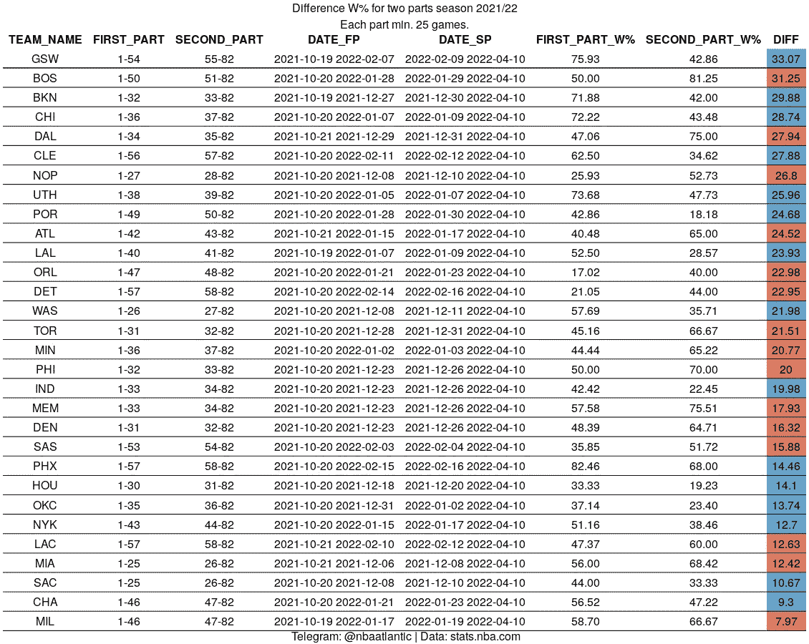
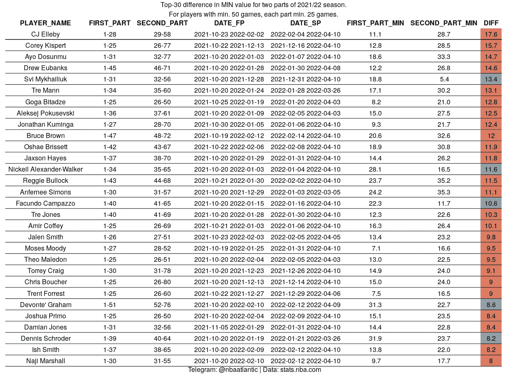
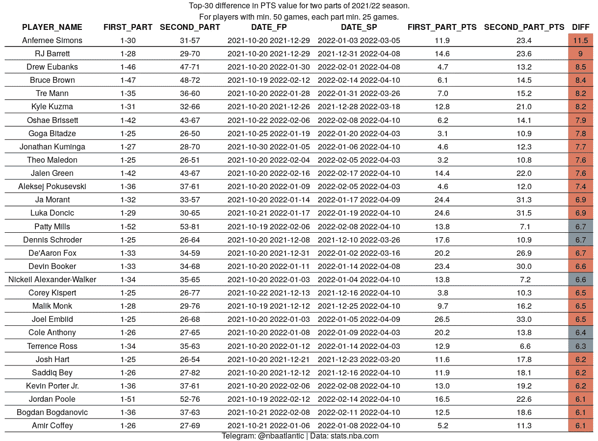
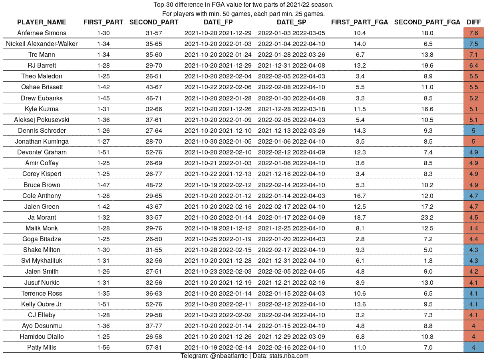
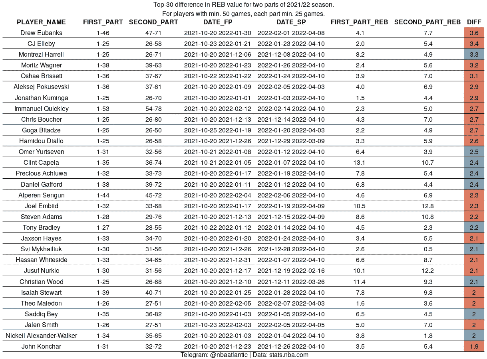
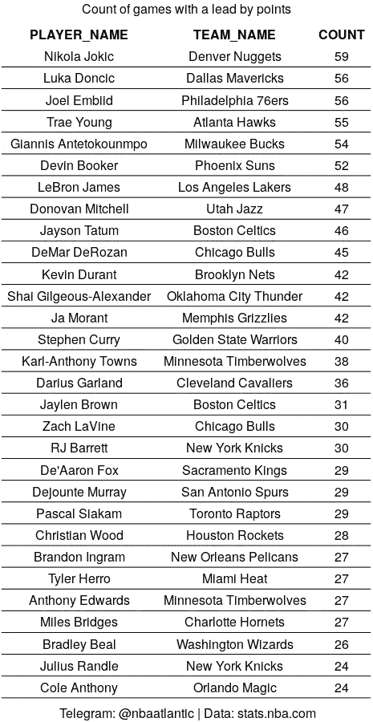

# 使用 R 比较 NBA 球队和球员的赛季部分

> 原文：<https://blog.devgenius.io/comparing-parts-of-season-for-nba-teams-and-players-using-r-36e237fc7a97?source=collection_archive---------8----------------------->

# 介绍

抱歉我的英语，希望一切都清楚。

NBA 赛季前几天结束了。82 场比赛太多了。很难顺利地走完全程。有很多例外，既有积极的(金州 2015/16，芝加哥 1995/96)，也有消极的(夏洛特 2011/12)，但通常球队的赛季都是由起伏组成的。通常在媒体上，球队的赛季被一些事件(全明星，新年，截止日期)划分，并比较赛季的两个部分:之前和之后。我们也会这样做，但我们不会被束缚在任何特定的点上，而只是简单地找到一个分成两部分的划分，这两部分之间会有最大的差异。每部分最少游戏数为 25。

如果你对关于编程的部分不感兴趣，直接进入“比较季节的部分”部分。

# 用 R 语言实现任务。

为了解决这个问题，我使用了 R 语言。接下来，我将描述计算团队获胜百分比的解决方案。对玩家的计算是相似的。您可以在[项目存储库](https://github.com/shufinskiy/nba_various/tree/main/two_different_segments_season)中查看它们。
首先我们需要得到这个赛季所有比赛的游戏日志。我们将通过对 NBA API 的一个请求来实现这一点。我使用自己的函数来获取数据:

使用 NBA API 的主要函数隐藏在 **download_utils 中。R** 。

我们收到了数据:30 个命令中的每一个都有 82 行。现在我们需要一个算法来计算。我们有 82 场比赛，条件是每个赛季至少有 25 场比赛。程序如下:

*   我们将创建一个变量 max_diff，在这个变量中，我们将存储赛季各部分之间的最大差异。最初，它是零。
    我们来做第一个分区:1–25 26–82。
    ·计算双方获胜的百分比。
    ·计算赢率百分比的模差，如果它大于 max_diff，那么现在这个差变成最大值。
    回到第二点，将 1–26 27–82 分开，然后重复第 3 点和第 4 点。

我通过循环计算。通常在 R 中，在这种情况下使用 apply family 函数，但是在这种情况下这无关紧要。对于每个命令，我们重复计算 30 次。我们感兴趣的是季节各部分之间的差异大小，所以我们省略了符号(加号或减号)。
在 R 代码中，看起来都是这样的:

接下来，我想以漂亮的表格形式呈现所有数据。看了 stackoverflow 和几个教程，原来是通过写以下代码来实现的:

比较季节的不同部分。现在让我们来看看我们的计算结果。让我们从团队获胜的百分比开始。

金州差别最大。在前 54 场比赛中，GSW 只输了 13 场，但在剩下的 28 场比赛中，输了 16 场之多。另一方面，波士顿在赛季开始时相当平庸，但自二月以来已经开启了杀手模式，赢得了 5 场比赛中的 4 场。结果，凯尔特人甚至在联盟中名列前茅。同样在下半赛季，西南赛区的两支球队大增:达拉斯和新奥尔良。两支球队——在赛季初出人意料，芝加哥和克利夫兰，在第二部分明显减弱，以及布鲁克林。

让我们从团队转移到玩家。我们将通过一些基本值来比较球员赛季的两个部分:MIN，FGA，PTS，REB，AST。

top 里有相当多的球员，关于他们，没有互联网的帮助，一个单纯的 NBA 球迷是不会说什么的。主要是那些在下半赛季时间增加的球员。这些都是赛季新人，弱队中的二流球员，因为“尽量少输”的任务，成为了基础球员。在严重的瀑布，这些是价值(也是 FGA 和 PTS)亚历山大-沃克交换到犹他后。

这个按名字排的 top 就有趣多了:有莫兰特，有东契奇，有布克。领袖是安弗妮·西蒙斯，他在下半赛季成为波特兰的领袖。

投篮次数与得分有很好的相关性，这并不奇怪。丹尼斯·施罗德在被交易到休斯顿后损失惨重，他的赛季桥到大合同的赌注没有成功。

直到最近，Montrez Harrell 还是第六好的 10 +10 球员，现在他已经连续 50 场比赛，场均 5 个篮板。我们还可以注意到，恩比德的篮板数量有所增加，而五车二的篮板数量有所下降。

你知道戈加·贝塔泽和阿列克谢·波库舍夫斯基的共同点吗？他们在所有 5 个等级中。注意泰瑞斯·哈利伯顿，他在 50 场比赛中有 9.5 次助攻，克里斯·保罗有惊人的 12 次助攻。

我还统计了该球员所在球队得分最多的比赛场次。尼古拉·乔吉奇以 59 场比赛排名第一，东契奇和恩比德落后他三场。我会注意到来自波士顿(塔图姆-布朗)和芝加哥(德罗赞-拉文)的配对，他们两人几乎参加了他们球队的所有比赛。

我希望你对这篇文章感兴趣。

[Github 上的存储库](https://github.com/shufinskiy/nba_various/tree/main/two_different_segments_season)

[我的推特](https://twitter.com/vshufinskiy)

[我的 Linkedin](https://www.linkedin.com/in/vladislav-shufinskiy/)