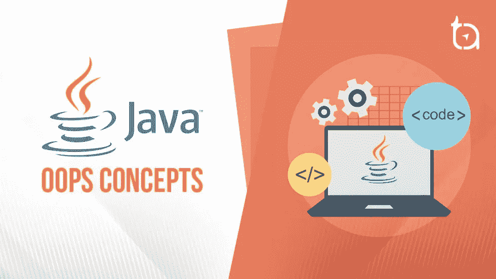
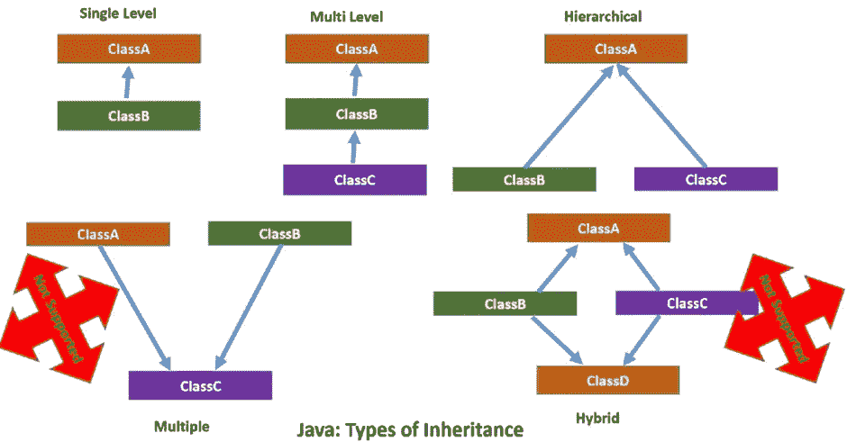
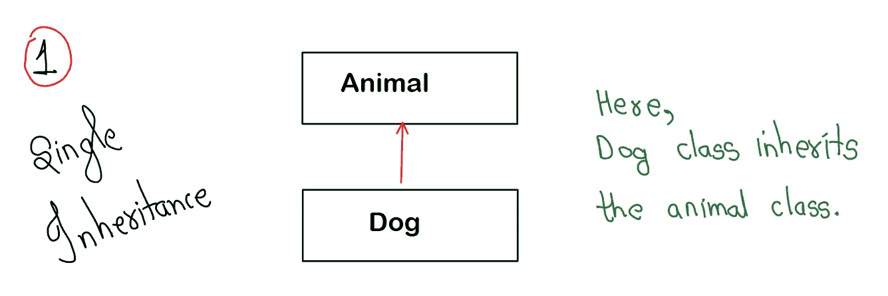
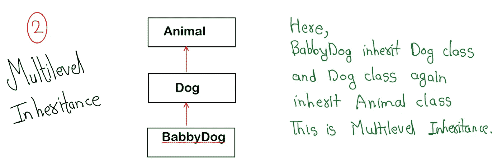
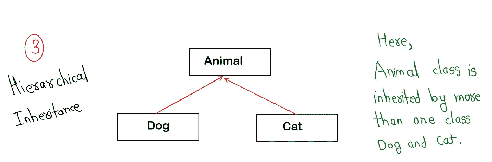
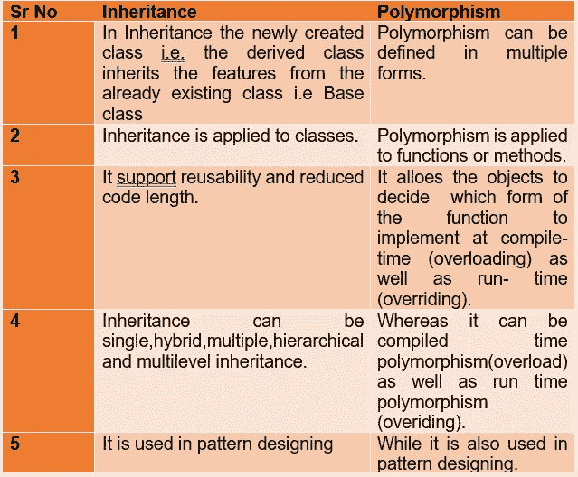

# 比较遗传和多态性

> 原文：<https://blog.devgenius.io/comparison-inheritance-and-polymorphism-12064ce8a5aa?source=collection_archive---------7----------------------->



## **继承:**

*   继承是一种允许创建层次分类的组织机制。
*   使用继承，我们可以创建一个新类，它是现有类的专门化。
*   在 java 的术语中，被继承的类被称为超类。进行继承的类称为子类。
*   因此，子类是超类的特殊版本。

**可重用性:**当我们想要创建一个新的类，并且已经有一个类包含了一些我们想要的代码时，我们可以从现有的类中派生出我们的新类。通过这样做，我们可以重用现有类的字段和方法。

**为什么我们需要在 JAVA 中使用继承？**

> 对于**方法重写**(这样*运行时多态*就可以实现了)。
> 
> 对于代码**的可重用性**。

使用的关键字:**扩展了**

> **语法:**
> 
> **类子类名称扩展超类名{**
> 
> **//类的主体**
> 
> **}**

# **Java 中的继承类型**



**继承树:**
Java 只支持单继承。这意味着一个类只能扩展另一个类。因此，在 java 中，继承关系定义了一棵继承树。

# **1。单一继承**

当一个单独的类从另一个单独的类继承时，它被称为单独继承。示例:



```
package ExampleInheritance;

class Animal{
    void eat(){System.*out*.println("eating...");}
}
class Dog extends Animal{
    void bark(){System.*out*.println("barking...");}
}
class TestInheritance{
    public static void main(String args[]){
        Dog d=new Dog();
        d.bark();
        d.eat();
    }}
```

输出:

```
barking...
eating...
```

# 2.多级遗传

当存在继承链时，称为多级继承。继承已经被另一个类继承的类。



```
package ExampleInheritance;

class Animal{
    void eat(){System.*out*.println("eating...");}
}
class Dog extends Animal{
    void bark(){System.*out*.println("barking...");}
}
class BabyDog extends Dog{
    void weep(){System.*out*.println("weeping...");}
}
class TestInheritance2{
    public static void main(String args[]){
        BabyDog d=new BabyDog();
        d.weep();
        d.bark();
        d.eat();
    }}
```

输出:

```
weeping...
barking...
eating...
```

# 3.分层继承

当两个或更多的类继承一个类时，这叫做层次继承。示例:



```
package ExampleInheritance;

class Animal{
    void eat(){System.*out*.println("eating...");}
}
class Dog extends Animal{
    void bark(){System.*out*.println("barking...");}
}
class Cat extends Animal{
    void meow(){System.*out*.println("meowing...");}
}
class TestInheritance3{
    public static void main(String args[]){
        Cat c=new Cat();
        c.meow();
        c.eat();
    }}
```

输出:

```
meowing...
eating...
```

# 4.多重遗传

当一个类从多个类继承时，它被称为多重继承。例如:C 类继承自 A 类和 b 类。

*Java 不允许多重继承，以避免由此带来的歧义。*

# 5.混合遗传

Java 中的混合继承是两种或多种类型继承的组合。例如:D 类继承自 C 类和 B 类，B 类和 C 类都继承自 a 类。

Java 也不支持混合继承。

# 多态性

*   多态性是指一个事物以多种形式存在。
*   简单地说，多态是一个消息以多种格式显示的能力。
*   多态性允许我们以不同的方式执行一个动作。换句话说，多态性允许您定义一个接口并拥有多个实现。
*   单词“poly”的意思是许多，“morphs”的意思是形式，所以它的意思是许多形式。

# 多态性的类型

> 1.编译时多态性
> 
> 2.运行时多态性

# 1.编译时多态性

编译时多态性是根据它在编译过程中出现而命名的。编译器在构建时检查方法签名，以确定在构建时为给定的方法调用调用哪个方法。它也被称为早期绑定、静态多态或重载。

在 Java 中实现编译时多态性的一种方法是使用[方法重载](https://www.codingninjas.com/codestudio/guided-paths/basics-of-java/content/120298/offering/1404433)。这种多态性还包括构造函数重载和方法隐藏。

现在让我们看一个编译时多态性的例子。

# 例子

```
class SimpleMultiplication
{

    */* Two different functions with same name */* int multiply(int a, int b)
    {
        return a*b;
    }
    int  multiply(int a, int b, int c)
    {
        return a*b*c;
    }
}

class Demo
{
    public static void main(String args[])
    {
        SimpleMultiplication num = new SimpleMultiplication();

        */* Calling functions */* System.*out*.println(num.multiply(10, 20));
        System.*out*.println(num.multiply(10, 20, 30));
    }
}
```

## 输出

```
**200****6000**
```

## 解释:

即使这两个函数有相同的名称，即“乘法”,但它们执行的是不同的操作，这证明了多态性的含义，即相同的名称和不同的函数。

# 2.运行时多态性

在 java 中，运行时多态性也称为动态绑定或动态方法分派。在这种方法中，对重写方法的调用是在运行时而不是在构建时动态解析的。[方法覆盖](https://www.codingninjas.com/codestudio/library/exception-handling-with-method-overriding-in-java)就是这样一种用于实现运行时多态性的方法。

现在让我们看一个运行时多态性的例子。

# 例子

```
class ABC{
    public void myMethod(){
        System.*out*.println("Overridden Method");
    }
}
public class XYZ extends ABC{

    public void myMethod(){
        System.*out*.println("Overriding Method");
    }
    public static void main(String args[]){
        ABC obj = new XYZ();
        obj.myMethod();
    }
}
```

# 输出

```
**Overriding Method**
```

# 说明

在这个例子中，我们有两个班级:ABC 和 XYZ。父类别是 ABC，而子类别是 XYZ。父类的函数 myMethod()被子类覆盖。在这个例子中，我们有一个分配给父类引用的子类对象。因此，将在运行时识别对象的类型，以确定将调用哪个方法。将被调用的方法的版本由对象的类型(而不是引用的类型)决定。

现在，学习这两个概念，我们现在可以区分这两个，



继承和多态是面向对象编程中的一个重要概念。在上面的文章中，我们已经彻底讨论了**继承**的概念，并且已经看到了它在 Java 中的实现。试着在 JAVA 中不同类实现的基础上比较它们。我们希望你能理解这种比较，并清楚这些概念。

留下评论，分享你的想法。