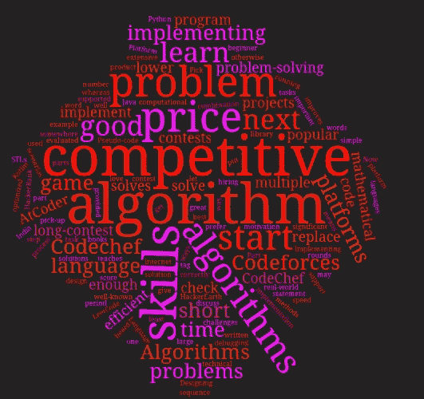

# C++竞争编程:第 1 部分

> 原文：<https://blog.devgenius.io/competitive-programming-with-c-part-1-3eb11c09fca7?source=collection_archive---------1----------------------->

如果你在这里，那意味着你想开始竞争性编程，或者你从某个地方听到了这个词。学习编程有两种方法:一种是做一些项目，另一种是开始竞争性编程。在项目中，我们通过实现现实问题的解决方案来学习，而在竞争性编程中，我们通过实现问题陈述中给出的各种场景来学习。在竞争性编程中，您可以在给定的时间内用自己选择的编程语言在平台上为给定的问题编写高效和优化的代码。在这个博客中，我们将讨论竞争性编程。



竞争规划有两个部分:设计算法和实现算法。所以，在深入讨论竞争性编程之前，让我们先讨论一下什么是算法。

# 算法是什么？

简而言之，算法是一系列定义明确的任务来完成一项重要的任务。例如，我们有一些带有价格标签的商品。现在我们想找到价格最低的商品。为此，我们可以编写如下算法-
首先，我们拿起一个项目并将其放入我们的 beg 中，然后检查下一个项目的价格，如果该项目的价格低于我们 beg 中的产品，我们会用新项目替换它，否则，检查下一个项目的价格。

该算法的伪代码可写如下:

```
1\. Pick up the first item
2\. Choose a next item 
3\. If the price of the item is lower than the price of the item in our beg, then replace it with a new item. 
4\. Go to 2 until all the items are not checked. 
```

# 算法的设计

在竞争性编程中，编写一个算法是不够的，但它需要编写一个有效的算法来解决一个定义明确的计算问题。解决给定问题的算法可以是多个众所周知的算法或方法的组合。算法的设计需要良好的问题解决技能和数学技能。

# 实现算法

一旦我们想出了解决问题的算法，下一步就是正确地实现它，这需要良好的编程技能。我们对问题的解决方案是通过在大量测试用例上运行我们的程序来评估的。在竞争性编程中，代码应该很短，这样我们就可以在短时间内实现它，因为在竞争性编程中，实现时间对于获得好的分数更为重要。

# 竞争编程使用哪种编程语言？

您可以使用任何编程语言来测试您的竞争编程技能。大多数平台支持的语言是 C、C++、Python、Java 和 Kotlin。C++是竞争编程中最流行的编程语言，因为它速度快，并且有广泛的库支持，比如 STL 和 Algorithms。我也更喜欢 C++来进行竞争性编程。

# 哪种平台最适合竞争性编程？

有各种平台可用于竞争性编程。印度最受欢迎的平台有 [Codechef](http://codechef.com/) 、 [Codeforces](https://codeforces.com/) 、A [tcoder](https://atcoder.jp/) 、 [HackerRank](https://www.hackerrank.com/) 、 [HackerEarth](https://www.hackerearth.com/) 、 [LeetCode](https://leetcode.com/) 。如果你是编程新手，你应该参加 AtCoder 上的初学者竞赛、Codeforces 上的 division-3 竞赛和 Codechef 上的长期竞赛。CodeChef 上的长期竞赛是学习算法的一个好方法。在这次竞赛中，你有 6-7 个问题，为期 10 天，你可以使用互联网或书籍。

# 为什么你应该做竞争性编程？

如果你喜欢挑战和编程，那么竞争性编程适合你。如果这个动机还不足以让你开始竞争性编程，那么我给你另一个，如果你擅长竞争性编程，你可以很容易地清除招聘过程的技术回合。

竞争性编程教会我们在短时间内用多种方法解决一个问题。它提高了我们解决问题的技能、调试技能和数学技能。当你开始竞技编程的时候，你会很享受这个游戏。

在这篇博客的第 2 部分，我们将从竞争性编程的 C++编程基础开始。