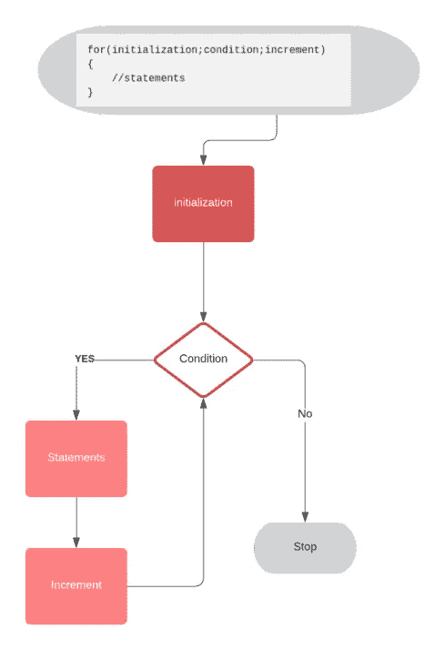

# 用 C++进行竞争性编程:第 2 部分

> 原文：<https://blog.devgenius.io/competitive-programming-with-c-part-2-4e23cff31f5f?source=collection_archive---------5----------------------->

这是我的博客“用 C++进行竞争性编程”的第 2 部分。C++是 C 的高级变体，你可以使用 C 语言的所有功能以及一些高级特性，如类、名称空间。如果你已经熟悉了 C 编程，学习 C++对你来说并不难。在这篇博客中，我们将学习 C++基础知识，开始竞争性编程。


# C++程序的基本结构

```
#include<iostream> /*include libraries*/
using namespace std;int main()
{
    cout<<”Hello World”;
    return 0;
}
```

一个 C++程序的基本结构主要包含-
1。图书馆部门
2。主要功能部分

1.  **图书馆区**

```
#include<iostream>
```

简单来说， ***#include*** 是一个预处理器指令，在编译前将给定文件或库的内容复制到当前程序中。 ***iostream*** 是定义与输入/输出流相关的函数的文件或库。所以通过 **#include < iostream >，**在 *iostream* 中定义的所有函数都将被导入到我们的程序中。

```
using namespace std;
```

这一行为我们程序中使用的所有函数添加了前缀 std::在像 iostream 这样的*标准库中定义。例如，当我们在编译之前调用 iostream 中定义的函数' cout '时，它就变成了 std::cout。为了清楚地了解名称空间，可以参考这个[链接](https://www.geeksforgeeks.org/namespace-in-c/)。*

**2。主要功能部分**

```
int main(){
 //body of function 
}
```

C++程序的起点是 main 函数。C++程序中每个函数的主体都以“{”开始，以“}”结束。{ '表示代码块的开始，而' } '表示代码块的结束。在函数体中，我们编写一组语句来执行给定的任务。

## **评论**

//'和“/* */”符号用于注释代码。编译器忽略//之后的代码和/*和*/之间的代码，不影响程序的输出。注释用于使代码易于被他人理解。

# C++中的数据类型

变量是与计算机内存中某些信息的地址相联系的符号或标签。在 C++中，在声明变量之前，我们需要指定希望变量存储的内容(数值或字符值)。例如，假设我们告诉我们的程序，变量' var '存储数值。一旦我们这样做了，我们就不能在那个变量中存储任何其他类型的数据，比如字符串或字符值。

C++有许多数据类型，包括数字、布尔值和字母数字值。一些数据类型有 ***i* nt、float、long long、char、bool、string、**等。当我们看到像 python 这样的其他编程语言时，我们不需要指定数据类型，可以在变量中存储任何类型的数据。那么为什么 C++有许多数据类型呢？这个问题的答案是用来存储一个值的内存。众所周知，不同的数据类型需要不同的内存量。因此，通过使用适当的数据类型，我们可以节省内存，这些内存可以用于程序中的其他数据。例如，当我们想要存储一个可以用 1 位存储的布尔值时，那么使用一个占用 4 个字节内存的 int 变量是没有用的。在技术面试中，程序的评判标准之一就是我们的程序所使用的内存。因此，程序员需要理解各种数据类型及其用途。

## 变量的声明、初始化

变量声明的基本语法是:

```
datatype variable_name;
```

变量初始化的语法是

```
variable_name = value;
```

我们可以同时声明和初始化一个变量

```
datatype variable_name = value;
```

让我们来看看具有以下范围的一些数据类型:

**int** 用于存储数值。存储该变量需要 4 字节的系统内存。其范围是-2147483648 到 2147483647。如果我们在 int 之前使用一个 unsigned 关键字，它将存储 0 到 4294967295 范围内的值。

```
int var;          //range: -2147483648 to 2147483647 size: 4 bytes
unsigned int var; //range: 0 to 4294967295 size: 4 bytes
signed int  var;  //range: -2147483648 to 2147483647 size: 4 bytes
```

**long long** 也用于存储数值。有符号 long long 可以存储从-9，223，372，036，854，775，808 到 9，223，372，036，854，775，807 的值。无符号 long long 可以存储 0 到 18，446，744，073，709，551，615。它占用 8 字节的系统内存。

```
long long var;  //range: ​-9223372036854775808 to 9223372036854775807
```

**Short int** 可以存储-32768 到 32767 范围内的数值，并且只占用 2 字节的系统内存。

```
short int var;  //range: -32768 to 32767
```

以下是所有数据类型及其范围和大小的列表。

# 输入和输出

在 C++中，要获取输入，我们只需要一个字符一个字符地读取，直到到达一个分隔符，不管输入是来自文件还是来自控制台中的用户。分隔符是标记输入结束的符号或字符，可以是空格或换行符(\n)。C++中用于输入输出流的库是' *iostream '。iostream* 代表输入输出流。在 C++中，输入被存储为流，而流只不过是一个接口，在这里数据被顺序地读/写。

## 标准输出

```
#include<iostream>
using namespace std;
int main()
{
   cout<<"Hello World!"<<endl;
   cout<<"C++ is a greate language \n";}
```

“cout”代表**字符输出。** cout '用于向控制台显示输出。'< <'后的文字或数值会显示在控制台上。在 C++中，使用“endl”关键字或“\n”(换行符)来结束一行。

## cin

```
#include<iostream>
using namespace std;
int main()
{
    int var; //declare a variable 
    cin>>var; //input a value for var
    cout<<var; // display the value of var in console}
```

‘CIN’代表**字符输入**。“cin”用于从标准输入设备(可能是控制台或文件)获取输入。有时我们会混淆'< <'和'> >。”我们可以这样记:'< <'用于“从程序向控制台发送值”，'>【T11]'用于“从控制台向程序获取值。”这是另一个输入/输出的例子

```
#include<iostream>
using namespace std;
int main()
{
    string name; //declare a variable to store name
    cin>>name; //input name
    cout<<"Hello "<< name <<"!"<<endl;
}
```

## getline

cin 中的默认分隔符是空格；这意味着在空格之后，所有输入都将被忽略。getline 函数允许我们定义任何字符分隔符，默认分隔符是换行符。这里有一个例子-

```
#include<iostream>
using namespace std;
int main()
{
    string name; //declare a variable to store name
    cin>>name; //input name
    cout<<"Using cin "<< name <<endl; string name2;
    getline(cin,name2);
    cout<<"using getline"<<name2<<endl;}
```

尝试上面的程序，在输入中输入你的全名和空格，观察输出。

# 控制流

## 决策块

在我们的程序中，有时我们需要决定是否运行一段代码。在这种情况下，我们可以利用 if-else 语句来根据给定的条件指定运行哪个块或不运行哪个块。以下是 if-else 语句的语法-

```
if(condition1)
{
  //code which we want to run when condition 1 is true}
else if(condition2)
{
  //code which we want to run when condition 2 is true}
else if(condition3)
{
  //code which we want to run when condition 3 is true}
else
{
  //default code to run when no conditions are setisfied
}
```

如何指定 if-else 语句的条件？让我们看一些例子-

例 1:年龄是否等于 18 岁

```
if(age == 18)
{
    cout<<"Yes";
}
else 
{
   cout<<"No";
}
```

例 2:年龄是否在 18 至 23 岁之间

```
if(age > 18 and age<23) //we can also use '&&' inplace of 'and'
{
    cout<<"Yes";
}
else 
{
   cout<<"No";
}
```

示例 3:年龄小于 12 或大于 50

```
if(age < 12 or age > 50) //we can also use '||' inplace of 'or'
{
    cout<<"Yes";
}
else 
{
   cout<<"No";
}
```

为了更好的理解 C++决策块，可以参考下面的[链接](https://www.w3adda.com/cplusplus-tutorial/cpp-decision-making-statements#:~:text=Decision%20making%20statement%20evaluates%20single,%E2%80%9D%20or%20%E2%80%9CFALSE%E2%80%9D%20otherwise.)，尝试运行下面的程序。

```
#include<iostream>
using namespace std;
int main()
{
      string zone;
      cin>>zone; //input the zone 

      if(zone == 'red')
      {
          cout<<"you can not go outside"<<endl;
      }
      else if(zone == 'yellow')
      {
          cout<<"If necessory then only go outside"<<endl;
      }
      else if(zone == 'green')
      {
          cout<<"You can go outside,but follow social distancing";
      }
      else 
      {
           cout<<"please provide correct input: one of (red,yellow,green)";
      }
      return 0;}
```

## 环

当我们想要一次又一次地运行一段代码时，我们可以在 C++中使用循环。这里我们将讨论被程序员广泛使用的“for”循环和“while”循环。

```
for(initialization;condition;increment)
{
    //statements
}
```

for 循环的流程图:



for 循环流程图

示例:

```
#include<iostream>
using namespace std;
int main()
{
    for(int i=0;i<5;i++)
    {
       cout<<i<<endl;
    }
    return 0;
}
/* output 
0
1
2
3
4 */
```

现在让我们看看，while 循环是如何工作的-

```
//syntax of while loop
while(condition)
{
    //statements
}
```

在 while 循环中，代码块将反复运行，直到条件不为假。这是一个“while”循环的例子

```
#include<iostream>
using namespace std;
int main()
{
    int i=0;
    while(i<5)
    {
       cout<<i<<endl;
       i = i+1; }
    return 0;
}/* output 
0
1
2
3
4 */
```

# 数组

现在，假设我们想要存储考试中前 100 名学生的分数。根据我们目前的知识，一种方法是创建 100 个变量，并逐个接受输入。但另一种方法是使用数组。数组是连续内存中相同类型数据的集合。

## 声明数组

```
datatype array_name[size];
```

## 将第 I 个元素的值设置为 x

```
array_name[i]=x;
```

这是我们在整个博客中学到的完整例子

```
#include<iostream>
using namespace std;
int main()
{
    int n;
    cin>>n; //input the number of students
    int marks[n]; // declare a int array of size n

    for(int i=0;i<n;i++) //input marks of all students
    {
       cin>>marks[i];
    }
         //print scores
    int j=0;
    while(j<n)
    {
       cout<<"Marks of student i = "<<i<<" is "<<marks[i]<<endl;
       j = j+1; 
    } return 0;
}
```

希望对你有帮助。在本博客的下一部分，我们将利用在本博客中获得的知识来解决 CodeChef 平台上的一个问题。