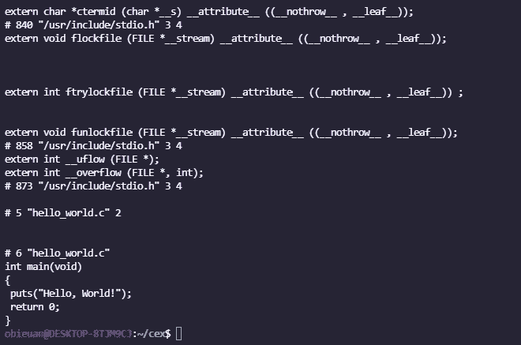
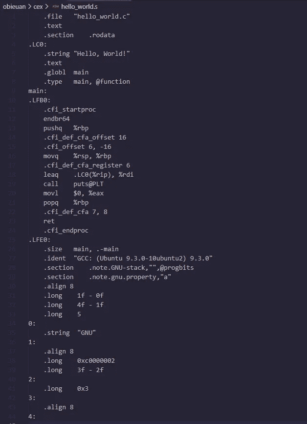

# C 程序的编译程序，它是如何工作的？！

> 原文：<https://blog.devgenius.io/compilation-process-for-c-programs-how-does-it-works-55333238415e?source=collection_archive---------13----------------------->


再说 C，是什么？

c 是一种通用的、过程化的计算机编程语言，这意味着它是用来在广泛的应用领域中构建软件的。

作为一名程序员，你可能需要用任何编辑器以文本文件的形式编写它的源代码，然后它必须被编译成机器代码。


为了做到这一点，在你的代码被编译之前有 4 个步骤:预处理，编译，汇编，链接。

我将在这篇文章中使用这个例子


# **预处理:**

这是第一步，预处理器处理指令，指令是以#开头的命令，然后它开始删除注释，展开宏和代码中包含的文件。

如果您碰巧包含一个头文件，比如#include <stdio.h>，它将搜索名为 stdio.h 的文件，并将头文件复制到源代码文件中。使用#define 定义的常量也是由预处理程序生成的。</stdio.h>

要打印预处理阶段的结果，将`-E`选项传递给`gcc`

```
gcc -E hello_world.c
```



# 编译:

现在我们进行第二步，这是预处理器的输出将生成特定于目标处理器架构的汇编语言。这些将是一种中级的人类可读语言。

为了保存编译阶段的结果，将`-S`选项传递给`gcc`:

```
gcc -S hello_world.c
```

将创建一个名为 hello_world.s 的文件，其中包含汇编指令，输出如下:



# 装配

共同供应商...集合！这是第三步，汇编程序将代码转换成纯二进制代码或机器码。也称为目标代码。

如果我们想保存组装阶段的结果，我们需要将`-c`选项传递给`gcc`:

```
gcc -c hello_world.c
```

将创建一个名为`hello_world.o`的文件，其中包含程序的目标代码。


但是如果我们想要检查它的内容，我们需要通过运行以下命令之一来使用命令`hexdump`或`od`:

```
hexdump hello_world.o
od -c hello_world.o
```


# 链接:

现在，为了伟大的结局…编译的最后一步，整个代码将被链接器从多个模块合并成一个模块。如果我们使用库，这些库将链接到我们的代码。在某些情况下，如静态链接，来自库的代码将被复制到可执行文件中，另一方面，使用动态链接，代码不会被复制，它只在二进制文件中包含库的名称。

在我们的“Hello，World”程序中，链接器将为`puts`函数添加目标代码。结果将是一个可执行文件，如果不带选项运行，该文件的名称将是`a.out`。为了更好的命名，你需要将`-o`选项传递给`gcc`:

```
gcc -o hello_world hello_world.c
```


# 感谢您的阅读！

我希望这个解释对您有用，记得阅读 gcc 手册页以获得更多信息。愿原力与你同在！

