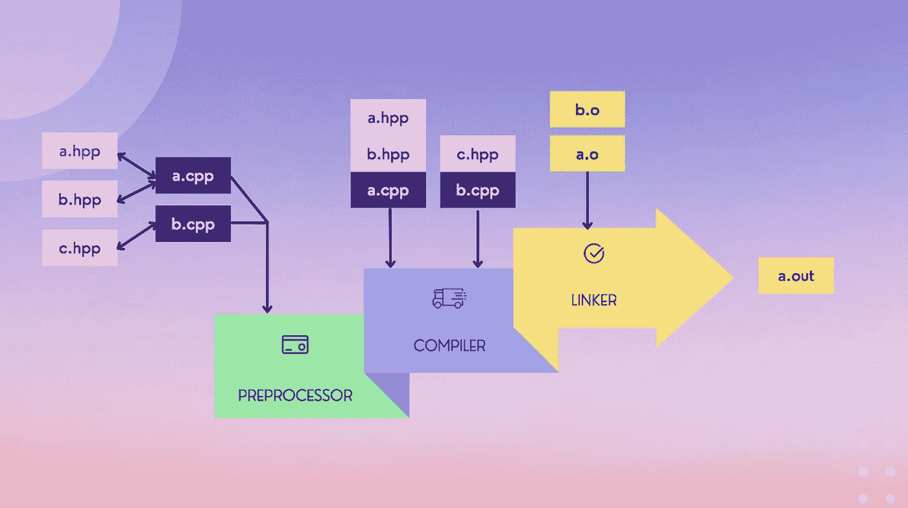

# 编译 C/C++:注意事项/技巧

> 原文：<https://blog.devgenius.io/compiling-c-c-notes-tips-8215b82d4a4b?source=collection_archive---------12----------------------->



说到性能，C 和 C++甚至在今天都是无与伦比的。它们是编译语言，用 C 或 c++编写的代码需要用特定于平台的工具针对给定平台进行编译，这个过程或针对给定平台的编译称为交叉编译。作为一名开发人员，仅仅知道这种漂亮的语言的语法和语义是不够的，还必须知道编译中发生了什么，以及编译是如何进行的。

有各种供应商提供 C/C++编译器和各种工具。在本文中，我们将介绍编译过程、一些重要的工具、它们的用法和一些调试技巧。

典型的 C/C++项目有两种类型的文件:

*   头文件(文件扩展名为`.h/.hxx/.hpp`)和
*   源文件(文件扩展名为`.c/.cxx/.cpp/.cc`)。

C 和 C++是两种不同的语言，因此避免混合使用，但是如果项目需要，通常的经验法则是将 C 文件扩展名命名为`.h and .c`，而 C++ `.hpp and .cpp`

让我们从文件名为`hello_cpp.cpp`的一段 C++代码开始:

```
**#include <iostream>**

**int** **main**(**int** argc, **char*** argv[]) 
{
    std::cout << "Hello C Plus Plus!" << std::endl;
    **return** 0;
}
```

我的构建平台是 Darwin(苹果 MacOS)

```
$ uname -srmp
Darwin 17.7.0 x86_64 i386
```

使用 g++编译器:

```
$ g++ --version
Apple LLVM version 10.0.0 (clang-1000.11.45.5)
```

# 阶段:预处理器、编译、链接

所有源文件都转换成目标文件，目标文件遵循 Linux 和 macOS 平台的 [ELF](https://en.wikipedia.org/wiki/Executable_and_Linkable_Format#:~:text=In%20computing%2C%20the%20Executable%20and,shared%20libraries%2C%20and%20core%20dumps.&text=By%20design%2C%20the%20ELF%20format,extensible%2C%20and%20cross%2Dplatform.) 格式。

在项目中，可交付成果可以是可执行程序或库。库可以是静态(`.a`)或动态(`.so`)链接的。稍后我们将看到如何使用编译选项生成这些各自的输出。

但是首先，让我们创建**预处理器**文件:

对于每个 C++源文件，当预处理器找到一个`#` include 指令、宏替换、条件编译时，它将通过在其中插入内容来构建一个[翻译单元](https://en.wikipedia.org/wiki/Translation_unit_(programming))。这是查找重复符号的最佳时机，或者如果您想用自己的实现覆盖某个特定的符号。

为了获得翻译单元(预处理的源代码)，可以将选项`-E`传递给 g++编译器。

```
$ g++ -E hello_cpp.cpp -o hello_cpp.pp
```

一旦预处理器创建完那个(有时是巨大的)翻译单元，编译器就开始编译阶段并生成目标文件。

```
$ wc -l hello_cpp.pp
   40845 hello_cpp.pp
```

接下来，**用`-c`选项编译**文件，不链接项目。

```
$ g++ -c hello_cpp.cpp
$ file hello_cpp.o
hello_cpp.o: Mach-O 64-bit object x86_64
```

您会注意到我生成了一个文件`hello_cpp.o`,它是一个没有关联链接的目标文件。

最后，**链接**我们可以执行的文件。

```
$ g++ hello_cpp.cpp -o hello_cpp.out
$ hello_cpp.out
Hello C Plus Plus!
```

# 包括路径和链接库(第三方)

在一个项目中，您可能有来自不同地方的头文件:

*   你自己的创造，
*   系统文件，
*   与第三方软件包或代码集成等。

我们的任务是包含路径，以便编译器可以找到它们。此时最重要的提示:

> 通常，人们会忽略一个很小但非常重要的点，最终导致漫长的调试周期。

提示 1 :- **包含文件版本和生成库版本必须相同。**

提示 2:- **还要确保这些库是为你要编译的平台编译的。**这很容易检查，只需运行`file`命令，后跟库名。

让我们举一个例子，调用 OpenCV APIs 在图像上呈现文本。文件被命名为`hello_cv.cpp`

```
#include <iostream>
#include "opencv2/highgui/highgui.hpp"
#include <opencv2/imgproc.hpp>int main(int argc, char* argv[])
{
    /* Create an empty image*/
    cv::Mat img(500, 1000, CV_8UC3, cv::Scalar(0,0, 100)); if (img.empty())
    {
        std::cout << "\n Image is empty, something gone wrong.\n";
        return -1;
    } cv::namedWindow("My_Screen", CV_WINDOW_AUTOSIZE); cv::Point org(30, 100);
    cv::putText(img, "A Perfect Compiled World", org,
           cv::FONT_HERSHEY_SCRIPT_COMPLEX, 2.1,
           cv::Scalar(0, 0, 255), 2, cv::LINE_AA);

    cv::imshow("My_Screen", img);
    cv::waitKey(0);
    cv::destroyWindow("My_Screen"); return 0;
}
```

在编译我们的小程序之前，让我们先熟悉一个叫做`pkg-config`的小工具。这是一个帮助工具，可以在您的系统上找到库的正确**安装路径**和它们各自的头文件，以及编译选项，注意世界**安装**。这并不总是如此，因此另一个警告，并注意这一事实。

```
$ pkg-config --cflags opencv
-I/usr/local/include/opencv -I/usr/local/include
```

美在于`pkg-config`也增加了`-I`选项。这个标志通知编译器的目录路径，在那里可以找到头文件。类似地，`-L`下面的选项通知编译器可以找到所有库的路径。

```
$ pkg-config --libs opencv
-L/usr/local/lib -lopencv_ml -lopencv_bioinspired -lopencv_dnn_objdetect -lopencv_highgui -lopencv_videoio -lopencv_imgcodecs -lopencv_freetype -lopencv_fuzzy -lopencv_hfs -lopencv_img_hash -lopencv_line_descriptor -lopencv_phase_unwrapping -lopencv_reg -lopencv_tracking -lopencv_dnn -lopencv_video -lopencv_plot -lopencv_xphoto -lopencv_imgproc -lopencv_core
```

现在，让我们用 OpenCV 编译我们的代码:

```
$ g++ `pkg-config --cflags --libs opencv` hello_cv.cpp -o hello_cv
$ ./hello_cvv
```

您必须看到以下屏幕:


**静态库文件**

当几个`.o` 文件被实现为一个带有扩展名的文件时，`.a`被称为静态库。是的，它只是将所有的目标文件归档到一个文件中。

在 Linux/MacOS 中，这些静态库有一个`.a`扩展名，而在 Windows 中，它们以`.lib`扩展名存在。另一个工具`ar`用于创建静态库:

```
# Just an example$ ar -cvq libmyproj.a myproj_file1.o myproj_file2.o myproj_file3.o
```

**共享对象(动态)库文件**

由于它们是共享的，不同的程序可以对它们进行外部引用。它们不会被添加到程序代码大小中，而是在运行时程序对引用进行调用。如果没有找到引用，您可能会得到一个“ *Symbol not found* ”错误。

*   在 Linux 上，这些库被称为共享对象，扩展名为`.so`。
*   在 MacOS 上，它们有一个`.dylib`扩展名。
*   在 Windows 上，它们被称为动态库，扩展名为`.dll.`

在 Linux 上，使用以下命令创建共享对象:

```
$ g++ -shared -Wl,-soname,libhellocv.so `pkg-config --cflags --libs opencv` hello_cv.cpp
```

在 MacOS 上，

```
$ g++ -shared `pkg-config --cflags --libs opencv` hello_cv.cpp-o libhellocv.dylib
```

拥有共享对象有很多好处，你能列举几个吗？

如果这些库在不同的文件夹中会怎样？

假设您在系统路径之外的`/path/to/other/library/libfoo.so,`有一个库`libfoo.so`(即`LD_LIBRARY_PATH`)。

您可以指定包含它的文件夹，如`-L/path/to/other/library`，然后使用简写形式`-lfoo`来表示库名。正如你看到的，库的实际名称是`libfoos.so`，但是你可以跳过序言`lib`和类似的`.so`，只提到`-lfoo`。

# 调试:有用的工具

**生产与调试**:开发人员添加了许多调试代码，但在生产版本中通常并不需要。如何使用编译时控制这种行为？

在编译选项期间使用 NDEBUG 宏将启用或禁用调试代码。如下所示:

```
#include <iostream>
#include "opencv2/highgui/highgui.hpp"
#include <opencv2/imgproc.hpp>int main(int argc, char* argv[])
{
    /* Create an empty image*/
    cv::Mat img(500, 1000, CV_8UC3, cv::Scalar(0,0, 100)); if (img.empty())
    {
       std::cout << "\n Image is empty, something gone wrong.\n";
       return -1;
    } cv::namedWindow("My_Screen", CV_WINDOW_AUTOSIZE); cv::Point org(30, 100);#ifdef NDEBUG
    cv::putText(img, "RELEASE Build", org,
           cv::FONT_HERSHEY_SCRIPT_COMPLEX, 2.1,
           cv::Scalar(0, 0, 255), 2, cv::LINE_AA);
 #else
    cv::putText(img, "DEBUG Build", org,
           cv::FONT_HERSHEY_SCRIPT_COMPLEX, 2.1,
           cv::Scalar(0, 0, 255), 2, cv::LINE_AA);
 #endif
    cv::imshow("My_Screen", img);
    cv::waitKey(0);
    cv::destroyWindow("My_Screen"); return 0;
}
```

编译代码，但只到**预处理器**阶段，并验证代码包含性？

现在，在有和没有`NDEBUG`的情况下进行完整编译，如下图所示，以查看不同之处:

```
$ g++ -DNDEBUG `pkg-config --cflags --libs opencv` hello_cv.cpp -o hello_cv
```

`NDEBUG`是系统已知的编译标志，但您也可以定义自己的标志，并使用`-D`编译选项来控制它们。

***【未定义符号】*** :

*   有各种各样的工具，但我最喜欢的是`nm`和`grep`可以给你最好的结果。

通过`nm`，可以看到符号的名称列表。熟悉符号类型的含义:

*   `T`(文本段符号)
*   `U`(未定义—对那些`undefined symbol`错误有用)
*   `I`(间接符号)

如果一个符号是局部的(非外部的),符号类型用小写字母表示，例如，小写的 u 表示对同一库中另一个模块中私有外部的未定义引用。

在 Linux 上也可以使用`objdump`和`readelf`。MacOS 的`otool`与`readelf`非常相似。

**魔法** `**strings**` **命令:**

有时，您想要在库中或可执行文件中快速搜索字符串。这可能是由于各种原因，例如搜索次要/主要版本号、建议有效版本的特定字符串等。您可以通过以下方式实现这一点:

```
$ string -a hello_cv | grep <your search string>
```

**删除调试符号:**

`strip`是另一个可以显著减小库或可执行文件大小的神奇命令。通常，生产版本必须去除调试符号。

**生成并分析** [**代码转储文件**](https://medium.com/pune-smart-city-hackathon/guidelines-for-your-solution-code-now-9bcbc6517e23) **:**

如果你想让我添加更多我遗漏的工具，请发给我 tomdeore@gmail.com。

**可以联系我上|**[**LinkedIn**](https://www.linkedin.com/in/mdeore/)**|**[**网站**](https://tomdeore.wixsite.com/epoch)**|**[**Github**](https://github.com/milinddeore)**|**