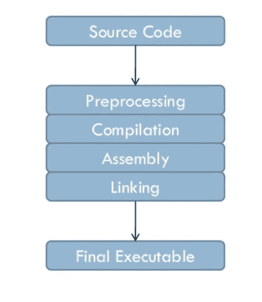
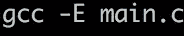
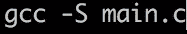

# 用 gcc 编译 C 文件

> 原文：<https://blog.devgenius.io/compiling-c-files-with-gcc-62f3849c524a?source=collection_archive---------0----------------------->



在这篇文章中，我将解释什么是 C 语言，以及在达到 C 语言的每一步中会发生什么，这就是编译。

# **编程语言 C**

c 是一种通用编程语言，它提供了语法经济性、流控制和简单的结构以及一组很好的操作符。它不是一种非常高级的语言，而是一种小而简单的语言，不专门用于任何类型的应用。这使它成为一种强大的语言，有无限的应用领域，最重要的是，你学得很快。在很短的时间内，一个程序员可以使用整个语言。

与解释语言相反，C 也是一种编译语言，这意味着用 C 编写的源文件应该被编译才能执行。

# 咱们**的明星**

我们需要一个类似 Unix 的操作系统，还可以访问 [*外壳*](https://es.wikipedia.org/wiki/Shell_(inform%C3%A1tica)) ，
，为此，我们使用一个终端，或终端仿真器，它只是一个窗口，允许我们与外壳进行交互。在终端内部，我们应该看到 shell 提示符，它包含您的用户名和机器名，后面是 PS1 环境变量，通常是“$”字符。
最后，我们需要一个文本编辑器，比如 vi 或 emacs，来创建一个源文件。


# 汇编

编译是将一种语言的代码转换成另一种语言，在执行之前的一个步骤。通常，当我们想到编译时，我们谈论的是它最实际的版本，它给我们一个可执行的二进制文件作为输出。

gcc 编译过程有四个不同的步骤:

*   预处理
*   编译
*   组装
*   链接

在我们的编辑器 vi 中，我们创建了一个所谓的 main.c，它包含以下内容:

```
#include <stdio.h>

/**
 * main - Entry point
 *
 * Return: Always 0 (Success)
 */
int main(void)
{
    puts("Hello, World");
    return (0);
}
```

为了使我们的 main.c 代码可执行，我们需要输入命令“gcc main.c ”,编译过程将经历它包含的所有四个步骤。当然 gcc 有选项允许我们在每一步之后停止编译过程。让我们来看看它们。

## 1.**预处理器**

在这个阶段，指令被解释给预处理器。其中，用#define 初始化的变量在代码中所有出现它们名字的地方都被替换为它们的值。

这一步的输出将存储在一个带有“.”的文件中。I "扩展名，所以这里将它放在 main.i.
中，为此我们使用以下命令:



## 2.编译器

编译将 C 代码转换成我们机器处理器的汇编语言。在这一步之后，我们可以在 gcc 命令中使用“-S”选项，然后按 enter 键。



## 3.装配工

汇编将汇编语言编写的程序转换成目标代码，目标代码是处理器可执行的机器语言的二进制文件。这将生成一个以“.”结尾的文件。o”。

在这一步之后，我们可以通过在 gcc 命令中使用选项"-c "并按 enter 键来停止编译过程。


## 4.链接器

我们的代码中包含的 C / C ++函数，比如示例中的 printf()，已经在系统中的现有库中编译和汇编了。有必要以某种方式将这些函数的二进制代码合并到我们的可执行文件中。这是链接阶段，目标代码中的一个或多个模块与库中的现有代码相遇。

默认情况下，在第四步也是最后一步之后，也就是当您键入完整的“gcc main.c”命令而没有任何选项时，编译器将创建一个名为 a.out 的可执行程序，我们可以通过键入。/a .out"。

我们也可以选择用我们想要的名字来创建一个可执行程序，方法是在 gcc 命令中添加"-o "选项，将*放在我们正在编译的一个或多个文件的名称*之后，然后按 enter 键:


# 一步到位。

在只有一个源文件的程序中，上述过程可以一步完成:

$ gcc -o main main.c

未创建 main.o 文件；中间目标代码在操作员看不见的情况下被创建和销毁，但可执行程序出现在那里并工作。