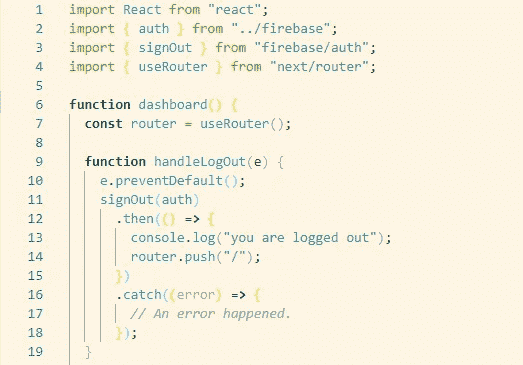

# 使用 firebase-9 和 next.js 完成电子邮件/密码认证

> 原文：<https://blog.devgenius.io/complete-email-password-authentication-with-firebase-9-and-nextjs-518392a3a530?source=collection_archive---------2----------------------->

在本文结束时，让我们看看我们将会构建什么。

**在我们继续之前，请确保您对以下内容有足够的了解。**

1.  Next.js (react knowledge 就行)。如果没有，请点击这里的[开始阅读文档。](https://nextjs.org/docs/getting-started)
2.  Firebase(第 9 版)但如果你知道后续版本，你会轻松通过第 9 版。如果没有，也在处检查文档
3.  确保在您的计算机中安装了最少的节点。下载节点[这里](https://nodejs.org/en/download/)
4.  顺风 CSS。但是你可以选择使用你选择的任何其他 UI 库。点击查看文档

你可以在这里克隆回购[。或者你完全可以开始一个新的项目，这是你的选择。闲聊够了，现在让我们进入正题。](https://github.com/SADIQQ005/firebase-9-auth)

第一步是创建一个 next.js 项目。通过命令行使用命令 npx create-next-app <your app="" name="">。在我的例子中，npx create-next-app auth-9。这是为那些选择不克隆我的应用程序。</your>

等待它完成安装，安装完成后可能需要一些时间。通过运行 cd <your app="" name="">进入项目目录，在我的例子中是 cd auth-9。然后用你最喜欢的文本编辑器打开它。如果你像我一样喜欢 Vs 代码，你可以简单地运行代码。直接从终端用 Vs 代码打开项目。没那么容易。</your>

如果你在你的文本编辑器上看到这个，你就在轨道上，不要介意你看到的 netlify 文件夹。否则，你一定跳过了一些东西，如果是这样，不用担心，原路返回。我相信你会回到正轨的。既然我们的第一步已经完成。

第二步是安装 firebase 并在我们的项目中使用它。

1.  通过运行 npm install firebase 安装 firebase，等待它完成，或者不要等待，转到 [firebase 控制台](https://console.firebase.google.com/)并设置您的应用程序。让你有一个电子邮件，如果你以前没有使用过 firebase，否则只需点击控制台上的添加项目按钮。
2.  选择您的项目名称，然后点按“继续”。
3.  一旦你的项目准备好了，你会看到一个仪表板。点击网络图标。
4.  注册您的应用程序。然后点击继续。
5.  复制 sdk 并关闭页面，我们到此为止。
6.  现在，单击菜单栏上的“身份验证”,然后单击“开始”。点击电子邮件/密码按钮启用它，并点击保存。我们现在已经完成了 firebase 控制台。我们可以回到 Vs 代码或者你最喜欢的编辑器，记住我们的 firebase 安装已经完成。

消防基地控制台

Firebase sdk

电子邮件/密码验证已启用

现在 firebase 已经安装在我们的项目中。我们需要将应用程序连接到 firebase sdk。这很容易做到。

1.  在项目的根目录下创建一个 firebase 文件。
2.  记住我们从 firebase 复制的 sdk，现在粘贴到这里。有了新版本的 firebase(版本 9)。他们引入了他们所谓的树摇动方法，该方法允许每个 firebase 方法作为一个函数单独导入。我认为这很酷。下面你会注意到我从 firebase/auth 导入了 getAuth，并将其导出为 const。有了它，你可以把它导入到任何你想使用它的文件中，而不是在我们想使用它的每个组件中一次又一次地导入它。
3.  现在 firebase 已经在我们的项目中设置好了，所以我们可以开始动手了。

让我们从安装顺风开始。

1.  运行上面的以下命令
2.  打开刚刚创建的 tailwind.config.js 文件，用下面的代码编辑内容。
3.  打开 styles 文件夹中的 globals.css 文件，删除所有内容，然后粘贴下面的代码。
4.  运行 npm run dev 以在 [localhost:3000](http://localhost:3000/) 启动您的开发服务器。

tailwind.config.js

全局变量. css

打开 index.js，用下面的代码编辑它。

索引. js

1.  现在让我们复制输入 div 来获得我们的密码字段。如果你这样做，你只需要编辑标签说密码，也改变类型为密码。您也可以将占位符改为密码而不是电子邮件。
2.  将一个 on Change 处理程序附加到输入，并使用 react hook 来处理更改，如下所示。不要忘记把它也添加到密码输入中。
3.  在表单标签上添加一个提交处理程序，这样当提交按钮被点击时，它可以执行登录用户的功能。
4.  但是您需要在密码字段之后创建一个 submit 类型的输入字段。

index.js 使用 react 使用状态来绑定输入

index.js/login

现在创建一个为您处理登录(handleLogin)的函数，它将接受一个事件。如下图所示。

index.js/login

记住树摇动，你将必须像这样从 firebase/auth 导入 signInWithEmailAndPassword。我们还在 firebase.js 中将 auth 导出为一个 const，将它导入以便作为一个参数传递给 signInWithEmailAndPassword 方法，否则它将不起作用。

index.js/login

如果你还没有运行 npm run dev 或 yarn dev，现在就运行它，并在 localhost:3000 上检查你的应用程序。它应该看起来像下面的图像。如果你追随我愚蠢的风格。键入电子邮件和密码，然后点击登录，它应该会抛出一个用户没有发现的错误😫如果你检查你的控制台。这是正确的，因为我们试图登录时，我们从来没有创建一个用户🤔。要解决这个问题，请返回 firebase 控制台，单击 authentication 选项卡并添加一个用户。输入凭证并添加。如果这样做了，回到你的应用程序，并尝试使用相同的凭证登录，它应该工作。

索引/登录页面

注册. js

现在 login.js 已经完成，创建一个名为 signup.js 的新文件。复制 login.js 并粘贴到那里，您只需要更改一些内容。

1.  就像文本所说的登录页面，把它改成注册页面。
2.  让输入保持原样，您只需要将函数名改为 handleSignup，而不是 handleLogin，并且不要忘记在提交处理程序中进行更改。
3.  还要将方法 signUpWithEmailAndPassword 更改为 createUserWithEmailAndPassword。不要忘记导入它，就像我们导入 signInWithEmailAndPassword 一样。将 auth const 从 firebase.js 导入到。
4.  你可以尝试在你的应用程序上注册，看看是否有效。

让我们的应用程序的工作显而易见。让我们创建一个仪表板页面，它不会做太多，但至少我们会知道用户何时登录。用户也可以注销。

dashboard.js

dashboard.js

对于像我这样经常忘记密码的人来说😬。不要担心 firebase 让我们覆盖了密码重置，您可以随时重置您的密码时，试图登录。

现在让我们创建一个 passwordReset.js 文件，您可以选择对登录页面使用相同的样式。如果是这样，只需将您的 login.js 复制到 resetPassword，并将上面的登录文本更改为 reset password，同时将函数名更改为 handleReset。不要忘记将其传递给提交处理程序，删除密码字段，因为我们不会使用它。如果这样做了，改变方法 signInWithEmailAndPassword 为 sendPasswordResetEmail，不要传递密码的方法，我们只需要在这里的电子邮件。还要从 firebase.js 导入 auth const，以便将其传递给 sendPasswordResetEmail。

resetPassword.js

resetPassword.js

现在，您可以测试您的应用程序，看看它是否正常工作。注册，注销，再次登录，注销，并尝试重置您的密码。将向电子邮件发送一个链接以重置密码，之后您可以使用新密码登录。

本教程是为了解 next.js 和 firebase 的人量身定制的。我省略了一些部分来缩短文章，但最终这并不妨碍教程的主要目的。您可以在自己的产品中添加更多功能。比如错误处理等等。

请跟我来，感谢阅读。