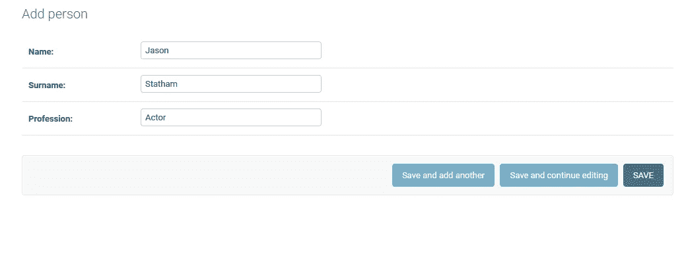
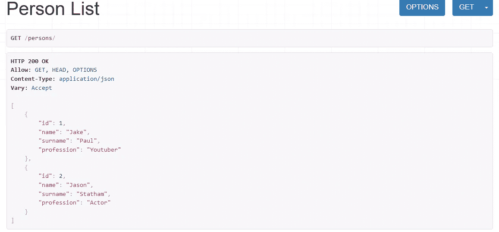
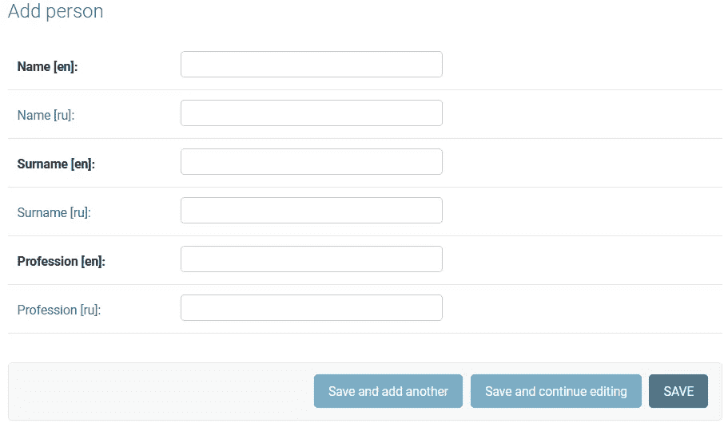
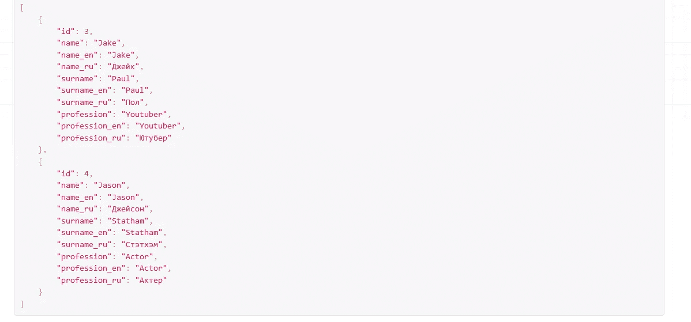
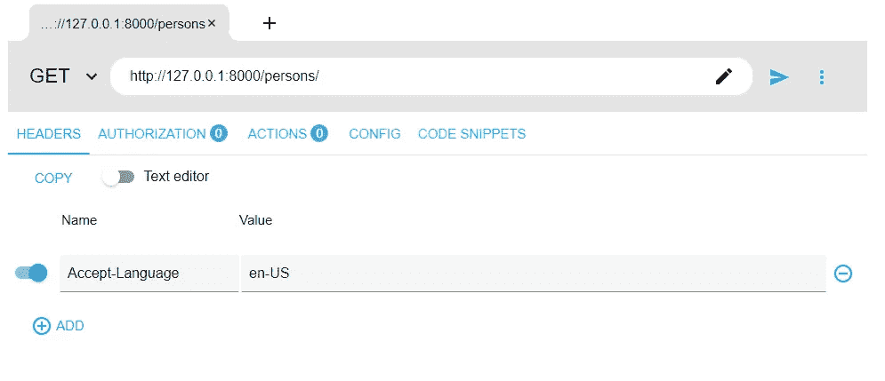
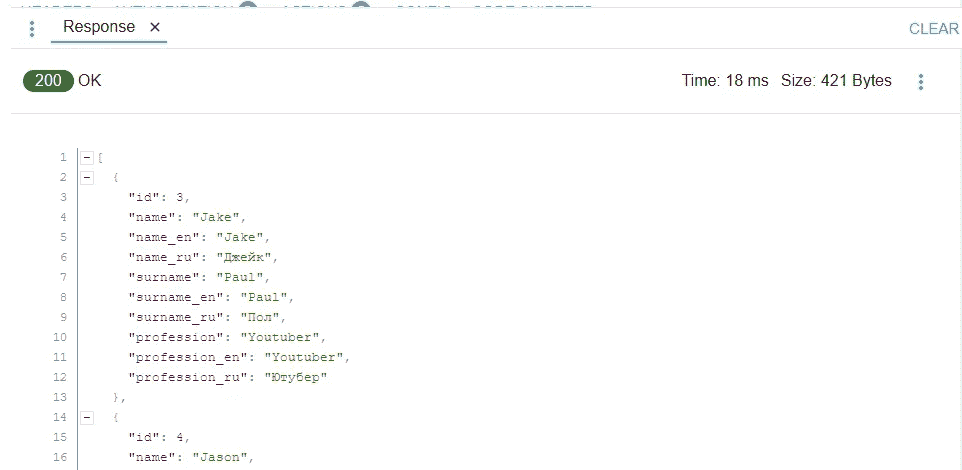
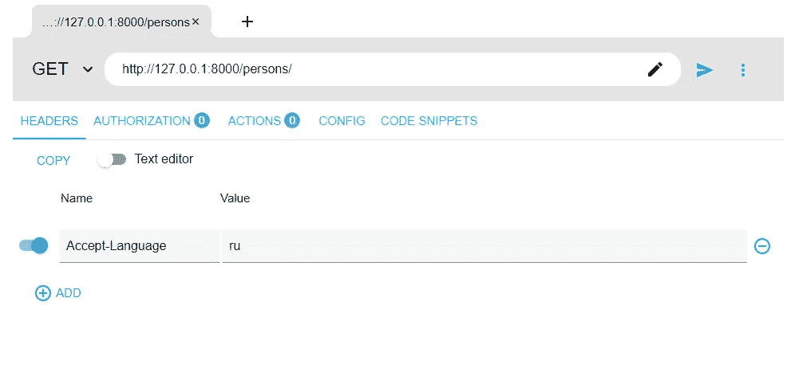
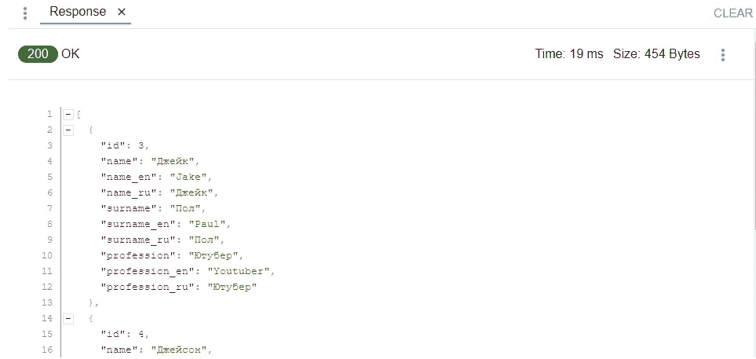

# Django 模型字段翻译完全指南

> 原文：<https://blog.devgenius.io/complete-guide-to-translation-django-model-fields-ed926a463689?source=collection_archive---------1----------------------->

## 如何使 Django 中的模型字段可翻译


拥有多语言内容是现代网站的主要特征之一。在本文中，我们将看到如何使 Django 模型字段可翻译。

我们将使用*django-model translation*包。你可以在这里了解更多。

# 模型

假设我们有一个人模型，它有三个字段:姓名和职业。

在`admin.py`文件中注册模型后，我们可以通过管理面板添加人物对象。我们将有一个简单的视图、序列化器和 url 来查看 django rest 框架中作为 json 响应的数据。为了简单起见，我不会展示如何创建所有这些东西，因为主要重点是使字段可翻译。



在管理界面中添加人员对象

我们可以从图片中看到，我们只能添加一种语言(英语或任何其他语言)的领域。

让我们将数据视为 json 响应:



# 设置

现在让我们安装上面提到的软件包:

```
$ pip install django-modeltranslation
```

安装成功后，我们需要将`modeltranslation`添加到项目 settings.py 中的`INSTALLED_APPS`中。

在设置文件中，我们必须设置`USE_I18N = True`

那我们应该设定`LANGUAGES`

```
gettext = lambda s: s
LANGUAGES = (
    ('en', gettext('English')),
    ('ru', gettext('Russian')),
)
```

现在，我们应该在存储`models.py`文件的应用程序中创建`translation.py`。在这个文件中，我们应该为有问题的型号注册`TranslationOptions`。

translation.py

`fields`包含我们希望可翻译的字段名。

我们应该运行迁移，并将它们迁移到数据库:

```
$ python manage.py makemigrations
$ python manage.py migrate
```

然而，如果我们想在管理面板中添加一个新的 Person 对象，我们会看到每个字段仍然有一个框，这意味着我们只能添加一种语言的值。

这就是为什么我们要改变`admin.py`。`PersonAmin`类必须从`modeltranslation.admin`继承`TranslatioAdmin`。`PersonAdmin`类将不包含任何内容，因为我们在此阶段不自定义管理界面。

管理. py

当试图添加新的人或改变现有的人时，可以在管理面板中看到新的字段:



管理中的新字段

让我们用新字段再次添加两个对象，并检查 json 响应:



我们可以看到添加了两个字段，例如`name_ru` 和`name_en`。如果我们试图获取对象的名称，我们将使用`object.name`，它会用默认语言给出值。默认情况下，默认语言是由`LANGUAGE_CODE`在`settings.py`中指定的语言。

# 处理请求标题中的默认语言

因为我们在项目设置中指定了默认语言，所以对于所有请求中的所有用户，我们会得到与设置文件中指定的语言相同的响应。你会同意，这不是我们想要的，因为我们希望每个用户都以特定的语言得到响应。处理它的方法之一是在请求头中发送语言。我们将在请求中发送`Accept-Language`报头。让我们更改视图，从请求头中获取语言并激活它，这样我们就可以获得该语言的默认值。

views.py

我们添加了`get_queryset` 函数，在这个函数中，我们将从请求头中获取语言，并使用`django.utils`中的`translation.activate`激活它

首先，应该检查请求头中是否存在`HTTP_ACCEPT_LANGUAGE`(if 语句)。如果它确实存在，我们从包含请求的元数据(比如头)的字典中获取它的值。之后，我们使用`translation.activate`激活该语言进行响应。

为了测试，我将使用[高级 Rest 客户端](https://install.advancedrestclient.com/install)，但是你可以使用任何你想要的其他客户端，比如 [Postman](https://www.postman.com/) 。

我们在 ARC 中添加一个头，在 Name 部分选择`Accept-Language`，在 Value 部分选择`en-US` (英语)或`ru` (俄语)。

我们先选择`en-US`看看响应数据:



现在让我们选择`ru`并查看默认字段是否为俄语:



可以清楚地看到，默认字段包含我们在请求头中指定的语言的值。

## 附加说明

我们可以在用户模型中有一个特殊的默认语言字段，因此如果用户登录，我们可以直接从用户表中获取语言，而不是从请求头中获取。这有助于不同设备中的相同用户使用相同的语言。

## 参考

[https://django-model translation . readthedocs . io/en/latest/index . html](https://django-modeltranslation.readthedocs.io/en/latest/index.html)