# 使用 Laravel Fortify 和 Bootstrap 4 完成 Laravel 8 认证—第 1 部分

> 原文：<https://blog.devgenius.io/complete-laravel-8-authentication-using-laravel-fortify-and-bootstrap-4-part-1-87234225979d?source=collection_archive---------20----------------------->

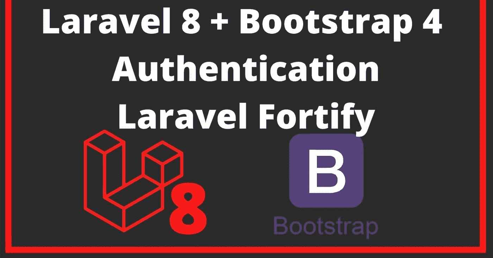

加强认证

Laravel 8 推荐使用 Jetstream，它使用 tailwindcss 作为其前端的 livewire 或 inertia.js。新版本仍然提供以前版本的 Laravel UI，但建议用户迁移到推荐的身份验证功能，如 Jetstream、Breeze 或 Fortify，因为它可能会在后续版本中被删除。

不懂 tailwindcss 和 javascript 的人怎么样。在本文中，我们将研究使用 Laravel Fortify 构建一个完整的身份验证系统，该系统使用 bootstrap 4 作为用户界面，具有双向因素。

如果你打算研究 Jetstream 或 Breeze，你可以看看 laravel 8 的指南文档。对于熟悉 Javascript 和 tailwindcss 的人来说非常简单。

[拉勒韦尔设防](https://laravel.com/docs/8.x/fortify)

Laravel Fortify 是 Laravel 的前端不可知认证后端实现。Fortify 注册了实现 Laravel 的所有身份验证功能所需的路由和控制器，包括登录、注册、密码重置、电子邮件验证等。

Laravel Fortify 基本上采用了 Laravel Breeze 的路线和控制器，并将其作为一个不包括用户界面的软件包提供。这使得您仍然可以快速地搭建应用程序身份验证层的后端实现，而不受限于任何特定的前端观点。

由于我们已经选择安装 Fortify，我们的用户界面将请求 Fortify 的身份验证路由。对于 Fortify 中提供的身份验证功能的不同部分，前端的选择是 bootstrap 4。

让我们从一个**新鲜的 laravel 应用安装**开始

如果您安装了 laravel

```
laravel new laravel8_fortify_with_bootstrap 
```

**或**

```
composer create-project laravel/laravel laravel8_fortify_with_bootstrap
```

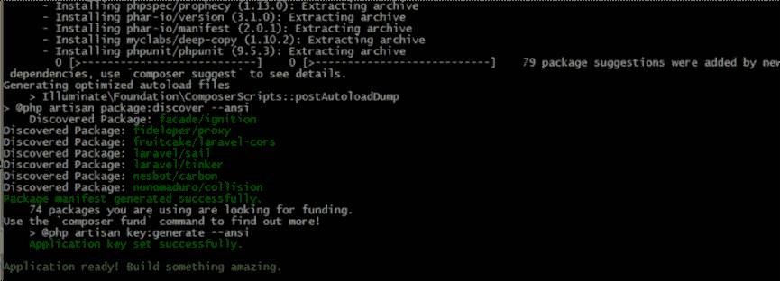

成功安装**后，将目录**更改为 laravel 8 _ fortify _ with _ bootstrap

```
cd laravel8_fortify_with_bootstrap 
```

**安装设防**

```
composer require laravel/fortify 
```

**接下来，使用 vendor:publish 命令发布 Fortify 的资源:**

```
php artisan vendor:publish --provider="Laravel\Fortify\FortifyServiceProvider" 
```

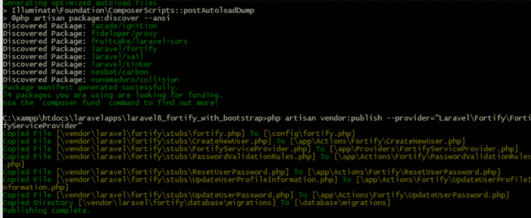

**这是发布的服务提供商。我们将设置代码来显示这个文件的视图**

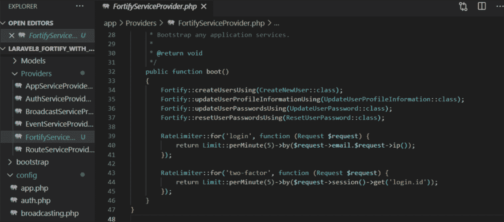

在应用程序配置文件的提供程序数组中注册该文件

```
App\Providers\FortifyServiceProvider::class,
```

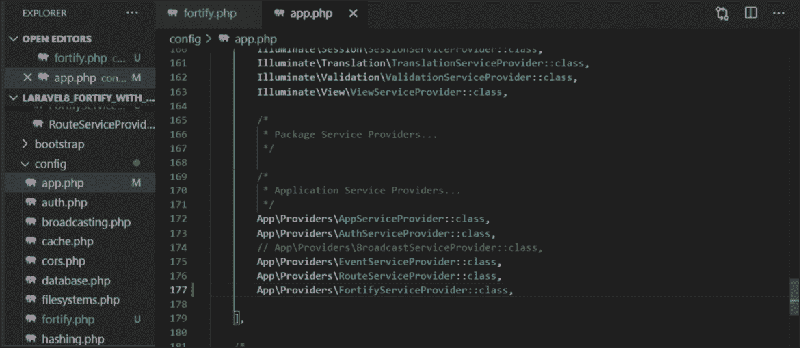

这是创建的操作文件夹，我们可以在其中自定义身份验证逻辑

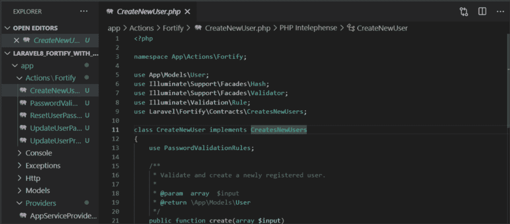

Fortify 有 6 个特性。您可以注释任何方法来禁用该功能。对于本文的第一部分，我们将评论其他 5 个，并只使用注册方法。

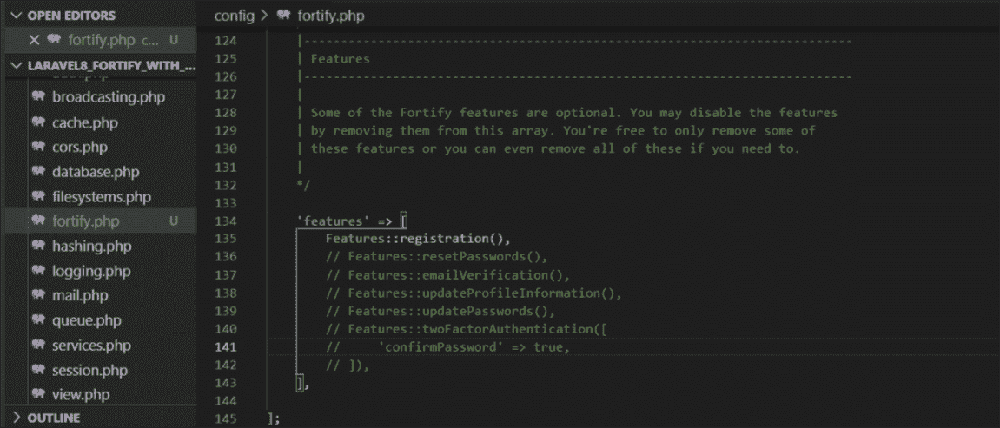

在您最喜欢的编辑器中打开项目，然后进入**。env** 文件为您的机器设置数据库连接细节

```
DB_CONNECTION=mysql 
DB_HOST=127.0.0.1 
DB_PORT=3306 
DB_DATABASE=laravel8_fortify_with_bootstrap 
DB_USERNAME=root 
DB_PASSWORD=
```

接下来，迁移您的数据库

```
php artisan migrate
```

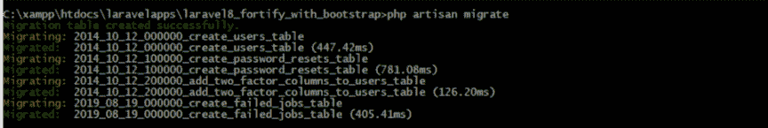

**在 resources/js/bootstrap.js 文件中安装 npm 和引导依赖关系** **导入包**

```
npm installnpm install --save bootstrap jquery popper.js cross-env
```

导入 resources/js/bootstrap.js 文件中的包

```
try {
    window.Popper = require('popper.js').default;
    window.$ = window.jQuery = require('jquery');require('bootstrap');
} catch (e) {
}
```

将资源文件夹中的 CSS 文件夹重命名为 sass

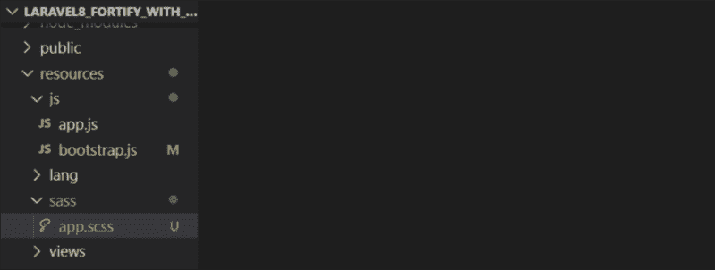

**导入 resources/sass/app.scss 文件中的包** **打开 webpack.mix.js 并更新**

```
// bootstrap
[@import](http://twitter.com/import) "~bootstrap/scss/bootstrap";
```

打开 webpack.mix.js 并更新它

```
mix.js('resources/js/app.js', 'public/js')
 .sass('resources/sass/app.scss', 'public/css');
```

接下来，编译安装的资产

```
npm run dev
```

> *请注意:如果出现此错误*

**错误。/node _ modules/bootstrap/dist/js/bootstrap . ESM . js 6:0–41 找不到模块:错误:无法解析**中的'[**@ popper js**](https://hashnode.com/@popperjs)**/core '**

运行下面的命令并重新编译

```
npm i @popperjs/core --save
```

在本文中，我们将停止添加 auth 视图和设置注册逻辑

**添加授权视图**

您可以从这个 repo[Laravel Fortify with Bootstrap 4](https://github.com/RaphAlemoh/laravel8_fortify_with_bootstrap)获得示例 auth 视图，或者根据需要在每个文件中使用您的 Bootstrap 自定义片段。

在根资源/视图文件夹中创建 **auth 文件夹**layouts 文件夹 home.blade.php

分别在文件夹中创建以下文件

> ***资源/视图/布局/app.blade.php***
> 
> ***资源/视图/auth/login.blade.php***
> 
> ***资源/视图/授权/注册. blade.php***
> 
> ***resources/views/home . blade . PHP***

**添加以下方法来加强提供者文件**

> *app/Providers/FortifyServiceProvider*

```
Fortify::loginView(function () {
            return view('auth.login');
        });Fortify::registerView(function () {
            return view('auth.register');
        });
```

我们只是告诉 fortify 使用这些引导方法渲染我们设置的视图

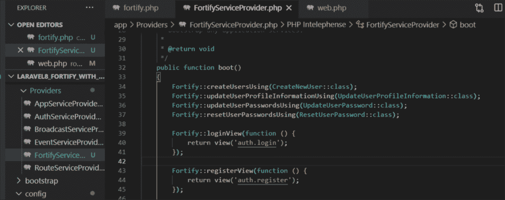

我们需要在成功注册或登录 Open > routes/web.php 后设置重定向的主视图

```
Route::middleware(['auth'])->group(function () {
    Route::view('home', 'home')->name('home');
});
```

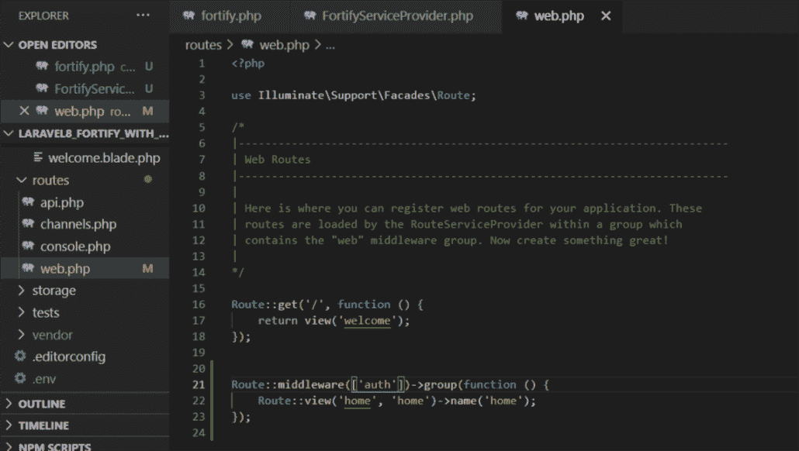

**接下来，上 app**

```
php artisan serve
```

在浏览器上导航至以下路线

```
[http://127.0.0.1:8000/register](http://127.0.0.1:8000/register)
```

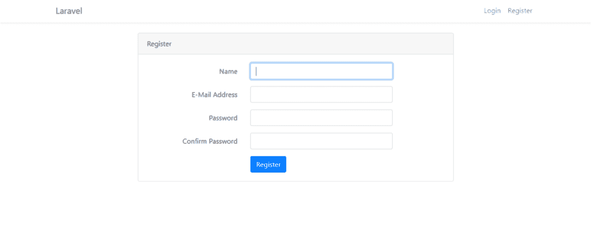

```
[http://127.0.0.1:8000/login](http://127.0.0.1:8000/login)
```

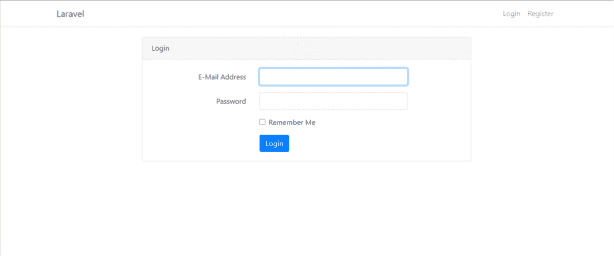

成功注册或登录后，这是最终视图

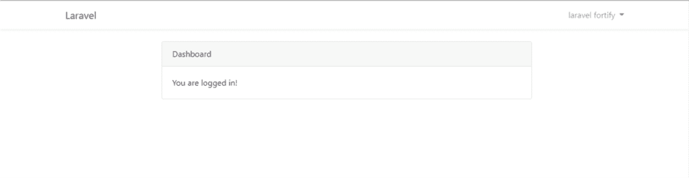

恭喜，我们已经使用 laravel fortify 和 bootstrap 4 设置了注册、登录和主页视图。

当第 2 部分发表后，我会在这里发布它的链接

如果您发现任何挑战，请友好地喜欢，分享和评论。

感谢您的阅读。

*原发布于*[*https://alemsbaja . hashnode . dev*](https://alemsbaja.hashnode.dev/complete-laravel-8-authentication-using-laravel-fortify-and-bootstrap-4-part-1)*。*