# 使用 Laravel Fortify 和 Bootstrap 4 完成 Laravel 8 认证—第 2 部分

> 原文：<https://blog.devgenius.io/complete-laravel-8-authentication-using-laravel-fortify-and-bootstrap-4-part-2-d62ce4ed7577?source=collection_archive---------17----------------------->

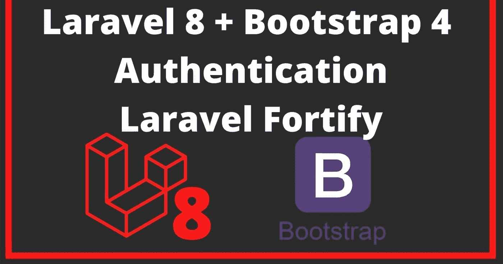

在本文的第 1 部分 中，我们使用 Laravel fortify 和 bootstrap 作为我们的前端框架，查看了注册和登录特性。

在本文的第 2 部分，我们将深入研究身份验证系统的其余特性。

**让我们开始吧！**

将目录更改为我们以前的项目，并为应用程序提供服务

**CD laravel 8 _ fortify _ with _ bootstrap****PHP artisan serve**

在你最喜欢的编辑器上打开代码库，进入 fortify.php 文件

让我们看看电子邮件验证功能..取消注释 fortify.php 文件中电子邮件验证方法的功能

**功能::emailVerification()，**

它会自动添加三个邮件验证路径(发送、通知和验证)

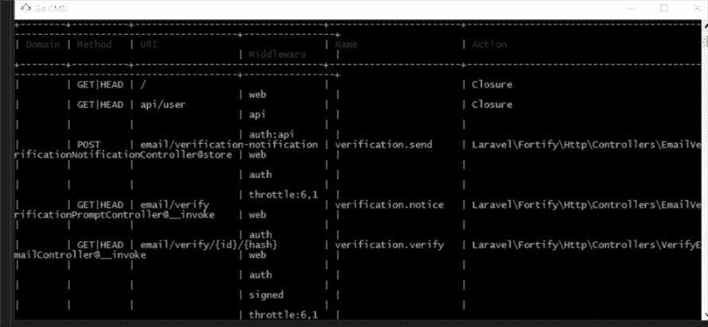

接下来转到 Models 文件夹下的 User.php 模型，通过实现 MustVerifyEmail 接口来修改它

```
implements MustVerifyEmail
```

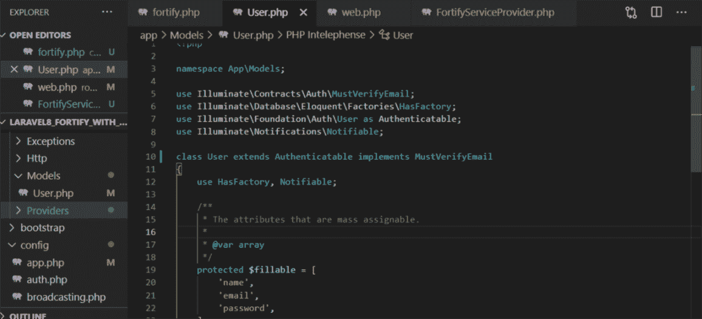

接下来，配置您的首选电子邮件驱动程序，将电子邮件验证链接发送到用户邮件。

出于测试目的，您可以在 [mailtrap.io](http://mailtrap.io) 上创建一个帐户，并在上配置邮件设置。环境文件

```
MAIL_DRIVER=smtp 
MAIL_HOST=smtp.mailtrap.io 
MAIL_PORT=2525 
MAIL_USERNAME= 
MAIL_PASSWORD= 
MAIL_ENCRYPTION=tls 
MAIL_FROM_ADDRESS="your@gmail.com" 
MAIL_FROM_NAME="${APP_NAME}" 
```

接下来，在 web.php 文件中指定在用户通过验证之前不可访问的路由

```
Route::middleware(['auth',  'verified'])->group(function () {
    Route::view('home', 'home')->name('home');
});
```

接下来，在 fortify 服务提供者内部，实例化在成功注册后返回验证视图的方法

```
Fortify::verifyEmailView(function () {
        return view('auth.verify'); 
   });
```

**接下来刷新浏览器。注册成为用户。检查 mailtrap 收件箱以查看用于验证电子邮件的邮件。**

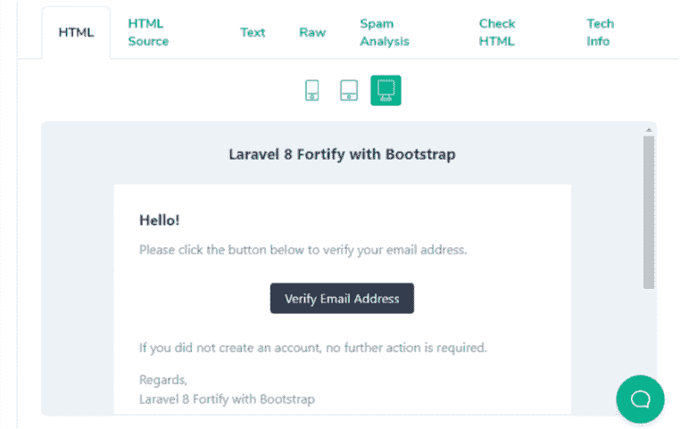

**全部工作！！**让我们继续重置密码功能

浏览器上的登录视图没有忘记密码链接，因为该功能已被禁用

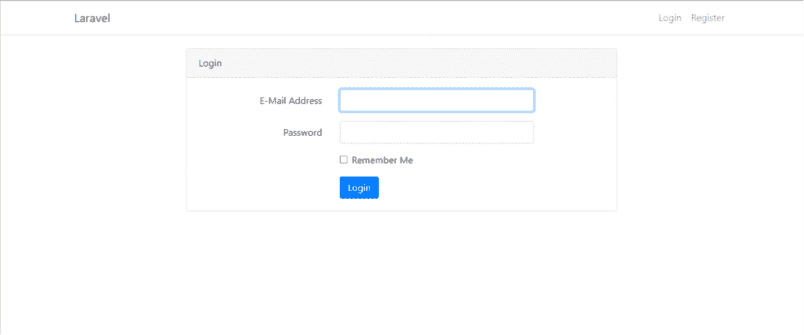

**取消 fortify.php 文件中重置密码特性**的注释

刷新您的浏览器，您将在视图中看到忘记密码链接

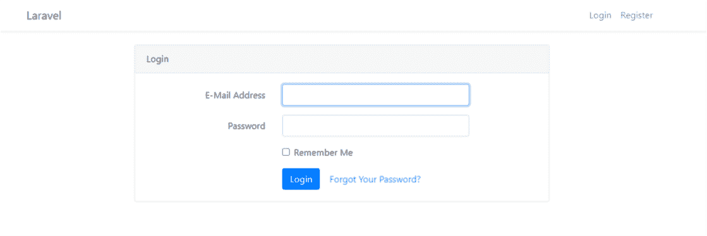

> *如果路由有 password.request 链接，显示重置密码的链接。*

接下来，让我们定义 FortifyServiceProvider.php 文件中的密码重置视图

```
Fortify::requestPasswordResetLinkView(function () {
        return view('auth.passwords.email');
   });
```

在 auth/passwords 文件夹中创建一个新的文件 email.blade.php。对**email.blade.php**文件的看法是在[上 **Github 回购**上](https://github.com/RaphAlemoh/laravel8_fortify_with_bootstrap)

进入浏览器，刷新并点击忘记密码链接

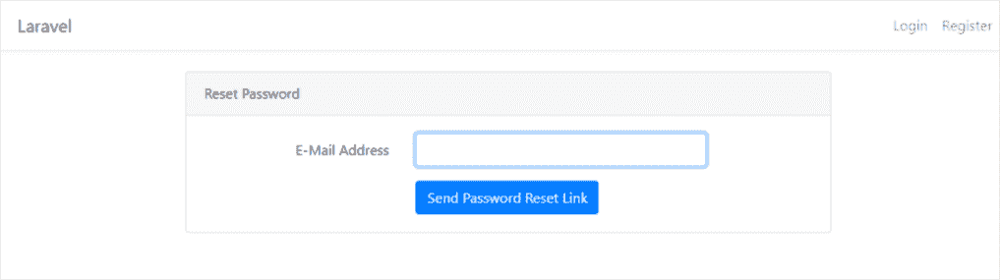

**输入电子邮件并点击发送密码重置链接。检查邮件陷阱收件箱，查看重置密码的邮件。**

接下来定义在邮件中单击重置链接时密码重置视图的方法

```
Fortify::resetPasswordView(function ($request) {
      return view('auth.passwords.reset', ['request' => $request]);
   });
```

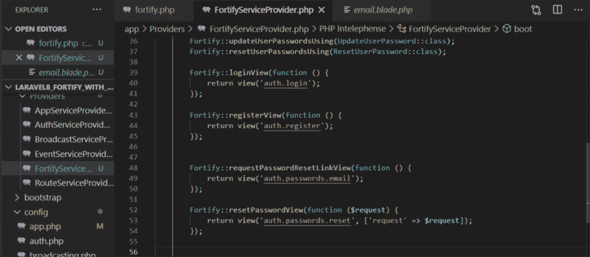

创建 reset.blade.php 文件，并使用 bootstrap 对所需的视图进行编码，但是如果您打算继续，请从 [Github Repo](https://github.com/RaphAlemoh/laravel8_fortify_with_bootstrap) 中获取视图

重置密码到此为止。出于定制的目的，您可以查看 laravel 文档。

让我们看看更新密码功能..取消对 fortify.php 上更新密码功能的注释

**功能::更新密码()，**

> *定义查看密码更新的路线*

```
Route::middleware(['auth',  'verified'])->group(function () {
    Route::view('home', 'home')->name('home');
    Route::view('password/update', 'auth.passwords.update')->name('passwords.update');
});
```

update.blade.php 视图在 [Github Repo](https://github.com/RaphAlemoh/laravel8_fortify_with_bootstrap) 上可用

转到您的浏览器并刷新。填写当前密码、所需的新密码并提交。

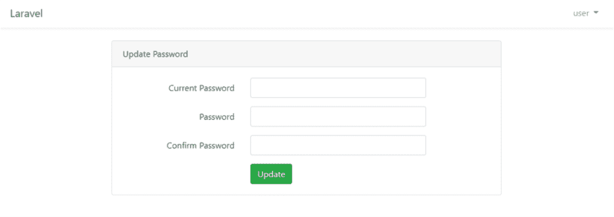

接下来是 2FA —双因素身份认证，这是我们将在本教程中实施的最后一项功能。

取消注释 fortify.php 文件中的 twoFactorAuthentication 方法

**特性::two factor authentic ation([' confirm password ' =>true，])，**

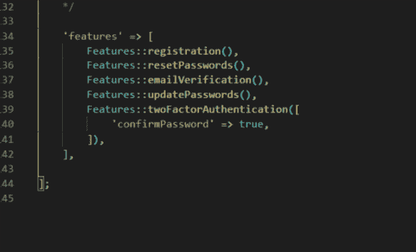

如果我们不希望用户在 2FA 期间输入他们的密码，我们可以将 confirmPassword 值设置为 false

```
Features::twoFactorAuthentication([ 'confirmPassword' => false, ]), 
```

接下来，为了实现 2FA，我们需要将特征添加到用户模型中

请注意:laravel 的一个优点是，您可以根据自己的需要决定修改我们的 code a 特性，而不必像框架所提供的那样做。它可以用于除用户模型之外的任何模型。重要的是在表中定义将要使用的字段。

打开用户模型文件以添加 2FA 特征

> *两个可认证的工厂*

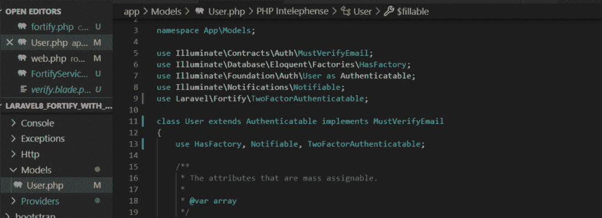

当我们取消 fortify.php 文件中 2FA 特性的注释时，已经定义了执行 2FA 时表单提交的路径。运行“管线列表 artisan”命令查看已定义的管线。

```
php artisan route:list
```

> *这是路由/用户/双因素认证，用于 2FA 确认 post 请求*

用户表有两列，称为双因素保密和双因素恢复代码，它们指定用户是否做了 2FA。

因此，我们将检查 2FA 是禁用还是启用，并创建一个表单来根据用户的需要切换 2FA 的状态。

我们将为 2FA 禁用/启用功能修改我们的 home.blade.php 视图文件，这可以在 [Github Repo](https://github.com/RaphAlemoh/laravel8_fortify_with_bootstrap) 上找到

```
<form method="post" action="/user/two-factor-authentication">
        [@csrf](http://twitter.com/csrf)
        [@if](http://twitter.com/if) (auth()->user()->two_factor_secret)
        [@method](http://twitter.com/method)('DELETE')
        <div class="pb-3">
        {!! auth()->user()->twoFactorQrCodeSvg() !!}                                
        </div>
        <button class="btn btn-danger">
        Disable
        </button>
        [@else](http://twitter.com/else)
        <button class="btn btn-success">
        Enable
        </button>
        [@endif](http://twitter.com/endif)
       </form>
```

下面是重新加载页面后用户仪表板的图像

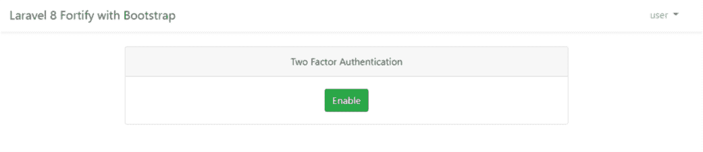

单击“enable”按钮后，它会询问用户密码。因为我们将“confirm password”设置为 true，所以我们需要定义“confirm password”的视图，以确保启用它的是帐户的所有者，方法是在 Fortify service provider 中实例化该方法，并在“views”文件夹中创建 confirm-password.blade.php 文件。

```
Fortify::confirmPasswordView(function () {
       return view('auth.password-confirm'); 
   });
```

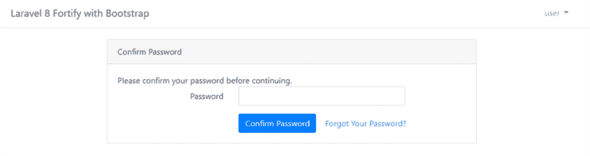

成功启用 2FA 后，它会返回并显示两个密码。

我们可以使用 **twoFactorQrCodeSvg()** 显示二维码，供用户使用 QR scanner app 扫描，并在登录时启用 2FA 进行后续认证后获取密码。

接下来，我们将检查 2FA 启用或禁用时来自服务提供商的会话消息，并通知用户

```
[@if](http://twitter.com/if) (session('status') == "two-factor-authentication-disabled")
       <div class="alert alert-danger" role="alert">
       Two factor authentication has been disabled
        </div>
        [@endif](http://twitter.com/endif)[@if](http://twitter.com/if) (session('status') == "two-factor-authentication-enabled")
        <div class="alert alert-success" role="alert">
        Two factor authentication has been enabled
        </div>
        [@endif](http://twitter.com/endif)
```

启用 2FA 后，它会显示下图

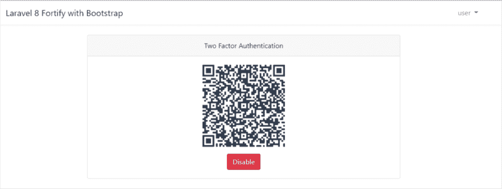

当我们注销并再次尝试登录时，它会要求 QR 扫描仪提供 2FA 密码

当启用了 2FA 的用户想要登录时，我们需要在服务提供者中定义方法来返回我们将创建的视图。

```
Fortify::twoFactorChallengeView(function () {
            return view('auth.two-factor-challenge'); 
        });
```

two-factor-challenge.blade.php 文件查看详见 [Github 回购](https://github.com/RaphAlemoh/laravel8_fortify_with_bootstrap)

因为我们使用的是密码，所以我们需要显示一个表单来验证用户，登录后在 two-factor-challenge.blade.php 中询问密码。

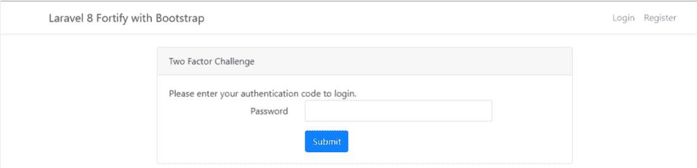

当用户输入密码并点击登录时，它会验证用户是否正确，或者将他们重定向到登录页面。

接下来，在我们没有扫描二维码的设备的情况下，让我们显示恢复码，供用户存储在安全的地方。

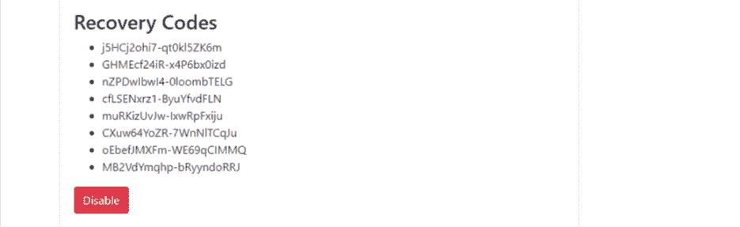

数据库中存储的双因子恢复码可以被解密，然后解码成数组供用户复制..

```
json_decode(decrypt(auth()->user()->two_factor_recovery_codes)
```

修改 home.blade.php 以显示恢复代码

```
<div class="mt-4">
<h3>Recovery Codes</h3>
<ul class="list-group mb-2">
    [@foreach](http://twitter.com/foreach) (json_decode(decrypt(auth()->user()->two_factor_recovery_codes)) as $code)
    <li class="list-group-item">{{ $code }}</li>
    [@endforeach](http://twitter.com/endforeach)
</ul>
</div>
```

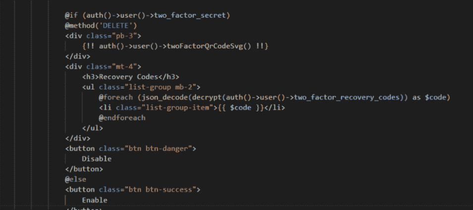

刷新浏览器并启用了 2FA

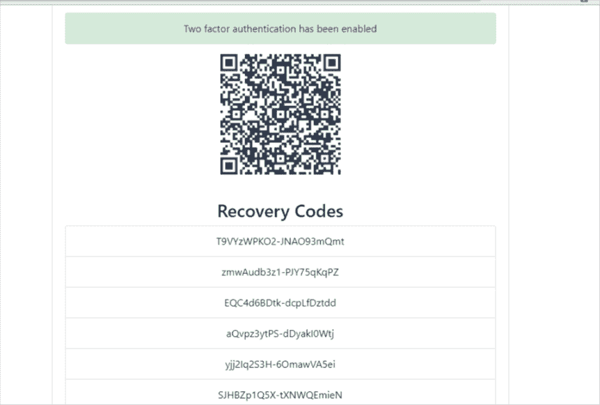

我们将修改 app.blade.php 文件，为自定义脚本和 home.blade.php 文件添加一个 yield 方法，以允许用户切换双因素代码来提交身份验证。

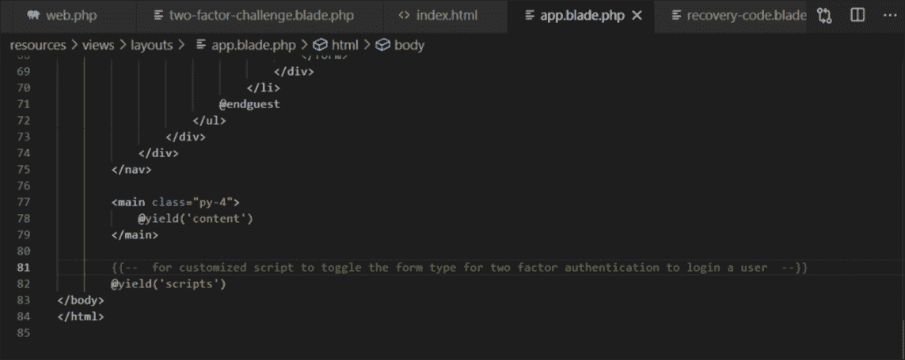

接下来编写脚本，根据用户请求隐藏或显示表单

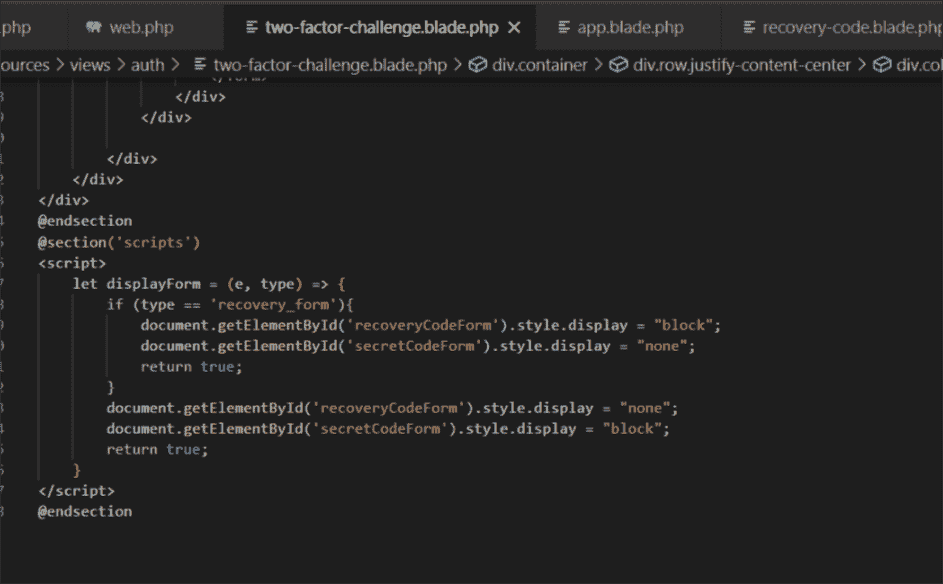

更新后的 home.blade.php 视图可在 [Github Repo](https://github.com/RaphAlemoh/laravel8_fortify_with_bootstrap) 上获得

**请注意，您不能使用两次密码或恢复码**

> *刷新浏览器选择首选的 2FA 认证选项并登录*

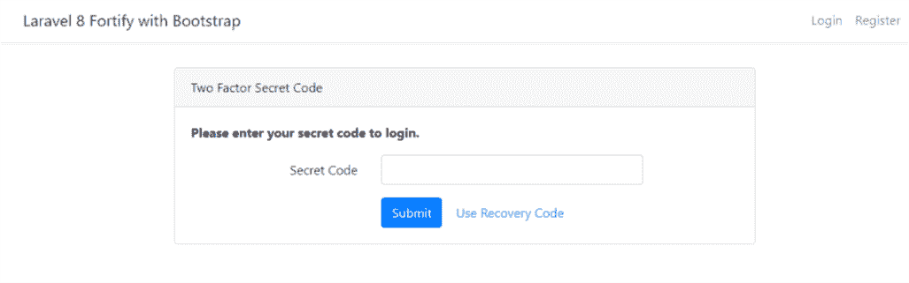

单击“使用恢复代码”以显示提交恢复代码的表格

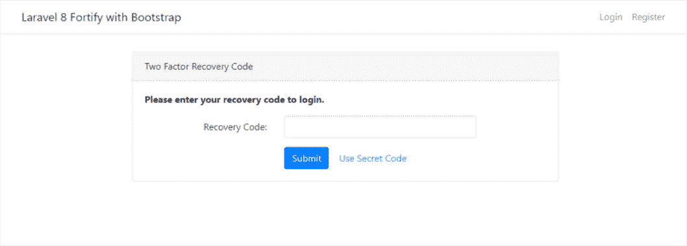

输入密码或恢复码，2FA 认证就完成了！！赞成

恭喜我们使用 Laravel Fortify 和 Bootstrap 4 完成了 Laravel 8 中的认证系统！！！

下面是 [**第 1 部分**](https://raphealenike.medium.com/complete-laravel-8-authentication-using-laravel-fortify-and-bootstrap-4-part-1-87234225979d) 的链接

感谢您阅读这篇文章。请随意在评论区提问、回答和投稿。

如果你喜欢这篇文章，请在 twitter 上关注我

*原发布于*[*https://alemsbaja . hashnode . dev*](https://alemsbaja.hashnode.dev/complete-laravel-8-authentication-using-laravel-fortify-and-bootstrap-4-part-2)*。*