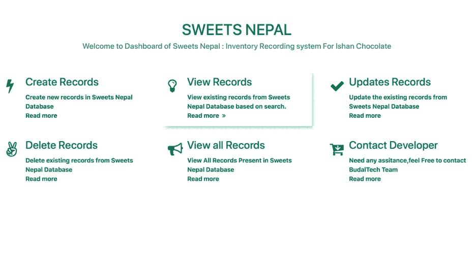
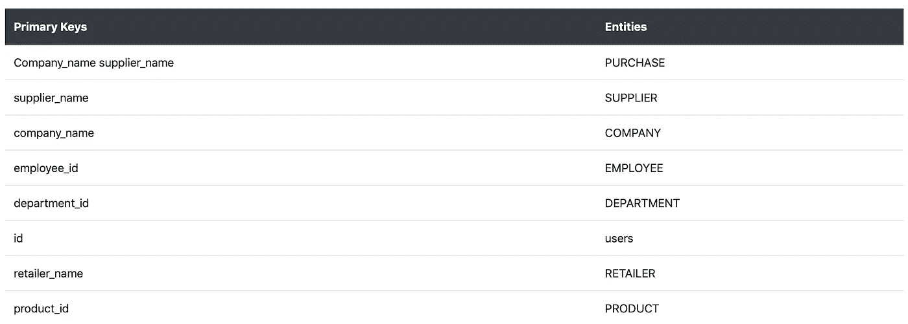
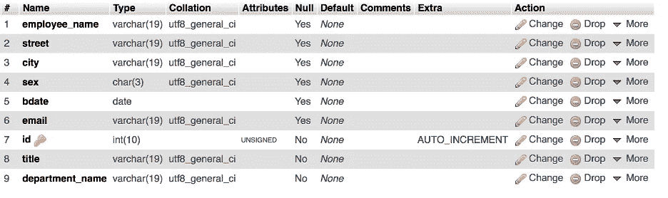
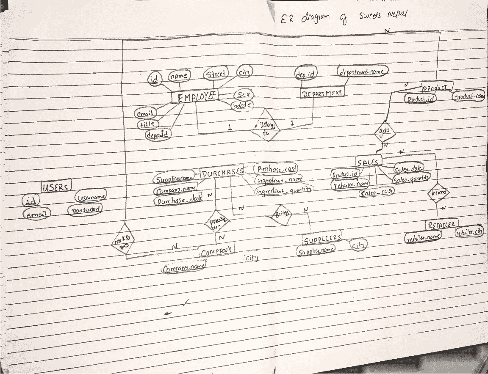
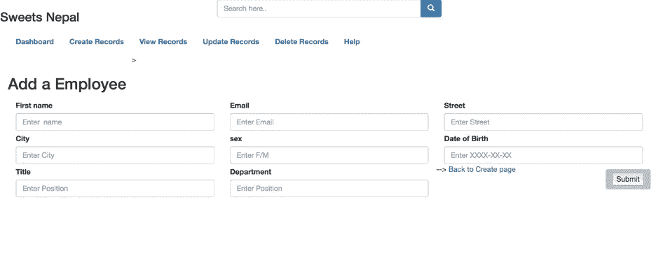
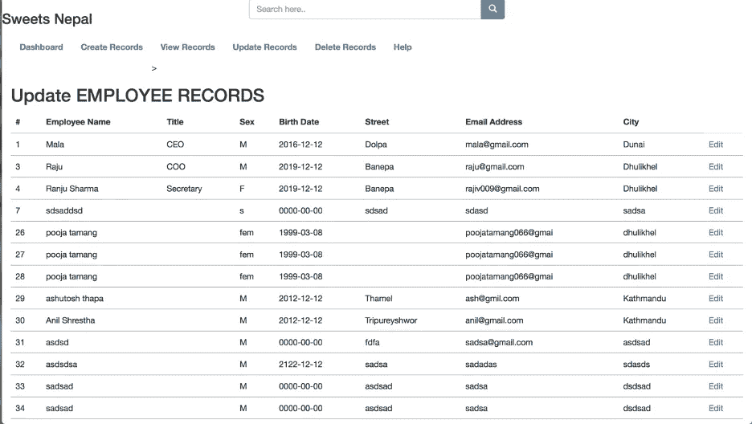

# 使用 MySQL 完成 CRUD 应用程序的迷你项目

> 原文：<https://blog.devgenius.io/complete-mini-project-on-crud-app-using-mysql-18bde01d24df?source=collection_archive---------3----------------------->

## 创建、读取、更新和删除糖果店库存



图片由作者提供。

数据库是任何技术的核心。在这里，你会发现如何开发 CRUD 数据库。MySQL 提供了一组基本但最重要的操作，这些操作将帮助您轻松地与 MySQL 数据库进行交互，这些操作称为 CRUD 操作。CRUD 是持久数据库应用程序的四个基本操作符的缩写:创建、读取、更新和删除。简单地说，术语 CRUD 概括了用户创建和管理数据所需的功能。

这里我们将为名为 Sweets Nepal 的巧克力制造厂开发 CRUD 数据库，使用 [MySQL](https://www.mysql.com/) 作为[结构查询语言](https://www.geeksforgeeks.org/sql-tutorial/)，以[关系数据库管理系统](https://www.geeksforgeeks.org/rdbms-architecture/) (RDBMS)的形式存储数据。

> 数据库是任何技术的核心。

## **需求场景**

Sweets Nepal 是一家生产糖果/巧克力的工厂，它试图构建一个库存管理器来处理与工厂的总体记录相关的数据，包括商品、员工、购买记录等等。It (Sweets Nepal inventory manager)基本上记录了糖果的成分、供应商的详细信息、员工的个人信息、他们的职位及其工资、参与制作糖果的各个部门、生产的产品名称以及零售商的信息。

为了制作糖果，从其他部门进口了几种配料，因此记录了配料的名称及其成本和数量。还记录了供应商及其各自的位置。

该经理还记录当前在工厂工作的员工的个人信息。每个雇员都有各自的工作部门，因此他们的工作部门也由经理记录在数据库中。

每种类型的糖果都根据它们在数据库中的价格进行分类。将会有许多零售商向其出口糖果，这些零售商也记录在管理器中，并显示其各自的城市。

## 使用的技术

*   后端: [MySQL](https://www.mysql.com/)
*   前端:[引导程序 3](https://getbootstrap.com/docs/3.3/)

## **数据要求**

## 实体

实体是任何必须以个体存在存在于现实世界中的东西。凭借这一理念，Sweets Nepal 拥有以下 9 个实体。

```
**Purchases**· company_name(PK FK1)· supplier_name(PK FK2)· purchase_date· purchase_cost· ingredient_name· ingredient_quantity **Supplier**· supplier_name(PK)· supplier_city **Company**· company_name(PK)· city**Employee**· employee_id(PK)· employee_name· street· city· sex· bdate**Department**· department_id(PK)· company_id(PK)**Retailer**· retailer_name(PK)· retailer_city**Products**· product_id(PK)· product_name**Users**·id(PK)· username· email· password**Sales**· product_id (PK)· retailer_name(FK)· sales_date· sales_quantity· sales_cost
```

## 参照完整性

引用完整性是关系数据库管理系统中的一个数据库特性。它通过应用约束来防止用户或应用程序输入不准确的数据，从而确保数据库中表之间的关系保持准确。

## **1。**候选键

候选键是表中满足所有行唯一性的单个列。基于候选关键字，我们选择在表中保持唯一性。

示例:

```
Create table EMPLOYEE ( 
Employee_id char (40) NOT NULL UNIQUE AUTO INCREMENT,
Employee_name varchar (20),
Street varchar (20),
City varchar (20),
Sex char (3),
bdate date ,
CONSTRAINT EMPLOYEE_employee_id_pk PRIMARY KEY (employee_id)
);
```

## **2。C** 复合**键**

候选关键字是员工 id，如果我们采用员工 id，员工姓名也是唯一的。例如， *employee_id，employee_name，bdate* 是关系 employee 的复合候选键

## **3。**主键

主键或 PK 是我们选择用来保持表中唯一性的列。在员工表中，我们可以选择 *employee_id* 作为主键。



表 1:显示每个实体的所有主键。图片由作者提供。

## 主键的特征

一个表中只能定义一个✔️。

不允许✔️空列。

✔️默认索引是聚集的。

## **4。F** 外来键

外键(FK)创建了与不同表的关系，参照完整性指的是这些表之间的关系。在一个表上创建的数据必须存在于被引用的表中。这是由 FK 保险的。

示例:

```
CONSTRAINT PURCHASE_company_name_fk FOREIGN KEY(company_name) REFERENCES COMPANY(company_name)
```

## 属国

数据库中的函数依赖在属性之间实施一组约束。当关系中的一个属性唯一地确定另一个属性时，就会出现这种情况。这可以写成 **A - > B** ，意思是“B 在功能上依赖于 A”，这也称为数据库依赖。

在 Sweets Nepal 表中，我们有如下函数依赖关系:



功能依赖。图片作者。

我们有一个 EMPLOYEE 表，其属性为 *employee_name，title，department_name，city，bdate，street，sex，email。*

在这里，员工决定了他工作的地点，因此存在一种依赖性:

`employee -> city`

但是该城市可能有多个经理，因此员工和部门共同决定经理:

`employee, department -> manager`

这是一种功能依赖性，它有助于确保数据完整性和减少数据冗余的数据库规范化。

## 索引

索引或数据库索引是一种数据结构，用于快速定位和访问数据库表中的数据。

```
ALTER TABLE PRODUCT ADD index product_id (product_id)
```

## **实体关系图**

实体关系图是一种用于数据库设计的结构图。ER 图包含符号、连接符，它们将两个重要的概念或信息可视化。

系统范围内的主要实体

这些实体之间相互关系。

**ER 图用例:**

*   在物理数据库设计中非常方便。
*   很容易进行数据库调试。
*   帮助收集需求和规格。

基于 ER 图符号，我们设计了 Sweets Nepal 的 ER 图。



尼泊尔糖果的 ER 图。图片由作者提供。

# 数据库脚本

```
CREATE TABLE COMPANY(
company_name varchar (19) NOT NULL,
city VARCHAR (19),
CONSTRAINT COMPANY_company_name_pk PRIMARY KEY(company_name)
);CREATE TABLE SUPPLIER(
supplier_name varchar(19) NOT NULL,
city varchar(19),
CONSTRAINT SUPPLIER_supplier_name_pk PRIMARY KEY(supplier_name)
);CREATE TABLE EMPLOYEE(
employee_id char(4) NOT NULL,
employee_name varchar(19),
street varchar(19)
city varchar(19),
sex char(3),
bdate date,
CONSTRAINT EMPLOYEE_employee_id_pk PRIMARY KEY(employee_id)
);CREATE TABLE PURCHASES(
supplier_name varchar(19) NOT NULL,
company_name varchar(19) NOT NULL,
purchase_date date,
purchase_cost decimal(10,2) uns
ingredient_name varchar(19),
ingredient_quantaty int unsigned ,
CONSTRAINT PURCHASES_company_name_fk FOREIGN KEY(company_name) REFERENCES COMPANY(company_name),
CONSTRAINT PURCHASES_supplier_name_fk FOREIGN KEY(supplier_name) REFERENCES SUPPLIER(supplier_name),
CONSTRAINT PURCHASES_company_name_pk PRIMARY KEY(company_name,supplier_name)
);CREATE TABLE DEPARTMENT(
department_id char(5) NOT NULL,
company_name varchar(19),
CONSTRAINT DEPARTMENT_department_id_pk PRIMARY KEY(department_id),CONSTRAINT DEPARTMENT_company_name_fk FOREIGN KEY(company_name) REFERENCES COMPANY(company_name)
); CREATE TABLE RETAILER(
retailer_name varchar(19) NOT NULL,
retailer_city varchar(19),
CONSTRAINT RETAILER_retailer_name_pk PRIMARY KEY(retailer_name)
);CREATE TABLE SALES(
product_id char(5) NOT NULL,
retailer_name varchar(19) NOT NULL,
sales_date date,
sales_quantity Numeric (4,0),
sales_cost decimal (13,4),
CONSTRAINT SALES_product_id_pk PRIMARY KEY(product_id,retailer_name),
CONSTRAINT SALES_product_id_fk FOREIGN KEY(product_id) REFERENCES PRODUCT(product_id),
CONSTRAINT SALES_retailer_name_fk FOREIGN KEY(retailer_name) REFERENCES RETAILER(retailer_name)
);
```

## **快速解释**

1.  create table 语句表明您希望创建一个表。
2.  表名以第一个'('开头
3.  表属性和数据完整性规则在两个括号中定义。该表与其他表的关系也在两个括号中定义(例如，通过定义外键)
4.  not null 语句意味着，如果您试图用值填充表，但将该属性的值留空，将会出现错误。
5.  varchar (19)表示由 19 个字符组成的字符串。
6.  数字(6，2)表示一个最多可有 6 位数字的数字，其中 2 位在小数点后，例如，您可以有一个从 0.0 到 1234.56 的数字。
7.  日期意味着该属性将在数据库系统中表示为日期。
8.  CONSTRAINT 语句意味着正在定义一个约束。该语句将用于描述哪些属性是主键，哪些属性(如果有)是外键(引用另一个表)。
9.  约束语句的形式为约束 xxx 主键(name _ of _ attribute _ that _ you _ want _ as _ the _ PRIMARY _ KEY)或约束 yyy 外键(name _ of _ attribute _ that _ REFERENCES _ another _ table)引用 hhh(name _ of _ attribute _ that _ REFERENCES _ another _ table)，其中 xxx 和 yyy 的值只是任意组成的名称，并不重要。hhh 是被引用的基表的名称。

基于这个脚本，对于后端的实现，我们使用 MySQL 和 php，前端使用 bootstrap 3 框架。


注册和登录页面截图。图片由作者提供。


仪表板的屏幕截图。图片由作者提供。



添加员工部分的屏幕截图。图片由作者提供。



更新记录部分的屏幕截图。图片由作者提供。

*如果你对这篇文章有任何疑问，或者想在你的下一个设计心理学或数据科学项目上合作，请在**[***LinkedIn***](https://www.linkedin.com/in/maladeep/)***上 ping 我。****

> **谢谢！* ***🙏****
> 
> **喜欢这篇文章吗？成为一个中等会员继续学习，没有限制。如果你使用* [下面的链接](https://medium.com/@maladeep.upadhaya/membership)、 ***，我会收取你一部分会员费，不需要你额外付费。****

*[](https://medium.com/@maladeep.upadhaya/membership) [## 通过我的推荐链接加入 Medium

### 作为一个媒体会员，你的会员费的一部分会给你阅读的作家，你可以完全接触到每一个故事…

medium.com](https://medium.com/@maladeep.upadhaya/membership)* 

## *这里有更多的文章，你可能会喜欢❤*

*[](https://medium.com/nightingale/how-to-apply-gestalt-psychology-principles-in-data-visualization-6242f4f1a3de) [## 如何在数据可视化中应用格式塔心理学原理

### 格式塔原则在头脑中，而不是在眼睛里

medium.com](https://medium.com/nightingale/how-to-apply-gestalt-psychology-principles-in-data-visualization-6242f4f1a3de) [](https://towardsdatascience.com/go-beyond-csv-data-ingestion-with-pandas-4c1a0dd4f2e2) [## 超越 CSV:熊猫的数据摄取

### CSV 中的数据不会总是出现在你面前

towardsdatascience.com](https://towardsdatascience.com/go-beyond-csv-data-ingestion-with-pandas-4c1a0dd4f2e2) [](https://towardsdatascience.com/surprisingly-effective-way-to-name-matching-in-python-1a67328e670e) [## 用 Python 命名匹配的惊人有效的方法

### 数据匹配、模糊匹配、重复数据删除

towardsdatascience.com](https://towardsdatascience.com/surprisingly-effective-way-to-name-matching-in-python-1a67328e670e) [](https://towardsdatascience.com/little-known-ways-to-make-your-data-visualization-awesome-890d71b6e365) [## 鲜为人知的方法，让你的数据可视化真棒

### 去除多余的部分

towardsdatascience.com](https://towardsdatascience.com/little-known-ways-to-make-your-data-visualization-awesome-890d71b6e365) [](https://towardsdatascience.com/knowing-these-5-hcis-principles-will-make-your-data-visualization-look-amazing-efbf22f05ab8) [## 了解这 5 个 HCI 原则会让你的数据可视化看起来很神奇

### 人机交互(HCI)研究中使用的原则

towardsdatascience.com](https://towardsdatascience.com/knowing-these-5-hcis-principles-will-make-your-data-visualization-look-amazing-efbf22f05ab8) [](/top-3-concepts-i-wish-i-knew-when-i-started-as-a-data-scientist-45004bd3dae1) [## 我希望在开始成为数据科学家时就知道的 3 大概念

### 你应该知道的基本数据科学概念

blog.devgenius.io](/top-3-concepts-i-wish-i-knew-when-i-started-as-a-data-scientist-45004bd3dae1)*