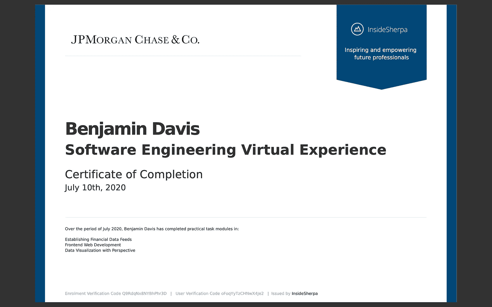

# 完成摩根大通软件工程虚拟体验

> 原文：<https://blog.devgenius.io/completing-the-jpmorgan-chase-software-engineering-virtual-experience-8e1875dfe98c?source=collection_archive---------2----------------------->

照片由[锤子&獠牙](https://unsplash.com/@hammerandtusk?utm_source=medium&utm_medium=referral)敲在[的挡泥板上](https://unsplash.com?utm_source=medium&utm_medium=referral)

# 了解“实习”机会

有一份面向熨斗学校毕业生的每周简讯，为求职提供建议和资源。新闻稿底部有一个机会信息页面的链接。

 [## 虚拟实习|摩根大通。

### 摩根大通的网站和/或移动条款、隐私和安全政策不适用于您将要……

careers.jpmorgan.com](https://careers.jpmorgan.com/us/en/students/campaign/virtual-internship?search=&tags=location__Americas__UnitedStatesofAmerica) 

它被宣传为虚拟的*实习*，但是他们的政策规定这个项目不能被列为工作经历。在简历中，它必须包含在“课外活动”、“证书”或“成就”中。LinkedIn 对该计划的引用必须在“许可证和认证”部分。该政策提供了在任何参考资料中必须使用的措辞，并且没有任何地方包含“实习”一词。它总是被称为“虚拟体验项目”。

虽然这可能不是它最初宣称的实习，但它作为一个证书是有价值的。这个项目不需要很长时间(不到一周)就能完成，而且你有一个合法的证书，证书上有你的名字，旁边还有一家像摩根大通这样的知名公司。

我的实际 pdf 证书截图

# 任务详细信息

就像我之前提到的，这个项目花了我不到一周的时间就完成了。有三个任务，其中第四个任务是可选的，但是当您完成第三个任务时，它们会自动发送数字证书。每项任务都附有关于任务目标和如何完成任务的详细说明。

对我来说，任务中最困难的部分是用完成每项任务所需的软件来设置我的本地环境。每项任务的部分详细说明包括设置说明。这些任务使用 python 和 nvm，所以我必须安装它们，并且遇到了一些问题。令人欣慰的是，安装说明包括故障排除幻灯片，涵盖了我遇到的大多数安装问题。

正确设置环境后，完成每项任务就像遵循指示一样简单。任务 1 要求您在 python 文件中编辑一些方法，以便客户机正确使用来自服务器的信息来制定某些数据。任务 2 涉及在客户端 React 应用程序中编辑一些文件。我们可以看到任务 2 中的进展，因为我们正致力于以特定的方式呈现带有特定信息的图形。任务 3 让我们在 React 应用程序中编辑两个文件，以更新图表，为使用该应用程序的金融交易员显示更多有用的信息。

每个任务都有自己具体的、写得很好的说明，包括截图，这样新手就可以完成每个任务。像历史上的每个编程项目一样，有一些不可预见的错误，但没有什么是一点谷歌搜索不能修复的。

# 外卖食品

这是一门独特的课程。在线软件工程课程数不胜数，但这是我见过的第一个为特定公司量身定制的开放式体验。每项任务都详细说明了该任务如何与摩根大通金融分析师协同工作。

它是免费的。我之前没有提到那件事。

不是一个大的时间承诺。他们说需要 5 个小时才能完成，这个估计对我来说很划算。对于完全是编程新手的人来说，这很可能需要更长的时间。

你带着你工作的成果离开。如果你正在寻找软件工程方面的工作，拥有有形的证书来展示你的能力总是好的。

如果你感兴趣，这是 InsideSherpa 提供的程序。

 [## 摩根大通软件工程虚拟体验

### 探索摩根大通，快速跟踪您的技术职业生涯。在 InsideSherpa 做虚拟实习。

www.insidesherpa.com](https://www.insidesherpa.com/virtual-internships/prototype/R5iK7HMxJGBgaSbvk/Technology%20Virtual%20Experience)