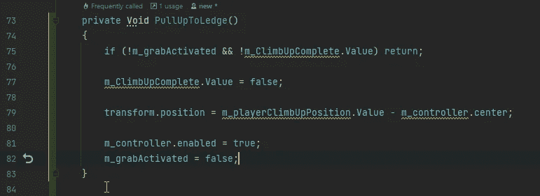

# 完成壁架抓取系统

> 原文：<https://blog.devgenius.io/completing-the-ledge-grabbing-system-9a4fef94be3b?source=collection_archive---------3----------------------->

## 使用[反向运动学](https://docs.unity3d.com/Manual/InverseKinematics.html)进行手部放置，并用[状态机行为](https://docs.unity3d.com/2021.1/Documentation/ScriptReference/StateMachineBehaviour.html)将玩家拉上平台。

反向运动学参见 Unity 手册

 [## 反向运动学

### 你如何在整个工作流程中使用文档？请参加本次调查，与我们分享您的体验。大多数…

docs.unity3d.com](https://docs.unity3d.com/Manual/InverseKinematics.html) 

状态机参见 Unity 手册

 [## 状态机行为

### 你如何在整个工作流程中使用文档？请参加本次调查，与我们分享您的体验。一种行为…

docs.unity3d.com](https://docs.unity3d.com/2021.1/Documentation/Manual/StateMachineBehaviours.html) 

# 固定手的位置

我需要做的第一件事是设置动画控制器来使用 IK。我必须将该层设置为 IK 过程。

现在，在玩家动画行为中，如果壁架抓取动画被触发，如果我将“使用 IK”设置为“真”,我会将“设置 IK 位置”设置为“真”。然后我检查设置的 IK 位置是否为真，如果为真，我将左手和右手的 [**位置权重**](https://docs.unity3d.com/ScriptReference/Animator.SetIKPositionWeight.html) 设置为 1。然后我使用 On [**Animatior IK**](https://docs.unity3d.com/ScriptReference/MonoBehaviour.OnAnimatorIK.html) 方法设置左右手的 IK 位置。

现在我设置了手的位置。

我得到一个警告，设置权重只能在 Animator IK 上完成，所以我移动了它。

现在移动和位置将会移动指针的位置。

# 代码清理和重构

我重构了我的一些代码，并设置了一些东西，使玩家能够爬上窗台。

## 玩家行为

最大的变化是玩家的行为，而不是禁用重力我禁用了角色控制器，这实际上给了我一个更好看的动画/玩家在抓壁架时的位置。我也把事情分成他们自己的方法。

## 玩家动画行为

在播放器动画中，我将代码从触发动画改为使用 Bool

## 壁架行为

最后一个变化是在壁架的行为，我现在只使用一个布尔。

## 固定球员的位置。

现在物理因素没有影响到球员，把他拉下来，球员的位置就有点偏了。为了解决这个问题，我将使用一个 Vector3 参考变量，这样我就可以将想要的位置传达给玩家。

我在检查器中设置了所需的值。

我不得不进行测试，以获得我想要设置的玩家转换值。我还必须调整玩家手的位置。退出播放模式后，我将数值设置到我想要的位置。

我取消了玩家行为中的转换集位置的注释，并进行测试以确保它是我想要的。

因为我不想为游戏中的每个平台手动设置玩家的位置，所以我把它转换成了一个偏移量。为了得到要使用的偏移量，我打印了减去所需位置的变换位置。因为当我设置球员的边缘位置时，我是用减法来得到偏移的，所以我采用了边缘变换位置并加上了偏移位置。这将玩家置于不期望的位置。所以我把加法改成了减法。这产生了预期的结果。

现在我已经得到了想要的结果，我删除了想要的位置和调试日志。现在，无论我在哪里有这个平台，我都可以抓住一个壁架，而不必弄清楚我想要的位置是什么。

现在，我修复了一些问题，我会导致以后的问题。当我执行壁架抓取时，我确保将跳转设置为假。将速度设置为 0，将动画速度设置为 0。

# 将玩家移动到平台上

我将动画添加到 Animator 控制器中，并设置了所需的过渡。

因为我没有使用动画来控制角色的位置，所以我把位置和旋转数据放进了动画中。

现在我已经设置好了动画制作工具，我需要一种方法让玩家爬上平台。在攀爬动画完成后，我需要将玩家捕捉到正确的位置。为了完成这个，我将使用一个名为 [**的动画行为，状态机行为**](https://docs.unity3d.com/2021.1/Documentation/ScriptReference/StateMachineBehaviour.html) 。

这个状态机行为带有几个预定义的方法，它们都被提交出去。我对打开状态退出感兴趣，因为这是动画结束并退出状态的时间。

我填写 On 状态退出方法

我为动画师的身体位置设置了一个 Vector3 参考值。我把一个布尔引用设置为 true。这给了我玩家需要的 2 个值。

这给了我一个警告信息，所以我把位置移到了动画 IK 方法的打开状态。

现在我需要在播放器中使用这些 ScriptableObject 变量。

我创建了一个拉起壁架的方法。我检查以确保抓取是活动的并且向上的攀爬是完整的，如果不是，我退出该方法。我将爬升完成值设置为 false。我将变换位置设置为爬升位置减去控制器中心，这将控制器的位置与玩家动画所在的位置对齐。然后，我将控制器设置为启用状态，这样物理效果就会影响到玩家。然后，我确保抓取激活设置为假，这将设置玩家做控制器移动。

在更新方法中，我添加了执行拉高到壁架的条件。

测试以确保一切正常。

回到向上爬的方法，我必须在 IK 方法上添加一个向上爬行为的检查。我检查向上爬的值是否为真。如果是，我退出这个方法。这个方法在所有其他方法之后被调用，所以它在空闲动画开始播放后将位置设置为身体的位置，我需要它将位置设置为身体在最后一帧的位置。

现在，玩家正确地将自己拉至壁架上。

# 完成壁架抓取系统

## 使用[反向运动学](https://docs.unity3d.com/Manual/InverseKinematics.html)进行手部放置，并用[状态机行为](https://docs.unity3d.com/2021.1/Documentation/ScriptReference/StateMachineBehaviour.html)将玩家拉上平台。

反向运动学参见 Unity 手册

 [## 反向运动学

### 你如何在整个工作流程中使用文档？请参加本次调查，与我们分享您的体验。大多数…

docs.unity3d.com](https://docs.unity3d.com/Manual/InverseKinematics.html) 

状态机参见 Unity 手册

 [## 状态机行为

### 你如何在整个工作流程中使用文档？请参加本次调查，与我们分享您的体验。一种行为…

docs.unity3d.com](https://docs.unity3d.com/2021.1/Documentation/Manual/StateMachineBehaviours.html) 

# 固定手的位置

我需要做的第一件事是设置动画控制器来使用 IK。我必须将该层设置为 IK 过程。

现在，在玩家动画行为中，如果壁架抓取动画被触发，如果我将“使用 IK”设置为“真”,我会将“设置 IK 位置”设置为“真”。然后我检查设置的 IK 位置是否为真，如果为真，我将左手和右手的 [**位置权重**](https://docs.unity3d.com/ScriptReference/Animator.SetIKPositionWeight.html) 设置为 1。然后我使用 On [**Animatior IK**](https://docs.unity3d.com/ScriptReference/MonoBehaviour.OnAnimatorIK.html) 方法设置左右手的 IK 位置。

现在我设置了手的位置。

我得到一个警告，设置权重只能在 Animator IK 上完成，所以我移动了它。

现在移动和位置将会移动指针的位置。

# 代码清理和重构

我重构了我的一些代码，并设置了一些东西，使玩家能够爬上窗台。

## 玩家行为

最大的变化是玩家的行为，而不是禁用重力我禁用了角色控制器，这实际上给了我一个更好看的动画/玩家在抓壁架时的位置。我也把事情分成他们自己的方法。

## 玩家动画行为

在播放器动画中，我将代码从触发动画改为使用 Bool

## 壁架行为

最后一个变化是在壁架的行为，我现在只使用一个布尔。

## 固定球员的位置。

现在物理因素没有影响到球员，把他拉下来，球员的位置就有点偏了。为了解决这个问题，我将使用一个 Vector3 参考变量，这样我就可以将想要的位置传达给玩家。

我在检查器中设置了所需的值。

我不得不进行测试，以获得我想要设置的玩家转换值。我还必须调整玩家手的位置。退出播放模式后，我将数值设置到我想要的位置。

我取消了玩家行为中的转换集位置的注释，并进行测试以确保它是我想要的。

因为我不想为游戏中的每个平台手动设置玩家的位置，所以我把它转换成了一个偏移量。为了得到要使用的偏移量，我打印了减去所需位置的变换位置。因为当我设置球员的边缘位置时，我是用减法来得到偏移的，所以我采用了边缘变换位置并加上了偏移位置。这将玩家置于不期望的位置。所以我把加法改成了减法。这产生了预期的结果。

现在我已经得到了想要的结果，我删除了想要的位置和调试日志。现在，无论我在哪里有这个平台，我都可以抓住一个壁架，而不必弄清楚我想要的位置是什么。

现在，我修复了一些问题，我会导致以后的问题。当我执行壁架抓取时，我确保将跳转设置为假。将速度设置为 0，将动画速度设置为 0。

# 将玩家移动到平台上

我将动画添加到 Animator 控制器中，并设置了所需的过渡。

因为我没有使用动画来控制角色的位置，所以我把位置和旋转数据放进了动画中。

现在我已经设置好了动画制作工具，我需要一种方法让玩家爬上平台。在攀爬动画完成后，我需要将玩家捕捉到正确的位置。为了完成这个，我将使用一个名为 [**的动画行为，状态机行为**](https://docs.unity3d.com/2021.1/Documentation/ScriptReference/StateMachineBehaviour.html) 。

这个状态机行为带有几个预定义的方法，它们都被提交出去。我对打开状态退出感兴趣，因为这是动画结束并退出状态的时间。

我填写 On 状态退出方法

我为动画师的身体位置设置了一个 Vector3 参考值。我把一个布尔引用设置为 true。这给了我玩家需要的 2 个值。

这给了我一个警告信息，所以我把位置移到了动画 IK 方法的打开状态。

现在我需要在播放器中使用这些 ScriptableObject 变量。

我创建了一个拉起壁架的方法。我检查以确保抓取是活动的并且向上的攀爬是完整的，如果不是，我退出该方法。我将爬升完成值设置为 false。我将变换位置设置为爬升位置减去控制器中心，这将控制器的位置与玩家动画所在的位置对齐。然后，我将控制器设置为启用状态，这样物理效果就会影响到玩家。然后，我确保抓取激活设置为假，这将设置玩家做控制器移动。

在更新方法中，我添加了执行拉高到壁架的条件。

测试以确保一切正常。

回到向上爬的方法，我必须在 IK 方法上添加一个向上爬行为的检查。我检查向上爬的值是否为真。如果是，我退出这个方法。这个方法在所有其他方法之后被调用，所以它在空闲动画开始播放后将位置设置为身体的位置，我需要它将位置设置为身体在最后一帧的位置。

现在，玩家正确地将自己拉至壁架上。

不止一个壁架也可以，我复制了平台并重新定位。

