# 统一中的复合模式

> 原文：<https://blog.devgenius.io/composite-pattern-in-unity-fc90e60c946f?source=collection_archive---------5----------------------->

假设我想把我能力的复杂性提升到一个新的水平。

我想要一个强力攻击技能，它是一个序列技能。顺序异能是一种拥有一系列异能的异能，并且按照列表中的顺序来使用每种异能。

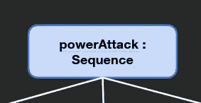

强力攻击序列

强力攻击会运行治疗技能，然后是愤怒技能，最后是持续伤害技能。

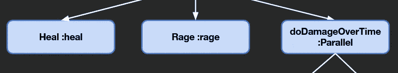

强力攻击序列

“持续造成伤害”是一个平行异能，它同时使用列表中的所有异能。它会造成即时伤害和延迟伤害。

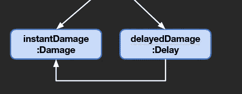

随着时间的推移造成损害

我最终得到的是一个复杂的层次结构，它重用了大量代码，并允许我将不同的功能放在一起。要做到这一点，我需要复合模式，它看起来很像策略和装饰模式。

# 事实真相

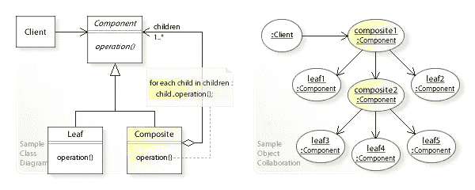

来源:https://en.wikipedia.org/wiki/Composite_pattern

复合的目的是将对象组合成树形结构来表示部分-整体层次结构。它允许我有一个树形结构，并要求树形结构中的每个节点执行一项任务。这也是如何建立行为树。这种模式的主要缺点是很难限制复合材料的组件类型。

## 定义

1.  **组件** —组件为组合中的对象以及访问和管理其子组件声明接口。它还实现了所有类通用的接口的默认行为。
2.  **Leaf** — Leaf 定义组合中图元对象的行为。它表示组合中的叶对象。(它下面没有物体，像树上的一片叶子。)
3.  **Composite** — Composite 存储子组件，并在组件接口中实现子组件相关的操作。(下面可以有其他物体，比如树枝。)
4.  **客户端** —客户端通过组件接口操纵合成中的对象。

客户端使用组件类接口与组合结构中的对象进行交互。如果收件人是叶子，则直接处理请求。如果接收方是一个复合组件，那么它通常会将请求转发给其子组件，可能会在转发前后执行额外的操作。

## 作为复合模式的复杂能力

这看起来像下面这样。

1.  **客户** —能力跑者。
2.  **组件** —可靠性。
3.  叶子——愤怒，治疗，近战，愤怒，其他能力
4.  **复合**——序列、平行、其他能力与一系列子系。

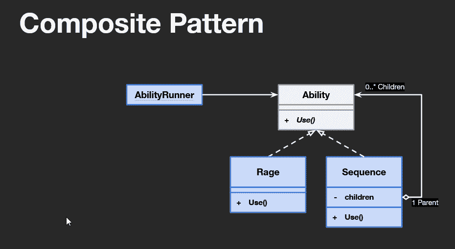

作为复合模式的复杂能力

# 履行

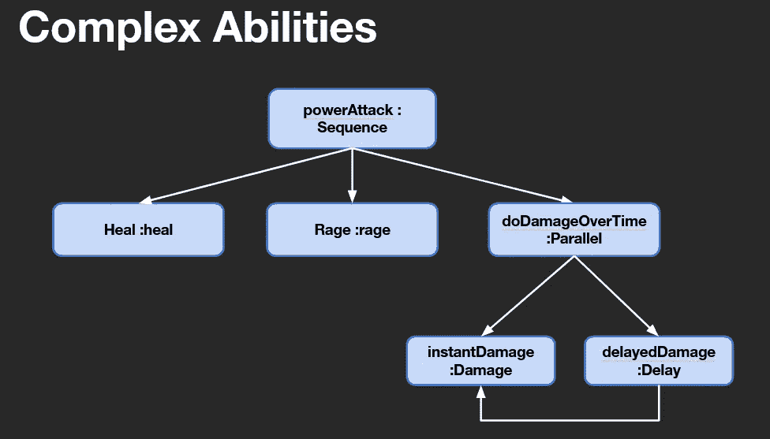

我需要两种不同的复合能力类型；顺序能力和平行能力。

## 序列能力

首先，我创建了一个使用能力接口的能力。

```
public class SequenceAbility : IAbility
{

    #region Implementation of IAbility

    */// <inheritdoc />* public void Use(){}

    #endregion
}
```

为了使用复合模式，我需要添加一个责任子数组。

```
private IAbility[] m_abilities;
```

当然，现在我需要一种方法来设置子元素，所以我创建了一个构造函数，将子元素作为参数。

```
public SequenceAbility(IAbility[] children)
{
    m_abilities = children;
}
```

最后，我需要通过孩子排序，并使用每一个。

```
public void Use()
{
    foreach (IAbility ability in m_abilities)
    {
        ability.Use();
    }
}
```

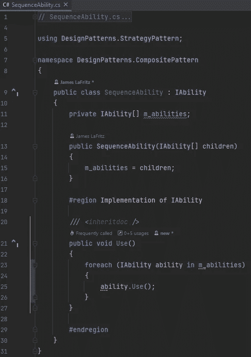

序列能力

## 平行能力

首先，我创建了一个使用能力接口的能力。

```
public class ParallelAbility : IAbility
{ #region Implementation of IAbility */// <inheritdoc />* public void Use(){} #endregion
}
```

为了使用复合模式，我需要添加一个责任子数组。

```
private IAbility[] m_abilities;
```

当然，现在我需要一种方法来设置子元素，所以我创建了一个构造函数，将子元素作为参数。

```
public ParallelAbility(IAbility[] children)
{
    m_abilities = children;
}
```

最后，我需要并行使用所有的能力。

```
public void Use()
{
    ParallelUse();
}
```

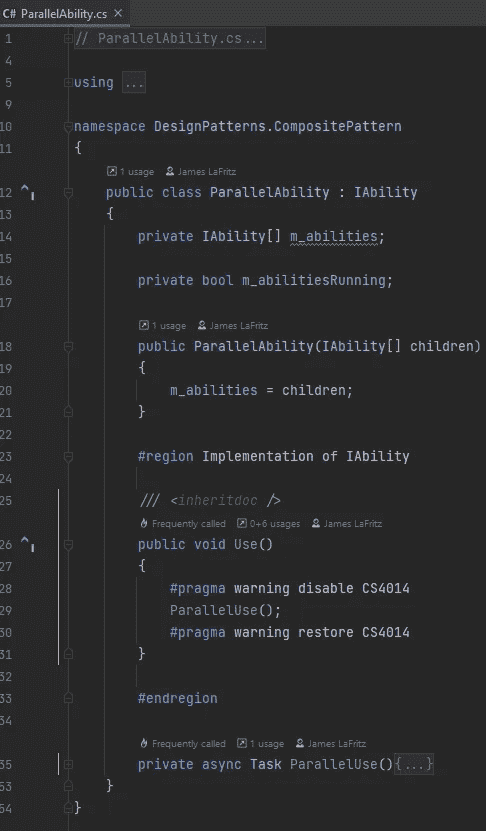

平行能力

并行使用方法实现与如何实现复合模式无关。

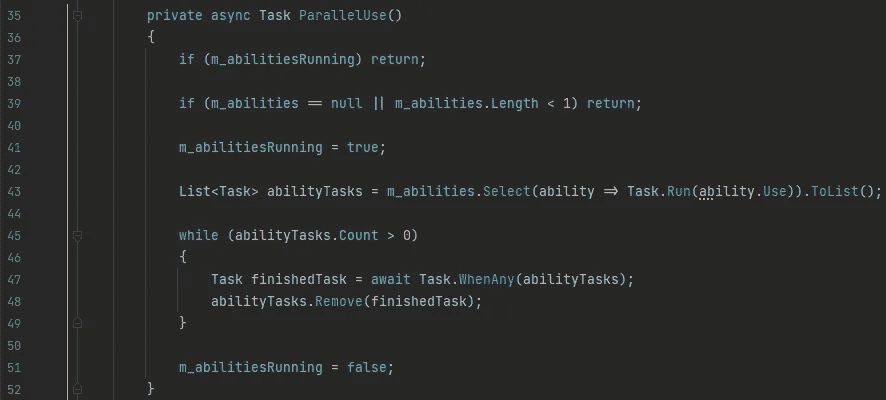

并行使用任务

## 强力攻击

现在对于异能攻击能力。所以我不需要创造额外的伤害能力，因为这是不必要的，所以我把伤害能力改为近战能力。我会在能力跑者中创造这个能力。

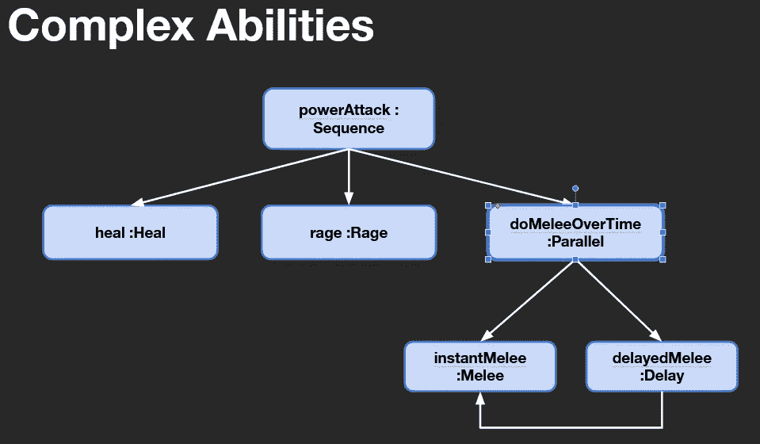

第一步是制造一个名为 powerAttackAbility 的新序列异能。序列异能需要一系列的异能来排序，在这里是治疗异能、愤怒异能和平行异能。并行能力需要一系列能力并行运行，在这种情况下是近战能力和带有延迟装饰的近战能力。

```
private SequenceAbility m_powerAttackAbility = new SequenceAbility(
    new IAbility[]
    {
        new HealAbility(), new RageAbility(),
        new ParallelAbility(new IAbility[]
        {
            new MeleeAbility(),
            new DelayedDecorator(new MeleeAbility())
        })
    });
```

现在我需要做的就是当按钮被点击的时候把这个设置为当前能力，并使用当前能力；

```
public void SetPowerAttackAbility()
{
    m_currentAbility = m_powerAttackAbility;
    Use();
}
```

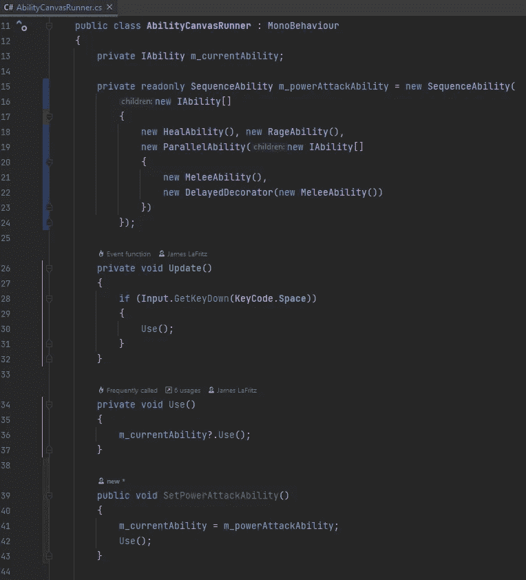

在 Unity 中，我需要让我的能量按钮在被点击时运行新的设定能量攻击功能。

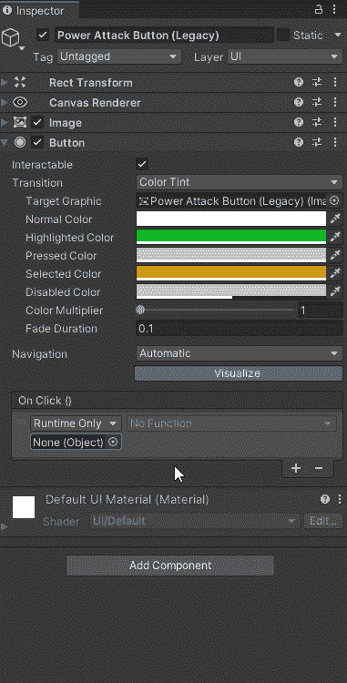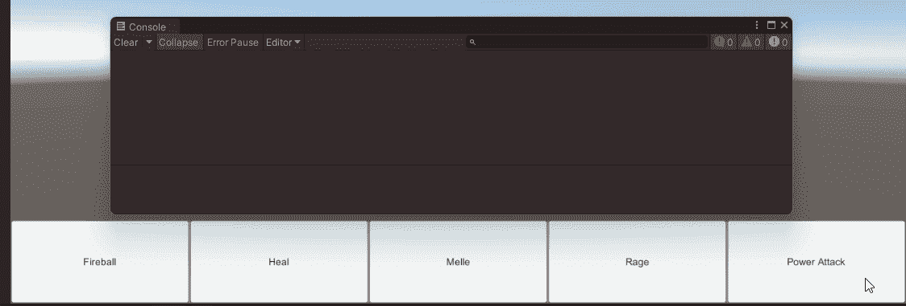

使用能量攻击

# 结论

使用复合模式，我可以用一些简单的能力创建复杂的能力树。请注意，这段代码可以使用一些工作的方式，并行使用和复合使用的实现，现在我可以垃圾邮件的权力攻击和并行能力只运行一次。这里唯一的 Unity 特定代码是能力运行器，因为它是一个 MonoBehavior，其余的是纯 C#。这使我能够在不同的 C#应用程序中重用所有这些，如果我想的话。

# 代码可以在 Git Hub 上找到

[](https://github.com/JamesLaFritz/Design-Patterns-For-Unity/tree/release-CompositePattern) [## GitHub-JamesLaFritz/发布时用于统一的设计模式-复合模式

### 报告 Bug 请求特性展示了 Unity 中不同的编程设计模式。有许多不同的…

github.com](https://github.com/JamesLaFritz/Design-Patterns-For-Unity/tree/release-CompositePattern)