# 使用 Python 构建智能英语同义词库的全面 11 步指南

> 原文：<https://blog.devgenius.io/comprehensive-11-step-guide-to-building-an-intelligent-english-thesaurus-using-python-a72317f1d160?source=collection_archive---------6----------------------->


“智能”查找单词

> 第 1 步:获取数据

包含英语单词及其含义的 JSON 文件可以在[这里](https://github.com/TutorSP/PythonCoding/commit/03a32c4375d1add6457784dd2135fdb39438401c)找到。

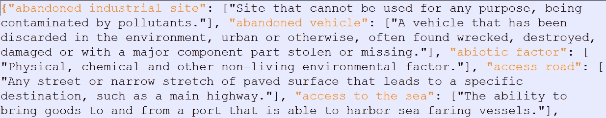

**我们的 JSON 数据文件快照:data.json**

> 第 2 步:加载 JSON 库

要使用 JSON 文件，我们需要在程序中导入相应的库:

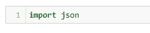

**我们准备好使用 JSON 文件**

> 第 3 步:加载 JSON 数据

首先，我们需要以读取模式打开 JSON 文件:

```
fh = open("data.json", mode = "r")  # fh is the file handler 
```

接下来，我们链接文件处理程序以从文件加载数据:

```
data = json.load(fh)
```

理解 JSON 文件中数据的组织是明智的。这将指导我们的编码过程。为此，我们可以使用 type()函数:

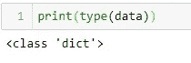

**我们的文件是字典**

查看了快照并确定了文件的类型后，我们可以得出以下结论:我们有一个包含键值对的字典；单词是表示为字符串的键；含义是表示为列表的值。我们正在处理一个相当大的数据集，从文件中的总字数可以看出:

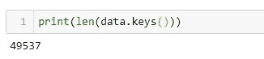

**通过我们的应用程序**可以找到近 5 万个单词及其含义

> 第四步:测试一个单词

从小规模开始并慢慢扩大规模始终是一种良好的做法:

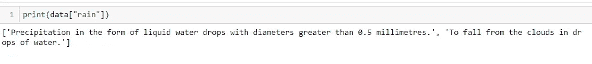

**雨这个词有两个意思，从打印出来的清单上可以看出**

> 第 5 步:返回作为参数传递的单词定义的函数

我们一件一件地构建了一个名为**return _ measure()**的函数，它将处理查找同义词库的所有可能场景。用户输入要查找其含义的单词。这个词作为一个参数传递给我们的函数。假设输入有效，将返回并打印正确的定义:

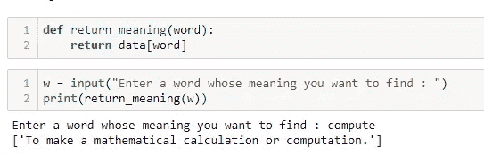

**用户输入“compute”被传递给 return _ meaning()。返回定义并打印出来**

> 第六步:考虑无效单词

期待假话一次又一次出现。在这种情况下，用户需要得到同样的通知，应用程序应该正常终止。到目前为止开发的函数**return _ measure()**不能处理不正确的输入。我们增加了一个其他部分，使其更加坚固:

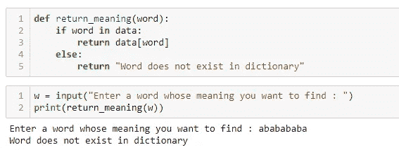

**“ababababa”是一个假词，不存在于我们的同义词库中**

> 第 7 步:考虑小写、大写和混合大小写的输入

人们可能会注意到，到目前为止，我们只处理小写输入。由于该文件仅包含小写键值，所有结果均符合我们的预期。但是，有效的大写和混合大小写输入不会产生正确的输出:

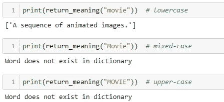

**虽然输入是相同的，但表示很重要**

为了处理所有可能的情况，我们在找到它的定义之前将输入单词转换成小写(使用 **lower( )** 方法):

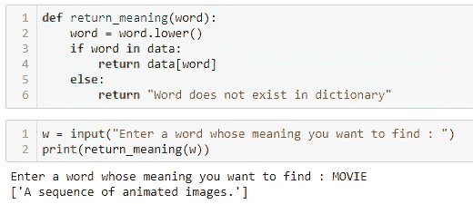

**大写输入现在工作了**

> 第八步:展示个人含义

单词的定义以列表的形式出现，这是一种不合适的形式:

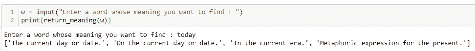

**“今天”的多个定义作为列表项出现**

相反，在单独的行上显示每个含义以及索引号，提供了一种更紧凑的表示形式:

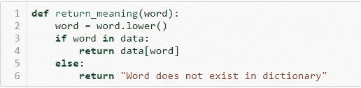

**return_meaning()不需要修改**

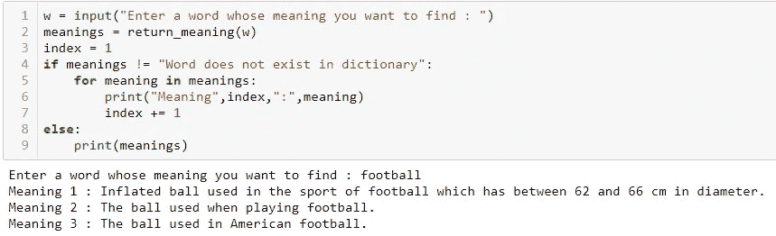

**我们遍历返回的定义列表，通过索引变量为每一个含义附加一个数字，并在单独的行上打印出来**

> 步骤 9:处理印刷错误

这是我们使查找变得“智能”的步骤。如果用户键入“rainn ”,她很可能指的是“rain”。我们应该提示她选择我们的程序认为最接近初始输入的单词。difflib 库帮助我们比较文本。来自 **difflib** 库的 **get_close_matches( )** 方法有助于将一个单词与一列条目进行比较。它也需要一个截止值。然而，我们需要首先将这些包合并到我们的代码中:

```
import difflib
from difflib import get_close_matches
```

从这里开始，我们可以试验我们的代码并解决输入错误:

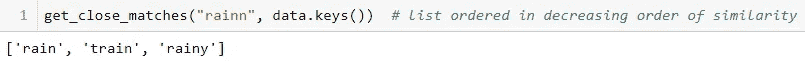

类似“rainn”的单词作为列表返回

我们将“rainn”与我们的数据文件中存在的所有单词进行比较，并得到一个由三个单词组成的列表，按照相似性降序排列，即根据函数**get _ close _ matches()**,“rain”最接近“rainn”，然后是“train”，最后是“rainy”。此时出现了两个关键问题:

为什么只有最接近的三个字而没有更多？
决定最接近的比赛的截止日期是什么？

**get_close_matches( )** 的通用语法具有以下形式:

```
get_close_matches(word, possibilities, n, cutoff)
```

**单词** : *我们要比较的字符串*
**可能性** : *我们要比较的单词*
**n(可选)** : *需要的最接近匹配数的字符串列表；必须大于 0；n 的默认值为 3*
**截止(可选)**:*【0，1】中的浮点(默认为 0.6)。不评分至少与* **单词** *相似的可能性被忽略。* 可能性中的最佳(**不超过 n 个**)匹配在列表中返回
，按相似性得分排序，最相似的排在最前面。

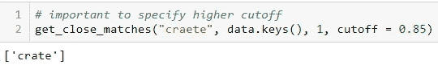

拼写错误的“craete”最接近“crate ”,截止值高于 0.85

如上所示，我们希望最接近“craete”的单词(n = 1)在相似性得分方面的截止值高于 0.85。

现在，我们可以向 **return_meaning( )** 方法添加更多的特性，我们已经在过去的许多步骤中构建了这个方法。

如果在我们的文件中找到一个有效的单词，我们只需返回与之对应的含义列表。

否则，我们**使用 get_close_matches( )** 检查拼写错误。如果返回的**列表**为**空**，则推断作为**输入**输入的**单词**为**无效**，并报告消息:**“词典中不存在该单词”**。

否则，我们会提示用户她是否指的是由 **get_close_matches( )** 返回的列表中的**第一个单词**。我们为她提供了两个选项——Y 代表是，N 代表否。如果用户输入 **Y 代表是**，我们**将返回与我们从 **get_close_matches( )** 收到的最接近的正确单词**相对应的含义列表。如果用户为 no 输入 **N，她正在寻找一个在我们的词库中不存在的单词。我们报告了一个大意如此的信息。第三种可能性出现了——用户既不输入 Y 也不输入 N。在这个场景中，我们提示用户:**“请检查您的输入。这是不正确的”。**该函数采用以下形式:**

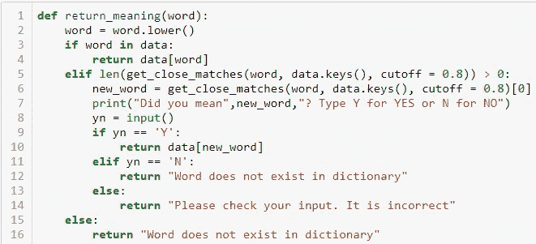

“情报”公司

我们将**的截止值设置为 0.8** ，并且只报告返回单词列表中最相似的单词。

下面可以看到一个“智能”的例子:

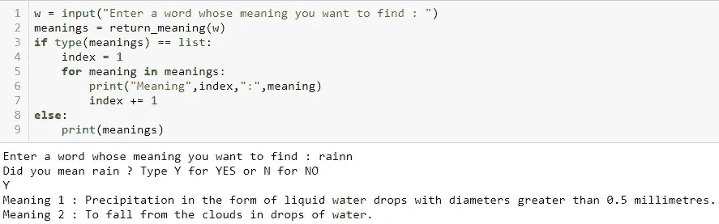

“rain”拼错成“rainn”处理完美

> 第十步:处理专有名词

成功地处理了打字错误之后，我们偶然发现了另一个场景——以大写字母(专有名词)开头的单词不能每次都通过目前开发的函数成功地查询到:

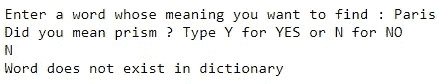

“巴黎”里没有错别字

出现此问题的主要原因是，在进行查找操作之前，首先将所有单词转换为小写。我们添加了一个条件，将字符串的每个首字母转换成大写，然后检查它在文件中是否存在。这可以使用 **title( )** 方法完成:

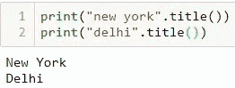

将专有名词转换成它们在文件中出现的形式

在检查错误类型之前，我们将上述操作包含在我们的函数 **return_meaning( )** 中:

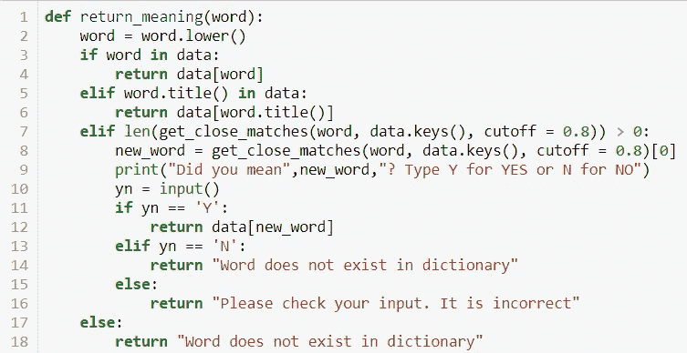

新增了第 5 行和第 6 行

专有名词现在被处理了:

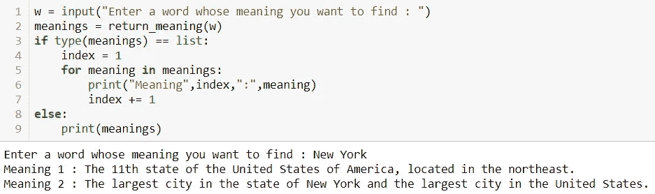

输出按预期返回

> 步骤 11:处理缩略语

我们的字典中以缩写形式出现的单词被忽略:

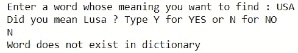

找不到美国的含义

为了给有效的首字母缩略词腾出空间，我们将这个词转换成大写，然后检查它在我们的同义词库中是否存在。这是使用 **upper( )** 方法完成的:

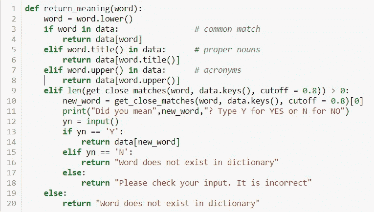

第 7 行和第 8 行完成了必要的工作

我们现在可以成功地查询首字母缩写词:

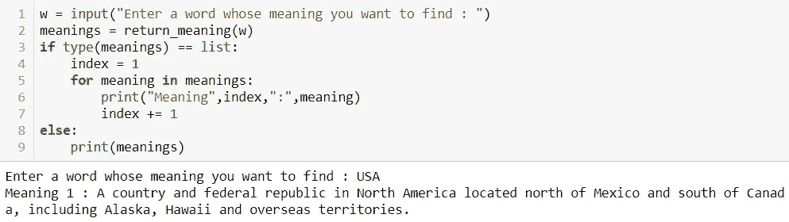

…而且很有效！！

完整的 Python 程序如下所示:

*我希望这篇文章对你有所帮助。请随时留下您的评论、反馈、批评、想法和其他一切。回头见！*