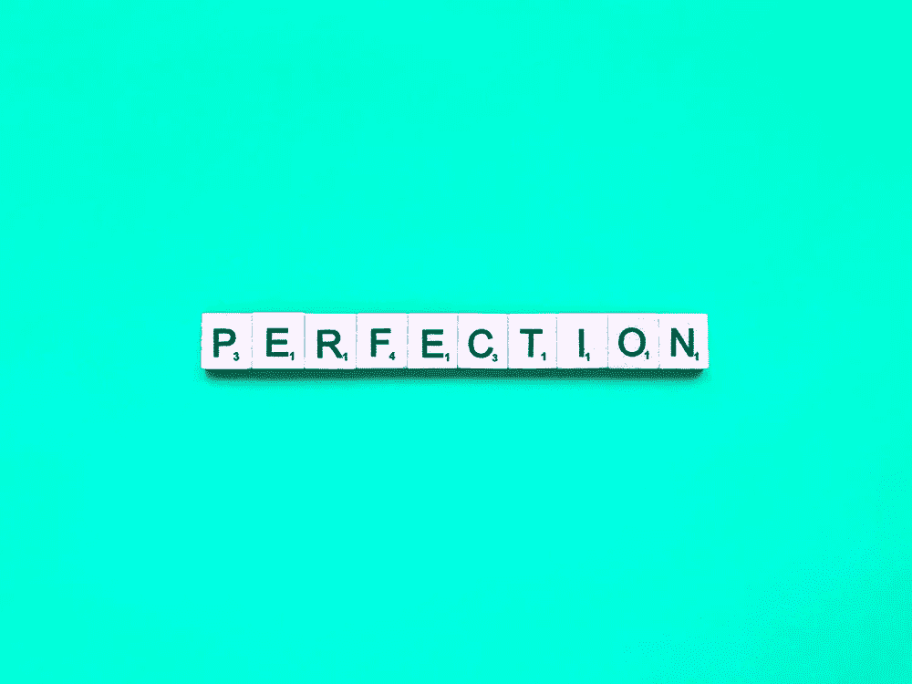

# 在编程中妥协以实现价值最大化

> 原文：<https://blog.devgenius.io/compromise-in-programming-to-maximize-value-746aef8de85f?source=collection_archive---------7----------------------->

每一个以构建软件产品为生的程序员都经历过或将最终经历代码道路上的岔路口。他们可以暂时满足于他们刚刚构建的功能，然后继续下一个任务，承认该功能还有改进的空间，或者他们可以继续构建以使某个功能变得更好(并且越来越好)(哦，如果可以的话……)。

# 妥协还是不妥协？

对我来说，一个想要 100%完成视频游戏的人，一个在完全完成我的饭菜中长大的人，这样我就可以成为干净盘子俱乐部的一员，我的本能通常是尽我所能坚持做某件事，直到它完全完成。然而，有时妥协可以带来更好的结果。我们生命中的时间都是有限的(肚子里的空间也是有限的，除了十几岁的时候)，有意识地利用时间是很重要的。同样，为软件产品的创建或维护付费的客户通常会有有限的资金可用于该目的，这通常大致相当于他们可以支付给你在他们的项目上工作的有限小时数，并且每个客户都希望他们的钱得到最大的回报。他们会想用他们花在你开发工作上的钱来最大化产品的价值。

所以作为程序员，当我们遇到这些问题时，我们应该考虑一个更大的图景，而不仅仅是这个特性及其质量/健壮性/易用性/灵活性等等。在决定向哪里妥协时，应该考虑哪些因素？

1.  **需求-** 首先也是最重要的一点，对于这个特性是否有一套约定的或合同的需求？如果是这样的话，你最好满足那些最低要求(在某些情况下，最高要求)。在软件开发中，一个很好的实践是，当一个特性的需求被规划出来时，在该特性的更昂贵的工作开始之前，获得客户的批准(或者反馈、修改，然后批准),这样你可以避免不得不做出可能不正确的假设，这可能导致不得不返工与客户的设想不同的东西。理想情况下，这些协议和计划可以被迭代和重新批准，因此它们包含了客户或架构可能需要的最新支点。一致同意的需求文档倾向于以书面形式将每个人对产品的愿景结合起来，并确保对产品的期望不是不断变化的目标。根据您团队的规模，您可能有一个业务分析师来做大量的收集和记录客户批准的需求的工作，但是即使您没有，这个过程仍然非常有帮助。
2.  **Priority-** 就产品或公司的成功与否而言，该特性在其他特性中的排名如何？如果它接近列表的顶部，你会希望确保它很好地实现了它的每个目的，从每个相关的角度来看。如果没有，也许记下增强的想法，并把它们放在 backlog 中，以备将来考虑，然后继续实现或改进对成功更关键的特性。
3.  **努力-** 您认为添加您考虑过的增强功能需要多长时间，其价值是否值得付出努力/成本？你可能有三个想做的改进，但是其中只有一两个能提供足够的价值，使花费必要的努力值得。如有疑问，与客户沟通(如有必要，通过适当的渠道)；只是注意不要过度承诺或措辞问题或陈述，暗示额外的增强功能是免费的，并确保每个需要了解决策的人都得到通知(在口头会议后将事情写下来，并与相关方分享这些决策)。这种对优先事项或沟通失误的误解或分歧很容易破坏原本良好的客户关系，所以要确保沟通得到妥善处理。
4.  **有用-** 你所考虑的改进对该功能的典型用户的成功或快乐有多重要？他们能没有它吗？或者它对他们来说是否重要甚至至关重要？快乐的用户往往会带来快乐的产品所有者。当计划或讨论一个特性时，你可以作为产品典型用户的代言人的这些谈话要点应该与客户产生共鸣。
5.  **Frequency-** 如果您正在进行一项更改，使一项受欢迎或常见的用户任务能够在更短的时间内完成，那么节省下来的时间会让谁受益？节省的一分钟，甚至几秒钟，经过成百上千次或更多次的积累，对于从节省的时间中受益的个人和公司来说，会产生巨大的变化。另一方面，如果这个特性不经常使用，那么这种增强的价值可能很低。
6.  **观点-** 考虑所有相关的观点(各种类型的用户、各种客户实体、各种合作伙伴等)以及增强将为这些实体中的每一个提供什么价值。设身处地地从他人的角度看问题是优秀程序员的一个关键素质，这有助于做出这类决定。
7.  最后，当有疑问时，将你的实现限制在一个特性的核心关键功能上，并记录或积压增强的想法，以便在产品的未来迭代中查看。在构建额外的功能之前，通常最好是在客户和用户手中获得一个最小可行产品(MVP ),尤其是当您可以应用用户分析并接收用户反馈时。你可能会对用户的反馈和使用感到惊讶；有时你或你的客户可能认为某个特性非常重要，但最终用户几乎从未使用过，或者可能认为某个特性无关紧要，但用户认为它是必不可少的。关于使用的用户反馈和见解，尤其是在产品上升的早期，通常是决定下一步工作重点的极好工具。

长话短说，在决定是否在特定功能的实现上妥协时，尝试将产品和公司作为一个整体来考虑，对他们的成功最重要的是什么，以及各种观点、功能/增强的预期价值和所需的努力，以及各种其他因素。妥协还是不妥协？正如编程中的许多情况一样，答案是:“视情况而定”。希望现在你能更好地评估每种情况，交流和记录需要什么来提高客户的快乐和成功，并最大限度地利用你的编程时间。

## ——汤米·埃利奥特， [AWH](http://awh.net) 的软件开发团队负责人。我们正在帮助企业通过技术推动增长。