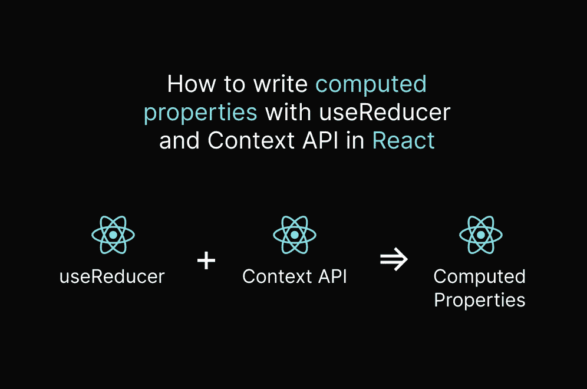
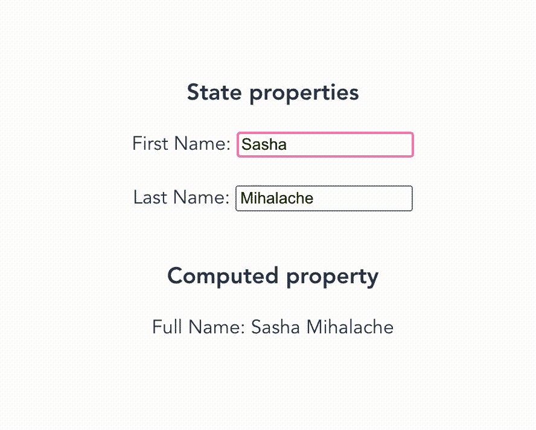

# React 中带有 useReducer 和上下文的计算属性

> 原文：<https://blog.devgenius.io/computed-properties-with-usereducer-and-context-in-react-d10d4adfdae5?source=collection_archive---------5----------------------->



# 一点背景知识

最近，我参与了一个 **React-Native** 移动项目，在这个项目中，我有机会选择我的技术组合。

由于我有一个主要面向网络的背景，我习惯于默认使用 **Redux** 作为选择的**状态管理**工具。

但是由于项目相当小，我试着只使用**上下文 API** 和 **useReducer** 来执行状态管理，总体来说效果很好。

# **问题**

我发现自己编写了同样的逻辑，一遍又一遍地导出状态，并且我注意到在使用这个上下文和 useReducer 时，没有现成的" **computed property'** "特性。

# 等等，什么是计算属性？

*   每当**所依赖的**值之一发生变化时，该值就会**重新计算**。
*   它有许多名字，如**派生状态**、**虚场**、**反应性质、**等
*   其他成熟的库都是开箱即用的，比如 **Redux** 、 **Vue/Vuex** 和 **EasyPeasy、**等等。



*一张 GIF 胜过千言万语，所以我将在这里发布一个计算属性的实例:*

# 酷毙了。现实世界的例子好吗？

假设你正在开发一个租车应用，让你在旅途中可以在附近租车。

您和汽车之间的会话模型将具有以下可能的状态:

```
'none' | 'booked' | 'started' | 'ended' | 'feedback'
```

*   除非你对汽车做了什么，否则**不会有会话**——**用户界面不会显示计时器**
*   为了到达那辆车，你将**预订**它— **UI 显示一个剩余预订时间的计时器(可选)**
*   一旦你进入汽车，会话将**开始**——**用户界面显示会话持续时间的计时器**
*   一旦您**结束**会话— **UI 就会显示一个计费屏幕**
*   一旦会话成功结束，它将进入反馈模式— **UI 显示反馈屏幕(可选)**

> 从上面可以看出，**预定的**和**开始的**状态都必须显示一个计时器，这可能意味着应用程序有一个正在进行的状态，我们可以将其转换为布尔类型的**计算属性**称为`isOngoingSession`。

# 具有状态属性的经典方法

以下是会话模型的精简商店的外观:

例如，如果您尝试注入状态并检查会话是否正在进行:

使用这种方法，并将其扩展到一百个不同的文件可能会很麻烦，原因如下:

*   这是一个重复的过程，试图在脑海中记住什么状态定义了一个正在进行的**会话，而且你可能会时不时地弄错**
*   在编写**魔法字符串**时，你必须**注意拼写错误**
*   如果您**稍后**想要**更新**正在进行的会话的含义，并且需要添加另一个状态，那么遍历每个组件来这样做将是非常糟糕的，并且显然容易出错

# 具有计算属性的方法

让我们通过直接在状态中移动上面的条件来尝试改进我们已经拥有的。

这将是引入我们的计算对象(*第 21 行*)的好地方，在这里我们现在可以定义一个从处于`booked`或`started`状态的`session`属性派生的`isOngoingSession`布尔值。

现在，让我们尝试将新的计算属性注入到组件中:

这种方法的好处在于:

*   你只需要**写一次**
*   它不太容易出错，因为你只是从商店里注射
*   这又回到了那个古老的咒语:将逻辑/状态/无论什么提升到一个更高的层次，我们的是会话存储
*   我们让我们的**组件更笨，**有时候更笨是可以的
*   请记住，当然，您可以传递**其他类型的数据**如带参数的**函数**。

# 结论

我们通过对计算商店内正在进行的会话的逻辑冒泡，对我们的代码库做了一个小小的改进。

之前，我们不得不在所有组件中重复相同的逻辑，如果不小心的话，这可能会导致一些**错误**。

每当你写完一些代码，你应该**总是回头**看看是否有什么方法可以**让**写完。

非常感谢你的阅读！我希望这篇文章提供了一些有用的见解。

祝一切顺利，
——萨沙