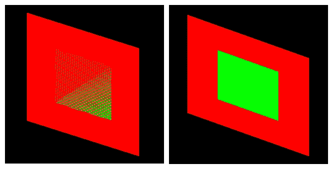
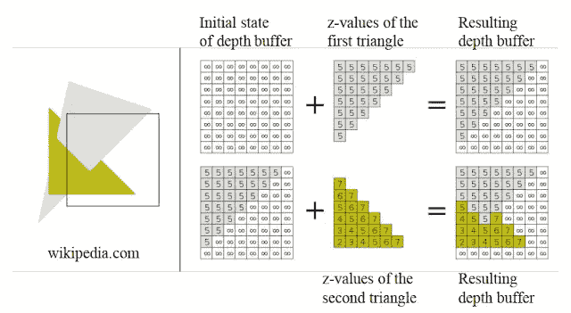
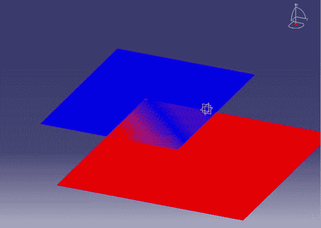
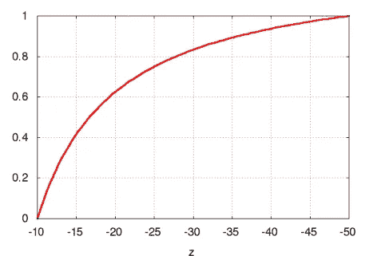
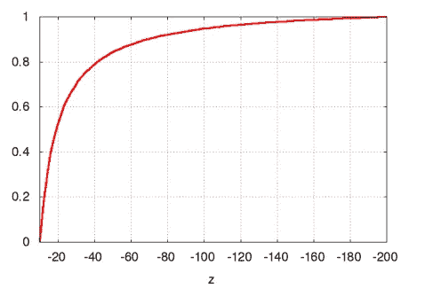

# 深度缓冲和 Z 战斗

> 原文：<https://blog.devgenius.io/computer-graphics-depth-buffer-test-5c29807cf475?source=collection_archive---------4----------------------->



```
We start with setting the depth of each pixel to infinity.
d(i, j) = infinity
Initialize the color value for each pixel 
c(i, j) = background color
for each polygon, do the following steps :

for (each pixel in polygon's projection)
{
    z (depth) of polygon at (x, y) corresponding to pixel (i, j)

    if (z < d(i, j))
    {
        d(i, j) = z;
        c(i, j) = color;
    }
}
```



一个例子取自曾的幻灯片

# z 型格斗

当两个平面具有相同的深度(在 z 轴上具有相同的值)并且 z 缓冲区无法确定哪个平面近哪个平面远时，会发生 z 战斗。然后会出现以下情况:



交叉中的 z 形战斗当深度范围[最近，最远]被缩放到[0，1]时，也可能发生这种情况。这是投影和视口变换后从[near=10，far=50]开始的范围[0，1]缩放。



摘自曾幻灯片

这是投影和视口变换后从[near=10，far=200]开始的范围[0，1]缩放。



摘自曾幻灯片

正如您可以看到的差异，当最近和最远的范围增加时，[0–1]范围的稳定性降低。z= 180 和 z= 200 的缩放 z 值几乎相同，这种相似性可能会导致 z 打架。为了防止这种情况，您必须选择尽可能小的[最近，最远] **范围。**

**更多资源:**

【https://www.geeksforgeeks.org/z-buffer-depth-buffer-method/ 

[https://en.wikipedia.org/wiki/Z-buffering](https://en.wikipedia.org/wiki/Z-buffering)