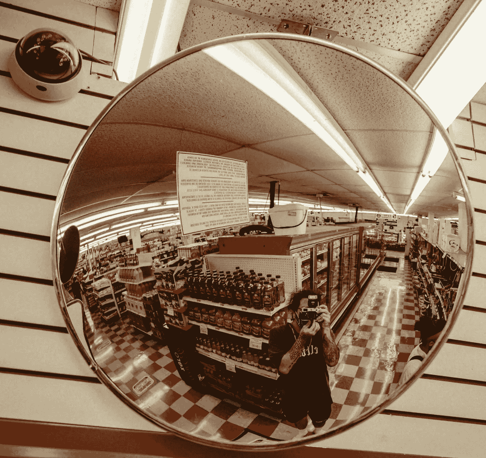
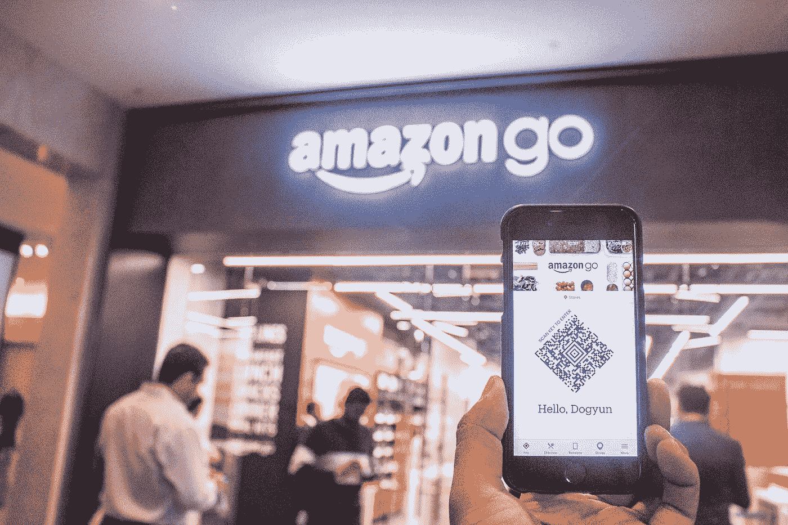
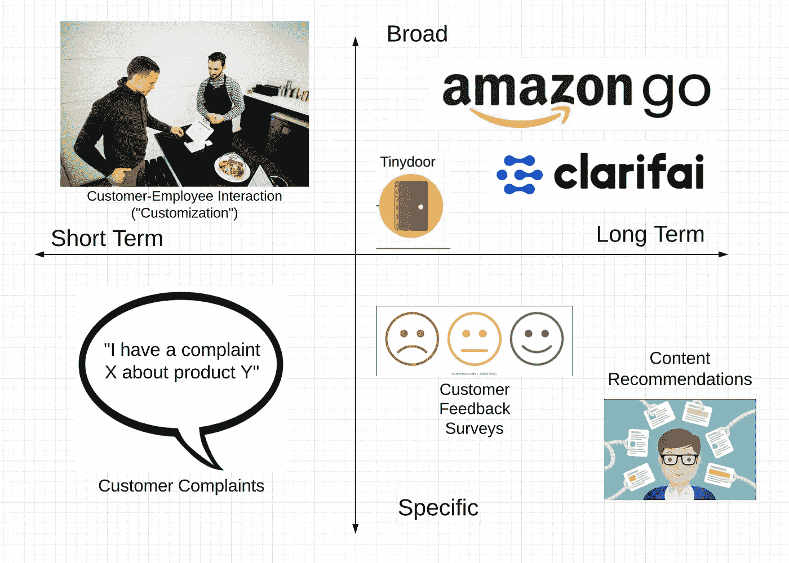
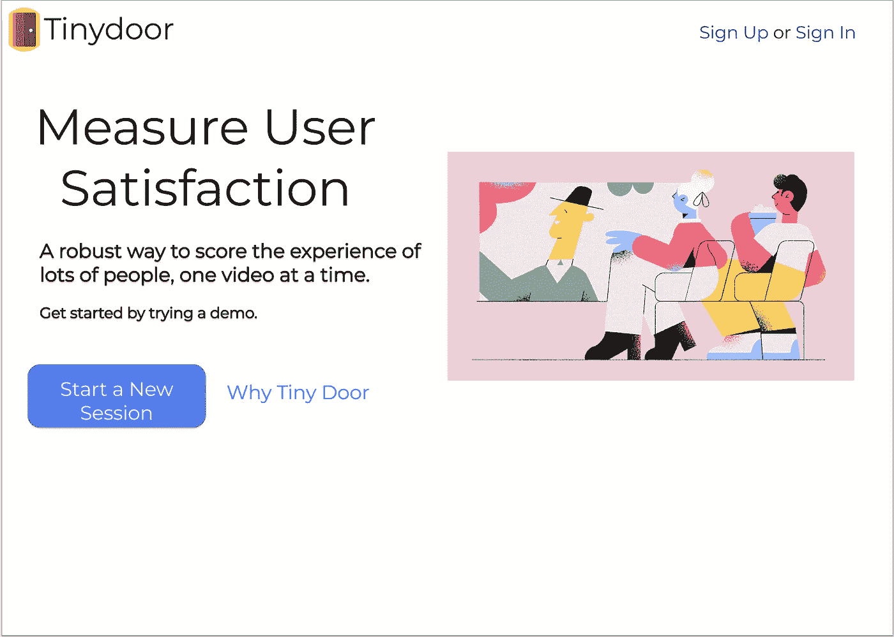
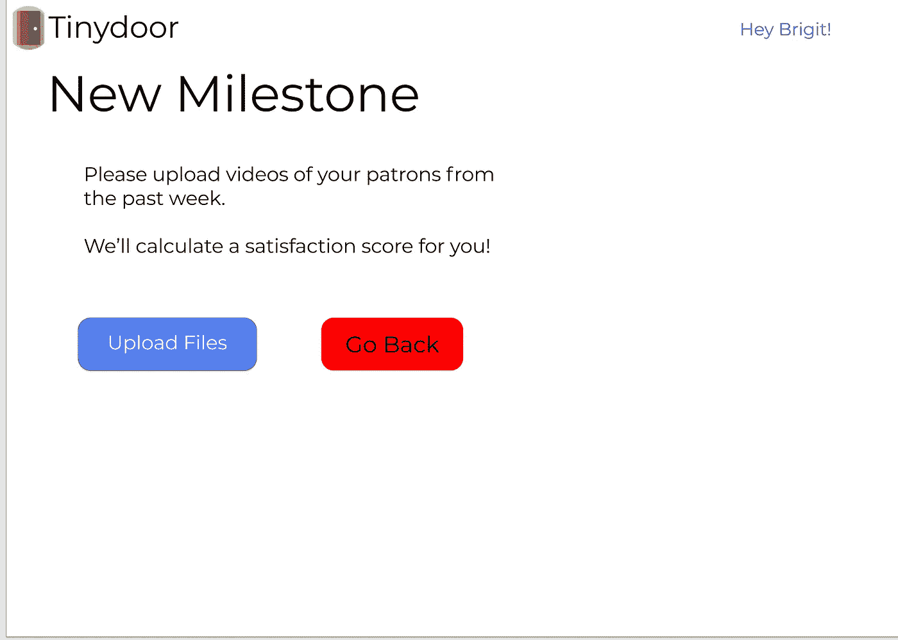
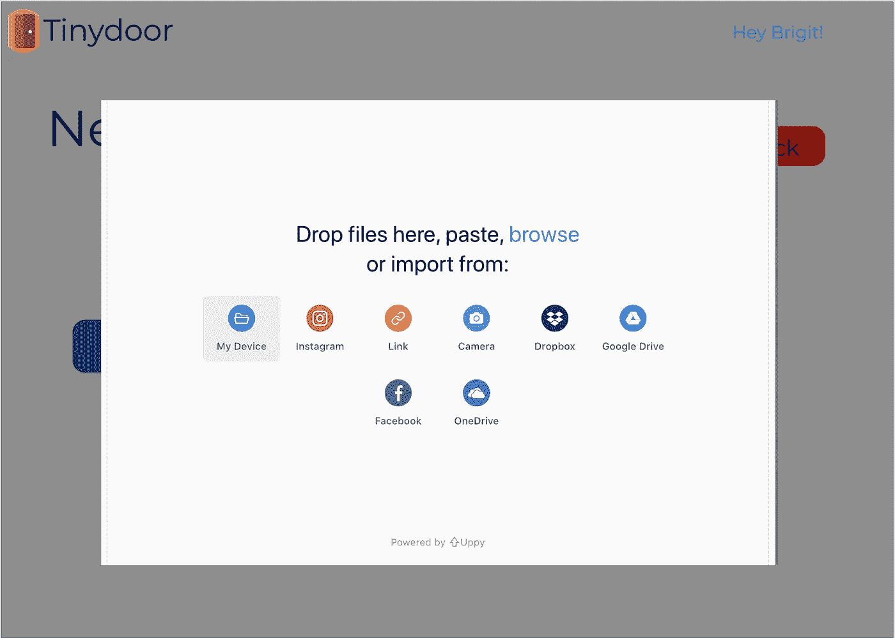
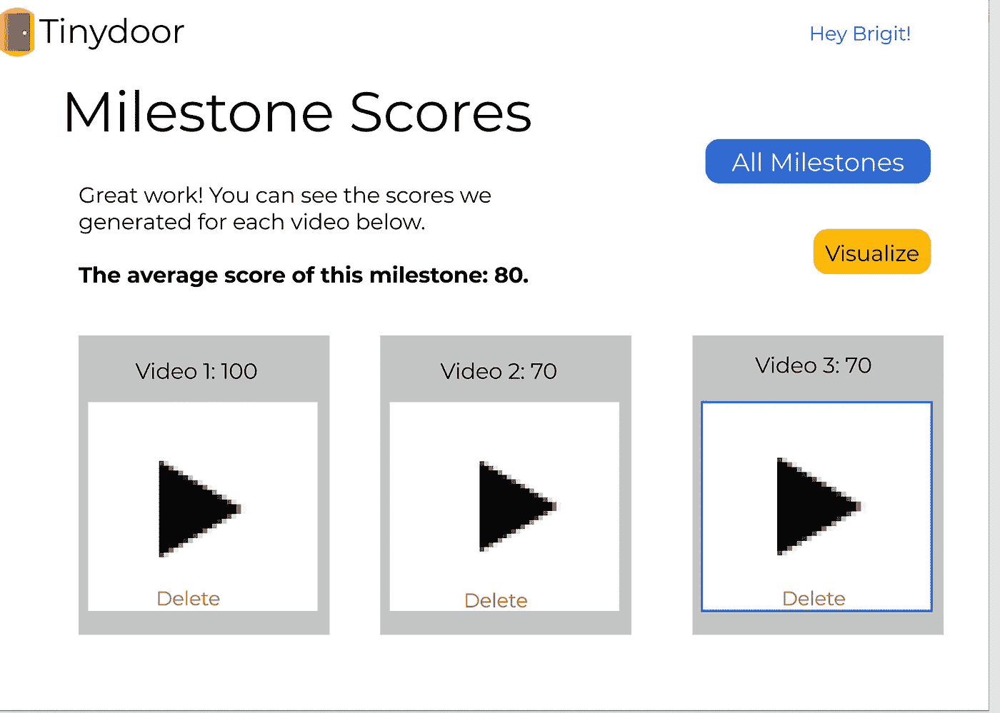
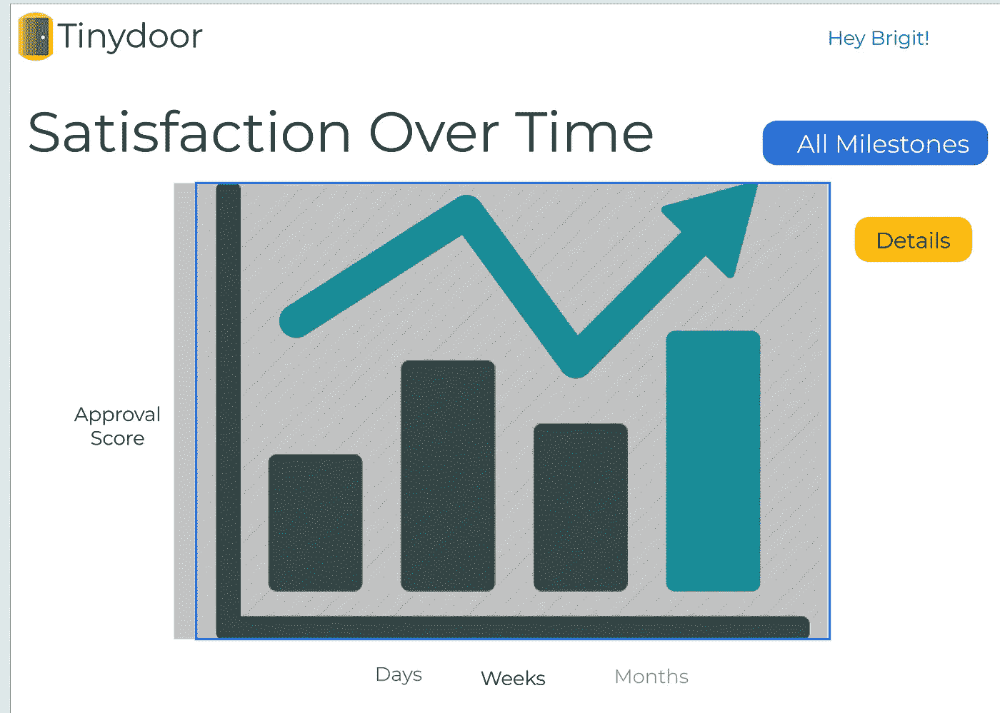
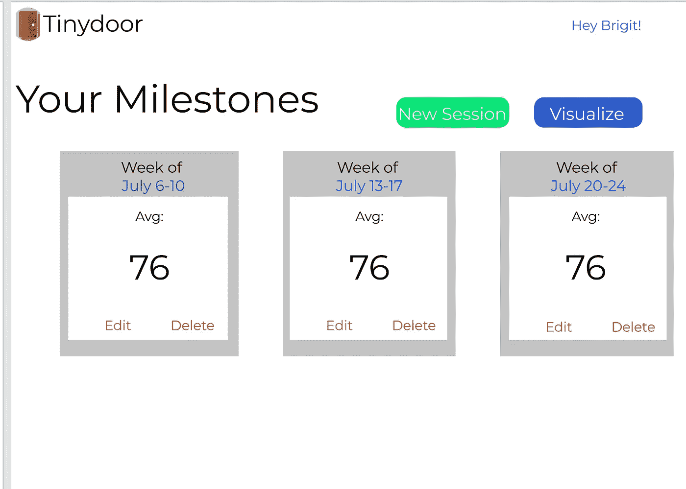

# 计算机视觉:零售业的解药？

> 原文：<https://blog.devgenius.io/computer-vision-the-cure-for-the-retail-industry-ba666421f182?source=collection_archive---------26----------------------->

弗兰基·科尔多瓦在 [Unsplash](https://unsplash.com/s/photos/convenience-store?utm_source=unsplash&utm_medium=referral&utm_content=creditCopyText) 上的照片

# 零售业面临的挑战

我是在零售业中长大的——我 13 岁的时候，父母同时开了一家便利店和一家洗车店，当我回首往事(现在作为一名即将升入大学的大四学生)，我无法想象这需要做多少工作，以及他们经历了多少考验和磨难。

*不断为钱争吵，每天工作 14 小时，甚至一度被抢劫，等等。*

但是事后看来，**最重要的问题**是这样的:**我们缺乏与客户的密切关系。**

我这么说是什么意思？为什么知道顾客想要什么很重要？

这也不是一个反问句。我记得每天我父亲从商店回家，他会从我们家庭办公室的传真机里拿出当天收银机的收据。出于好奇，我过去常常在吃饭时问他:“爸爸，商店怎么样了？”

“好吧，”这是他的回答。这是他一贯的回答。

但是事情并不顺利。举个例子，几天前在研究这篇博文时，我在 Yelp 上查阅了我们家族企业的评论，那是我上高中的时候。它们不漂亮。有些人不得不说:

> “实际上是周围最差的无接触洗车场…最好穿过肮脏的水坑”
> 
> “这里没有人要求退款……你再也不会把我当成顾客了。”

这些对我来说读起来特别痛苦，因为我们的家族企业实际上在它们被写出来的时候就关闭了——你可以想象我有多惊讶！

不阅读 Yelp 评论只是让企业主*不知道是什么损害了他们的业务，或者阻止了扩张的行为的一个例子。*

我了解我的父母。他们失败不是因为缺乏努力，也不是因为不关心顾客。他们失败了，因为他们不知道如何取悦他们。

## 为什么你应该读这个

我父母的生意绝不是一个人的。据《福布斯》报道，它在第五年就倒闭了，就像大约一半的小企业一样。

我们相信，我们正在改变这个国家的零售方式，如果你是一名商店经理，有兴趣与顾客建立更好、更数据驱动的关系，我们希望与你分享我们的进展。

在这篇博文中，我想和你分享 Tinydoor 的故事，这是我和我的同事 [Jonasz Rice](https://www.linkedin.com/in/jonasz-karwacki/) 、 [Uyen Nguyen](https://www.linkedin.com/in/uyen-nguyen-82b680187/) 以及 [Make School](https://makeschool.com) 的 Ashab Siddiqui 一起开发的最新网络应用。

# 为什么是计算机视觉？

## **害虫分析**

那么计算机视觉和零售有什么关系呢？

**【民主化】Amazon Go** 正如上面提到的，我的家人在经营他们的商店时经常遇到困难——毫无疑问，他们对客户在我们的产品中寻找什么缺乏敏锐的感觉。

现在，你能想象当亚马逊宣布其第一家无收银员商店 [Amazon Go 时我的反应吗？](https://www.youtube.com/watch?v=NrmMk1Myrxc)

西蒙·贝克在 Unsplash 上的照片

Amazon Go 一直是我们团队灵感的主要来源。计算机视觉可以给零售业带来以下好处:

*   防止盗窃
*   跟踪客户行为，并重新排列项目以匹配
*   降低成本

在像新冠肺炎这样的时代，模仿亚马逊 Go 的零售业务模式——通过将计算机视觉融入你的客户体验——提供了一个让人们更安全的可能性世界。

计算机视觉不仅仅是未来。是今天的。现在是为了*了。*

那么是什么让计算机视觉技术一直掌握在亚马逊 Go 这样的少数零售店手中呢？

## 域名问题

近年来，像《T21》、《大西洋月刊》这样的许多出版物开始预测“零售业的死亡”。这通常指的是实体店，你大概能猜到原因。

人们使用实体店来查看他们认为可能会喜欢的产品，然后去网上购买:

1.  更好的定价
2.  交货容易

**然而，**与他们的在线自动化同行相比，实体公司仍然有一个优势，改编自[这篇关于 migo IQ](https://www.migoiq.com/retail-challenges-the-3-biggest-problems-facing-brick-and-mortar/) **的博客:**

文化——这是实体店相对于网上商店或自动化商店的最大优势。

为什么我只是重复我自己？彼得·德鲁克曾说过“文化早餐吃战略。”即使在人们对冠状病毒的意识增强的今天，苹果商店仍然有客流量。

## **竞争格局**

***2020 年 7 月 14 日更新:下面的部分现在显示了企业在客户满意度方面的不同解决方案。它最初显示了顾客在零售店购物的不同选择。***

客户认可解决方案的竞争格局。

企业主知道他们需要跟踪他们与客户的关系。但是大多数方法本质上都包含了某种形式的**志愿者偏见，**意味着企业主听到的关于他们公司的信息，仅限于那些真正会说出来的客户子集。

我将使用上图中的几个例子来说明:

*   谁在控制企业的 Yelp 评级？*使用 Yelp 的客户！*
*   你在客户服务部听到过谁的抱怨？*打进电话的客户！*
*   客户调查代表了谁的意见？*填写了调查问卷的客户！*

我们可以做得更好。这就是为什么 Tinydoor 的目标是通过使用深度学习来分析客户的所有面部表情，来捕捉一家企业的所有物理顾客对他们的体验的感受，这些表情在我们说话的时候每天都被监控摄像头捕捉到。

# **用户研究**

## **用户访谈**

我们出去进行了用户访谈——与那些有零售业工作经验的人进行即兴对话，这样我们就可以了解零售业的情况。我们特别询问了他们的工作是什么样的，他们的困难在哪里，以及他们希望他们的工作流程能够更容易些

以下是我收集的一些经验:

**用户采访#1:赛义德·扎伊迪，** *沃尔特洗车场和美国农场的前老板*

扎伊迪于 20 世纪 60 年代出生在巴基斯坦。2000 年代，他和家人移民到美国。2010 年代中期，他买下了一家便利店和一家洗车店，目的是通过经营小企业实现自己当老板的梦想。

顺便说一句，他也是我爸爸。

我问了爸爸很多关于他在经营商店时用来管理安全的工具，因为我正在寻找方法来看看计算机视觉如何能够改善他的业务。事后看来，这种只强调计算机视觉可解决问题的做法可能使他的回答有所偏差，让我看不到我们真正能提供最大价值的地方。

尽管如此，爸爸还是深入介绍了他目前的工作流程。他给我看了他智能手机上的一个应用。当爸爸在店面安装安全摄像头时，他雇佣了一家公司为他安装摄像头。他不想处理设置闭路电视的麻烦，也不想把它连接到他的移动设备上。然而，一旦设置好了，*宾果！*现在，爸爸可以全天候访问商店的摄像机镜头，并且可以随时访问不同摄像机的实时视频。

通过这次交流，我发现简单地升级安全系统对许多零售店老板来说可能并不重要。事实上，我父亲对他已经使用的移动应用程序非常满意，以至于当我问他是否会改变什么时，他立刻一本正经地回答说“什么都不会”。当我问他是否向其他人推荐过他用过的服务时，他也这么做了。最终，爸爸帮助我认识到**安全系统是一个已经被许多零售店解决的问题。**

**用户采访#2:丹尼尔·莫尔斯，**甜菜盒子的联合创始人和前首席执行官

莫尔斯先生与我父亲有着天壤之别——作为密歇根大学的一名棕色头发、欣喜若狂的商科学生，他和几个同学想建一家“健康”的快餐店。举例来说，麦当劳、汉堡王和温蒂餐厅在底特律这样的食品沙漠中太常见了，但这并不是它们的昂贵替代品，而是一种新型餐厅，既能满足人们的健康需求，又能满足他们的预算。

如果你与丹或任何与他亲近的人交谈，你首先注意到的一件事是，他非常关心他所服务的客户，以及他的合作伙伴。在我们的交谈中，我们的团队可能会开发一些自动化情绪分析的东西，以便企业主可以更容易地看到他们的客户对他们的体验感觉如何。

丹对这个想法非常兴奋，回忆起他在甜菜箱的时候，他说他有“跟踪存货的方法”。但是，如果在跟踪客户情绪方面也能做到这一点，那就太好了。

**总结**

如你所见，我们团队中没有人知道经营零售业务是什么样子。为了建造 Tinydoor，我们没有寻求“愿景”——我们的想法不是来自于观星、阅读茶叶或经文，或任何类似的东西。它来自实际用户，他们帮助 use 发现了通过计算机视觉帮助企业主跟踪客户分析的兴趣。

# **产品设计文件**

## 这个想法

Tinydoor 通过计算机视觉技术辅助的简单在线工具，帮助实体零售商查看关于他们业务的高级分析。

## **用户旅程**

Tinydoor 的设计非常简单，商店经理可以使用它，而无需雇用任何额外的员工。它被创建为端到端，所以用户可以立即开始，只要他们有视频文件上传。

以鲍勃为例，他是一个虚构但现实的人物，我们围绕他设计了网站的用户界面/UX:

> 你好。我是当地便利店的**经理。我们是旧金山当地最受欢迎的人。我做生意已经超过 25 年了，我想要一种方式向别人展示顾客对我们的生意有多好。那时我从朋友杰森那里听说了 Tinydoor，他在旧金山也有一家宠物店。他和我分享说，他使用这项服务上传他的安全视频，以衡量他的访客喜欢与他饲养的动物打交道的程度。我决定亲自尝试一下，因为我们刚刚安装了新的高清监控摄像头，我认为这是一种很酷的方式来使用它们。
> 登陆该网站后，我能够**使用我的电子邮件创建一个账户并设置密码**。现在，每周我都会将我的安全摄像头拍摄的视频上传到网站上，它会给我一些指标来了解我们每天的表现，以及一周的平均值，从 0 到 100。我期待着每周跟踪我们的进展，并为我们的客户满意度设定目标，这样我们就能达到新的高度！**

这只是一个想象的场景；还有成百上千的使用案例可以实现计算机视觉来帮助企业主。

## **线框**

使用 Figma，我们设计了 MVP 来指导用户完成三个初始步骤:

请注意，分数被封装在“里程碑”中，代表它们发生的那一周。我们打算帮助您一周又一周地提高客户满意度！

**步骤#1:** 点击登录页面，点击绿色的“开始”按钮

登录页面

**第二步:**上传他们店铺的视频文件

Uppy 处理实际的上传过程，因此用户可以一次上传任意多的视频。

**步骤#3:** 查看计算机视觉算法返回的结果摘要，并可视化随时间推移的进度

一周“里程碑”总结

数据可视化

**第四步:**返回并能够查看您之前创建的任何分数！

# 下一步是什么？

Tinydoor 是一个特殊的 app，但它还有很长的路要走。我们目前正在使用*亚马逊 Rekognition* ，一种基于云的深度学习模型，来处理我们的计算机视觉算法。我们现在需要继续研究我们的用户想要什么，这样我们就可以准确地确定我们应该交付的指标，以便服务提供价值。我们将探索这项技术同样适用的其他行业，如医疗保健和机场。

这个过程看起来像以下 3 个步骤:

1.  找到一个可以得到计算机视觉帮助的业务用例(即面部识别、标签检测等。)
2.  使用 AWS 内置函数实现它
3.  设计网站以向用户显示有意义的信息的方式显示结果

感谢您花时间了解我们的产品。你可以在 [live 站点](https://tinydoor.co)上查看它的进展，或者在 [GitHub 库上做开源贡献。](https://github.com/escofresco/tinydoor)