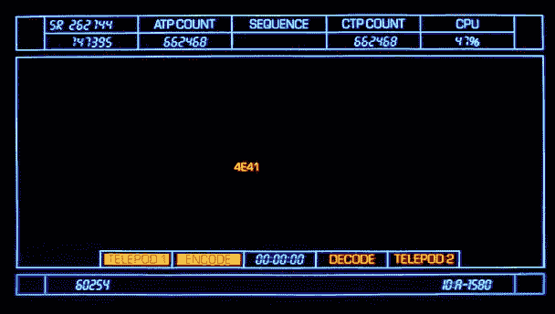
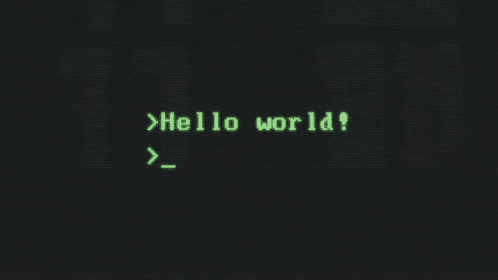

# 电脑毫无线索

> 原文：<https://blog.devgenius.io/computers-are-clueless-32b7c5184356?source=collection_archive---------8----------------------->

我是如何成为一名软件工程学生的

> “计算机是愚蠢的。他们只知道你告诉他们的。” *塞斯·布伦德尔，《苍蝇》(1986)*

我觉得有必要这样开始:我和 ***总是*** 被计算机和它们的能力所震惊。无论是通过使用我们的智能手机与来自世界另一端的人交谈来改善我们的日常生活，还是地图应用程序独自一人拯救了我，使我在去朋友家的路上不会迷路，我去过上百次了。别问了。也不知道，唯一的答案是我已经脱离了大半个人生。但这是题外话。重点是——我热爱技术以及它为我们持续做的事情。我小时候一直觉得电脑本身就是 ***智能*** 。他们可以做所有这些疯狂的事情，他们怎么可能不是呢？但直到我决定研究如何与计算机交流，我才意识到，它们是*。我们是他们的大脑。我们。人类。多棒啊。！*

> *“机器能否思考的问题……和潜艇能否游泳的问题一样重要。”— Edsger Dijkstra，对计算科学的威胁*

**

*早在我认为计算机本身是智能的，对整个编程过程一无所知的时候，我确实对它们的能力感到有点害怕。还记得机器人索菲亚吗？ 我肯定做。索菲亚是一个沙特阿拉伯的社交人形机器人，由总部位于香港的汉森机器人公司开发。回到 2016 年，当我第一次听说这个人形机器人 ***和我同名的东西*** 时，我想是的，就是它了。这是结束的开始。毫无疑问，这是一种非常愚蠢的思维方式，但我事先对这个人形造物的方式和原因一无所知。老实说，我不确定在这一点上我对机器的了解是否充分。但是我只是文明的一部分，不明白计算机本身是愚蠢的。机器人索菲娅不可能独立思考。但是索菲亚这个*(未来)*程序员绝对可以，她可以给机器人索菲亚编程序，让她做任何她想让她做的事情。这种认识——认识到程序员是控制者——永远改变了我看待计算机的方式。我开始相信，我自己可以学会如何与计算机交流，就像这些才华横溢的工程师多年来一直在做的那样，通过这样做——通过技术不断改变我们的世界。*

* [## 索菲亚-汉森机器人公司

### Sophia Hanson Robotics 最先进的类人机器人 Sophia 体现了我们对人工智能未来的梦想。作为一个…

www.hansonrobotics.com](https://www.hansonrobotics.com/sophia/) 

> “计算机快得令人难以置信，精确得令人难以置信，而且愚蠢。人类慢得令人难以置信，不准确，而且聪明。他们在一起的力量超乎想象。”[人名]阿尔伯特·爱因斯坦(犹太裔理论物理学家)* 

# *作为一名软件工程学生*

*我目前在一个软件工程训练营，没有以前的编码或计算机科学背景。所以你可以想象，这很困难，有时甚至是不可能的。但是挑战很有趣。我喜欢编程中解决问题的部分——差不多占了 90%。所以我想你可以说我在我应该在的地方。我在这么短的时间里学到了这么多，但同时又觉得自己什么都没学到。今天是我在训练营的第二周，到目前为止，我已经学会了如何操作 DOM、与服务器通信以及 JavaScript 的基础知识。*

**

*JavaScript 是…当你理解它的时候很有趣。否则，这是非常令人沮丧的。我喜欢它能给网页增加的互动性，到目前为止，我很喜欢学习它的所有功能，以及如何使用和为什么使用。第一次安慰 ***【你好世界】*** 的时候，我觉得很强大。我想“你好，世界很好！”。可以说，那是我第一次也是最后一次觉得使用 JavaScript 很成功。但是我比我不断从我的终端得到的错误信息更加无情。有一天，希望是明天，一切都会变得明朗，我会掌握这门语言。*

*学习如何编程向我证明了 ***电脑是如此的无能。你忘记了代码中的一个小逗号，整个程序就会崩溃。真的挺搞笑的，对于一个不可能有任何感情的东西，电脑就这么容易被触发。它们被编程为要么工作要么不工作。没有中间地带。当然，只有当你发现少了一件小事时，才觉得有趣。因为调试你的代码几个小时，并试图理解这个程序的怪异之处，却发现你忘记了一个逗号或一个右花括号，这是非常令人沮丧的，你开始对着你的屏幕尖叫。或许你可以考虑删除整件事，然后像下面这位朋友一样，呼唤你虚构的妻子琳达。****

**

# *像电脑程序员一样思考*

*除了实际学习编码语言和它们的目的，在学习如何编程和操作程序的过程中，你需要做的最重要的事情是从像“规范”一样思考转变为像*程序员*一样思考。在我看来，这是那些不能教的事情之一。通过大量的试验和错误，打破和修正程序，这种思维方式在你的大脑中被编程。对我来说，这只是最近才开始发生的，我离我想要的地方还很远。所以这意味着我仍然有很多个深夜(更像是清晨)期待着尝试找出如何让 50 行代码工作。但这是我们必须做的工作，以便能够成功地与计算机交流。记住，计算机不能自己编程——我们必须为它们编程。*

# *总之…*

*电脑功能强大，牛逼。不可否认。无论你在世界的哪个角落，你都能读到这篇文章，光是这一点就令人难以置信。难道你不想知道这是怎么回事吗？我们在技术上已经走了这么远，但我看不到在不久的将来会有任何自我思考的机器出现。所以在那之前，这些机器拥有我们，需要我们为它们做这件事。学习如何成功地与他们沟通的过程非常耗时，需要很大的耐心，我的意思是这就是为什么程序员能挣大钱。如果这很容易，每个人和他们的母亲都会成为程序员——除非你的母亲实际上是一名程序员，那就很酷了。你绝对应该追随她的脚步。*

**

*签署…………..*