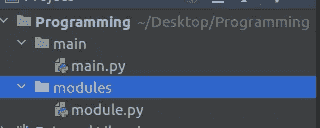

# Python 中模块的概念

> 原文：<https://blog.devgenius.io/concept-of-modules-in-python-4b6ee3f6a030?source=collection_archive---------3----------------------->

解释了 python 模块如何工作，并创建了您的自定义模块

我们知道，从计算机科学的角度来看，如果代码没有增长，这意味着它可能完全无法使用。一个真正想要的和可用的代码根据用户和市场需求不断增长。pythons 中有数百万个已开发的库，其中多个库的用途相同，只是功能和易用性有所不同。如果你的代码不能满足用户的需求，它将会被遗忘并被其他代码所取代。所以代码增强很重要。

但是我们也知道代码越大，问题就越大。维护大型代码并从一大段代码中跟踪 bug 是很困难的。在这种情况下，您可能希望将代码分成几百个片段，而这些片段可能会由数百名开发人员来处理。但是由这些开发者来更新同一个文件会很头疼。如果你真的想成功，你必须将任务划分给开发者，并将所有的任务整合成一个整体。将一个任务分解成几个更小的任务叫做**分解。**

你如何将一个软件分成独立但相互协作的部分？这就是问题。**模块**就是答案。

在一个 python 模块中有两个人完全参与，一个是**模块用户**(他将使用现有的模块)和第二个**模块供应商**(他们想要创建自己的新模块供个人使用或公共使用)。其实 python 为我们提供了大量的内置模块，你可以像对待一本书一样对待它们，查看它们 [**这里**](https://docs.python.org/3/library/index.html) 。

# 模块导入

要使一个模块可用，必须使用 **import** 关键字导入该模块。它将允许您将模块导入到 Python 脚本中

```
import math
import os
     OR
import math,os
```

在继续之前，让我们讨论一下**名称空间。**一个**名称空间**是一个空间，其中存在一些名称，这些名称彼此不冲突，即它们是唯一的。

如果指定名称**的模块存在并且可以访问**(一个模块实际上是一个 **Python 源文件**)，Python 会导入它的内容，也就是说**模块中定义的所有名称都变成已知的**，但是它们不会进入你的代码的名称空间。现在如何限定一个模块的实体名？

```
module_name.name_of_entity
eg-
math.pi
math.sin
```

你也可以这样限定一个实体-

```
from math import pi
or 
from math import pi,sin
or 
from math import *
```

星号(*)表示从给定模块导入所有实体。但是这样使用是不安全的，因为如果你不知道一个模块的所有实体，它可能会产生名称冲突。如果你想用你自己的名字命名一个实体，你可以使用别名。

```
import module as alias
eg-
import panda as pd
```

注意-成功执行别名导入后，原始模块名称变得不可访问。

如果你想检查一个模块的所有实体，你可以使用 **dir()** 函数。是啊！你没听错，这不同于我们的 Linux/Unix **dir** 命令。


**模块是一种装满函数的容器，**我们可以添加任意多的函数，但要确保模块中的函数用于特定的领域或用途。为此，我们可以为不同的目的创建多个模块并将它们组合在一起，我们可以将这样一组模块称为一个包。


# 自定义模块

让我们进入正题，创建我们的自定义模块。创建两个文件 module.py 和 main.py。确保两个文件都位于**相同的文件夹**中。


包含 main.py 和 module.py 的文件夹


module.py，目前为空


main.py，我们导入了空模块

让我们运行 main.py，看看有什么变化。你看到什么变化了吗？没什么啊！！看到你的文件夹，会有一个新创建的文件夹 **__pycache__** 。如果打开它，您将看到一个名为 module.cpython-xy.pyc 的文件，其中 **xy** 是您的 python 版本，文件名是您的模块名。 **cpython** 表示哪个 python 实现创建了文件， **pyc** 表示 ***python 并编译。***

如果你打开这个文件，你将无法阅读里面的内容。这对于人类来说毫无用处，但该文件仅供 python 使用。当 Python 第一次导入一个模块时，它**将其内容翻译成某种编译过的形状**。

该文件不包含机器码——它是内部 Python **半编译代码**，准备由 Python 的解释器执行。因为这样的文件不需要纯源文件所需要的大量检查，所以执行开始得更快，运行得也更快。

Python 能够检查模块的源文件是否已经被修改(在这种情况下， **pyc** 文件将被重建)或者没有被修改(当 **pyc** 文件可能被立即运行时)。由于这个过程是完全自动和透明的，你不必记住它。

让我们在我们的 **module.py.** 中打印一些东西


在 module.py 中添加了打印，并且在运行 main.py 时会重新加载 module.py

注意:**初始化只发生一次**，当第一次导入发生时，因此模块完成的赋值不会不必要地重复。

Python 可以做得更多。它还创建了一个名为`__name__`的变量。

此外，每个源文件使用它自己的、独立的变量版本——它不在模块之间共享。

*   当你直接运行一个文件时，它的`__name__`变量被设置为`__main__`；
*   当一个文件作为一个模块导入时，它的`__name__`变量被设置为文件名(不包括。py)
*   我们可以使用这个 __name__ 变量来运行一个模块的测试用例，让我们探索更多。

In module.py

```
def merge_sort(arr):
    if len(arr) > 1:
        r = len(arr) // 2
        L = arr[:r]
        M = arr[r:]
        merge_sort(L)
        merge_sort(M)

        i=j=k=0
        while i < len(L) and j < len(M):
            if L[i] < M[j]:
                arr[k] = L[i]
                k += 1
                i += 1
            else:
                arr[k] = M[j]
                k += 1
                j += 1

        while i < len(L):
            arr[k] = L[i]
            k += 1
            i += 1
        while j < len(M):
            arr[k] = M[j]
            k += 1
            j += 1

if __name__ == "__main__":
    print("This is module file: Running test cases for the module")
    sample_data = [1,3,2,4,6,5,0]
    merge_sort(sample_data)
    print(sample_data)
```

In main.py

```
import module

arr = [10,5,3,7,8,2,3]

module.merge_sort(arr)
print(arr)
```

我已经在 module.py 中实现了合并排序，但是你注意到我已经使用了 **__name__** 来测试我的模块了吗？


main.py 和 module.py 的输出

现在让我们深入一点，文件结构是这样的—



新文件结构


为了解决这个问题，我们可以使用 **Python 的 sys** 模块，它有一个**路径** **方法**。In main.py

```
from sys import path
path.append('/home/Desktop/Programming/modules/')
import module

arr = [10,5,3,7,8,2,3]

module.merge_sort(arr)
print(arr)
```

变量名为`path`，可以通过名为`sys`的模块访问

如果您使用的是 Window，那么路径格式是不同的，请在这里查看路径概念。但是请注意，我使用了 ***path.append()，*** 只是将路径附加到模块 dir。但是我们也可以使用*插入() ***的方法。****

*让我们再创建一个文件**modules/insertion _ sort . py***

```
*def insertion_sort(arr):
    *"""* ***:param*** *arr:* ***:type*** *arr:* ***:return****:* ***:rtype****: 
    """* for index in range(1,len(arr)):
        element = arr[index]
        prev_index = index - 1

        while prev_index >= 0 and arr[prev_index] > element:
            arr[prev_index+1] = arr[prev_index]
            prev_index -= 1

        arr[prev_index+1] = element*
```

*现在**模块/module.py** 中的变化*

```
*import insertion_sort

def merge_sort(arr):
    *"""* ***:param*** *arr:* ***:type*** *arr:* ***:return****:* ***:rtype****: 
    """* if len(arr) > 1:
        r = len(arr) // 2
        L = arr[:r]
        M = arr[r:]
        merge_sort(L)
        merge_sort(M)

        i=j=k=0
        while i < len(L) and j < len(M):
            if L[i] < M[j]:
                arr[k] = L[i]
                k += 1
                i += 1
            else:
                arr[k] = M[j]
                k += 1
                j += 1

        while i < len(L):
            arr[k] = L[i]
            k += 1
            i += 1
        while j < len(M):
            arr[k] = M[j]
            k += 1
            j += 1

if __name__ == "__main__":
    print("This is modules file: Running test cases for the modules's functions Merge Sort")
    sample_data = [1,3,2,4,6,5,0]
    merge_sort(sample_data)
    print(sample_data,"--- OK")

    print("This is modules file: Running test cases for the modules's functions Insertion Sort")
    new_sample_data = [1, 3, 2, 4, 6, 5, 0]
    insertion_sort.insertion_sort(new_sample_data)
    print(new_sample_data,"--- OK")*
```

***和 main/main.py 中的变化***

```
*from sys import path
path.append('/home/vvdn/Desktop/Programming/modules/')
import module

arr = [10,5,3,7,8,2,3]
module.merge_sort(arr)
print(arr)

arr2 = [4,6,1,2,5,3]
module.insertion_sort.insertion_sort(arr2)
print(arr2)*
```

**

*输出*

*您注意到了吗，我们可以将其他自定义和内置模块导入到其他模块文件中，并轻松使用它们。*

*现在，我希望你能够创建自己的自定义模块，并在你的项目中使用它们。如果项目功能增加，将它们转换成 M 个**模块**，如果模块增加，将它们转换成**包**，这样你的代码将变得简单并可重用。*

***谢谢！**对于阅读，希望会有帮助。*