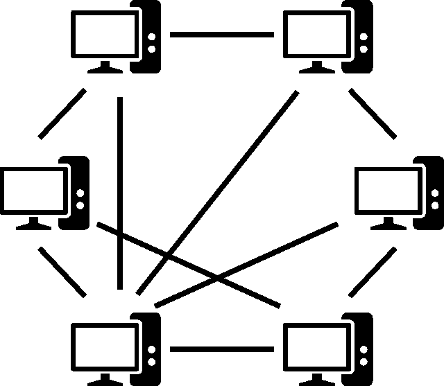
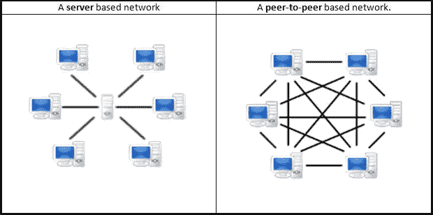
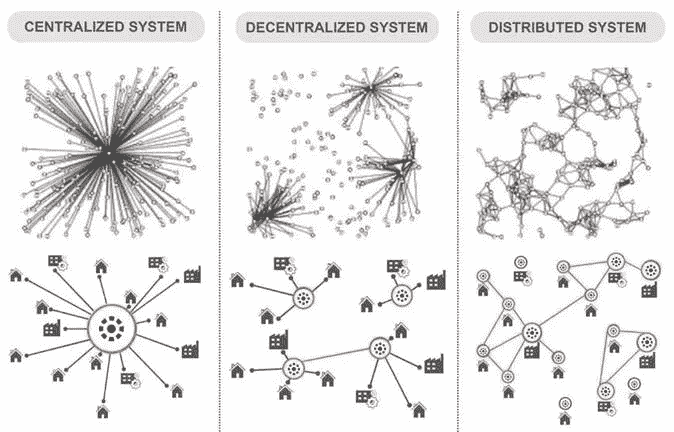
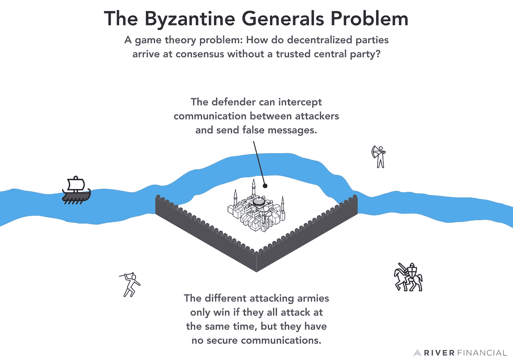

# 关于加密货币区块链的概念构想

> 原文：<https://blog.devgenius.io/conceptual-ideas-about-the-cryptocurrency-blockchain-b26aec08e2cb?source=collection_archive---------22----------------------->

照片由 [Unsplash](https://unsplash.com/@theshubhamdhage?utm_source=medium&utm_medium=referral) 上的 GuerrillaBuzz Crypto PR 拍摄

加密货币区块链不只是一个普通的区块链。它是一个自己运行的点对点的货币系统。

## 什么是对等系统？

【https://en.wikipedia.org/wiki/Peer-to-peer 

意味着只有两个人在交流，没有第三方的干扰。

## 为什么不是集权？

[https://en.bitcoinwiki.org/wiki/Peer-to-peer](https://en.bitcoinwiki.org/wiki/Peer-to-peer)

一个**集中的系统**缺乏完整性。

任何系统要公平运行，都需要:

👉系统完整性

👉关于同伴的知识

👉关于对等体可信度的知识

然而，集中式系统**假设**系统已经具有完整性。

[https://web . ITU . edu . tr/~ yuce soyb/Centralized-decorated-distributed . html](https://web.itu.edu.tr/~yucesoyb/Centralized-decentralized-distributed.html)

他们(集中系统)期望你首先信任他们，这样他们就可以成为获得关于你的同伴的知识的权威，并促进同伴的可信度。

这个假设完全是扯淡！

它让所有参与者将他们的权力交给一个集中的组织，并允许他们为你分配资源。

中央集权制将变得越来越强大和不可控制。它将成为单点故障，直到整个系统崩溃。

[https://armament . solutions/tactics/单点故障. html](https://armament.solutions/tactics/single-points-of-failure.html)

**分散系统**通过以下方式改进集中系统:

👉系统完整性有待证明

👉关于同伴的知识

👉关于对等体可信度的知识

由于需要测试系统的完整性，参与者将确认系统是否实现了完整性，并加强他们的信任。否则，参与者将由于缺乏系统完整性而离开系统。

**纯分布式系统**通过以下方式改进分散式系统:

👉关于对等体的知识是未知的

👉关于同伴可信度的知识还有待证实

当你在不知道双方身份的情况下运行一个系统，同时保持程序的完整性并加强对等体的信任时，这将变得非常具有挑战性。

## 如何运行一个**纯分布式系统？**

如果你想在公共领域创建一个**成功的**对等系统，这里有一些你需要克服的挑战。

👉防止技术故障

👉防止恶意对等方

既然我们不能知道对等体的身份，就必须有一种方法来执行事务，而不需要对等体证明他们自己的身份。

解决方案:

防止技术故障-> **区块链**

防止恶意同行-> **工作证明**

[https://river . com/learn/what-is-the-Byzantine-generals-problem/](https://river.com/learn/what-is-the-byzantine-generals-problem/)

当然，真正的解决方案取决于拜占庭一般问题。